- ---
title: Computação Gráfica com Unreal Engine e Autodesk Maya
description: Computação Gráfica com Unreal Engine e Autodesk Maya
tags: [Unreal Engine,Rendering,Maya,computação gráfica]
layout: page
---

## Capítulo I - A computação gráfica
1. [O que é computação gráfica?](#1.1)
1. [Computação gráfica para jogos digitais](#1.2)
1. [O curso Computação Gráfica com Unreal Engine e Autodesk Maya](#1.3)
1. [Habilidades que serão aprendidas](#1.4)

## Capítulo II - Como são formados os objetos 3D
1. [Quais são os elementos que compõem imagens?](#2.1)
    1. [Bitmap](#2.1.1)
    1. [Vector Graphics](#2.1.2)    
    1. [Lista de formatos que o Unreal Engine suporta](#2.1.3)        
1. [O que são Pontos?](#2.2)
    1. [Pixel](#2.2.1)
    1. [Bits por pixel](#2.2.2)    
    1. [Uma dica para utilizar texturas no Unreal Engine](#2.2.3)        
1. [Linhas, raios e segmentos](#2.3)
1. [Planos e Triângulos](#2.4)
1. [Polígonos](#2.5)
    1. [Polígonos no Maya](#2.5.1)
    1. [Polígonos no Unreal Engine](#2.5.2)
1. [Face](#2.6)       
    1. [Faces no Maya](#2.6.1)       
    1. [Faces no Unreal Engine](#2.6.2)           
1. [Aresta](#2.7)           
    1. [Arestas no Maya](#2.7.1)           
    1. [Arestas no Unreal Engine](#2.7.2)               
1. [Vértices](#2.8)           
    1. [Vértices no Maya](#2.8.1)           
    1. [Vértices no Unreal Engine](#2.8.2)                   
1. [Valores de ponto flutuante](#2.9)
1. [Sistemas de coordenadas](#2.10)
    1. [À esquerda e à direita serão entregues de coordenadas](#2.10.1)
    1. [Pivot - O centro do objeto 3D no Maya](#2.10.2)
    1. [Pivot - O centro do objeto 3D no Unreal Engine](#2.10.3)
1. [Cor](#2.11)  
1. [Transparência com Alpha](#2.12)

## Capítulo III - Entendendo o processo de rendenrização
1. [Entendendo como os processos são executados pelo sistema operacional](#3.1)
1. [O processo de renderização pela GPU](#3.2)
    1. [Aplicação](#3.2.1)
    1. [Geometria](#3.2.2)    
    1. [Renderização](#3.2.3)        
    1. [Conclusão](#3.2.4)      

## Capítulo IV - Processamento de imagens com Unreal Engine
1. [O processo de renderização no Unreal Engine](#4.1)
1. [Processamento do Frame 0 - Time 0 - CPU](#4.2)
1. [Processamento do Frame 1 - Time 33ms - Preparar a Thread](#4.3)
    1. [Distance Culling ou corte de distância](#4.3.1)
          1. [Atores na cena](#4.3.1.1)
          1. [Cull Distance Volume](#4.3.1.2)
    1. [Frustim Culling](#4.3.2)
    1. [Precomputed Visibility](#4.3.3)
    1. [Occlusion Culling](#4.3.4)         
    1. [3.5 Occlusion Culling é um processo pesadoa a partir de 10.000 objetos na cena](#4.3.5)   
1. [ Processamento do Frame 2 - Time 66ms - GPU](#4.4)  
    1. [Drawcalls](#4.4.1)
    1. [O comando Stat RHI](#4.4.2)
    1. [O comando Stat unit e Stat FPS](#4.4.3)
    1. [Considerações](#4.4.4)
***

## Capítulo I - A computação gráfica
<a name="1.1"></a>
## 1. O que é computação gráfica?
"A Computação Gráfica reúne um conjunto de técnicas que permitem a geração de imagens a partir de modelos computacionais de objetos reais, objetos imaginários ou de dados quaisquer coletados por equipamentos na natureza." [[1](#r1)]

Utilizando e entendendo os elementos e as técnicas envolvidas na geração de imagens podemos aplicar esse conhecimento em diversas áreas de atuação, como por exemplo:
1. Engenharia e arquitetura;    
1. Efeitos especiais;
1. Apresentação de gráfica de dados em formatos tridimensionais;
1. Realidade virtual;
1. Jogos digitais;

     
*Figura: Computer graphics - Wikipedia.*

<a name="1.2"></a>
## 2. Computação gráfica para jogos digitais
"Jogos: o setor de Jogos são um dos maiores usufruidores dos avanços gráficos e de maior aplicação de recursos da computação gráfica. Resultando também no desenvolvimento e aprimoramento de equipamentos para este tipo de trabalhos, como placas de vídeo e processadores mais poderosos. Os jogos digitais ganharam mais realidade graças ao aporta da CG." [[3](#r3)]

Construir jogos digitais para que possam ser executados em diversas plataformas, sejam de arquiteturas e hardware ou sistemas operacionais diferentes exige conhecimento de técnicas de renderização de objetos na tela, bem como conhecer os elementos que os formam.

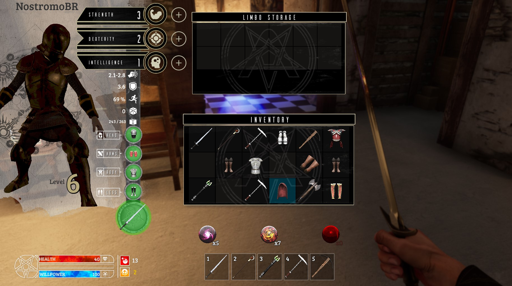      
*Figura: Dungeon Crowley - Estúdio Animvs.*

<a name="1.3"></a>
<a name="3"></a>
## 3. O curso de Computação Gráfica com Unreal Engine e Autodesk Maya
Conceitos de computação gráfica aplicados na prática usando o Unreal Engine e o Autodesk Maya.  

<a name="1.4"></a>
<a name="4"></a>
## 4. Habilidades que serão aprendidas  
- Como são formados os objetos em gráficos 3D.
- Processo de renderização no Unreal Engine.


## Capítulo II - Como são formados os objetos 3D

Neste capitulo será apresentados os elementos que constituem uma imagem 3D utilizando como exemplo softwares como o Unreal Engine e Maya Autodesk.

<a name="2.1"></a>
## 1. Quais são os elementos que compõem imagens?
Imagens apresentadas nos dispositivos de saída são formadas por pontos  construídos e organizados pelas seguintes estruturas:

<a name="2.1.1"></a>
### 1.1 Bitmap
Um bitmap é um tipo de imagem que é usado para armazenamento de imagens e pode ser definindo como um mapa de bits.
Cada pedaço da imagem é composto por um ponto chamado de pixel.

      
*Figura: Imagem bitmap  - www.marceloaventura.art.br.*

<a name="2.1.2"></a>
### 1.2 Vector Graphics
São arquivos de imagens que são utilizados que calculam a posição dos pontos.   
Em um programa de gráficos vetoriais, fornecemos o ponto inicial e o ponto final e o programa faz o resto.

   
*Figura: Vector Graphics - https://etc.usf.edu.*

Mas tem outra vantagem. Se aplicarmos zoom a uma imagem bitmap, podemos ver os pixels e teremos uma imagem ruim. Em gráficos vetoriais, ampliar uma imagem não envolve uma imagem ruim porque a imagem é criada por uma fórmula matemática.

<a name="2.1.3"></a>
<a name="1.3"></a>
### 1.3 Lista de formatos que o Unreal Engine  suporta
- .bmp - Bitmap;
- .float;
- .pcx;
- .png;
- .psd - Vector Graphics;
- .tga;
- .jpg - Bitmap com metadados e compressão;
- .exr.

<a name="2.2"></a>
<a name="2"></a>
## 2. O que são Pontos?
Na geometria, um ponto é representado por sua coordenada no espaço. Geometria usa um sistema de coordenadas cartesianas, onde as coordenadas de um ponto em espaço são representados pela distância ao longo de cada um dos eixos principais para o ponto.    

     
*Figura: Plano cartesiano - https://conhecimentocientifico.r7.com.*

Pontos são representados por pixels em monitores.

<a name="2.2.1"></a>
### 2.1 Pixel
Pixel é o menor elemento em um dispositivo de exibição, sendo que cada pixel é composto por um conjunto de 3 pontos: verde, vermelho e azul.

Um exemplo de formação de imagens.    


*Figura: Figura pixelada livre.*

<a name="2.2.2"></a>
### 2.2 Bits por pixel
As cores do pixel dependem da quantidade de bits por pixel (bpp).

- 1 bpp, 2(1) = 2 colors (monochrome);
- 2 bpp, 2(2) = 4 colors;
- 3 bpp, 2(3) = 8 colors;
- 4 bpp, 2(4) = 16 colors;
- 8 bpp, 2(8) = 256 colors;
- 16 bpp, 2(16) = 65,536 colors ("Highcolor" );
- 24 bpp, 2(24) = 16,777,216 colors ("Truecolor").

Aumentando a qualidade de cores a imagem terá uma aparencia mais realista mas consumira mais memória e processamento.

<a name="2.2.3"></a>
### 2.3 Uma dica para utilizar texturas no Unreal Engine
Formatos de textura menores resultam em materiais mais rápidos (por exemplo, [DXT1](https://www.khronos.org/opengl/wiki/S3_Texture_Compression) é de 4 bits por pixel, DXT5 é de 8 bpp, ARGB descompactado é de 32 bpp).

>**DXT1**   
Compressão de imagens que usam blocos de bits.    
**GIMP**    
[Exportando imagens do **Gimp** com compressão DXT1](
https://wiki.thedarkmod.com/index.php?title=DDS_Creation_with_GIMP)

<a name="2.3"></a>
## 3. Linhas, raios e segmentos
Uma linha tem direção e comprimento infinito. A direção de uma linha pode ser definido por dois pontos distintos pelos quais a linha passa.    
Um raio começa em um ponto e se estende infinitamente em uma direção distante do ponto. Um raio é definido por um ponto e uma direção.    
Um segmento de linha é uma linha de comprimento finito definida por seus dois pontos finais.    
>Em computadores, devemos lidar com quantidades finitas, então não podemos tirar o total extensão de uma linha ou raio de acordo com sua definição matemática. No computador gráficos quando nos referimos a “linhas”, geralmente nos referimos a segmentos de linha.

     

*Figure: Segmento de linha - https://cdn1.byjus.com .*

<a name="2.4"></a>
## 4. Planos e Triângulos
Um plano é uma folha orientada em 3 espaços sem espessura e com uma extensão infinita.
Um plano é definido por três pontos não colineares que cruzam o plano ou por um ponto no plano e uma direção perpendicular ao plano.      
A direção perpendicular a um plano é chamado de **Normal** ao plano.    
Um triângulo também é definido por três pontos no espaço 3 chamados **Vértices** (singular vértice).

      

*Figure: Triangle Vertex Normal - https://www.oreilly.com .*

<a name="2.5"></a>
## 5. Polígonos (Polygon)
As imagens tridimensionais formadas no computador são compostas por polígonos.
Polígonos são uma coleção de vértices, arestas e faces que definem a forma do objeto poliédrico.

<a name="2.5.1"></a>
### 5.1 Polígonos no Maya
Utilizando as opções em **Poly Modeling** podemos definir uma séria de elementos poligonais.      
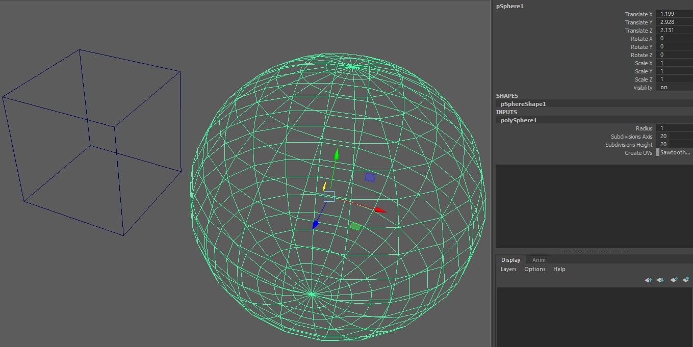     

*Figura: Polígonos no Maya utilizando a visualização Wireframe- Autor.*

- **Channel Box/Layer Editor** - Propriedades do objeto com a sua quantidade de subdivisões, estes valores podem ser manipulados aumentando ou diminuindo a quantidade de arestas.
- Apresentado a quantidade de vértices e arestas.   
  **Display > Heads up display > Poly Count**.      

  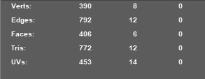     

  *Figura: Verts, Edges, Faces, Tris, UVs no Maya - Autor.*

<a name="2.5.2"></a>
### 5.2 Polígonos no Unreal Engine
Selecionando **Brush Wireframe** no **View Port** ou pressionando *Alt+2* a estrutura de malha de vértices dos polígonos na cena.       

     

*Figura: Visualização Brush Wireframe no Unreal Engine 4 -  Autor.*

- Apresentado a quantidade de vértices e arestas.   
  **Window > Statistics**.      

  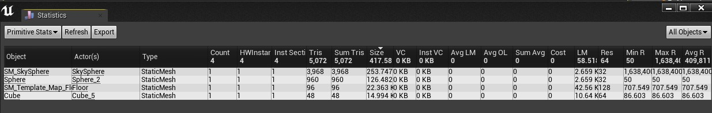     

  *Figura: Unreal Engine View Statistics - Autor.*

<a name="2.6"></a>
## 6. Face
São as superfícies planas que constituem um sólido. Consistem em triângulos (malha de triângulo), quadriláteros ou outros polígonos convexos simples, uma vez que isso simplifica a renderização.

<a name="2.6.1"></a>
### 6.1 Faces no Maya
Com botão direito pressionado (RMB) escolha **Face** para selecionar  a face.   
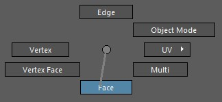     

*Figura: Maya RMB  Face - Autor.*  

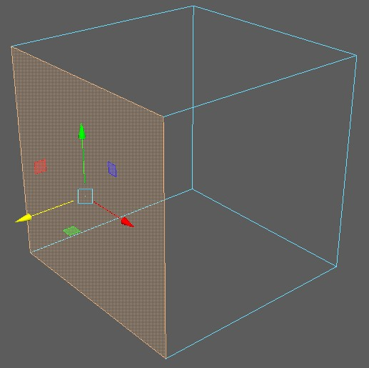   

*Figura: Maya e seleção de Face - Autor.*

<a name="2.6.2"></a>
### 6.2 Faces no Unreal Engine
Somente é possível selecionar faces e vértices de objetos do tipo **Geometry** em **Place Actors**.   
É necessário habilitar as opções de edição em **Modes >  Brush Editing**.   

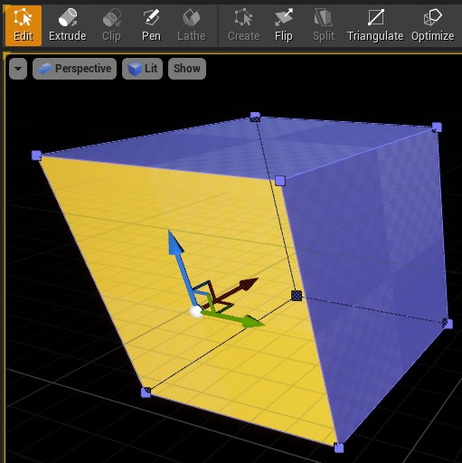    

*Figura: Unreal Engine Modes->Brush Editing - Autor.*

<a name="2.7"></a>
## 7. Aresta
São segmentos de reta que são as intersecções de duas faces contíguas.

<a name="2.7.1"></a>
### 7.1 Arestas no Maya
Selecionamos com RMB a opção **Edge**.    

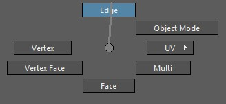   

*Figura: Maya RMB Edge- Autor.*     

     

*Figura: Maya select Edge - Autor*

<a name="2.7.2"></a>
### 7.2 Arestas no Unreal Engine

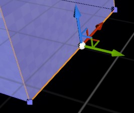      

*Figura: Unreal Engine select Edge - Autor.*

<a name="2.8"></a>
## 8. Vértices
São os pontos de encontro das arestas.

<a name="2.8.1"></a>
### 8.1 Vértices no Maya
Selecionamos com RMB a opção **Vertex**.    

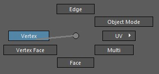     

*Figura: Maya RMB Vertex - Autor.*

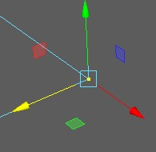   

*Figura: Maya select vertex - Autor.*   

<a name="2.8.2"></a>
### 8.2 Vértices no Unreal Engine
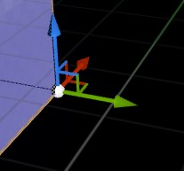    

*Figura: Unreal Engine select Vertex - Autor.*

<a name="2.9"></a>
## 9. Valores de ponto flutuante
Na matemática, todos os cálculos são exatos e realizam aritmética sobre os valores e não alteram sua precisão. No entanto, os computadores armazenam aproximações para números reais como valores de ponto flutuante e realizando operações aritméticas podem fazer com que sua precisão mude. Nem todos os números reais podem ser representados exatamente por uma representação de ponto flutuante. Números como π e outros transcendentais os números têm uma expansão decimal infinita.
A natureza aproximada dos números de ponto flutuante geralmente levanta sua cabeça ao comparar números de ponto flutuante e outras estruturas compostas de números de pontos, como pontos, vetores, retas, planos, matrizes e assim por diante.

      

*Figura: https://media.geeksforgeeks.org .*

<a name="2.10"></a>
## 10. Sistemas de coordenadas
Objetos em Computação Gráfica possuem descrições numéricas (modelos) que caracterizam suas formas e dimensões. Esses números se referem a um sistema de coordenadas, normalmente o sistema Cartesiano de coordenadas: x, y e z.  Em alguns casos, precisamos de mais de um sistema de coordenadas.   

       

*Figura: https://www.tutorialspoint.com .*

Normalmente, os softwares de elementos gráficos 3D, como por exemplo Maya ou Blender,  usam um dos dois tipos de sistemas de coordenadas cartesianas de esquerda e direita. Em ambos os sistemas de coordenadas, o eixo x positivo aponta para a direita e o eixo y positivo aponta para cima.

<a name="2.10.1"></a>
### 10.1 À esquerda e à direita serão entregues de coordenadas
Você pode lembrar para qual direção o eixo z positivo aponta, apontando os dedos de sua mão direita ou esquerda na direção x positiva e curvando-os na direção y positiva. A direção do seu polegar aponta em sua direção ou para longe de você, é a direção em que o eixo z positivo aponta para esse sistema de coordenadas. A ilustração a seguir mostra esses dois sistemas de coordenadas.   

     

*Figura: https://docs.microsoft.com .*

- **Unreal Engine** - Utiliza o sistema de coordenadas *Left-Handed*.
- **Maya** - Utiliza o sistema de coordenadas *Right-Handed*

<a name="2.10.2"></a>
### 10.2 Pivot - O centro do objeto 3D no Maya
Pivot é um ponto que marca o centro de objetos tridimensionais no Maya, onde :
- Todas as transformações de um objeto são relativas ao ponto de pivô do objeto.
- Os manipuladores 3D também contam com o ponto de pivô do objeto.

- Autor.")     

*Figura: Maya select pivot (Selecione W e depois Tecla Insert ou D)- Autor.*

<a name="2.10.3"></a>
### 10.3 Pivot - O centro do objeto 3D no Unreal Engine

     

*Figura: - Alt + Scroll mouse.*

<a name="2.11"></a>
## 11. Cor
Uma cor é descrita para o computador como uma tupla ordenada de valores de um **cor space** (espaço de cor). Os próprios valores são chamados de **components**(componentes) e são coordenados no espaço de cores. O GDI do Windows representa as cores como uma tupla ordenada de componentes vermelhos, verdes e azuis com cada componente no intervalo [0 . 0 , 1 . 0] representado como uma quantidade de bytes sem sinal no intervalo [0 , 255].     
Por padrão, o [Windows GDI](https://pt.wikipedia.org/wiki/GDI) usa o espaço de cores RGB.

Em computação gráfica, muitas vezes é conveniente usar as cores HLS e HSV.    
- HLS: matiz, leveza, saturação.    
- HSV: matiz,saturação,valor    

<a name="2.12"></a>
## 12. Transparência com Alpha
Muitas vezes, em computação gráfica, desejamos combinar pixels como se eles fossem pintados em folhas transparentes empilhadas umas sobre as outras. No Direct3D, a transparência é representada como um canal adicional de informações que representam a quantidade de transparência do pixel.   
Quando um pixel é totalmente opaco, seu valor alfa é 1 . 0 e este pixel completamente obscurece qualquer coisa por trás dele. Quando um pixel é totalmente transparente, seu valor alfa é 0. 0 e tudo por trás do pixel aparece. Quando o valor alfa é entre 0 e 1, o pixel é parcialmente transparente.


*Figura: Alpha compositing - wikipedia.*

***

## Capítulo III - Entendendo o processo de rendenrização

Neste capitulo serão apresentados quais são os passos para processamento de imagens no computador.

<a name="3.1"></a>
## 1. Entendendo como os processos são executados pelo sistema operacional
Em computação, um processo é uma instância de um programa de computador que está sendo executada. Ele contem o código do programa e sua atividade atual. Dependendo do sistema operacional, um processo pode ser feito de várias linhas de execução que executam instruções concorrentemente. O sistema operacional seleciona um processo da fila de aptos para receber o processador. O processo selecionado passa do estado de apto para o estado executando. O módulo do sistema operacional que faz essa seleção é chamado de escalonador.

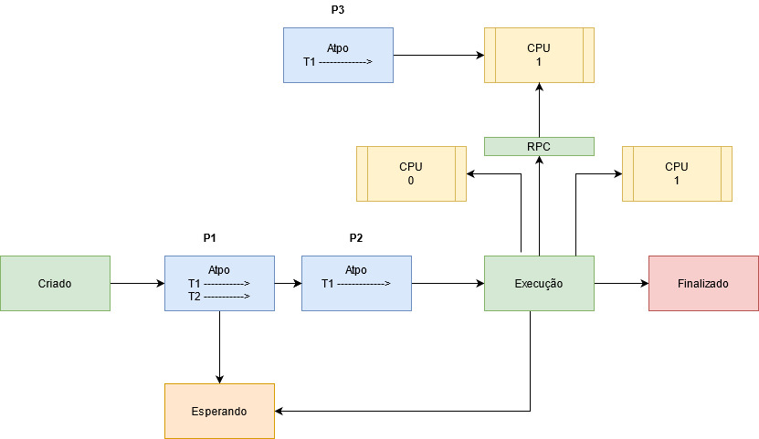  

*Figura: Fila de Processos  - Autor.*

- **Criado** - Enquanto o processo está sendo criado, esse é seu estado.
- **Apto** -Esse é como um estado de ponto de partida, aqui ficam os processos que estão prontos para serem processados.
- **Espera** - Esse é um estado especial que na verdade está mais para uma característica de outros estados, basta observar os processos que estão nos estado de prontidão e os que estão aguardando eventos, pois ambos também estão em um estado de espera.
- **Execução** - Quando o processo está sendo executado, seu estado passa a ser este.
- **Encerrado** -Esse é o último estado  de um processo, sua finalização, seja de forma voluntária, como quando ele não é mais necessário ou de forma involuntária, como as ocasionadas por um erro.
- **RPC** - Remote Procedure Call (Chamada de Procedimento Remoto) é uma tecnologia para a criação de programas distribuídos servidor/cliente que provê um paradigma de comunicação de alto nível no sistema operacional, á presumindo a existência de um protocolo de transporte, como TCP/IP ou UDP, para carregar a mensagem entre os programas comunicantes.
- **Threads** - Thread é um pequeno programa que trabalha como um subsistema, sendo uma forma de um processo se auto dividir em duas ou mais tarefas. É o termo em inglês para Linha ou Encadeamento de Execução. Essas tarefas múltiplas podem ser executadas simultaneamente para rodar mais rápido do que um programa em um único bloco ou praticamente juntas, mas que são tão rápidas que parecem estar trabalhando em conjunto ao mesmo tempo.

<a name="3.2"></a>
## 2. O processo de renderização pela GPU
A renderização GPU torna possível usar sua placa de vídeo para renderização, ao invés da CPU. Isso pode acelerar a renderização, porquê as GPUs modernas são desenhadas para fazer muito processamento de números. Por outro lado, elas também têm algumas limitações na renderização de cenas complexas devido à memória mais limitada, e questões com interatividade quando usando a mesma placa de vídeo para visualização e renderização. A renderização ocorre mediante o envio de comandos para a GPU, que gera a tela de forma assíncrona. Em algumas situações, a GPU pode ter muito trabalho para fazer, e a CPU terá de aguardar antes de enviar novos comandos.

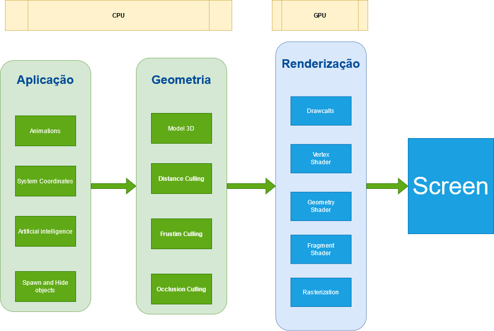    
*Figura: Pipeline de computação de gráfica - Autor.*

<a name="3.2.1"></a>
### 2.1 Aplicação
Etapa de toda a lógica da mecânica dos elementos que são apresentados.

- **Animations** - Animações calcula quando as Animações iniciam e terminam.
- **System Coordinates** - Posição de modelos calcula a posição dos objetos e sua influência.
- **Artificial intelligence** - Inteligência Artificial determina como o objeto se movimenta e qual o seu estado.
- **Spawn and Hide objects** - Ou Criar e destruir objetos é a lógica necessária para determinar onde os objetos aparecem no mundo.

<a name="3.2.2"></a>
### 2.2 Geometria
A etapa de geometria (com pipeline de geometria), que é responsável pela maioria das operações com polígonos e seus vértices (com pipeline de vértices), pode ser dividida nas tarefas a seguir. Depende da implementação específica de como essas tarefas são organizadas como etapas reais do pipeline paralelo.

- **Model 3D** - Modelo 3D é o processo onde os objetos são desenhados na cena, entre eles vértices, triângulos e o sistema de coordenadas.
- **Distance Culling** - *Distance Culling* ou Corte de Distância Remove objetos que estão além de um valor X da câmera.
- **Frustim Culling** - *Frustim Culling* ou Corte de câmera remove objetos que não estão a frente da câmera.
- **Occlusion Culling** - *Occlusion Culling* ou Corte de oclusão é o processo que desativa a renderização de objetos quando eles não são vistos pela câmera porque estão obscurecidos (obstruídos) por outros objetos. Isso não acontece automaticamente na computação gráfica 3D, pois na maioria das vezes os objetos mais distantes da câmera são desenhados primeiro e os objetos mais próximos são desenhados por cima deles (isso é chamado de “overdraw”).

<a name="3.2.3"></a>
### 2.3 Renderização
- **DrawCalls** - Grupo de polígonos que compartilham a mesmo material. Os desenhos de chamadas, em uma tradução pé da letra, basicamente são quantos objetos estão sendo desenhados na tela. Você deseja manter esse número baixo para manter um bom desempenho, portanto, nas luzes dos pixels, fazem os objetos serem desenhados tantas vezes quanto as luzes que os afetam.
  

    *Figura: Drawcalls - Unreal Tips.*

- **Vertex Shaders** - É uma função de processamento gráfico usada para adicionar efeitos especiais a objetos em um ambiente 3D executando operações matemáticas nos dados de vértice dos objetos. Cada vértice pode ser definido por muitas variáveis diferentes. Por exemplo, um vértice é sempre definido por sua localização em um ambiente 3D usando as coordenadas x-, y- e z-. Os vértices também podem ser definidos por cores, texturas e características de iluminação. Os Vertex Shaders não alteram realmente o tipo de dados; eles simplesmente mudam os valores dos dados, de modo que um vértice emerge com uma cor diferente, texturas diferentes ou uma posição diferente no espaço.

    

  *Figura: Phong-shading - wikipedia.*

- **Pixel Shader** - Os Pixel Shader, calculam a cor e outros atributos de cada "fragmento": uma unidade de trabalho de renderização que afeta no máximo um único pixel de saída. Os tipos mais simples de sombreadores de pixel geram um pixel da tela como um valor de cor; sombreadores mais complexos com várias entradas / saídas também são possíveis. Os sombreadores de pixel variam desde simplesmente sempre a saída da mesma cor, até a aplicação de um valor de iluminação, até o mapeamento de saliências, sombras, realces especulares, translucidez e outros fenômenos. Eles podem alterar a profundidade do fragmento (para buffer Z) ou produzir mais de uma cor se vários destinos de renderização estiverem ativos.

     

  *Figura: Shading_models - wikipedia.*

- **Geometry Shaders** - Recebe como entrada um conjunto de vértices que formam uma única primitiva, por exemplo, um ponto ou triângulo. O sombreador de geometria pode então transformar esses vértices conforme achar necessário antes de enviá-los para o próximo estágio de sombreador. O que torna o shader de geometria interessante é que ele é capaz de converter a primitiva original (conjunto de vértices) em primitivas completamente diferentes, possivelmente gerando mais vértices do que os inicialmente dados.

  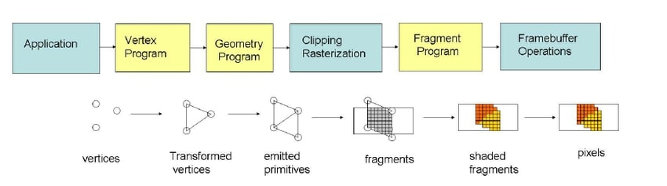

  *Figura: Pipeline OpenGL.*

- **Fragment Shader** - É uma unidade programável da GPU que opera em cada fragmento produzido durante a rasterização e seus dados associados.
- **Rasterization** - O termo rasterização, em geral, pode ser aplicado a qualquer processo pelo qual informações tipo vetorial podem ser convertidas num formato de pontos ou pixels.
Um exemplo seria uma reta descrita matematicamente é infinitesimalmente contínua, não importa o quão pequeno um trecho da reta é observado, é impossível determinar qual é o próximo ponto depois de um determinado ponto; não existem quebras.   
     

  *Figura: Rasterization - scratchapixel.*

<a name="3.2.4"></a>
### 2.4 Conclusão
1. O custo para renderizar muitos poligonos é muitas vezes menor que o Drawcall.
1. 50.000 triângulos podem rodar pior que 50 milhões dependendo da implementação.
1. Drwacall tem uma despesa básica, portanto, otimizar poli de baixo para super poli pode fazer nenhuma diferença.  
1. Componentes = DrawCalls
1. Componentes ocluem e são renderizados um por um.
1. Mesclar em um único ator geralmente não faz diferença para a renderização.
1. Para diminuir o drawcalls é melhor usar menos modelos maiores do que muitos modelos pequenos, você não pode fazer muito isso, no entanto, isso afeta todo o resto negativamente,
  - pior para oclusão - A oclusão é mais rápida por si só, mas não será capaz de fazer um trabalho bom o suficiente, tem menos objetos que precisam ser verificados quanto à oclusão, mas tem uma chance menor de realmente ocluir alguma coisa
  - pior para o lightmapping - Lightmap tem uma quantidade limite de espaço, a quantidade máxima de espaço é a textura do mapa de luz, independentemente da resolução, o mapa de luz também tem um limite de resolução superior.
  Por exemplo imagens de 4k, 4.096 já é enorme para um lightmap.
  - Se você fizer modelos muito grandes, eventualmente eles simplesmente ficarão sem espaço UV.
    - pior para calculo de colisão.
    - pior para memoria.

---

## Capítulo IV - Processamento de imagens com Unreal Engine

Neste capitulo vamos analisar como é realizado o processamento de imagens pela CPU e GPU pelo Unreal Engine.

<a name="4.1"></a>
## 1. O processo de renderização no Unreal Engine
Para exemplificar o processo de renderização vamos apresentar os seguintes passos conforme as *thread* são executas:

|  Threads    |     |     |     |   |
|:-           |:-   |:-   |:-   |:- |
| **CPU** | <span style="color:blue">Frame A</span> |  <span style="color:red">Frame B</span>  | <span style="color:green">Frame C </span>| <span style="color:brown">Frame D</span>|
| **DRAW CPU** |  | <span style="color:blue">Frame A</span> |  <span style="color:red">Frame B</span>  | <span style="color:green">Frame C </span>|
| **GPU** |  |  | <span style="color:blue">Frame A</span> | <span style="color:red"> Frame B</span>|
| **Time** | **0** | **33** | **66** | |

Acompanhe a ordem de execução de cada Frame.
1. O <span style="color:blue">Frame A</span> é instanciado na CPU.
1. Logo em seguida o <span style="color:blue">Frame A</span> é passado para um momento onde a CPU e a GPU compartilham alguns elementos de construção. Enquanto isso ocorre a CPU carrega o <span style="color:red">Frame B</span>.
1. Após passar pelo passo de compartilhamento o <span style="color:blue">Frame A</span> então é colocado inteiramente na GPU.
1. A operação se repete para todos os Frames.
1. Perceba que a cada passo que se completa são liberados recursos de CPU e GPU para serem usados com outros frames.

A seguir vamos abordar cada passo.

<a name="4.2"></a>
## 2. Processamento do Frame 0 - Time 0 - CPU
Neste passo é realizado o calculo é realizado na CPU de toda a lógica e as transformações:
> Qualquer coisa relativa a mudança e posição dos objetos.

1. **Animações** - Calcula quando as Animações iniciam e terminam.
1. **Posição de modelos e objetos** - Necessário para calcular a posição e sua influência.
1. **Física** - Calculo para determinar onde os objetos vão.
1. **Inteligência Artificial** - Por exemplo, em um veículo controlado por IA é necessário determinar, como ele se movimenta,  como o estado e onde o carro estará realmente.
1. **Cria e destrói, esconde e apresenta** - Necessário para determinar onde os objetos aparecem no mundo.

**Resultado:** o Unreal Engine conhece todas as transformações e todos os objetos.

<a name="4.3"></a>
## 3. Processamento do Frame 1 - Time 33ms - Preparar a Thread
Antes de podermos usar as transformações para renderizar a imagem, precisamos saber o que incluir na renderização, isso é executado principalmente na CPU, mas algumas partes são manipuladas pela GPU, para tal finalidade é realizada a tarefa de :        
- Processo de oclusão - Construção de lista de todos os objetos e modelos visíveis, sendo que o processamento é realizado por objeto e não por polígono.
- Preparação da Thread - Uma Thread da GPU é alocada.

A seguir as 4 Etapas em ordem de execução desse processo.

1. **Distance Culling** - Remove quaisquer objetos além de X da câmera.
1. **Frustim Culling** - Verifica o que está na frente da câmera.
1. **Precomputed Visibility** - (Visibilidade pré-computada) Divide a cena em uma grade, cada célula da grade lembra o que está visível naquele local
1. **Occlusion Culling** - Verifica com precisão o estado de visibilidade em cada modelo.   

<a name="4.3.1"></a>
### 3.1 Distance Culling ou corte de distância
Este método de seleção é ideal para grandes níveis externos, onde você teria edifícios ou estruturas de algum tipo com interiores detalhados, onde você gostaria de selecionar aqueles objetos que são pequenos demais para considerar importantes a distâncias distantes.

<a name="4.3.1.1"></a>
#### 3.1.1 Atores na cena
Atores selecionados em um Nível ou Blueprint contêm configurações de distância acessadas por meio de seu painel Detalhes. Eles permitem que distâncias por instância sejam definidas ou se o Ator é selecionado usando um **Cull Distance Volume**.   

      

*Figura: A seleção de distância do objeto.*

- **Min Draw Distance** - Define a distância mínima de desenho na qual o objeto será renderizado na cena. Isso é medido em unidades de espaço mundial (centímetros) do centro da esfera delimitadora do objeto até a posição da câmera.
- **Desired Max Draw Distance** - Define a distância máxima de projeção para o *Level Designer*. A distância máxima "real" é a distância mínima de tração (desconsiderando 0).

**Exemplo**   

O objeto vai ser rendirizado quando a câmera se aproximar a uma distância **MENOR** que 1000 centímetros.

```c++
Min Draw Distance = 0
Desired Max Draw Distance = 1000
```

<a name="4.3.1.2"></a>
#### 3.1.2 Cull Distance Volume

**Cull Distance Volumes** permitem que você especifique uma variedade de tamanhos e distâncias de seleção para que os Atores não devam mais ser desenhados.

1. Adicione o volume **Cull Distance Volume** localizado em **Place Actors/Volumes**.
1. Altere as dimensões do objeto para definir a área de corte.

  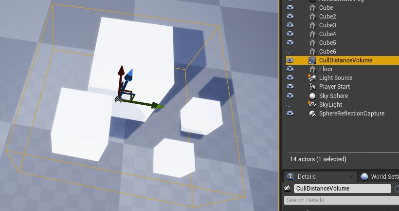

  *Figura: CullDistanceVolume Size.*
1. Configure a matriz de distância e tamanho, `Cull Distances` para o corte.

      

  *Figura: CullDistanceVolume Cull Distance Array.*

- **Cull Distances** - Uma lista de conjuntos de pares de Tamanho e Distância de Seleção usada para definir a distância de desenho de objetos com base em seu tamanho dentro de um **Cull Distance Volumes**. O código calculará o diâmetro da esfera da caixa delimitadora de um objeto e procurará o melhor ajuste nesta matriz para determinar qual distância de separação deve ser atribuída a um objeto.
    - **Size** - O tamanho a ser associado à distância de eliminação.
    - **Cull Distance** - A distância a ser associada ao tamanho dos limites de um ator.

**Exemplo**   

```c++
// 0 - Os objetos de tamanho 300 centímetros não sofreram corte.
  Size = 300
  Cull Distance = 0
// 1 - Objetos de tamanho 200 centímetros serão cortados a partir de 1200 centímetros de distância.
  Size = 200
  Cull Distance = 1200
// 2 - Objetos de tamanho 100 centímetros serão cortados a partir de 1500 centímetros de distância.
  Size = 100
  Cull Distance = 1500  
```

<a name="4.3.2"></a>  
### 3.2 Frustum Culling ou corte de câmera
A seleção de **View Frustum** usa a área visível da tela do campo de visão (FOV) da câmera para selecionar objetos fora deste espaço.
O tronco da visão é uma forma piramidal que inclui um plano de recorte próximo e distante que define o mais próximo e o mais distante que qualquer objeto deve ser visível dentro deste espaço. Todos os outros objetos são removidos para economizar tempo de processamento.

    

*Figura: View Frustum.*

1. O plano de recorte próximo é o ponto mais próximo da câmera em que os objetos ficarão visíveis.
1. A **Camera Frustum** é a representação em formato piramidal da área de visualização visível entre os planos de clipe próximo e distante.
1. O plano de recorte distante é o ponto mais distante da câmera em que os objetos serão visíveis.

Os objetos fora do campo de visão da câmera (o tronco de visão) não são visíveis e podem ser selecionados (objetos delineados em vermelho).   


*Figura: View Frustum Culled.*

Objetos selecionados fora do tronco de visão da câmera não são mais renderizados, deixando apenas um punhado de objetos dentro desta visão que são obstruídos por outro objeto que precisam ser verificados para visibilidade. Portanto, durante essa passagem, uma consulta será enviada à GPU para testar o estado de visibilidade de cada um desses objetos. Aqueles que são ocluídos por outro são retirados da vista (objetos delineados em azul).   

    

*Figura: Occlued Objects Remover.*

Todos os objetos que estão fora do tronco da vista ou que estão ocluídos são agora eliminados da vista. A vista final da cena agora corresponde aos objetos que sabemos serem visíveis na cena a partir da posição da câmera.

    

*Figura: View Occlued Scene View.*

Configurando o Unreal Engine para visualizar o corte de câmera.
- Show->Advanced->Camera frustum      

  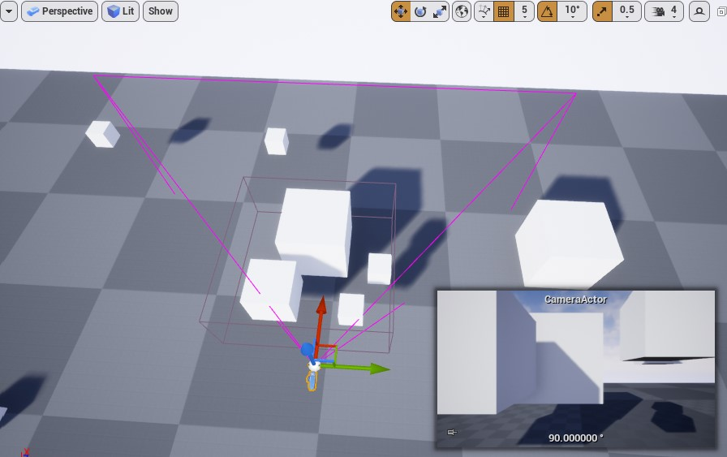  

  *Figura: Camera Frustum.*

<a name="4.3.3"></a>    
### 3.3 Precomputed Visibility - Visibilidade pré-computada
Armazenam o estado de visibilidade de atores não móveis em células colocadas acima de superfícies de projeção de sombras. Este método de seleção gera dados de visibilidade *offline* (durante uma construção de iluminação) e funciona melhor para níveis de tamanho pequeno a médio.

A **Precomputed Visibility** é ideal para hardware inferior e dispositivos móveis. Para tais hardwares e dispositivos, ao considerar os custos de desempenho, você obterá o máximo negociando custos de Thread de renderização que são mais caros por aqueles com memória de tempo de execução, onde há mais flexibilidade em relação ao desempenho.

> Divide a cena em um grid, onde cada célula do grid registra o que é visível naquele local. O tamanho das células é configurado .ini do projeto.

1. Configurar **World Settings** o atributo **Precomputed Visibility Volume** para verdadeiro.      
  

  *Figura: World Settings->Precompute Visibility.*

1. Adicione na cena o volume `Precomputed Visibility Volume` que está em `Place Actors` > `Volumes`s;
1. Defina o tamanho do Volume para abranger a área analisada;
1. Para visualizar o Grid de células na cena, `Show` > `Visualize` > `Precomputed Visibility Cells`.

  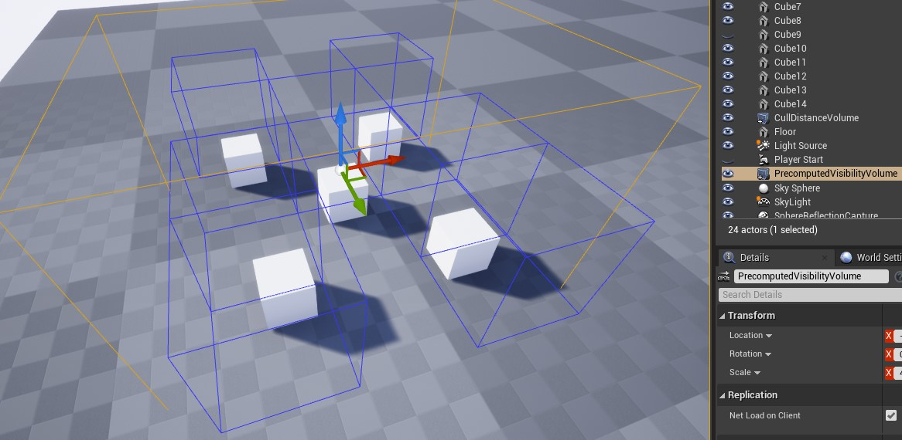   

  *Figura: Precomputed Visibility Cells, em azul as células.*

  > Se você já construiu a iluminação (**Bluid->Lighting**), pode usar o menu suspenso Construir na barra de ferramentas principal(**Show**) e selecionar **Precompute Static Visibility** para gerar células de visibilidade sem reconstruir a iluminação todas as vezes.

1. A câmera ao entrar na célula pergunta:    
- "O que pode ser ocluído?"   
- "O que pode ser renderizando e o que eu não devo renderizar?"     
- "Neste local, lembramos que esses objetos eram visíveis e estes outros não eram"

<a name="4.3.4"></a>
### 3.4 Occlusion Culling
O sistema de oclusão dinâmica em UE4 vem com vários métodos de abate para escolher. Cada um desses métodos rastreia os estados de visibilidade dos Atores em um nível dentro do tronco de visão da câmera (ou campo de visão) que são obstruídos por outro Ator. As consultas são emitidas para a GPU ou CPU para verificar o estado de visibilidade de cada ator. Uma heurística é usada para reduzir o número de verificações de visibilidade necessárias, por sua vez, aumentando a eficácia geral de seleção e o desempenho.
1. A seleção de oclusão verifica com precisão o estado de visibilidade em cada modelo.

1. Use o comando do console `freezerendering` que força a renderização para congelar ou retomar. Permite a visualização da cena conforme foi renderizada a partir do ponto em que o comando foi inserido.

```bash
    freezerendering
```
1. Comando do console `Stat initviews` exibe informações sobre quanto tempo levou a seleção de visibilidade e quão eficaz foi. A contagem de seções visíveis é a estatística mais importante com relação ao desempenho do thread de renderização e é dominada por **Visible Static Mesh Elements** em `Stat initviews`.

```bash
    Stat initviews
```
**Exemplo**

1. Marque a posição da camera com o comando `Ctrl + 1`.     
  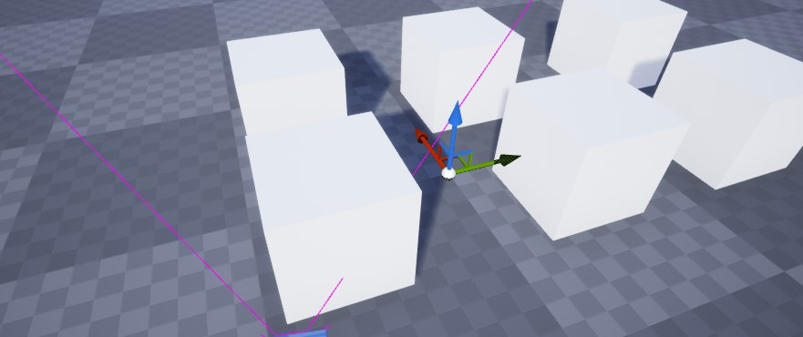

  *Figura: Freezerendering before.*
1. Com comando `Stat initviews` apresente as estatistas.    
  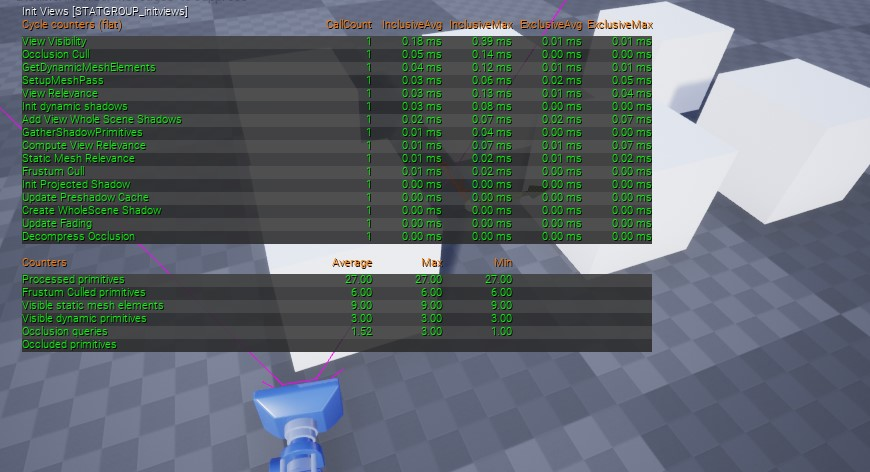

  *Figura: Stat initviews.*
1. Alterne para a visualização e controle de câmera.    
     

  *Figura: Stat initviews.*
1. Perceba que a média de objetos cortados na cena aumentou (`Frustum Culled Primitives`) e os objetos visíveis diminuiu (`Visible static mesh elements`).    
  

  *Figura: Stat initviews complete scene camera.*
1. Com o comando `freezerendering` congele a renderização.
1. Ejete a câmera para poder navegar pela cena e aperte a tecla **1**, que foi utilizada para marcar a posição da câmera antes.   
       

  *Figura: Stat initviews after.*  
1. Como resultado temos dois objetos sendo renderizados, pois se um pixel de um objeto estiver presente na cena, o caso do objeto mais longe da câmera, todo o objeto é renderizado.
> Se os objetos grandes fossem divididos em vários pedaços isso poderia diminuir o processo de renderização pois não teríamos que renderizar objetos gigantes que não aparecem totalmente na cena, mas sobrecarregaria a verificação de cada objeto visível na cena, então devemos balancear entre os dois métodos.

<a name="4.3.5"></a>
### 3.5 Occlusion Culling é um processo pesado a partir de 10.000 objetos na cena.
Abaixo um exemplo em uma cena com 10.000 objetos
1. Distance Culling remove 3.000 restando 7.000;
1. Frustum Culling remove e renderiza 4.000;
1. Precomputed Visibility remove 1.000;
1. Occlusion Culling remove 1.000.  

A necessidade do sistema executar os passos acima e efetuar vários cálculos para cada um pode tornar o processo pesado.

**Performance**

- Configure distance Culling;
- Mais de 10-15k objetos pode ter impacto;
- Maior parte na CPU mas tem algum impacto na GPU;
- Grandes ambientes não ocluem bem;
- A mesma coisa para as partículas;
- Modelos grandes raramente irão ocluir e, assim, aumentar GPU;
- Mas combinar modelos com modelos grandes irá diminuir o custo da CPU.

**Resultado**

- (Cubo) Modelos A  Visível;
- (Cubo) Modelos B Visível;
- (Esfera) Modelos C Não Visível;
- (Cilindro) Modelos D Visível;
- (Cubo) Modelos E Não Visível.

A,B,D são processados na GPU.

<a name="4.4"></a>
## 4. Processamento do Frame 2 - Time 66ms - GPU
A GPU agora tem uma lista de modelos e transformações, mas se apenas renderizássemos esta informação iria causar uma grande quantidade de renderização de pixels redundantes, portanto, precisamos descobrir quais modelos serão exibidos com antecedência.


*Figura. 3 Objetos na cena.*

- Considerando a renderização de cada pixel na cena na imagem acima não poderia renderizar os pixels que estão detrás dos cilindros e os que estão ocultos por outros objetos;
- Menu `Project Settings` > `Rendering` > `Early Z-Pass`.

<a name="4.4.1"></a>
### 4.1 Drawcalls
A GPU agora começa a renderizar, sendo feito objeto por objeto (DrawCall).      

Um grupo de poligonos compartilha as mesmas propriedades em um Drawcall, abaixo um exemplo de como é feita a renderização.

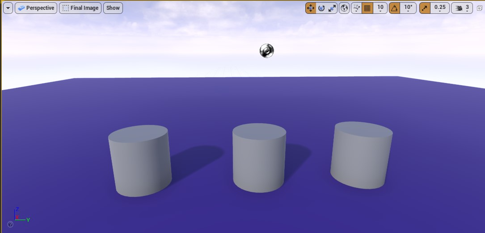

*Figura: A imagem acima renderiza 5 vezes.*

1. Chão;
1. Objetos 1, 2 e 3;
1. Céu.

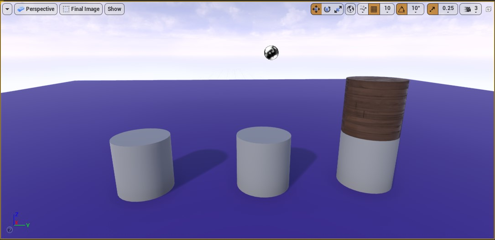

*Figura: A imagem acima renderiza 6 vezes.*

1. Chão;
1. Objetos 1, 2 e parte do objeto 3;
1. Parte do Objeto 3;
1. Céu.

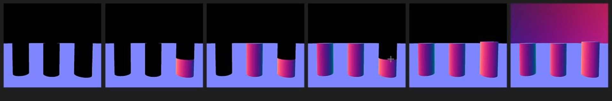

*Figura: Gemeotry Hendering Drawcall.*

Acima o passo a passo, a ordem de renderização depende da importância dos objetos na cena.
O chão é renderizado primeiro e depois os cilindos, isto se deve porque a cena é classificada por tipo de material, isso é mais rápido do contrário, pois tem que fazer uma mudança de estado de renderização no hardware.

> A ordem de renderização não tem impacto no processamento.

<a name="4.4.2"></a>
### 4.2 O comando Stat RHI
RHI significa Rendering Hardware Interface. Este comando exibe várias estatísticas exclusivas:


*Figura: Stat RHI.*

- **Render target memory** -  Mostra o peso total de alvos de renderização como o GBuffer (que armazena as informações finais sobre iluminação e materiais) ou mapas de sombras. O tamanho dos buffers depende da resolução de renderização do jogo, enquanto as sombras são controladas pelas configurações de qualidade das sombras. É útil verificar esse valor periodicamente em sistemas com várias quantidades de RAM de vídeo e, em seguida, ajustar as predefinições de qualidade do seu projeto de acordo.
- **Triangles drawn** - Este é o número final de triângulos. É após o abate de *frustum* e oclusão. Pode parecer muito grande em comparação com o *polycount* de suas malhas. É porque o número real inclui sombras (que "copiam" malhas para desenhar mapas de sombras) e mosaico. No editor, também é afetado pela seleção.
- **DrawPrimitive calls** -  As chamadas *Draw* podem ser um sério gargalo nos programas DirectX 11 e OpenGL4. São os comandos emitidos pela CPU para a GPU e, infelizmente, devem ser traduzidos pelo driver. Esta linha em **stat RHI** mostra a quantidade de chamadas de *draw* emitidas no quadro atual (excluindo apenas a IU do Slate - Interface do Editor). Este é o valor total, portanto, além da geometria (normalmente o maior número), também inclui decalques, sombras, volumes de iluminação translúcida, pós-processamento e muito mais.

**Comando do console**
```bash
stat RHI
```

<a name="4.4.3"></a>
### 4.3 O comando Stat unit e Stat FPS
**Stat fps** nos mostra o número final de *fps* e o tempo que levou para renderizar o último quadro. É o tempo total. Mas ainda não sabemos se o custo foi causado pela CPU ou pela GPU. Como explicado antes, um tem que esperar o outro. A renderização rápida na placa de vídeo não ajudará, se a CPU precisar de mais tempo para terminar o trabalho de jogabilidade, desenho (gerenciando a GPU) ou física.

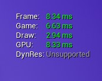     

*Figura: Stat Unit.*

Podemos obter informações mais específicas usando o comando stat unit. A hora do último quadro é mostrada com 4 números.
- **Frame** - é igual ao FPS, o custo final.
- **Game** - é o trabalho da CPU no código do jogo.
- **Draw** -  é o trabalho da CPU na preparação de dados para a placa gráfica.
- **GPU** - é o tempo bruto necessário para renderizar um quadro na placa de vídeo.

**Comandos do console**

```bash
stat fps
stat unit
```

<a name="4.4.4"></a>
### 4.4 Considerações
- 2000 - 3.000 é razoável;
- Mais de 5.000 esta ficando alto;
- Mais de 10.000 é provavelmente um problema;
- Em dispositivos moveis esse valor é muito menor;
- Para verificar experimente executar o comando **stat RHI** e alterar o **View Mode** de **Lit** para **Unlit** e verifique os valores **Triângulos desenhados**;
- **DrawCalls** tem um impacto grande na performance;
- **DrawCalls** tem um mais impacto que a quantidade de polígonos em muitos cenários, exemplo:
  Se temos um polígono com 32 triângulos e 34 tipos de materiais diferentes aplicados na sua superfície, terá mais impacto no FPS do que um polígono de 10.000 triângulos e 1 material.
  Cada triângulo com uma superfície diferentes é renderizado por vez.

<a name="4.5"></a>
## 5 ATIVIDADES
<a name="4.5.1"></a>
### 5.1  Renderização de materiais
1. Implemente os seguintes elementos e seus materiais.
  - Pedra
  - Mesa
  - Cadeira
1. Apresente as seguintes informações.
  - Média de Drawcalls
  - Quantidade de triângulos
  - Quantidade de memória
1. Utilizando os mesmos elementos tente reduzir o processo de renderização.
1. Justifique a possibilidade de executar a cena em hardware de baixo processamento (mobile).

***


## Referências
- [O que é computação gráfica](http://www.um.pro.br/index.php?c=/computacao/definicao)
- [Computação gráfica](https://pt.wikipedia.org/wiki/Computa%C3%A7%C3%A3o_gr%C3%A1fica)
- [Computação Gráfica e Jogos Digitais](https://medium.com/@bitsgrupo/computa%C3%A7%C3%A3o-gr%C3%A1fica-e-jogos-digitais-1e15f0febf7c)
- [Introduction to Computer Graphics](http://math.hws.edu/graphicsbook/)
- [An In-Depth Look at Real-Time Rendering](https://www.unrealengine.com/en-US/onlinelearning-courses/an-in-depth-look-at-real-time-rendering)
- [Visibility and Occlusion Culling](https://docs.unrealengine.com/en-US/RenderingAndGraphics/VisibilityCulling/index.html)
- [Visibilty Culling Reference](https://docs.unrealengine.com/en-US/RenderingAndGraphics/VisibilityCulling/VisibilityCullingReference/index.html)
- [Cull Distance Volume](https://docs.unrealengine.com/en-US/RenderingAndGraphics/VisibilityCulling/CullDistanceVolume/index.html)
- [WTF Is? Volume - Cull Distance in Unreal Engine 4](https://www.youtube.com/watch?v=g0ML7oJll3w)
- [Process Explorer](https://docs.microsoft.com/en-us/sysinternals/downloads/process-explorer)
- [Unreal’s Rendering Passes](https://unrealartoptimization.github.io/book/profiling/passes/)
- [Measuring Performance](https://unrealartoptimization.github.io/book/process/measuring-performance/)
- [Understanding Culling Methods | Live Training | Inside Unreal](https://youtu.be/6WtE3CoFMXU)
- [how unreal renders a frame](https://interplayoflight.wordpress.com/2017/10/25/how-unreal-renders-a-frame/)
- [Real-Time Rendering Fundamentals](https://www.unrealengine.com/en-US/onlinelearning-courses/real-time-rendering-fundamentals)
- [How Unreal Renders a Frame](https://interplayoflight.wordpress.com/2017/10/25/how-unreal-renders-a-frame/)
- [Introduction to Decal Rendering](https://samdriver.xyz/article/decal-render-intro)
- [Vertex Shaders](https://www.nvidia.com/en-us/drivers/feature-vertexshader/)
- [Verttex Shaders](https://pt.wikipedia.org/wiki/Vertex_shader)
- [Deferred Shading](https://learnopengl.com/Advanced-Lighting/Deferred-Shading)
-  [Normal Mapping](https://learnopengl.com/Advanced-Lighting/Normal-Mapping)
-  [General-purpose computing on graphics processing units](https://en.wikipedia.org/wiki/General-purpose_computing_on_graphics_processing_units)
-  [gpu-rendering-and-game-graphics-explained](https://www.gamersnexus.net/guides/2429-gpu-rendering-and-game-graphics-explained)
-  [feature-vertexshader](https://www.nvidia.com/en-us/drivers/feature-vertexshader/)
-  [General-purpose_computing_on_graphics_processing_units](https://en.wikipedia.org/wiki/General-purpose_computing_on_graphics_processing_units)
- [articles/forward-rendering-vs-deferred-rendering--gamedev-12342](https://gamedevelopment.tutsplus.com/articles/forward-rendering-vs-deferred-rendering--gamedev-12342)
-  [Graphics_pipeline](https://en.wikipedia.org/wiki/Graphics_pipeline)
- [Vertex_pipeline](https://en.wikipedia.org/wiki/Vertex_pipeline)
- [vertex-shader](https://www.pcmag.com/encyclopedia/term/vertex-shader)
- [video-game-e-jogos/863-o-que-e-vertex-shading](https://www.tecmundo.com.br/video-game-e-jogos/863-o-que-e-vertex-shading-.htm)
- [Geometry_Shader](https://www.khronos.org/opengl/wiki/Geometry_Shader)
- [Fragment_Shader](https://www.khronos.org/opengl/wiki/Fragment_Shader)
- [computer_graphics](https://en.wikipedia.org/wiki/Rendering_(computer_graphics))
- [what-are-draw-calls](https://unreal.tips/en/what-are-draw-calls/)
- [RPC](https://deinfo.uepg.br/~alunoso/2017/RPC/)
- [pixels](https://bassemtodary.wordpress.com/tag/pixels/)
- [Interplay of Light](https://interplayoflight.wordpress.com/2017/10/25/how-unreal-renders-a-frame-part-2/)
- [Game Engine Overview](https://www.slideshare.net/sharadmitra/game-engine-overview)
- [Polygon Mesh](https://pt.qaz.wiki/wiki/Polygon_mesh)
- [How to Prepare Textures](https://vvvv.org/documentation/howto-prepare-textures)
- [Computer Graphics. image treatment](https://www.petervaldivia.com/computer-graphics/)
- [Maya tutorial : How to move your Pivot Point ( 2 methods )](https://www.youtube.com/watch?v=V4DwKcik4yU)
- [UE4 Tutorial: Change Pivot Point on BSP or Static Mesh](https://www.youtube.com/watch?v=N1h5mMviSKs)
- [HSV to RGB Material Function in Unreal Engine](https://ferkizue.blogspot.com/2018/06/hsv-to-rgb-material-function-in-unreal.html)
- [Alpha compositing](https://en.wikipedia.org/wiki/Alpha_compositing)
- [Alpha (alpha channel)](https://developer.mozilla.org/en-US/docs/Glossary/Alpha)
- [RGB Color Codes Chart](https://www.rapidtables.com/web/color/RGB_Color.html)
