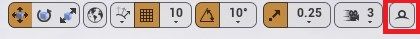

# RenderDoc
Neste capitulo vamos apresentar o aplicativo RenderDoc.

## Índice
1. [O aplicativo e plugin Renderdoc](#1)
1. [Ativando o Plugin no Unreal Engine 4](#2)

## 1. O aplicativo e plugin Renderdoc
**RenderDoc** é uma ferramenta de depuração de quadros de código aberto e gratuita que pode ser usada para analisar quadros únicos gerados por outros programas de software, como jogos.

## 2 Ativando o Plugin no Unreal Engine 4
1. Plugin     
    

    *Figura: Edit->Plugins*  
1. Instalação do aplicativo no Windows.       
  [Baixe aqui](https://renderdoc.org/)
1. Capturando o frame desejado.        
        

    *Figura: Icon no Viewport*

1. Carregando o frame capturado.        
  

    *Figura: Aba Localhost - UEEditor*  

1. Apresentando a textura carregada e suas saídas por processamento.        
  

    *Figura: A aba Textures Viewer*  
1. Lista de elementos renderizados por ordem de execução.   
  

    *Figura: Event Browser*  
  - Para apresentar o tempo de duração de cada Drawcall clique em **Time Durations for the Drawcalls**.

---
## Referências
1. [RenderDoc](https://en.everybodywiki.com/RenderDoc)
1. [RenderDoc Documentação](https://renderdoc.org/docs/index.html)
