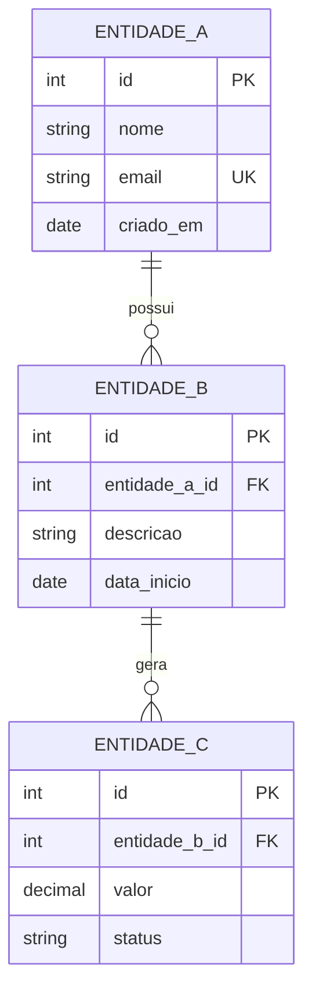

# 🗄️ [Nome do Projeto] — Modelagem e Implementação em PostgreSQL

> Projeto acadêmico desenvolvido para a disciplina de **Banco de Dados**.  
> Tema: _[descreva o tema escolhido, ex: "Sistema de Aluguel de Veículos"]_

---

## 📋 Identificação

| Campo        | Informação                          |
|--------------|-------------------------------------|
| **Aluno(s)** | Sobrenome, Nome / Sobrenome, Nome   |
| **Turma**    | Banco de Dados — [Ano/Semestre]     |
| **Data**     | DD/MM/AAAA                          |
| **Professor**| [Nome do Professor]                  |
| **Disciplina**| Banco de Dados                     |

---

## 📌 Sumário

- [Sobre o Projeto](#-sobre-o-projeto)
- [Regras de Negócio](#-regras-de-negócio)
- [Modelo de Dados (ER)](#-modelo-de-dados-er)
- [Justificativas Técnicas](#-justificativas-técnicas)
- [Estrutura do Repositório](#-estrutura-do-repositório)
- [Scripts SQL](#-scripts-sql)
- [Como Executar](#-como-executar)
- [Testes e Resultados](#-testes-e-resultados)
- [Log da Conversa com IA](#-log-da-conversa-com-ia)
- [Erros Identificados e Corrigidos](#-erros-identificados-e-corrigidos-alucinações-da-ia)
- [Checklist de Entrega](#-checklist-de-entrega)
- [Conclusões](#-conclusões)
- [Referências](#-referências)

---

## 📖 Sobre o Projeto

> _Descreva em 2 a 3 parágrafos o contexto e o objetivo do projeto._

Este projeto implementa um banco de dados relacional para [domínio do problema], com o objetivo de [objetivo geral]. O sistema foi modelado para atender às necessidades de [público-alvo], permitindo [principais funcionalidades].

A modelagem segue as três primeiras Formas Normais de Codd (1FN, 2FN e 3FN), garantindo integridade referencial, ausência de redundância e dependências funcionais corretas entre os atributos.

Todos os scripts foram desenvolvidos e testados no **PostgreSQL 16+**, utilizando recursos como `CREATE OR REPLACE`, procedures, functions, triggers e views.

---

## 📐 Regras de Negócio

> _Liste de forma clara e objetiva todas as regras que orientaram a modelagem._

- Um **[Entidade A]** pode ter zero ou muitos **[Entidade B]**.
- Cada **[Entidade B]** pertence obrigatoriamente a um único **[Entidade A]**.
- [Regra 3]: descrever a restrição de negócio.
- [Regra 4]: descrever a restrição de negócio.
- [Regra N]: descrever a restrição de negócio.

---

## 🗺️ Modelo de Dados (ER)

> _O diagrama abaixo foi validado no [Mermaid Live Editor](https://mermaid.live/)._



> ⚠️ **Instrução ao aluno:** substitua as entidades acima pelo seu modelo real. Teste sempre em [https://mermaid.live](https://mermaid.live) antes de fazer o commit.

---

## 🧠 Justificativas Técnicas

> _Explique as decisões de modelagem mais relevantes._

### Decisões de Projeto

- **Tabela `ENTIDADE_B`**: criada para separar [motivo], evitando dependência parcial em relação à chave primária composta de `ENTIDADE_A`.
- **Relacionamento N:N entre X e Y**: resolvido por meio da tabela associativa `XY`, que armazena [atributos da associação].
- **Uso de `SERIAL` / `BIGSERIAL`**: adotado para geração automática de chaves primárias, garantindo unicidade sem esforço manual.
- **Coluna `status` como `VARCHAR` e não `BOOLEAN`**: permite evolução futura para mais de dois estados sem migração de esquema.

### Normalização Aplicada

| Forma Normal | Aplicação no Projeto |
|---|---|
| **1FN** | Todos os atributos são atômicos; ausência de grupos repetidos. |
| **2FN** | Todos os atributos não-chave dependem completamente da chave primária. |
| **3FN** | Nenhum atributo não-chave depende transitivamente de outro atributo não-chave. |

---

## 📁 Estrutura do Repositório

```
📦 nome-do-repositorio/
├── README.md                          ← Este arquivo
├── scripts/
│   ├── 01__create_table_entidade_a.sql
│   ├── 02__create_table_entidade_b.sql
│   ├── 03__create_table_entidade_c.sql
│   ├── 04__insert_into_entidade_a.sql
│   ├── 05__insert_into_entidade_b.sql
│   ├── 06__insert_into_entidade_c.sql
│   ├── 07__create_view_resumo.sql
│   ├── 08__create_or_replace_function_calcular.sql
│   ├── 09__create_or_replace_procedure_processar.sql
│   └── 10__create_trigger_auditoria.sql
├── testes/
│   ├── resultado_query_01.png
│   ├── resultado_query_02.png
│   └── resultado_procedure.png
└── docs/
    └── log_conversa_ia.txt            ← ou link no README
```

> **Regra de nomenclatura dos scripts** (conforme exigido pela disciplina):
> `[Versão]__[acao]_[descricao_objeto].sql`
>
> Exemplos válidos:
> - `01__create_table_clientes.sql`
> - `05__add_email_to_clientes.sql`
> - `08__create_or_replace_procedure_calcula_nota_fiscal.sql`

---

## 📜 Scripts SQL

> _Todos os scripts estão na pasta `/scripts`. Abaixo, os principais trechos comentados._

### DDL — Criação de Tabelas

```sql
-- ============================================================
-- Tabela: ENTIDADE_A
-- Objetivo: Armazena os dados principais do domínio X
-- ============================================================
CREATE TABLE IF NOT EXISTS entidade_a (
    id         SERIAL       PRIMARY KEY,
    nome       VARCHAR(100) NOT NULL,
    email      VARCHAR(150) NOT NULL UNIQUE,
    criado_em  DATE         NOT NULL DEFAULT CURRENT_DATE
);
```

```sql
-- ============================================================
-- Tabela: ENTIDADE_B
-- Objetivo: Registra os ocorrências vinculadas a ENTIDADE_A
-- FK: entidade_a_id → entidade_a(id)
-- ============================================================
CREATE TABLE IF NOT EXISTS entidade_b (
    id             SERIAL      PRIMARY KEY,
    entidade_a_id  INT         NOT NULL REFERENCES entidade_a(id),
    descricao      TEXT        NOT NULL,
    data_inicio    DATE        NOT NULL DEFAULT CURRENT_DATE
);
```

### DML — Inserção de Dados de Exemplo

```sql
-- Popular ENTIDADE_A com dados de teste
INSERT INTO entidade_a (nome, email) VALUES
    ('João Silva',   'joao@email.com'),
    ('Maria Santos', 'maria@email.com'),
    ('Carlos Lima',  'carlos@email.com');

-- Popular ENTIDADE_B vinculada à ENTIDADE_A
INSERT INTO entidade_b (entidade_a_id, descricao) VALUES
    (1, 'Primeira ocorrência de João'),
    (1, 'Segunda ocorrência de João'),
    (2, 'Primeira ocorrência de Maria');
```

### Function — Exemplo Comentado

```sql
-- ============================================================
-- Function: calcular_total
-- Objetivo: Retorna a soma de valores de entidade_c
--           para um determinado entidade_b_id
-- Parâmetros:
--   p_entidade_b_id INT — ID da entidade B
-- Retorno: DECIMAL — Total calculado (0 se não houver registros)
-- ============================================================
CREATE OR REPLACE FUNCTION calcular_total(
    p_entidade_b_id INT
)
RETURNS DECIMAL AS $$
DECLARE
    v_total DECIMAL := 0; -- Inicializa com zero para evitar NULL
BEGIN
    SELECT COALESCE(SUM(valor), 0)
    INTO   v_total
    FROM   entidade_c
    WHERE  entidade_b_id = p_entidade_b_id;

    RETURN v_total;

EXCEPTION WHEN OTHERS THEN
    RAISE NOTICE 'Erro em calcular_total: %', SQLERRM;
    RETURN NULL;
END;
$$ LANGUAGE plpgsql;

-- Teste de execução
SELECT calcular_total(1);
```

---

## ▶️ Como Executar

### Pré-requisitos

- [PostgreSQL 16+](https://www.postgresql.org/download/)
- [pgAdmin 4](https://www.pgadmin.org/) ou [DBeaver Community](https://dbeaver.io/)
- Git instalado

### Passo a Passo

```bash
# 1. Clone o repositório
git clone https://github.com/seu-usuario/nome-do-repositorio.git
cd nome-do-repositorio

# 2. Conecte-se ao PostgreSQL e crie o banco
psql -U postgres -c "CREATE DATABASE nome_do_projeto;"

# 3. Execute os scripts em ordem
psql -U postgres -d nome_do_projeto -f scripts/01__create_table_entidade_a.sql
psql -U postgres -d nome_do_projeto -f scripts/02__create_table_entidade_b.sql
# ... continue na sequência numérica

# 4. Valide a criação das tabelas
psql -U postgres -d nome_do_projeto -c "\dt"
```

> **Dica:** todos os scripts usam `CREATE TABLE IF NOT EXISTS` e `CREATE OR REPLACE`, portanto podem ser executados múltiplas vezes sem erros.

---

## 🧪 Testes e Resultados

> _Inclua ao menos um screenshot por query principal e por procedure/function executada._

### Resultado: Listagem de ENTIDADE_A

```sql
SELECT * FROM entidade_a ORDER BY nome;
```

📸 _[Inserir screenshot: `testes/resultado_query_01.png`]_

### Resultado: Execução da Function

```sql
SELECT calcular_total(1);
```

📸 _[Inserir screenshot: `testes/resultado_procedure.png`]_

---

## 🤖 Log da Conversa com IA

> A seguir está o registro da interação com a IA durante o desenvolvimento.

- 🔗 **Link da conversa:** [https://claude.ai/share/...](https://claude.ai/share/) _(ou ChatGPT/outra ferramenta)_
- 📄 **Arquivo de log:** `docs/log_conversa_ia.txt`

**Resumo das iterações realizadas:**

1. Prompt inicial: solicitei o diagrama ER com base nas regras de negócio.
2. Revisão: corrigi cardinalidades inconsistentes na sugestão da IA.
3. Geração dos scripts DDL e DML com comentários.
4. Criação de functions e procedures com tratamento de erros.

---

## 🔍 Erros Identificados e Corrigidos (Alucinações da IA)

> _Documentar erros encontrados demonstra compreensão técnica e é critério avaliado._

| # | Erro gerado pela IA | Correção aplicada |
|---|---|---|
| 1 | Uso de `STRING_LENGTH()` inexistente no PostgreSQL | Substituído por `LENGTH()` |
| 2 | Referência à coluna `categoria_nome` que não existe no modelo | Adicionado `JOIN` com tabela `categorias` |
| 3 | Sintaxe MySQL `LIMIT 5, 10` | Corrigido para `LIMIT 10 OFFSET 5` (padrão PostgreSQL) |
| 4 | Function sem bloco `EXCEPTION` | Adicionado tratamento de erros com `RAISE NOTICE` |

---

## ✅ Checklist de Entrega

Antes de submeter o link do repositório, verifique:

- [ ] Diagrama Mermaid renderiza sem erros em [mermaid.live](https://mermaid.live)
- [ ] Todas as entidades estão na **3ª Forma Normal (3FN)**
- [ ] Todos os atributos têm tipo de dado especificado
- [ ] Chaves primárias marcadas com `PK`
- [ ] Chaves estrangeiras marcadas com `FK`
- [ ] Cardinalidades refletem fielmente as regras de negócio
- [ ] Scripts SQL com sintaxe **PostgreSQL** correta
- [ ] Procedures/Functions possuem comentários explicativos
- [ ] Testes executados e screenshots incluídos
- [ ] Log da conversa com IA incluído
- [ ] Justificativas técnicas explicam as decisões de modelagem
- [ ] Arquivo `README.md` presente e completo
- [ ] Nomenclatura dos arquivos segue o padrão da disciplina
- [ ] Repositório **público** no GitHub
- [ ] Nenhum arquivo compactado (`.zip`, `.rar`) no repositório
- [ ] Sem erros de ortografia relevantes

---

## 📝 Conclusões

> _Relate os aprendizados obtidos e as dificuldades enfrentadas._

Durante o desenvolvimento deste projeto, os principais aprendizados foram:

- [Aprendizado 1]: _ex: A importância de normalizar antes de codificar._
- [Aprendizado 2]: _ex: Como identificar dependências transitivas na prática._
- [Aprendizado 3]: _ex: O uso de `COALESCE` para evitar retorno NULL em agregações._

**Dificuldades enfrentadas:**

- [Dificuldade 1]: _ex: Definir a cardinalidade correta no relacionamento N:N entre X e Y._
- [Dificuldade 2]: _ex: A IA gerou sintaxe de MySQL em vez de PostgreSQL na primeira tentativa._

---

## 📚 Referências

- 📖 [Modelagem e Implementação Prática — Cafegeek](https://cafegeek.eti.br/curso/banco-de-dados/atividades/modelagem-e-implementacao/)
- 📖 [Regras das Atividades — Cafegeek](https://cafegeek.eti.br/curso/banco-de-dados/atividades/regras-das-atividades/)
- 📖 [Normalização de Banco de Dados — Cafegeek](https://cafegeek.eti.br/curso/banco-de-dados/normalizacao/normalizacao-de-banco-de-dados/)
- 📖 [Documentação Oficial PostgreSQL](https://www.postgresql.org/docs/)
- 📖 [Mermaid ER Diagram Syntax](https://mermaid.js.org/syntax/entityRelationshipDiagram.html)
- 📖 [Mermaid Live Editor](https://mermaid.live/)
- 📖 [W3Schools SQL Tutorial](https://www.w3schools.com/sql/)

---

> _Repositório desenvolvido como atividade acadêmica da disciplina de Banco de Dados._  
> _Contato com o professor via ambiente da disciplina._
