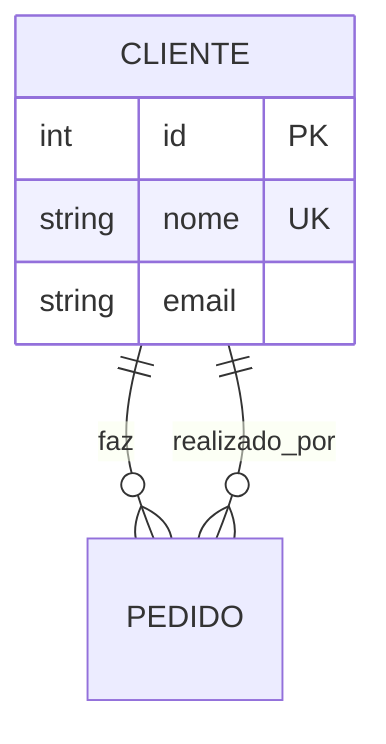

## Introdução

Todas as atividades seguem um modelo de dados com regras negociais específicas, como por exemplo: Site de Aluguel de Carros, Site de Rede Social, Site de Campeonatos ou Competições Esportivas.

As atividades são classificadas em duas categorias principais:

- **Modelo de Dados**: Diagrama ER com análise da normalização
- **Comandos PostgreSQL**: Scripts SQL com procedures, functions, triggers e consultas

## Regras para Avaliação de Modelos de Dados

### Critério 1: Análise da Regra Negocial (20%)

Identificação correta das entidades, atributos e relacionamentos conforme as Formas Normais de Codd.

**O que será avaliado:**

- Identificação completa de todas as entidades do domínio
- Atributos adequados para cada entidade
- Conformidade com 1FN, 2FN e 3FN
- Não há dependências parciais ou transitivas

**Referências:**

- Principal: <https://cafegeek.eti.br/curso/banco-de-dados/normalizacao/normalizacao-de-banco-de-dados/>
- <https://ebaconline.com.br/blog/normalizacao-de-bases-de-dados>
- <https://www.devmedia.com.br/artigo-sql-magazine-6-normalizacao-tecnicas-e-conceitos/7087>

**Penalidade:** Se o modelo não atender a qualquer das formas normais (1FN, 2FN ou 3FN), a nota neste critério sofrerá decréscimo de **50%**.

---

### Critério 2: Sintaxe MERMAID (20%)

Diagrama deve ser renderizável sem erros no Mermaid Live Editor.

**O que será avaliado:**

- Sintaxe válida do diagrama ER em Mermaid
- Renderização correta sem avisos ou erros
- Legibilidade e apresentação visual

**Referência:** <https://mermaid.live/>

**Para testar:** Copie seu código mermaid no editor online e valide se renderiza sem erros.

**Penalidade:** Qualquer erro de sintaxe que impeça a renderização resultará em decréscimo de **50%**.

---

### Critério 3: Cardinalidades Adequadas (20%)

Relacionamentos com marcadores corretos refletindo as restrições de integridade referencial.

**O que será avaliado:**

- Uso correto de marcadores: `||` (um para um), `o|` (zero ou um), `|}` (um para muitos), `o{` (zero para muitos)
- Cardinalidades apropriadas para a regra negocial
- Relacionamentos reflexivos se necessário
- Chaves estrangeiras devidamente indicadas

**Referência:** <https://mermaid.js.org/syntax/entityRelationshipDiagram.html>

**Exemplo correto:**

```text
CLIENTE ||--o{ PEDIDO : realiza
PEDIDO }o--|| PRODUTO : contém
```

**Penalidade:** Cardinalidades incorretas ou inconsistentes com a regra negocial resultarão em decréscimo de **50%**.

---

### Critério 4: Atributos Completos (20%)

Inclusão de tipos de dados, chaves primárias (PK), chaves estrangeiras (FK) e atributos relevantes para a regra negocial.

**O que será avaliado:**

- Todos os atributos necessários da regra negocial estão presentes
- Tipos de dados apropriados (INT, VARCHAR, DATE, DECIMAL, etc.)
- Chaves primárias claramente marcadas (PK)
- Chaves estrangeiras devidamente indicadas (FK)
- Restrições de NOT NULL onde aplicável
- Ausência de atributos redundantes

**Referência:** <https://mermaid.js.org/syntax/entityRelationshipDiagram.html>

**Exemplo correto:**

```text
CLIENTE {
    int id PK
    string nome
    string email UK
    date data_cadastro
}
```

**Penalidade:** Omissão de atributos relevantes ou falta de especificação de tipos de dados resultará em decréscimo de **50%**.

---

### Critério 5: Documentação e Justificativa (20%)

Comentários explicativos sobre decisões de modelagem, justificando as escolhas técnicas.

**O que será avaliado:**

- Explicação clara da regra negocial e seu contexto
- Justificativa de decisões de projeto
- Comentários sobre relacionamentos complexos
- Esclarecimento de razões para normalização
- Indicação de alternativas consideradas e o porquê foram rejeitadas

**Formato aceito:**

- Comentários em Markdown antes ou depois do diagrama
- Notas no próprio diagrama Mermaid
- Seção dedicada "Justificativas Técnicas"

**Exemplo:**

```markdown
## Decisões de Modelagem

- **Tabela RESULTADO**: Relaciona ATLETA, CATEGORIA e EVENTO para capturar
  desempenho em cada competição
- **Normalização**: 3FN aplicada para evitar anomalias de atualização
```

**Penalidade:** Falta de documentação ou comentários resultará em decréscimo de **50%**.

---

### Soma total para Modelo de Dados: 100%

## Regras para Avaliação de Comandos PostgreSQL

### Critério 1: Log da Conversa (10%)

Documentação completa da interação com a IA, demonstrando o processo de desenvolvimento.

**O que será avaliado:**

- Link ou captura da conversa com a IA (ChatGPT, Claude, etc.)
- Clareza das instruções iniciais ao modelo
- Histórico das correções solicitadas
- Evidência de iteração e refinamento

**Como documentar:**

- Cole o link da conversa compartilhada (se disponível)
- Ou anexe um arquivo `.txt` com o histórico
- Marque as partes relevantes

**Penalidade:** Ausência de log ou log vago resultará em decréscimo de **30%**.

---

### Critério 2: Detecção e Correção de Alucinações (10%)

Capacidade de identificar erros gerados pela IA e corrigi-los, demonstrando compreensão técnica.

**O que será avaliado:**

- Identificação de inconsistências nas sugestões da IA
- Correção de erros de sintaxe PostgreSQL
- Validação contra o modelo de dados proposto
- Conhecimento demonstrado sobre o domínio

**Exemplos de alucinações comuns:**

- Funções inexistentes ou com sintaxe incorreta (ex: `STRING_LENGTH` em PostgreSQL não existe, use `LENGTH`)
- Colunas ou tabelas que não existem no modelo
- Performance ruim por falta de índices apropriados
- Lógica de negócio incorreta ou incompleta
- Tipos de dados inválidos

**Como demonstrar:**

```markdown
## Erros Identificados e Corrigidos

**Erro 1**: A IA sugeriu `STRING_LENGTH()` mas PostgreSQL usa `LENGTH()`
**Correção**: Substituído para sintaxe correta

**Erro 2**: A função tentava acessar coluna inexistente `categoria_nome`
**Correção**: Adicionado JOIN com tabela CATEGORIAS
```

**Penalidade:** Aceitar alucinações sem questionamento resultará em decréscimo de **50%**.

---

### Critério 3: Código Final Funcional (80%)

Procedures, functions, triggers e consultas com sintaxe correta, comentários explicativos e comprovação de execução.

**O que será avaliado:**

- Sintaxe PostgreSQL válida e sem erros
- Comentários explicando a lógica de cada bloco
- Alinhamento com o modelo de dados
- Execução comprovada (prints do resultado)
- Performance adequada
- Tratamento de erros (EXCEPTION quando apropriado)

**Formato esperado:**

```sql
-- Descrição geral da procedure
-- Parâmetros: ...
-- Retorno: ...
CREATE OR REPLACE FUNCTION sp_minha_funcao(
    p_parametro1 INT
)
RETURNS TABLE (
    resultado_1 VARCHAR,
    resultado_2 INT
) AS $$
DECLARE
    v_variavel1 INT; -- Descrição da variável
BEGIN
    -- Lógica comentada em blocos
    
    RETURN QUERY
    SELECT 
        coluna1,
        coluna2
    FROM tabela
    WHERE id = p_parametro1;
    
EXCEPTION WHEN OTHERS THEN
    RAISE NOTICE 'Erro na execução: %', SQLERRM;
END;
$$ LANGUAGE plpgsql;

-- Teste de execução
SELECT * FROM sp_minha_funcao(1);
```

**O que demonstra qualidade:**

- Nomes descritivos para variáveis e parâmetros
- Tratamento de casos extremos (NULL, 0, etc.)
- Índices apropriados para dados grandes
- Evita N+1 queries
- CTE (Common Table Expressions) para lógica complexa

**Penalidades:**

- Erro de sintaxe PostgreSQL: decréscimo de **50%**
- Implementação sobre modelo incorreto: decréscimo de **50%**
- Falta de comentários explicativos: decréscimo de **20%**
- Sem comprovação de execução (screenshot/print): decréscimo de **30%**
- Sem tratamento de erros em procedures complexas: decréscimo de **15%**

---

### Soma total para Comandos PostgreSQL: 100%  

## Instruções Gerais

1. **Acesso à Regra Negocial**: Consulte o sistema ou documentação especificada para cada atividade. A análise profunda do contexto é fundamental para um modelo correto.

2. **Ferramenta MERMAID**: Utilize o [Mermaid Live Editor](https://mermaid.live/) para testar seu diagrama. O editor renderiza instantaneamente e mostra erros de sintaxe.

3. **Uso de IA**: Incentivamos o uso de IA como ferramenta auxiliar. Você será avaliado por sua capacidade de:
   - Formular instruções claras e bem estruturadas
   - Identificar e corrigir erros nas sugestões
   - Validar resultados contra a regra negocial
   - Demonstrar compreensão técnica

4. **Documentação Obrigatória**: Todo código e diagrama devem incluir justificativas técnicas. Um trabalho correto sem explicação receberá nota inferior a um trabalho com análise crítica.

## Regras para Entregas

Toda atividade deve ser entregue em um **arquivo Markdown** (.md) contendo:

### Estrutura Obrigatória

1. **Cabeçalho**: Título, aluno(s), turma e data
2. **Resumo Executivo**: Breve descrição da regra negocial (2-3 parágrafos)
3. **Diagrama MERMAID**: Modelo ER em formato renderizável
4. **Justificativas Técnicas**: Explicação das decisões de modelagem
5. **Scripts SQL**: Comandos CREATE TABLE, INSERT, procedures/functions com comentários
6. **Testes e Resultados**: Screenshots ou saída de execução
7. **Log da Conversa**: Link ou histórico da interação com a IA
8. **Conclusões**: Aprendizados e dificuldades enfrentadas

### Exemplo de Estrutura

```markdown
# Atividade: [Nome da Atividade]

**Aluno(s):** João Silva  
**Turma:** Banco de Dados 2026  
**Data:** 15/04/2026  

## Resumo Executivo

Descrever a regra negocial...

## 1. Diagrama do Modelo de Dados

\`\`\`mermaid
erDiagram
    -- Seu diagrama aqui
\`\`\`

## 2. Justificativas Técnicas

Explicar as decisões...

## 3. Scripts SQL

### Criação de Tabelas
\`\`\`sql
CREATE TABLE ...
\`\`\`

### Inserção de Dados
\`\`\`sql
INSERT INTO ...
\`\`\`

## 4. Testes e Resultados

[Incluir screenshots]

## 5. Log da Conversa

https://chatgpt.com/share/...

## 6. Conclusões

...
```

### Nomenclatura de Arquivos

Use o padrão: `ATIVIDADE-grupo-XX-sobrenome-aluno.md`

**Exemplos válidos:**

- `03-modelo-dados-grupo-01-silva.md`
- `04-sql-procedures-grupo-02-santos.md`
- `01-normalizacao-grupo-03-ferreira-oliveira.md`

### Critérios da Entrega

- ✓ Arquivo em Markdown (.md)
- ✓ Diagrama renderizável no Mermaid Live Editor
- ✓ Scripts SQL com sintaxe correta
- ✓ Comentários explicativos
- ✓ Comprovação de execução (prints/screenshots)
- ✓ Log da conversa com IA
- ✓ Documentação clara e completa
- ✓ Nenhum arquivo compactado (.zip, .rar) — entregue o .md direto

---

## Boas Práticas Recomendadas

### Para o Modelo de Dados

1. **Leia a regra negocial completamente** antes de começar o diagrama
2. **Identifique todas as entidades** em um brainstorm inicial
3. **Defina chaves primárias únicas** para cada entidade
4. **Use chaves estrangeiras** para representar relacionamentos
5. **Aplique normalização** (1FN → 2FN → 3FN)
6. **Evite valores NULL** em colunas críticas (use DEFAULT se necessário)
7. **Teste seu diagrama** no Mermaid Live Editor múltiplas vezes
8. **Documente decisões complexas** (por que uma tabela foi criada assim?)

### Para os Comandos SQL

1. **Comece com um prompt claro** para a IA (liste as requirements específicas)
2. **Peça exemplos de uso** além do código base
3. **Valide cada query** em um PostgreSQL local antes de submeter
4. **Use indentação** e formatação consistente
5. **Adicione comentários** para lógica não óbvia
6. **Trate erros** em procedures com EXCEPTION
7. **Teste casos extremos** (NULL, 0, empty string)
8. **Use EXPLAIN ANALYZE** para verificar performance em queries grandes

---

## Erros Comuns a Evitar

### Modelagem de Dados

❌ **Não fazer:**

- Tabelas em 2FN/1FN (sem normalização adequada)
- Atributos redundantes/repetidos
- Falta de chaves primárias/estrangeiras
- Cardinalidades inconsistentes com a realidade
- Diagrama com erro de sintaxe no Mermaid

✓ **Fazer:**



### SQL (PostgreSQL)

❌ **Não fazer:**

```sql
-- ❌ Função sem comentários
CREATE FUNCTION calc_total() ...

-- ❌ Sem tratamento de erro
RETURN 1 / valor_zero;

-- ❌ Sintaxe incorreta (PostgreSQL, não MySQL)
SELECT * FROM tabela LIMIT 10 OFFSET 5; -- Correto
SELECT * FROM tabela LIMIT 5, 10;       -- ❌ MySQL syntax
```

✓ **Fazer:**

```sql
-- Calcula total de vendas para um período específico
-- Parâmetros: p_data_inicio DATE, p_data_fim DATE
-- Retorna: soma dos pedidos no período
CREATE OR REPLACE FUNCTION calc_total_vendas(
    p_data_inicio DATE,
    p_data_fim DATE
)
RETURNS DECIMAL AS $$
DECLARE
    v_total DECIMAL := 0; -- Inicializar variáveis
BEGIN
    SELECT COALESCE(SUM(valor), 0)
    INTO v_total
    FROM pedidos
    WHERE data_pedido BETWEEN p_data_inicio AND p_data_fim;
    
    RETURN v_total;

EXCEPTION WHEN OTHERS THEN
    RAISE NOTICE 'Erro ao calcular total: %', SQLERRM;
    RETURN NULL;
END;
$$ LANGUAGE plpgsql;
```

### Documentação

❌ **Não fazer:**

- Log da IA sem nenhuma anotação
- Código sem explicação
- Diagrama sem justificativa

✓ **Fazer:**

- Indicar quais partes da IA foram úteis e quais tiveram erros
- Explicar por que cada entidade foi criada
- Descrever a lógica principal de procedures complexas

---

## Checklist de verificação Antes da Entrega

- [ ] Diagrama renderiza sem erros no [Mermaid Live Editor](https://mermaid.live/)
- [ ] Todas as entidades estão em 3FN
- [ ] Todos os campos têm tipo de dado especificado
- [ ] Chaves primárias marcadas com PK
- [ ] Chaves estrangeiras marcadas com FK
- [ ] Cardinalidades fazem sentido para a regra negocial
- [ ] Scripts SQL têm sintaxe PostgreSQL correta
- [ ] Procedures/Functions têm comentários explicativos
- [ ] Testes executados e resultados documentados (screenshots)
- [ ] Log da conversa com IA está incluído
- [ ] Justificativas técnicas explicam decisões importantes
- [ ] Arquivo em formato .md (não .docx, .pdf, etc.)
- [ ] Nome do arquivo segue padrão recomendado
- [ ] Sem erros de ortografia ou digitação
- [ ] Documentação clara e concisa

---

## FAQ (Perguntas Frequentes)

**P: Posso usar a IA para tudo?**  

R: Sim! Mas você será avaliado por sua capacidade de identificar e corrigir erros. Use a IA como assistente, não como substituto do aprendizado.

**P: E se a IA gerar código com erro?**  

R: Perfeito! Identifique o erro, corrija e documente. Isso demonstra compreensão técnica e pode melhorar sua nota.

**P: Qual é o mínimo de normalização exigida?**  

R: No mínimo **3FN**. 1FN e 2FN devem estar satisfeitos como passos intermediários. Qualquer violação resulta em -50% na nota deste critério.

**P: Posso usar trabalhos de colegas como referência?**  

R: Sim, mas o trabalho deve ser **original**. Cópia literal resulta em zero.

**P: E se meu modelo tiver erro de sintaxe MERMAID?**  
R: Teste sempre no [Mermaid Live Editor](https://mermaid.live/). Um diagrama que não renderiza receberá -50%.

**P: Preciso fazer screenshots de tudo?**  

R: Sim! Pelo menos:

- Resultado final de cada query principal
- Execução de procedures/functions
- Output dos testes

**P: Qual é o tamanho ideal da documentação?**  

R: Qualidade sobre quantidade. Uma documentação concisa e clara vale mais que um texto longo e vago.

**P: Posso entregar em outro formato (Word, PDF)?**  

R: Não. Obrigatoriamente em Markdown (.md). Arquivos compactados (.zip) também não são aceitos.

---

## Dicas Úteis

### Ferramentas Recomendadas

1. [Mermaid Live Editor](https://mermaid.live/) - Validar diagramas
2. [pgAdmin](https://www.pgadmin.org/) - Gerenciar PostgreSQL
3. [DBeaver Community](https://dbeaver.io/) - Cliente SQL gratuito
4. [Visual Studio Code](https://code.visualstudio.com/) - Editor com extensão SQL
5. [ChatGPT/Claude](https://openai.com/) - IA para auxiliar

### Recursos de Aprendizado

- 🎓 Curso de Normalização: <https://cafegeek.eti.br/curso/banco-de-dados/normalizacao/>
- 📚 Documentação PostgreSQL: <https://www.postgresql.org/docs/>
- 📖 SQL Tutorial: <https://www.w3schools.com/sql/>
- 🔍 Mermaid Syntax: <https://mermaid.js.org/syntax/entityRelationshipDiagram.html>

### Fluxo Recomendado

1. **Dia 1-2**: Ler regra negocial, identificar entidades, criar diagrama inicial
2. **Dia 3-4**: Validar no Mermaid, aplicar normalização, documentar decisões
3. **Dia 5-6**: Criar scripts SQL, testar com IA, corrigir erros
4. **Dia 7**: Revisar tudo, fazer screenshots, escrever relatório final
5. **Dia 8**: Entregar com antecedência (evitar last-minute crashes!)

## Considerações Finais

Este documento foi elaborado para **orientar e apoiar** seu desenvolvimento como profissional de banco de dados. As atividades não são apenas avaliações — são **oportunidades de aprendizado**.

### O Que Esperamos de Você

✅ **Iniciativa**: Use a IA como ferramenta, não como muleta  
✅ **Crítica**: Questione o que a IA gera, valide tudo  
✅ **Documentação**: Explique suas decisões técnicas  
✅ **Qualidade**: Prefira um código pequeno correto a um código grande errado  
✅ **Honestidade**: Acredite que compreender é mais importante que copiar  

### Você Está Preparado

Você tem acesso a:

- Referências técnicas completas
- Ferramentas modernas e gratuitas
- IA para acelerar o desenvolvimento
- Comunidade para tirar dúvidas
- Padrões claros de avaliação

### Próximas Etapas

1. Leia **toda** a regra negocial da sua atividade
2. Faça um **diagrama inicial** (mesmo que errado, isso é essencial)
3. **Itere**: revise, normalize, melhore
4. **Implemente** os scripts SQL com testes
5. **Documente**: justifique suas escolhas
6. **Revise** contra este checklist
7. **Entregue** com confiança!

---

### Contato e Suporte

Se tiver dúvidas sobre:

- **Normalização**: Consulte as referências na seção de critérios
- **Sintaxe MERMAID**: Teste no editor e analise as mensagens de erro
- **PostgreSQL**: Use `\h` no psql ou consulte a documentação oficial
- **Atividade específica**: Verifique o enunciado ou entre em contato com o professor

**Bom trabalho!** 🎉
