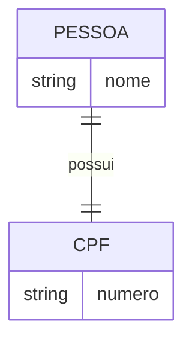
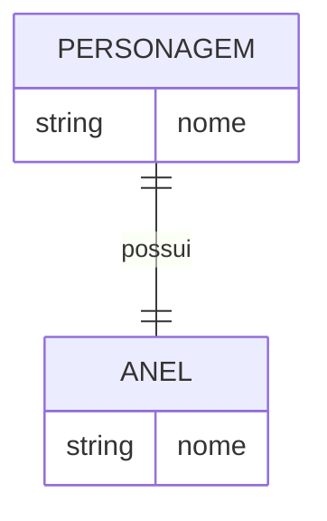
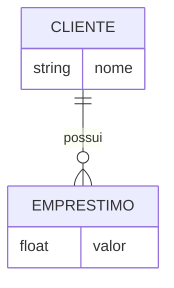
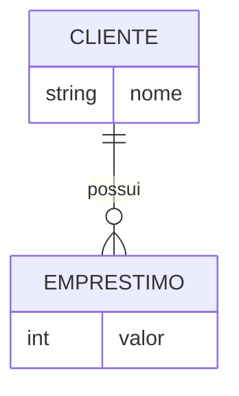
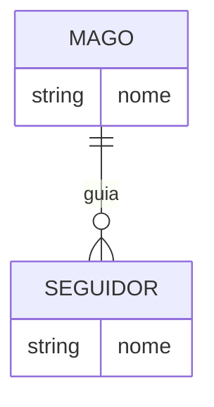
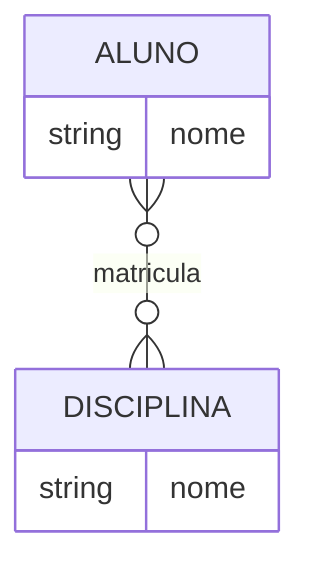
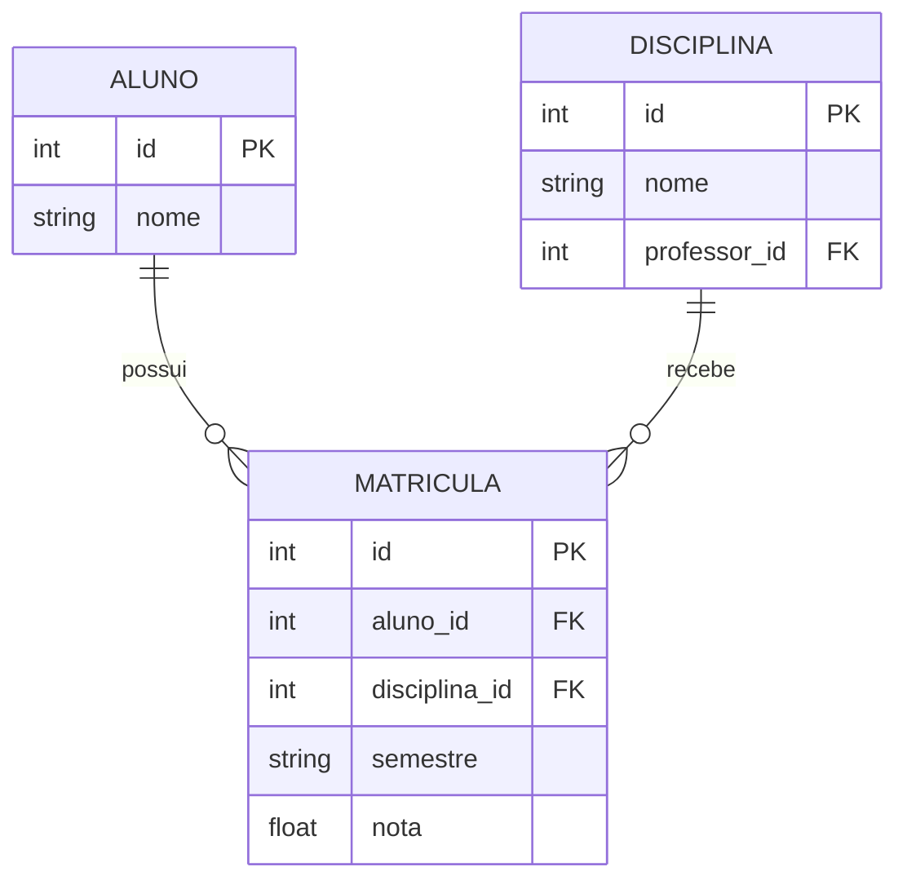
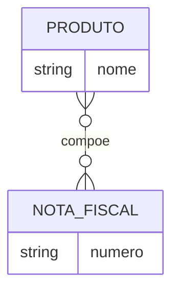
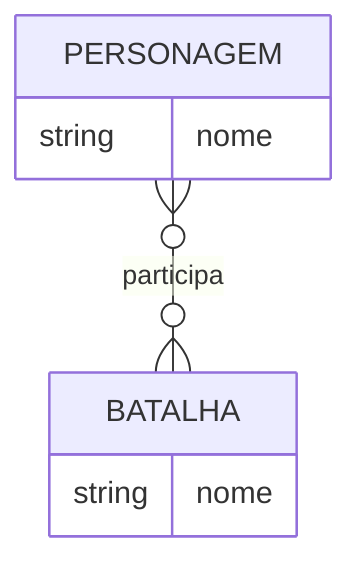

## Objetivos

- Compreender integridade referencial e cardinalidade.
- Visualizar exemplos práticos com personagens de O Senhor dos Anéis.
- Explorar representações gráficas (Mermaid) e tabelas.

---

## O que é Integridade Referencial?

Integridade referencial garante que os relacionamentos entre tabelas sejam válidos, evitando registros órfãos e inconsistências.

## O que é Cardinalidade?

Cardinalidade define quantas ocorrências de uma entidade podem se relacionar com outra em um relacionamento.

---

## Tipos de Cardinalidade e Exemplos

### 1:1 (Um para Um)

Cada elemento de uma entidade se relaciona com no máximo um elemento da outra.

**Exemplo:** Cada personagem tem um anel único.

| Personagem | Anel    |
| ---------- | ------- |
| Frodo      | Um Anel |
| Galadriel  | Nenya   |
| Gandalf    | Narya   |
| Elrond     | Vilya   |

#### Exemplo adicional de 1:1 (Pessoa e CPF)



---

#### Exemplo clássico de 1:1 (Pessoa e CPF)

Uma pessoa tem no máximo um CPF, e um CPF pertence a no máximo uma pessoa.




---

### 1:N (Um para Muitos)

Um elemento da entidade A se relaciona com múltiplos elementos da entidade B, mas cada elemento de B se relaciona com apenas um de A.

**Exemplo:** Um mago pode ter vários seguidores, mas cada seguidor segue apenas um mago.

| Mago    | Seguidor |
| ------- | -------- |
| Gandalf | Frodo    |
| Gandalf | Samwise  |
| Saruman | Gríma    |

#### Exemplo adicional de 1:N (Cliente e Empréstimo)



---

#### Exemplo clássico de 1:N (Cliente e Empréstimos)

Um cliente pode ter vários empréstimos, e cada empréstimo pertence a apenas um cliente.





---

### N:N (Muitos para Muitos)

Instâncias de ambas as entidades podem se relacionar com múltiplas instâncias da outra.

**Exemplo:** Personagens participam de várias batalhas, e cada batalha tem vários personagens.

| Personagem | Batalha              |
| ---------- | -------------------- |
| Aragorn    | Abismo de Helm       |
| Legolas    | Abismo de Helm       |
| Gimli      | Abismo de Helm       |
| Frodo      | Amon Hen             |
| Samwise    | Amon Hen             |
| Aragorn    | Portão Negro         |
| Frodo      | Montanha da Perdição |

#### Exemplo adicional de N:N (Aluno e Disciplina)



#### Exemplo prático de sistema acadêmico



Perceba que a tabela MATRICULA é uma tabela associativa criada para representar o relacionamento N:N entre ALUNO e DISCIPLINA. Ela possui como chaves primárias compostas as chaves das tabelas envolvidas, permitindo registrar cada matrícula de aluno em disciplina de forma única e garantindo a integridade referencial entre as entidades.
{: .notice}

## Exemplo prático de sistema acadêmico: Comandos SQL (PostgreSQL)

```sql
CREATE TABLE professor (
  id SERIAL PRIMARY KEY,
  nome VARCHAR(100) NOT NULL
);

CREATE TABLE disciplina (
  id SERIAL PRIMARY KEY,
  nome VARCHAR(100) NOT NULL,
  professor_id INT REFERENCES professor(id)
);

CREATE TABLE aluno (
  id SERIAL PRIMARY KEY,
  nome VARCHAR(100) NOT NULL
);

CREATE TABLE matricula (
  id SERIAL PRIMARY KEY,
  aluno_id INT REFERENCES aluno(id),
  disciplina_id INT REFERENCES disciplina(id),
  semestre VARCHAR(20),
  nota NUMERIC(4,2),
  UNIQUE (aluno_id, disciplina_id, semestre)
);
```

## Exemplo clássico de N:N (Produto e Nota Fiscal)

Um produto pode aparecer em várias notas fiscais, e uma nota fiscal pode conter vários produtos.





---

## Integridade Referencial: Exemplo SQL

```sql
CREATE TABLE personagem (
    id SERIAL PRIMARY KEY,
    nome VARCHAR(100) NOT NULL
);

CREATE TABLE anel (
    id SERIAL PRIMARY KEY,
    nome VARCHAR(100) NOT NULL,
    id_personagem INT UNIQUE REFERENCES personagem(id)
);

CREATE TABLE batalha (
    id SERIAL PRIMARY KEY,
    nome VARCHAR(100) NOT NULL
);

CREATE TABLE personagem_batalha (
    id_personagem INT REFERENCES personagem(id),
    id_batalha INT REFERENCES batalha(id),
    PRIMARY KEY (id_personagem, id_batalha)
);
```

Esses exemplos mostram como cardinalidade e integridade referencial são aplicadas na modelagem de dados, usando personagens de O Senhor dos Anéis para ilustrar os conceitos.
