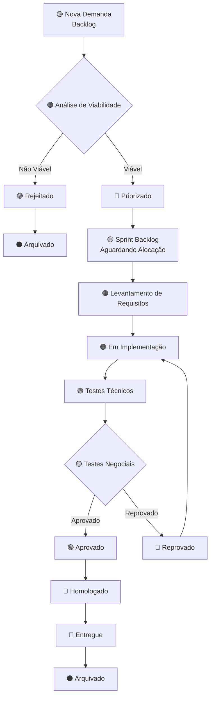
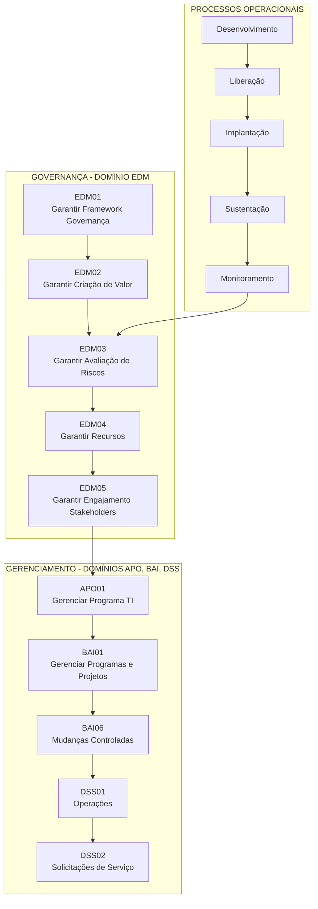
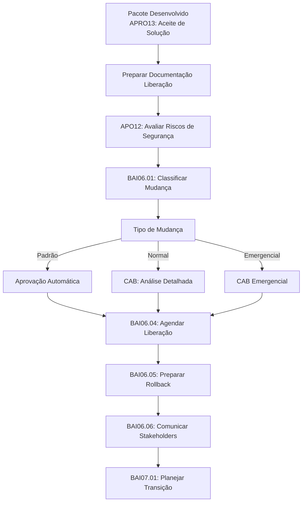
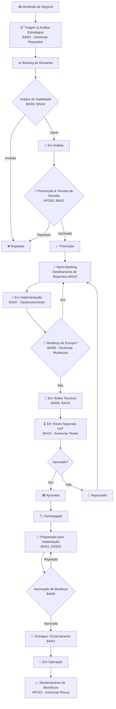
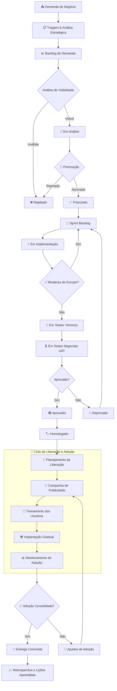

## Fase 1: Demanda e Análise de Viabilidade (Governança Inicial)

Estágio (Scrum + COBIT)	Atividades Chave (COBIT BAI)	Artefatos Principais	Status no Fluxo
- 📋 Triagem e Análise Estratégica	BAI02 - Gerenciar de Requisitos: Captura e registro inicial da demanda.
    - BAI01 - Gerenciar Programas e Projetos: Inicia o processo como um "projeto" ou "demanda".
    - BAI03 - Análise de Soluções: Identifica opções (desenvolver, comprar, customizar).
    - BAI04 - Manter a disponibilidade de tecnologia: Avalia impacto na infraestrutura.	Termo de Abertura de Demanda, Registro de Requisitos Iniciais,
    - Análise de Viabilidade (Técnica, Econômica, Legal).
    -Backlog de Demanda → Em Análise
- 🎯 Priorização e Tomada de Decisão
    - BAI01 - Gerenciar Programas e Projetos: Apresenta a análise para o comitê de governança (ex: Portfolio Board).
    - APO05 - Gerenciar o Portfolio: A priorização é feita com base no alinhamento estratégico, valor, risco e recursos.
    - Business Case,
    - Análise de Viabilidade aprovada,
    - Decisão do Comitê.	Aprovado / Rejeitado / Priorizado

## Fase 2: Planejamento e Desenvolvimento (Execução Controlada)

Estágio (Scrum + COBIT)	Atividades Chave (COBIT BAI)	Artefatos Principais	Status no Fluxo
- 📝 Planejamento Detalhado & Especificação
    - BAI02 - Gerenciar Requisitos: Detalha os requisitos funcionais e não funcionais.
    - BAI05 - Gerenciar Aquisição: Se for adquirir, inicia processo licitatório.
    - BAI06 - Gerenciar Mudanças: Estabelece o controle formal de mudanças.	Especificação de Requisitos Detalhados,
    - Plano de Projeto/Release,
    - Plano de Testes (Técnicos e de Aceitação).	Sprint Backlog
- ⚡ Implementação & Controle
    - BAI07 - Desenvolvimento e Aquisição de Soluções: Desenvolvimento propriamente dito (Scrum: Lev. Requisitos → Em Implementação).
    - BAI06 - Gerenciar Mudanças: Todas as mudanças de escopo são formalmente avaliadas e aprovadas.
    - BAI08 - Gerenciar Conhecimento: Documentação técnica é atualizada.	Incremento da Solução,
    - Registros de Mudança (se houver),
    - Documentação Técnica.	Em Implementação

## Fase 3: Validação e Transição (Qualidade e Entrega)
Estágio (Scrum + COBIT)	Atividades Chave (COBIT BAI)	Artefatos Principais	Status no Fluxo
- 👀 Validação Técnica e de Qualidade	
    - BAI09 - Gerenciar Ativos de Configuração: Versão do software é registrada no ambiente de testes.
    - BAI10 - Gerenciar Testes: Execução de testes unitários, integração, performance e segurança.	Plano de Testes Executado,
    - Relatório de Defeitos,
    - Registro de Configuração.	Em Testes Técnicos
- ⏳ Validação Negocial e Aceitação
    -BAI10 - Gerenciar Testes: Execução de testes de aceitação (UAT) pelos usuários-chave do negócio.
    - BAI02 - Gerenciar Requisitos: Confirma se a solução atende aos requisitos acordados.	Termo de Aceitação do Usuário (UAT),
Relatório Final de Testes.	Em Testes Negociais → Aprovado / Reprovado
- 🚀 Liberação e Implantação
    - BAI11 - Gerenciar Mudanças Organizacionais: Comunicação, treinamento e preparação dos usuários finais.
    - DSS02 - Gerenciar Serviços de Solicitação e Incidentes: Prepara a equipe de suporte.
    - BAI06 - Gerenciar Mudanças: A mudança para produção é formalmente aprovada.
    - Plano de Implantação,
    - Materiais de Treinamento,
    - Ordem de Mudança para Produção.
    - Homologado

## Fase 4: Conclusão e Pós-Implementação (Entrega e Valor)
Estágio (Scrum + COBIT)	Atividades Chave (COBIT BAI)	Artefatos Principais	Status no Fluxo
- ✅ Entrega e Encerramento
    - BAI01 - Gerenciar Programas e Projetos: Encerramento formal do projeto. Lições aprendidas são documentadas.
    - BAI12 - Gerenciar Conhecimento: Documentação final é arquivada e disponibilizada.
    - DSS01 - Operar os Serviços: A solução é formalmente entregue para a equipe de operações/suporte.	Relatório de Encerramento,
Lições Aprendidas,
    - Documentação Final da Solução.	Entregue
- 🔄 Monitoramento do Valor	
    - APO12 - Gerenciar Riscos & EDM03 - Assegurar a Otimização de Riscos: Monitora se os benefícios esperados no Business Case estão sendo realizados e os riscos residuais.	Relatório de Realização de Benefícios.	Em Operação (Novo Status)

# Processo de liberação

Fase: Ciclo de Liberação e Adoção

# **Fase: Ciclo de Liberação e Adoção**

| Etapa | Processos COBIT | Atividades Principais | Artefatos Gerados | Responsáveis | Critério de Êxito |
|-------|-----------------|------------------------|-------------------|-------------|-------------------|
| **🎯 Planejamento da Liberação** | **BAI11 - Gerenciar Mudanças Organizacionais** **BAI06 - Gerenciar Mudanças** | - Definir estratégia de rollout - Identificar públicos-alvo e stakeholders - Elaborar plano de comunicação - Estabelecer métricas de adoção - Definir plano de rollback | Plano de Liberação Matriz de Riscos de Adoção Cronograma de Implementação | Gerente de Projeto Líderes de Negócio Comunicação Organizacional | Plano aprovado pelos stakeholders Recursos alocados Riscos identificados e mitigados |
| **📢 Campanha de Publicidade** | **APO07 - Gerenciar Comunicações** **BAI11 - Gerenciar Mudanças Organizacionais** | - Desenvolver material de divulgação - Realizar comunicação multicanal - Organizar webinars de apresentação - Envolver gestores como embaixadores - Estabelecer portal de informações | Newsletters Comunicados Oficiais Materiais de Marketing Portal da Solução Gravações de Webinars | Equipe de Comunicação Marketing Interno Gestores da Área | >80% do público-alvo conscientizado Feedback positivo nas pesquisas Alta participação nos eventos |
| **👥 Treinamento do Sistema** | **BAI12 - Gerenciar Conhecimento** **BAI11 - Gerenciar Mudanças Organizacionais** | - Desenvolver material de treinamento - Conduzir sessões de capacitação - Treinar superusuários - Disponibilizar ambiente sandbox - Oferecer suporte durante aprendizado | Manuais do Usuário Vídeos Tutoriais FAQs Ambiente de Treinamento Certificações de Conclusão | CSCOR (Treinadores) RH Superusuários | >90% dos usuários treinados Avaliação positiva do treinamento Redução de chamados básicos |
| **🛠️ Implantação Gradual** | **BAI06 - Gerenciar Mudanças** **DSS02 - Gerenciar Serviços** | - Implementar para grupo piloto - Coletar feedback inicial - Expandir para demais áreas - Monitorar performance - Ajustar conforme necessário | Checklist de Implantação Plano de Rollback Relatório de Incidentes Feedback do Grupo Piloto | CSCOR Operações de TI Gestores de Departamento | Implantação sem impactos críticos Tempo de resposta dentro do SLA Feedback positivo do piloto |
| **📊 Monitoramento de Adoção** | **APO12 - Gerenciar Riscos** **DSS04 - Gerenciar Continuidade** | - Coletar métricas de uso - Monitorar indicadores de performance - Realizar pesquisas de satisfação - Identificar barreiras à adoção - Propor melhorias contínuas | Dashboard de Adoção Relatórios de Utilização Pesquisas de Satisfação Plano de Melhorias | CSCOR Gestores de Negócio Quality Assurance | >70% de adoção na primeira semana Taxa de satisfação >4.0/5.0 Problemas identificados e tratados |

---

## **Métricas de Sucesso da Fase**

| Métrica | Alvo | Periodicidade | Responsável |
|---------|------|---------------|-------------|
| **Taxa de Adoção Inicial** | >70% nos primeiros 7 dias | Semanal | CSCOR |
| **Satisfação do Usuário** | >4.0/5.0 | Pós-implantação | Gestores |
| **Redução de Chamados** | -30% em 30 dias | Mensal | Service Desk |
| **Tempo de Resolução** | Dentro do SLA estabelecido | Contínuo | Operações |
| **Utilização de Funcionalidades** | >80% das features principais | Mensal | Business Intelligence |

---

## **Fluxo de Decisão da Fase**

| Ponto de Decisão | Critério | Ação se Positivo | Ação se Negativo |
|------------------|----------|------------------|------------------|
| **Início da Campanha** | Plano de comunicação aprovado | Liberar materiais e comunicados | Revisar e ajustar plano |
| **Liberação para Treinamento** | Ambiente sandbox estável | Iniciar ciclo de treinamentos | Corrigir problemas críticos |
| **Implantação em Produção** | >85% dos usuários treinados | Prosseguir com rollout | Estender período de treinamento |
| **Expansão para Novas Áreas** | Sucesso no grupo piloto | Expandir gradualmente | Investigar e corrigir problemas |
| **Encerramento da Fase** | Adoção consolidada (>80%) | Encerrar fase de liberação | Implementar ações corretivas |

1. 🎯 Planejamento da Liberação (BAI11)

Antecede a Homologação

    Identificar públicos-alvo (usuários finais, gestores, administradores)

    Definir estratégia de comunicação multicanal

    Elaborar plano de treinamento segmentado

    Estabelecer métricas de adoção e sucesso

2. 📢 Campanha de Publicidade (APO07)

Inicia durante os Testes Negociais

    Desenvolver material de divulgação (benefícios, timeline)

    Comunicar via e-mail corporativo, intranet, murais

    Realizar webinars de apresentação da solução

    Envolver gestores como "embaixadores" da mudança

3. 👥 Treinamento do Sistema (BAI12)

Paralelo à Homologação

    Desenvolver material de treinamento (manuais, vídeos, FAQs)

    Agendar sessões de treinamento por perfil de usuário

    Treinar superusuários e gestores primeiro

    Disponibilizar ambiente de treinamento/sandbox

4. 🛠️ Implantação Gradual (BAI06)

Pós-Homologação

    Implantar para grupo piloto (canary release)

    Coletar feedback e ajustar conforme necessário

    Expandir para demais departamentos de forma controlada

    Manter suporte intensivo durante transição

5. 📊 Monitoramento de Adoção (APO12)

Contínuo pós-implantação

    Monitorar métricas de uso e performance

    Coletar feedback contínuo dos usuários

    Identificar resistências e barreiras à adoção

    Realizar ajustes no treinamento e comunicação

