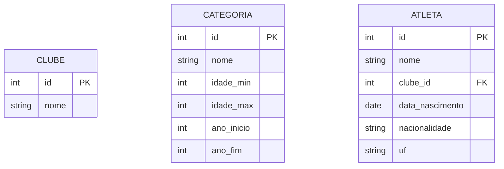

## Introdução

Todas as atividades seguem um modelo de dados com regras negociais específicas, como por exemplo: Site de Aluguel de carros, Site de Rede Social, Site de Campeonatos 

## Regras para avaliação de modelos de dados

1. Análise a regra negocial – identificação correta das entidades e atributos conforme a Formas Normais
    - Referencia principal: <https://cafegeek.eti.br/curso/banco-de-dados/normalizacao/normalizacao-de-banco-de-dados/>
    - Referencia: <https://ebaconline.com.br/blog/normalizacao-de-bases-de-dados>
    - Referencia: <https://www.devmedia.com.br/artigo-sql-magazine-6-normalizacao-tecnicas-e-conceitos/7087>
    - Pontuação:  **(20%)**
    - Se o modelo não atender uma das formas normais (1FN, 2FN e 3FN), a nota deve sofrer um decréscimo de 50%.

2. Sintaxe MERMAID correta – diagrama renderizável sem erros no Mermaid Live Editor
    - Referencia principal: <https://mermaid.live/>
    - Pontuação:  **(20%)**
    - Se houver erro de sintaxe MERMAID, a nota deve sofrer um decréscimo de 50%.

3. Cardinalidades adequadas – relacionamentos com marcadores corretos (--o{, }o--, etc.)
    - Referencia: <https://mermaid.js.org/syntax/entityRelationshipDiagram.html>
    - Pontuação:  **(20%)**
    - Se o modelo não atender uma das formas normais (1FN, 2FN e 3FN), a nota deve sofrer um decréscimo de 50%.

4. Atributos completos – inclusão de tipos de dados, PK e FK conforme especificação
    - Referencia: <https://mermaid.js.org/syntax/entityRelationshipDiagram.html>
    - Pontuação:  **(20%)**
    - Se o modelo não atender descrever todos os atributos envolvidos no projeto, a nota deve sofrer um decréscimo de 50%.
5. Documentação – comentários explicativos sobre decisões de modelagem
    - Referencia: Utilize Markdown ou comentários do mermaid
    - Pontuação:  **(20%)**
    - Se o modelo não conter comentários, a nota deve sofrer um decréscimo de 50%.

Soma total de pontos: **100%**

## Regras para avaliação de comandos PostgreSQL usando IA

1. Log da conversa – completo e bem documentado
   - Pontuação:  **(10%)**
2. Correção de alucinações – identificação e correção dos erros da IA 
   - Pontuação:  **(10%)**
3. Código final – procedures, triggers ou consultas com sintaxe correta e comentários e telas do resultado das consultas
   - Pontuação:  **(80%)**
   - Se houver erro de sintaxe PostgreSQL, a nota deve sofrer um decréscimo de 50%.
   - Se o comando estiver implementando em um modelo com erros deve sofrer um decréscimo de 50%.
  
Soma total de pontos: **100%**  

## Intruções

1. Acesso ao site oficial da regra negocial: Consulte o sistema XXX para visualizar os dados reais. A análise do site é fundamental para a implementação do modelo.
2. Ferramenta MERMAID: Utilize o Mermaid Live Editor Links to an external site. para testar e validar seu diagrama. O editor renderiza instantaneamente o diagrama a partir do código Links to an external site. Links to an external site..
3. Uso de IA: Não é proibido usar IA. Pelo contrário, você deve utilizá-la como ferramenta de apoio. O que será avaliado é sua capacidade de orientar, corrigir e validar o que a IA produz.
4. Documentação obrigatória: Todo código e diagrama devem vir acompanhados de justificativas. Um trabalho tecnicamente correto sem explicação vale menos que um trabalho com análise crítica.

## Regras para as entregas

1. Diagrama MERMAID do modelo de dados, arquivo `.mermaid`  ou `.text`
2. Scripts SQL corrigidos e comentados, sintexe markdown `.sql`
3. Log da conversa com a IA, arquivo `.md` ou link externo.
4. Justificativas técnicas, arquivo `.md` ou link externo.

## Exemplos

### Nome do Arquivo

Nome do arquivo: `Minha-atividade-de-banco-de-dados.md`

### Regra negocial

> O 29º Troféu Alexandre Pussieldi 2025 é uma competição de natação para categorias de base (Pré-Mirim e Mirim). Os dados reais do evento estão publicados no sistema FASE Aquática, que registra oficialmente os resultados de diversas competições de natação.

### Modelo de dados



Opcional: Imagem do mermaid aqui

Log da conversa `.text`
>https://chatgpt.com/share/69cb0e6f-9184-83e9-90e0-e66a140f0949

### Questão 1

- Log da conversa `.text`
  
 >https://chatgpt.com/share/69cb0e6f-9184-83e9-90e0-e66a140f0949
 >
 >Considerando tudo abordado no ultimo chat, sobre o banco de dados da federação de natação, vamos continuar este chat, espere alguma instrução nova, irei pedir queries e ajuda para correção nelas
 >
> Perfeito — pode mandar.
>
>Quando você trouxer as queries, vou focar em:
>
> corrigir sintaxe (PostgreSQL)
>
>validar modelagem (chaves, cardinalidade, integridade)
melhorar performance se fizer sentido
e te explicar o porquê das mudanças (pra você evoluir, não só copiar)
>
>Manda a primeira 👍
>
>Faça uma função sp_quadro_de_medalhas, aonde retornará um select de 
>
>RANKING
>
>CLUBE
>
>MEDALHAS DE OURO
>
>MEDALHAS DE PRATA
>
>MEDALHAS DE BRONZE
>
>TOTAL DE MEDALHAS
>
>4° LUGARES
>
>5° LUGARES
>
>6° LUGARES
>
>7° LUGARES
>
>8° LUGARES
>
>PONTUAÇÃO TOTAL (soma de todas medalhas e lugares)

- comando SQL  `.sql`

```sql
CREATE OR REPLACE FUNCTION sp_quadro_de_medalhas()
RETURNS TABLE (
    ranking INT,
    clube TEXT,
    ouro INT,
    prata INT,
    bronze INT,
    total_medalhas INT,
    quarto INT,
    quinto INT,
    sexto INT,
    setimo INT,
    oitavo INT,
    pontuacao_total INT
)
LANGUAGE plpgsql
AS $$
BEGIN
    RETURN QUERY
    SELECT
        RANK() OVER (ORDER BY pontuacao_total DESC) AS ranking,
        c.nome AS clube,

        COUNT(*) FILTER (WHERE r.posicao = 1) AS ouro,
        COUNT(*) FILTER (WHERE r.posicao = 2) AS prata,
        COUNT(*) FILTER (WHERE r.posicao = 3) AS bronze,

        COUNT(*) FILTER (WHERE r.posicao IN (1,2,3)) AS total_medalhas,

        COUNT(*) FILTER (WHERE r.posicao = 4) AS quarto,
        COUNT(*) FILTER (WHERE r.posicao = 5) AS quinto,
        COUNT(*) FILTER (WHERE r.posicao = 6) AS sexto,
        COUNT(*) FILTER (WHERE r.posicao = 7) AS setimo,
        COUNT(*) FILTER (WHERE r.posicao = 8) AS oitavo,

        SUM(
            CASE r.posicao
                WHEN 1 THEN 9
                WHEN 2 THEN 7
                WHEN 3 THEN 6
                WHEN 4 THEN 5
                WHEN 5 THEN 4
                WHEN 6 THEN 3
                WHEN 7 THEN 2
                WHEN 8 THEN 1
                ELSE 0
            END
        ) AS pontuacao_total

    FROM resultado r
    JOIN clube c ON c.id = r.clube_id

    GROUP BY c.nome

    ORDER BY pontuacao_total DESC;
END;
$$;
```
