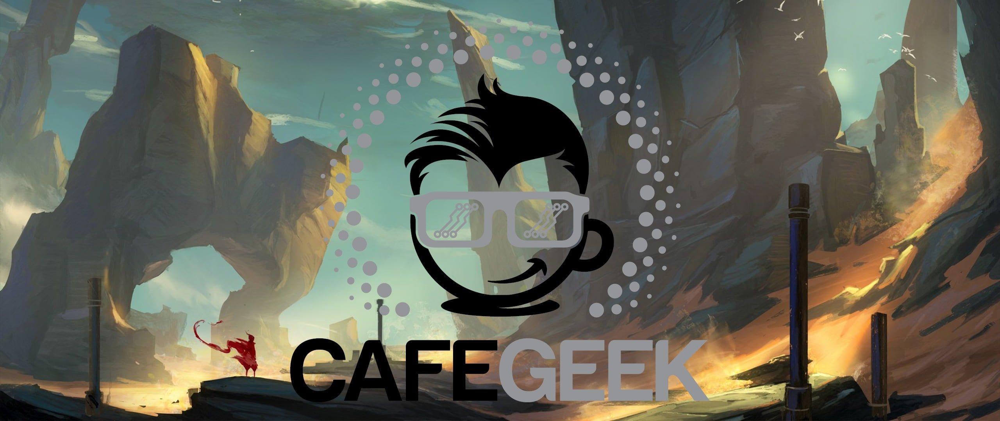

## Desenvolvimento de jogos

|  MDA | 1° Etapa  | 2° Etapa  |  3° Etapa |
|---  |---        |---        |-|
|**Mecânica**  | [Desenvolvimento de jogos utilizando Unreal Engine 4](https://myerco.github.io/CafeGeek/ue4_blueprint/index.html)  |   |   |
|   |   | [Computação Gráfica com Unreal Engine e Autodesk Maya](https://myerco.github.io/CafeGeek/ue4_computacao_grafica/index.html)  |   |  
|**Emoção**  |  [A jogatina das décadas](https://myerco.github.io/CafeGeek/a_jogatina_das_decadas/index.html) |   |   |  
|  |   | [Me conta uma história](https://myerco.github.io/CafeGeek/me_conte_uma_historia/index.html)  |   |  
|**Dinâmica**  |   |   |  [Porque eu amo Game Design](https://myerco.github.io/CafeGeek/porque_eu_amo_game_design/index.html) |

## Produção
1. [Lista de Roteiros](roteiros/index.html)
