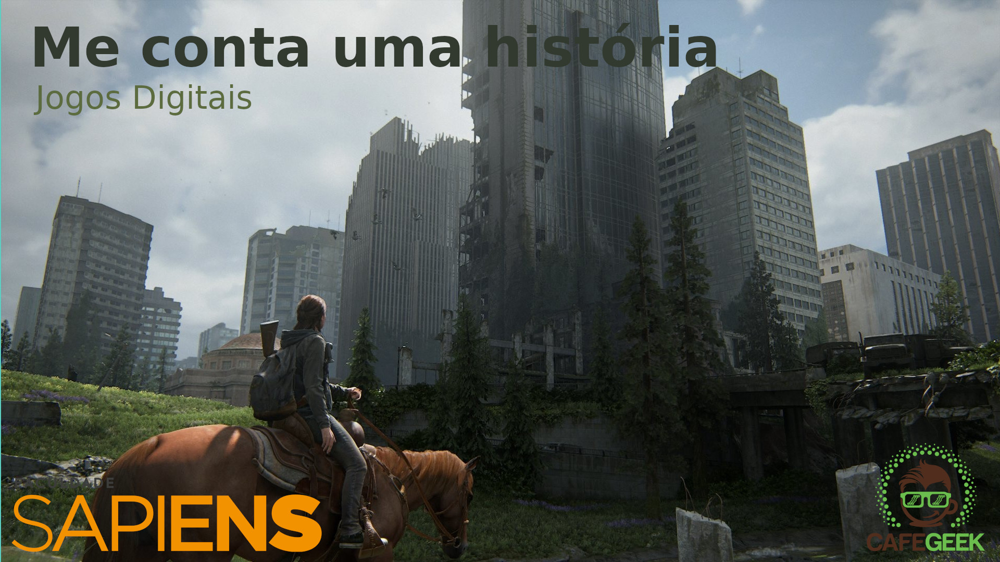

[CafeGeek](http://cafegeek.eti.br)

# Me conte uma história
Narrativa de jogos e construção de personagens. Construa sua narrativa, o tempo, o mundo, os personagens, os objetivos e os capítulos da história.
## Habilidades que serão aprendidas  
- Aprenda a organizar suas ideias;    
- Analise e construa elementos que compõem a história;      
- O Herói de mil faces;     
- Defina o papel e motivação dos inimigos;   
- Defina o papel dos personagens auxiliares;    
- O combate;    
- Objetivos da história;      
- Evolução do personagens;  
---
## Índice
1. [Por dentro da cabeça do Game Design](#1)    
    1. [Características do Game Design](#1.1)
    1. [Elementos de construção do jogo](#1.1)
1. [O projeto do jogo](#2)    
    1. [A equipe](#2)
    1. [Quais as tarefas necessárias?](#2)
    1. [Quais as limitações do projeto?](#2)
1. [Organizando as ideias](#1)
    1. [O que nos inspira?](#1)
    1. [O habito](#1)
1. [Os personagens](#2)
    1. [A jornada do herói](#)
    1. [A personalidade](#)
    1. [A motivação](#)
    1. [Morte como aliada](#)
    1. [Nomes](#)
    1. [Formas](#)
    1. [Customização](#)
    1. [Não estamos sozinhos](#)
    1. [NPC](#)
1. [Eles todos me querem morto](#1)
    1. [Tipos de conflito](#)
    1. [Forma segue a função](#)
    1. [Lutar com os inimigos deve ser divertido](#)
    1. [Inimigos devem ser enfrentados e não evitados](#)
    1. [Ataques](#)
    1. [Faça o jogador odiar seu inimigo](#)
    1. [Inimigos não inimigos](#)
    1. [BOSS](#)

## Referências
