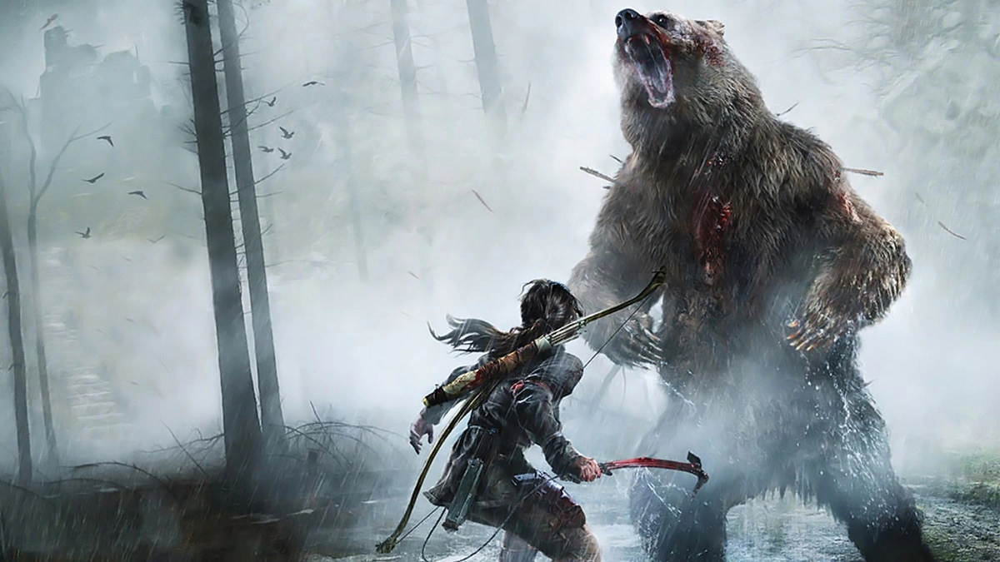
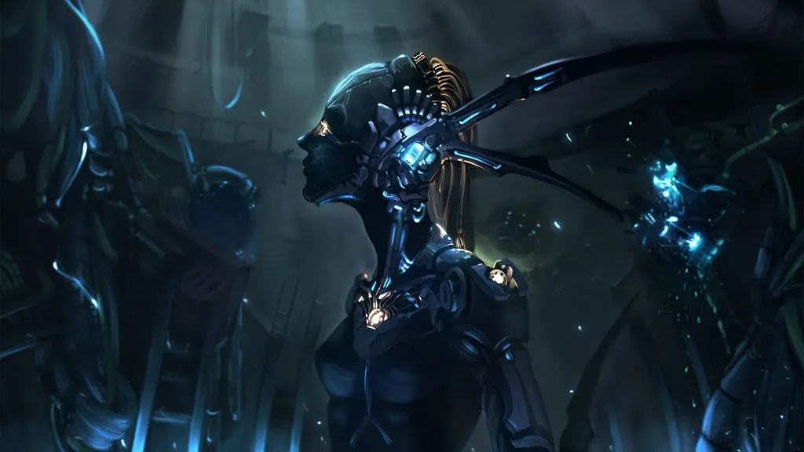
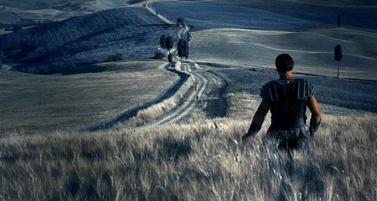
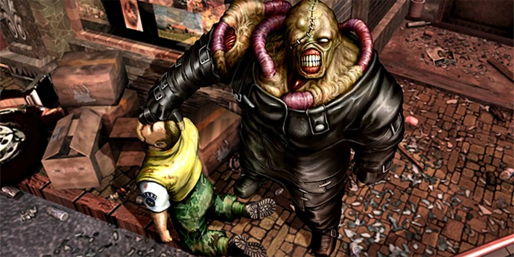

Neste curso vamos apresentar e trabalhar na construção da narrativa de jogos e  seus personagens bem como a definição de tempo, mundo, objetivos e os capítulos da história.  O curso está associado a construção **Estética** do jogo pois nele definimos elementos como fantasia, narrativa e expressão.

**Habilidades que serão aprendidas.**

- Aprenda a organizar suas ideias;    
- Analise e construa elementos que compõem a história;      
- Defina o papel, motivação e evolução dos personagens;   
- Defina o combate dos personagens;    
- Defina os objetivos da história;      

| M         |  D          | A         |
|:-         |:-           |:-         |
| Mecânicas | Dinâmicas   | **Estéticas** |

***

**[CAPÍTULO 1 -  O que é a profissão de Game Design?](#1 "CAPÍTULO 1 -  O que é a profissão de Game Design?")**

***

&nbsp;&nbsp;[1.1 Quero ser um Game Design](#1.1 "Quero ser um Game Design")    

&nbsp;&nbsp;[1.2 Quanto Ganha do Game Design?](#1.2 "Quanto Ganha do Game Design?")    

&nbsp;&nbsp;[1.3 Quais são as características pessoais?](#1.3 "Quais são as características pessoais?")    

***

**[CAPÍTULO 2 -  Como construir um jogo digital?](#2 "CAPÍTULO 2 -  Como construir um jogo digital?")**

***

&nbsp;&nbsp;[2.1 A equipe](#2.1 "A equipe")

&nbsp;&nbsp;[2.2 Tarefas](#2.2 "Tarefas")

&nbsp;&nbsp;[2.3 Limitações](#2.3 "Limitações")

***

**[CAPÍTULO 3 -  Como organizar as ideias?](#3 "CAPÍTULO 3 -  Como organizar as ideias?")**

***

&nbsp;&nbsp;[3.1 Onde nascem as ideias?](#3.1 "Onde nascem as ideias?")

&nbsp;&nbsp;[3.2 Cultivando ideias](#3.2 "Cultivando ideias")

&nbsp;&nbsp;[3.3 O que torna a ideia interessante é](#3.3 "O que torna a ideia interessante é")

&nbsp;&nbsp;[3.4 que nos inspira?](#3.4 "O que nos inspira?")

&nbsp;&nbsp;[3.5 Hábito](#3.5 "Hábito")

***

**[CAPÍTULO 4 - Como construir os personagens?](#4 "CAPÍTULO 4 - Como construir os personagens?")**

***

&nbsp;&nbsp;[4.1 A jornada do Herói](#4.1)

&nbsp;&nbsp;[4.2 Personalidade](#4.2)

&nbsp;&nbsp;[4.3 Motivação](#4.3)

&nbsp;&nbsp;[4.4 Morte](#4.4)

&nbsp;&nbsp;[4.5 Nome](#4.5)

&nbsp;&nbsp;[4.6 Forma](#4.6)

&nbsp;&nbsp;[4.6 Customização](#4.7)

&nbsp;&nbsp;[4.8 Não estamos sozinhos](#4.8)

&nbsp;&nbsp;[4.8 NPC- Personagens não jogáveis](#4.9)

***
**[CAPÍTULO 5 - Eles todos me querem morto](#5 "CAPÍTULO 5 - Eles todos me querem morto")**

***

&nbsp;&nbsp;[5.1 Tipos de conflito](#5.1)

&nbsp;&nbsp;[5.2 Forma segue a função](#5.2)

&nbsp;&nbsp;[5.3 Lutar com inimigos deve ser divertido](#5.3)

&nbsp;&nbsp;[5.4 Ataques](#5.4)

&nbsp;&nbsp;[5.5 Nem tudo é ataque](#5.5)

&nbsp;&nbsp;[5.6 Faça o jogador odiar seu inimigo](#5.6)

&nbsp;&nbsp;[5.7 BOSS](#5.7)

***
[Atividades e Referências](me_conta_uma_historia_atividades_referencias.html)

***

## CAPÍTULO 1 -  Por dentro da cabeça do Game Design

> "Por baixo dessa carne existe um ideal. e as ideias nunca morrem..."
>
> V de Vingança.

Um papel importante na produção de um jogo digital é o de Game Design que é analogamente o gerente de projeto, responsável por cada etapa da construção do produto.

O Game Design deve atuar como uma interface entre os diversos profissionais envolvidos no projeto e entender as suas necessidades, mas para um bom desempenho nessa tarefa o Game Design deve conhecer um pouco de cada processo no fluxo de trabalho.

## 1.1 Quero ser um Game Design
Como toda profissão para que possamos alcançar um reconhecimento e conhecimento adequado sobre o ofício devemos estruturar e agrupar os nossos passos, abaixo algumas dicas:

- Seja apaixonado por jogos e jogue, jogue para se divertir e se pergunte porque foi divertido;

- Entenda a dinâmica do mercado de jogos, como o produto é vendido, como é consumido e qual o ciclo de vida do produto;

- Leia bastante;

- Procure trabalhar a sua interação social e aprenda a expressar suas ideias, pois é, aprenda a trabalhar em equipe;

- Procure conhecer as profissões atuantes na construção e aprenda uma delas, por exemplo: Programação de jogos, Arte, publicidade ou todas as mesmo tempo.

> Figura: Design de games: conheça a profissão - https://www.gamerinfo.com.br/2018/09/10/design-de-games/ .

## 1.2 Quanto Ganha do Game Design?

Segundo o site https://www.educamaisbrasil.com.br o salário começa com **R$ 1.228,90** e pode chegar a **R$ 4.056,35** no Brasil (Consulta 17/01/2021).

> Figura: Profissão Designer de games: salário e carreira na área de DESIGN DE GAMES - https://www.educamaisbrasil.com.br/cursos-e-faculdades/design-de-games/salario-de-designer-de-games-carreira .*

## 1.3 Características pessoais
A seguir vamos destacar algumas Características necessárias para um bom Game Design.

> Figura: Turning employee ideas into profitable results - https://www.singerandfalk.com/uncategorized/turning-employee-ideas-into-profitable-results/ .

- Descrever e escrever as suas ideias;

- Usar a comunicação visual;

- Acompanhar o trabalho da equipe;

- Prestar atenção a opinião de outras pessoas.

**[⬆ Início](#indice)**

## CAPÍTULO 2 -  Como construir um jogo digital?

> "Se você quiser fazer uma torta de maçã do nada, você precisa, primeiro, inventar o universo."
>
> Carl Sagan.

Geralmente o fluxo de trabalhado pode ser definido pelas etapas de **Conceito**, **Funcional** e **Artista**, a seguir vamos descrever as etapas.

### Conceito.
Etapa mais abstrata do projeto onde definimos o conceito do jogo baseados em uma história ou mecânica, esta etapa é necessária para apresentar, documentar e organizar a ideia do jogo.

- Documentação e narrativa - "você não precisa de um contexto narrativo para cada jogo (isso é especialmente verdade em game jams), mas para esta classe e o GDW deste ano, você precisará de alguma forma de quadro narrativo dentro do qual seu jogo funciona. Este é o lugar para descrevê-lo, as configurações, tema e estilo visual. Se o seu jogo tem personagens fortes, você pode usar este ponto para descrever qualquer história de fundo ou tema que os preocupe."

> Figura: Communication and Game Design Documents - https://acagamic.com/free-courses/intro-to-game-design/communication-and-game-design-documents/ .

Um bom exemplo de documentação é o modelo [Death VIP](http://cafegeek.eti.br/trabalhos/modelo_gdd_death_vip.html), utilize a estrutura do modelo para o desenvolvimento de trabalhos no decorrer do curso.

### Funcional.

Nesta etapa definimos como organizar o fluxo de atividades e comunicação do projeto. Devemos definir também as regras que devem ser desenvolvidas no projeto como por exemplo a implementação técnica da mecânica.

- Fluxo de trabalho - Organize o encadeamento das etapas de produção determinando a duração de cada uma delas, finalmente implemente um plano de comunicação dos envolvidos no projeto;
- Regras - Defina regras do mundo do jogo que devem ser seguidas por desenvolvedores e roteiristas ;

> Figura: The growth of the gaming industry in the context of creative industries - https://www.researchgate.net/publication/346541011_The_growth_of_the_gaming_industry_in_the_context_of_creative_industries.

### Artista.
Como são os personagens? qual o ambiente? esse tipo de pergunta são apresentadas nessa etapa onde devem ser analisadas e aprovadas as representações visuais do jogo.

- Storyboards;

- Arte conceitual.

> *Figura: The Benefits of Embracing 3D in your Concept Art Workflow - https://magazine.artstation.com*

**[⬆ Início](#indice)**

## 2.1 A equipe
Organizar a equipe é um trabalho interessante quando compreendemos as Características do produto que vamos desenvolver e as aliamos aos perfis profissionais que devem atuar no desenvolvimento.

> Figura: Mas qual é a diferença entre design de games, game art e game design? - https://unidigitaldobrasil.com.br/carreira-na-industria-de-games-design-de-games-game-art-ou-game-design/ .

|Profissional |Papel                                  |
|:-           |:-                                     |
|Programador  |Desenvolvimento da mecânica do jogo    |
|Artista      |Arte 2D, Arte 3D e animações           |
|Design       |Ambiente e mecânica                    |
|Produtor     |Financiador e pode ter controle sobre o produto   |
|Testador     |Realiza testes do produto   |
|Compositor   |Musica tema e ambiente   |
|Sound design |Elementos sonoros durante a gameplay    |
|Redator      |Roteirização e pesquisa documental   |

Podemos comparar como trabalhar um grande desafio com um grupo de amigos onde cada um papel definido.

> Figura: Tips for positive player interactions in World of Warcraft instances - https://www.gameskinny.com/xiv9z/tips-for-positive-player-interactions-in-world-of-warcraft-instances .

**[⬆ Início](#indice)**

## 2.2 Tarefas
Quais são as tarefas e atividades que devem ser executadas, por onde começamos? uma resposta para a pergunta é organize em pacotes de entrega. Defina e agrupe um conjunto de entregas baseadas em funcionalidades e comece a organizar a sua agenda.

|Tarefas          |Descrição                    |
|:--              |:--                          |
|Prototipação     |Protótipo ou modelo do jogo  |       
|Level design     |Ambiente e mecânica          |
|Interface        |Interface com o jogador - HUD|
|Gerenciamento    |Acompanhamento das tarefas e comunicação das equipes|
|Líder de equipe  |Atua como interface entre as diversas necessidades |

> Figura: Improving Video Game Development: Facilitating Heterogeneous Team Collaboration through Flexible Software Processes - https://www.researchgate.net .

**[⬆ Início](#indice)**

## 2.3 Limitações

> Figura: The best survival games on PC in 2022  - https://www.rockpapershotgun.com/the-best-survival-games-on-pc .

O projeto é limitado por vários fatores, dentre eles:

**Dinheiro.**

Estime os custos do projeto, orçamento e controle de custos de modo que o projeto possa ser terminado dentro do orçamento aprovado.

> Figura: [The Factors That Influence the Cost of Game Development.](https://www.appstudio.ca/blog/cost-of-game-development/)

- Estime os custos;

- Determine o orçamento e estime os custos de atividades individuais ou pacotes de trabalho;

- Controle custos, acompanhe e monitore as mudanças feitas na custo base.

**Tempo.**

Fique atento aos prazos estabelecidos no escopo e o tempo estipulado para cada atividade.

> Figura: [How to take care of time management in web development](https://www.merixstudio.com/blog/time-management-web-development/).

- Defina e identifique as ações específicas a serem realizadas para produzir as entregas do projeto;

- Sequencie as atividades e documente os relacionamentos entre elas;

- Estime os recursos por atividade, quantidade de material, pessoas, equipamentos ou suprimentos;

- Desenvolva um cronograma do projeto;

- Monitore o andamento do projeto e atualize o progresso e gerenciamento de mudanças.

**Tecnologia.**

Considere de toda a base tecnológica do projeto.

>Figura: [Why infrastructure is a game-changer for the mobile gaming industry.](https://medium.com/tech-at-wildlife-studios/infrastructure-mobile-gaming-industry-584eee7e2fca)

- Rede de comunicação interna;

- Espaço de armazenamento e compartilhamento;

- Versionamento da lógica de programação;

- Modelo de distribuição do projeto;

- Softwares e licenças utilizados.

**Expertise.**

Organize as equipes com os papeis e responsabilidades designadas para a conclusão do projeto.

>Figura: [Time Management Skills for Developers: Best Tips, Tools, and Strategies](https://arc.dev/developer-blog/time-management-skills/)

- Desenvolva um plano de funções, responsabilidades, habilidades necessárias e relações hierárquicas do projeto;

- Mobilize a equipe do projeto, confirme a disponibilidade e obtenha a equipe necessária;

- Melhore as competências, interação e ambiente da equipe;

- Acompanhe o desempenho dos membros da equipe, forneça *feedback*, resolva questões e acompanhe as mudanças.

**[⬆ Início](#indice)**

## CAPÍTULO 3 -  Como organizar as ideias?

> "Sentir é criar. Sentir é pensar sem ideias, e por isso sentir é compreender, visto que o Universo não tem ideias."
>
> Fernando Pessoa.

## 3.1 Onde nascem as ideias?

> Figura: The Witcher 3: Wild Hunt is like an open-world, playable Game of Thrones - https://www.theverge.com/2015/5/12/8586515/witcher-3-wild-hunt-review-ps4-xbox-one-game .

- Outras ideias;

- Mundo;

- Jornal;

- Jogos;

- Experiências emocionais.

**[⬆ Início](#indice)**

## 3.2 Cultivando ideias

:format(webp)/cdn.vox-cdn.com/uploads/chorus_image/image/47374578/unravel-yarny.0.0.jpg "Figura: Unravel creator hopes the game will make you call your mom - https://www.polygon.com/2015/10/10/9487701/unravel-preview-call-your-mom")

> Figura: Unravel creator hopes the game will make you call your mom - https://www.polygon.com/2015/10/10/9487701/unravel-preview-call-your-mom .

- Seja curioso;

- Como as coisas funcionam;

- Crie elementos e os coloque no mundo;

- Compartilhe o seu mundo com outras pessoas;

**[⬆ Início](#indice)**

## 3.3 O que torna a ideia interessante é

> Figura: Lost in Random é um misto de ótimo roteiro e gameplay criativo - https://adrenaline.com.br/colunas/v/70890/lost-in-random-e-um-misto-de-otimo-roteiro-e-gameplay-criativo .

- Arranjo único;

- Seja divertido;

**[⬆ Início](#indice)**

## 3.4 O que nos inspira?

> *Figura: Um tributo aos fãs e um enorme passo nos jogos de ação em terceira pessoa - https://www.tecmundo.com.br/voxel/jogos/rise-of-the-tomb-raider/analise .*

- Lugar;

- Pessoas;

- Histórias;

- Experiências pessoais;

**[⬆ Início](#indice)**

## 3.5 Hábito

/i.s3.glbimg.com/v1/AUTH_08fbf48bc0524877943fe86e43087e7a/internal_photos/bs/2021/1/q/UZHV1lT8SDUVlX8Bso5Q/2015-07-24-journey3.jpg "Figura: Review Journey - https://www.tecmundo.com.br/voxel/jogos/journey/analise")

> Figura: Review Journey - https://www.tecmundo.com.br/voxel/jogos/journey/analise .

"A maior virtude do game é, sem dúvida, conseguir comover sem sequer dizer uma palavra. Confira a análise da versão de PlayStation 4!"

- Caminhe;

- Leia;

- Assista palestras;

**[⬆ Início](#indice)**

****

## CAPÍTULO 4 - Como construir os personagens?
> "Se nossas vidas já estão escritas, seria preciso um homem corajoso para mudar o roteiro."
>
> Alan Wake.

> Figura: 10 dicas e truques para criar personagens inesquecíveis - https://www.cafeinaliteraria.com.br/2016/05/07/10-dicas-e-truques-para-criar-personagens-inesqueciveis/ .

Não existe uma formula mágica que se deve seguir para construir um personagem de qualquer história ficcional, talvez observar a vida real e o comportamento das pessoas que estão a sua volta ajude a entender como construir personagens, pois eles estão ao seu lado, mas segundo Charlie Jane Ander em artigo publicado em 05/08/2014, adaptado e apresentado em mini-palestra no [Clarion West](https://www.clarionwest.org/) por Cristine é possível organizar algumas ideias e dicas para que os personagens ganhem vida, segue abaixo o resumo.

1. Personagem é ação;

2. Ações surpreendentes;

3. Contradições estranhas;

4. Um detalhe pode estar no seu caminho;

5. Mas salve os detalhes extras para a reescrita;

6. Um mundo atraente e alguém lutando por ele;

7. Yoda estava errado sobre a raiva;

8. A aspiração do seu personagem pode ser estranha;

9. Escreva uma história de origem, mesmo que você não a use;

10. Trabalhe no sentido contrário do fluxo do enredo ou história.

Devemos também outras estruturas de organização e entendimento dos  heróis, amigos, amigos nem tanto e supostos inimigos (Lembre do ótimo jogo [Last of Us Parte 2](https://thelastofus.com.br/)), a seguir apresentamos essas estruturas.

## 4.1. A jornada do Herói

> Figura: Jornada do Herói - https://medium.com/oorganismo/jornada-do-her%C3%B3i-13ef9b8e3a69 .

Está dividido em três seções:

- Partida (às vezes chamada Separação)

- Iniciação

- Retorno

> Figura: The Lord of the Rings Movie Games Need the Remaster Treatment - https://gamerant.com .

Abaixo alguns filmes que utilizam essa fórmula :

- Matrix;

- Senhor dos Anéis;

- Star Wars;

- Harry Potter.

**[⬆ Início](#indice)**

## 4.2 Personalidade

**Como ele caminha.**

/i.s3.glbimg.com/v1/AUTH_08fbf48bc0524877943fe86e43087e7a/internal_photos/bs/2021/1/A/koepwtTciyZq1aIruRUw/2016-07-27-sonic-melhores-jogos-10.jpg "Figura: Relembre os melhores jogos clássicos em 2D do Sonic - https://www.techtudo.com.br/")

> Figura: Relembre os melhores jogos clássicos em 2D do Sonic - https://www.techtudo.com.br .

**Como fala.**

**Como luta.**

> Figura: 15 anos de God of War: os bastidores do game que mudou a história do PlayStation - https://www.theenemy.com.br/.

**Como abre a porta.**

**Como comemora.**

**Como fica esperando.**

> Figura: Ghost Recon Wildlands PC graphics, performance and 4K analysis – the PCGamesN tech review - https://www.pcgamesn.com .

- Humorístico.
  - Falar, agir de forma engraçada
   para chamar de seu -https://www.techmundo.com.br")

  > *Figura: O “Merc With a Mouth” finalmente tem um game (surtado) para chamar de seu -https://www.techmundo.com.br .*

- Heroico.
  - Faça coisa heroicas, seja bom em algo e não esqueça das fraquezas
- Valentão.
  - Faça coisas de valentão com estilo, não é uma pessoa legal, diga coisas legais, mas ele quase nunca grita.

  

  > *Figura: ANÁLISE: Grand Theft Auto V - https://adrenaline.com.br .*

**Cuidado com histórias licenciadas!!!**

**[⬆ Início](#indice)**

## 4.3 Motivação

**Salvar a amada ou amigo.**

![Figura: Resident Evil 7 é melhor game já feito na série [análise] - https://canaltech.com.br](https://t.ctcdn.com.br/jjmLXI8pBWg2AvrETWFterqDf-U=/512x288/smart/i299893.jpeg "Figura: Resident Evil 7 é melhor game já feito na série [análise] - https://canaltech.com.br")

> *Figura: Resident Evil 7 é melhor game já feito na série [análise] - https://canaltech.com.br/games/resident-evil-7-e-melhor-game-ja-feito-na-serie-analise-89764/ .*

O que você faria se sua amada ficasse presa em uma casa mal assombrada e possivelmente possuída por uma entidade maligna?

Se a resposta é "Vou reativar o Facebook e  Tinder" acredito que uma boa dica é jogar esse jogo e tentar entender as motivações do personagem central.

> *Figura: O Livro de Eli: significado do filme -  https://www.culturagenial.com/o-livro-de-eli-significado-do-filme/ .*

O personagem central só consegue enxergar o seu real caminho quando percebe que ele não fez o que o livro ensinava, ajudar o outro e se conectar com alguém.    

Cumprir a sua missão o tinha transformado em **um** individuo alheio aos problemas dos outros, nas palavras dele "Siga seu caminho, não é da sua conta".

- [IMDB - O Livro de Eli](https://www.imdb.com/title/tt1037705/ "IMDB - O Livro de Eli")

- [Metacritic - The Book of Eli 2010](https://www.metacritic.com/movie/the-book-of-eli "Metacritic - The Book of Eli 2010")

**Sobrevivência.**

:max_bytes(150000):strip_icc():format(webp)/1LW4164252-4-341174c3997543728bd2b024c6e2a309.jpg "Figura: 7 Days to Die Review - https://www.lifewire.com")

> Figura: 7 Days to Die Review - https://www.lifewire.com .

**Vingança.**

> *Figura: Ryse: Son of Rome review - https://www.digitaltrends.com .*

  

A busca pela vingança fez o personagem trilhar o caminho cegamente e violentamente.

A vingança tem que ser justificada no roteiro, o mau é sempre mau e faz coisas de vilão.

**Salvar o mundo?**

> *Figura: Call of Duty: Modern Warfare: A guerra nunca muda - https://www.tecmundo.com.br .*

**[⬆ Início](#indice)**

## 4.4 Morte
- Valorize a morte do seu personagem.
  - Dos amigos.

  

  > *Figura: How to unlock Season 2 Ghost Skin in Warzone and Modern Warfare   - https://marriedgames.com.br .*

  - Dos animais.

  

  > *Figura: Shadow of the Colossus - Como executar truques com Agro e desbloquear o Troféu Trick Rider - https://www.eurogamer.pt .*

- Até dos seus inimigos.

  

  > *Figura: “Far Cry 3” vai te deixar sem vida social - https://tecnoblog.net/ .*

**[⬆ Início](#indice)**

## 4.5 Nome

> *Figura: Commander Shepard's first name is probably Sarah, or Jack - https://www.vg247.com .*

A escolha dos nomes é importante para que o jogador possa explorar a personalidade dos personagens ou passar alguma ideia para o leitor sobrea história, por exemplo:

**Significado.**

O nome Rachael do filme Blade Runner 1982 pode ser associado a sua origem bíblica Raquel onde é representada como uma mulher rica, bonita e estéril, esse último detalhe faz toda a diferença quando assistimos o segundo filme, pois ela sendo um replicante é estéril e mesmo assim concebeu uma criança.

: análise e significados do filme - https://www.culturagenial.com/blade-runner-1982-analise-significados-do-filme/")

> *Figura: Blade Runner (1982): análise e significados do filme - https://www.culturagenial.com/blade-runner-1982-analise-significados-do-filme/ .*

**Nome Curto ou longo?**

Podemos respondendo isso com "Não confunda o jogador com nomes complexos e longos", você deve ter estudado história do Brasil e definir a linhagem do imperador da seguinte forma, o imperador com barba e o sem barba, e a identificação é pelo numeral que representa a sequencia hereditária ([Lista de monarcas do Brasil](https://pt.wikipedia.org/wiki/Lista_de_monarcas_do_Brasil)).

O personagem L do mangá Death Note é um exemplo interessante de nome curto pois segundo o criador:

"Para o seu nome, Ohba queria usar uma única letra que contivesse muito significado: ele considerou "I" e "J", mas decidiu que não eram tão bons quanto "L", e escolheu "L" após cuidada ponderação.[6] O pseudônimo de Ryuuzaki (竜崎 Ryūzaki) foi lhe dado por que em japonês, L é pronunciado como R."

**[⬆ Início](#indice)**

## 4.6 Forma

**Proporções faciais.**

Trabalhe as expressões e cuidado com o "uncanny valley".

:format(webp)/cdn.vox-cdn.com/uploads/chorus_image/image/48428281/oriblindforestart.0.0.jpg "Figura: Ori and the Blind Forest has the most powerful opening to any game in 2015 - https://www.polygon.com")

> *Figura: Ori and the Blind Forest has the most powerful opening to any game in 2015 - https://www.polygon.com .*

**Movimento.**

Pessoas são articuladas, cuidado com o orçamento.

  

> *Figura: Hellblade: Senua's Sacrifice review - https://www.eurogamer.net/ .*

**Humanidade.**

Se parece com humano então faz coisas humanas.

> *Figura: Child of Light: Análise - https://culturanerdegeek.com.br .*

**[⬆ Início](#indice)**

## 4.7 Customização

> *Figura: Character development -https://www.ageofconan.com .*

- Nome;
- Aparência;
- Roupa;
- Veículos;
- Casa;
- Armas;

> *Figura: Best Guns in Super People - https://progameguides.com .*

**[⬆ Início](#indice)**

## 4.8 Não estamos sozinhos

> *Figura: The Last of Us: Remastered - https://gamehall.com.br/ .*

- Segundo personagem;
- Tem que ser úteis no gameplay;
- Complexidade na IA;
- Os opostos se atraem;

**[⬆ Início](#indice)**

## 4.9 NPC- Personagens não jogáveis

> *Figura: Search for Deckard Cain quest failed in Diablo 2 Resurrected: What are the consequences? - https://www.ginx.tv .*

- Objetivos do jogador;
- Acesso a novos lugares;
- Recompensas;
- Ferramentas para derrotar inimigos;
- Respostas para quebra-cabeças;

/i.s3.glbimg.com/v1/AUTH_08fbf48bc0524877943fe86e43087e7a/internal_photos/bs/2021/6/K/izP2kIQzWVrttXv2rO3g/2014-10-02-far-cry-4-longinus-fornecedor-armas.png "Figura: Far Cry 4: trailer mostra arsenal do game à disposição dos jogadores - https://www.techtudo.com.br")

> *Figura: Far Cry 4: trailer mostra arsenal do game à disposição dos jogadores - https://www.techtudo.com.br .*

- História sobre o mundo;
- Instruções ao jogador;
- Um Elogio a nosso herói;
- Humor.

**[⬆ Início](#indice)**

***

## CAPÍTULO 5 - Eles todos me querem morto

> "A jornada não acaba aqui. A morte é apenas um outro caminho... que todos temos que tomar".
>
> Gandalf - Senhor dos Anéis.

## 1. Tipos de conflito

> *Figura: Análise – Shadow of the Tomb Raider – The Forge - https://psxbrasil.com.br .*

- Homem versus natureza;
- Homem versus self;
- Homem versus homem;
- Homem versus criaturas;

**[⬆ Início](#indice)**

## 5.2 Forma segue a função

> *Figura: Resident Evil Village bosses guide - https://www.pcgamesn.com .*

- Tamanho;
- Comportamento;
- Velocidade;
- Movimento;

> *Figura: Resident Evil Village bosses guide - https://www.pcgamesn.com .*

- Ataques;
- Agressão;
- Saúde;

**Tamanho.**

- Pequenos não são mais altos que o personagem;
- Médios são mais ou menos da mesma altura do personagem do jogador;
- Grandes são muitas cabeças mais alto que o jogador;
- Imensos são pelo menos duas vezes o tamanho do jogador;
- Gigantes são tão grandes que só podem ser vistos completamente a uma certa distância;
 - https://www.gamersdecide.com")

> *Figura: The 50 Biggest Villains in World of Warcraft (Ranked Based on Badassery) - https://www.gamersdecide.com .*

**Comportamento.**
- Patrulheiro;
- Perseguidor;
- Atirador;
- Guarda;
- Voador;
- Bombardeiro;
- Sumidor;

:format(webp):no_upscale()/cdn.vox-cdn.com/uploads/chorus_asset/file/19748343/155054_the_lich_king.jpg "Figura: The 8 most memorable moments from World of Warcraft boss fights (for better or worse) - https://www.polygon.com/")

> *Figura: The 8 most memorable moments from World of Warcraft boss fights (for better or worse) - https://www.polygon.com/ .*

- Teletransportador;
- Bloqueador;
- Dublê;

**Velocidade.**
- Lento;
- Velocidade média;
- Rápido;
- Ligeiro.

> *Figura: Phases of Dealing With Hidden Trauma *

**[⬆ Início](#indice)**

## 5.3 Lutar com inimigos deve ser divertido
Os inimigos dever enfrentados, não evitados.

> *Figura: Assassin's Creed Valhalla Preview Impressions: A Strong Successor to Odyssey - https://www.cbr.com .*

- Eles têm o dinheiro;
- Bloqueiam o caminho;
- Eles têm a chave;
- Você precisa tirar seu poder;

**[⬆ Início](#indice)**

## 5.4 Ataques

> *Figura: Kirby’s Alpha 1 Combat Analysis - https://ashespost.com .*

- Corpo a corpo;
- Com armas;
- Com projéteis;
- Dano persistente;
- Ataques telegrafados.

**[⬆ Início](#indice)**

## 5.5 Nem tudo é ataque

> *Figura: The Ideal Video Game Enemy - https://www.thefandomentals.com .*

- Knockback;
- Atordoamento;
- Congele/paralise/capture;
- Recuperação/cura;
- Carga;
- Ladrão;
- Parasita;
- Comportamento inesperado;
- Vulnerabilidades ou resistências.

**[⬆ Início](#indice)**

## 5.6 Faça o jogador odiar seu inimigo

Inimigos não inimigos.

> *Figura: Conheça os maiores traidores dos games - https://gamehall.com.br .*

> *Figura:
Top 10 Most Annoying Video Game Enemies of All Time -  https://twinfinite.net .*

- Gremlin -Atrapalha  o jogador, exemplo Godzila em SimCity
- Carrasco - Desafia e insulta o jogador no curso do jogo, mas não confronta ou o ataca diretamente
- Tempo - Relógio fazendo tique-taque
- Competidor humano - Jogador versus jogador

**[⬆ Início](#indice)**

## 5.7 BOSS

> *Figura: Nemesis T-Type - https://residentevil.com.br .*

**Quando enfrentar?**

- Movimentos aprendidos;
- Novas habilidades;
- Combinação.

> *Figura: Darth Vader nos games: uma história visual - https://br.ign.com .*

**Quem é?**
- O que o torna um adversário digno?
- O que ele representa para o herói?
- O que o herói ganha em derrotar o vilão?
- Quais são os seus objetivos e motivações?
- Qual o trabalho do boss?

> *Figura: Dark Souls Game Design Analysis: Why Do We Come Back To Die? - https://www.gamedeveloper.com/ .*

**Componentes de uma luta**
- Ataque primário;
- Ataque invulnerável;
- Oportunidades;

/i.s3.glbimg.com/v1/AUTH_08fbf48bc0524877943fe86e43087e7a/internal_photos/bs/2021/c/k/lpbPiySoqlLqVm3tywSA/2015-02-27-fatality.png "Figura: Mortal Kombat: relembre os fatalities clássicos da série de luta - https://www.techtudo.com.br")

> *Figura: Mortal Kombat: relembre os fatalities clássicos da série de luta - https://www.techtudo.com.br .*

**Deixe o jogador administrar o golpe final.**

> *Figura: This Is Why I Hate Video Game Boss Fights - This Is Why I Hate Video Game Boss Fights .*

**Locação.**

**[⬆ Início](#indice)**

***
## Referências

- Level UP : Um guia para o Design de grandes Jogos ,ROGERS, Scott, 1ª Ed, RIO DE JANEIRO: 2013.

- Introdução ao desenvolvimento de jogos digitais, Steve Rabin, Editora Cengage Learning, 2012.

- [MODELO DE ROTEIRO CURTA-METRAGEM](http://animafro.com.br/wp-content/uploads/2015/12/MODELO-DE-ROTEIRO.pdf)
