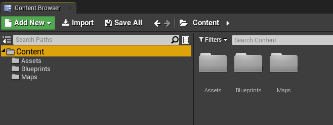
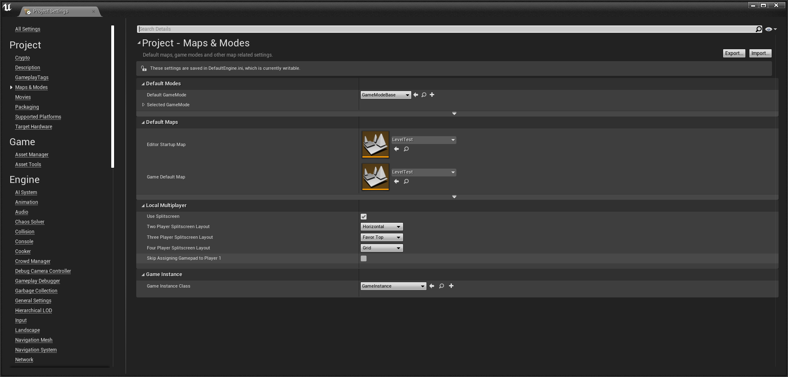

[Home](https://myerco.github.io/unreal-engine) / [Unreal](https://myerco.github.io/unreal-engine/unreal.html)

# Organizando o projeto
Neste capitulo vamos organizar o projeto do *ProjetoAula* e alguns elementos da interface.
1. Criando pastas de trabalho
1. Level e Inicialização
1. Preparando o projeto  
1. Pastas de trabalho e nomenclatura;
1. Configurando o ícone do projeto;
1. Configurando a pasta de mapas;

### 1. Criando pastas de trabalho
- Na aba *Content Browser* utilizando botão direito do mouse clique em *New Folder* e crie as seguintes pastas:
1. Assets
1. Bluprints
1. Maps

### 2. *Level* e Inicialização
- Salve o *level* atual na pasta Maps *File->Save Current* com o nome LevelTest
- Inicializando o projeto utilizando o LevelTest
	- Edit->Project Settings
	- Maps & Modes
	- Edit Startup Level : LevelTest
	- Game default Map : LevelTest  

### Referências
[Directory Structure](https://docs.unrealengine.com/en-US/Engine/Basics/DirectoryStructure/index.html)
[Editor Preferences](https://docs.unrealengine.com/en-US/Engine/UI/index.html)
[Style Guide](https://github.com/Allar/ue4-style-guide/blob/master/README.md)

### Teclas de atalho
[Controles de navegação](https://docs.unrealengine.com/en-US/Engine/UI/LevelEditor/Viewports/ViewportControls/index.html)
