## Actors
- Um ator é qualquer objeto que pode ser colocado em um nível. Atores são uma classe genérica que oferece suporte a transformações 3D, como translação, rotação e escala. Atores podem ser criados (gerados) e destruídos por meio de código de jogo (C ++ ou Blueprints). Em C ++, AActor é a classe base de todos os atores.
- É composto por Atributos, componentes  e eventos;
- Permitem Herança;

## Hierarquia
- UObject C++
 - Actor C++
    - Pawn
    - Character
    - GameController
- UObject C++
  - Actor BP
    - Pawn BP
    - Character BP
    - GameController BP

## Componentes e controles da classe *Character*
- Movimentação - É controlado pelo **PlayerController**
- PlayerController - Controla o **Character**
- IAController   - Controla um classe **Character** ou **Pawn**

## Estrutura  
- Actor
  - Actor Child
  - Component
  - Static Mesh

## Exemplo   
- Hero_Base - (Andar, Correr e Pular)
  - Mago
  - Guerreiro
  - Arqueiro

## Malhas
- Static Mesh
- Skeletal mesh

## Classes
- Principal grupo de classes de atores.  
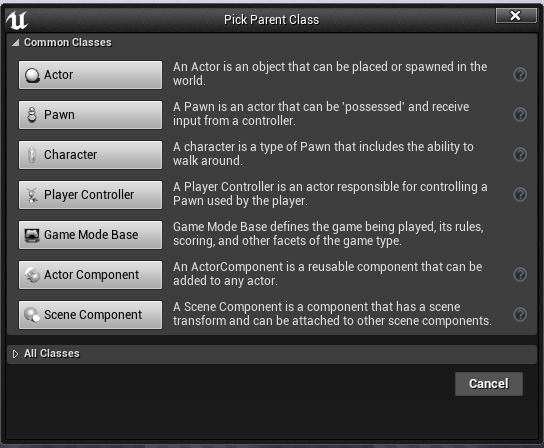  

- Detalhes da classe *Actor* .  
  

- Editor de objetos e componentes.  
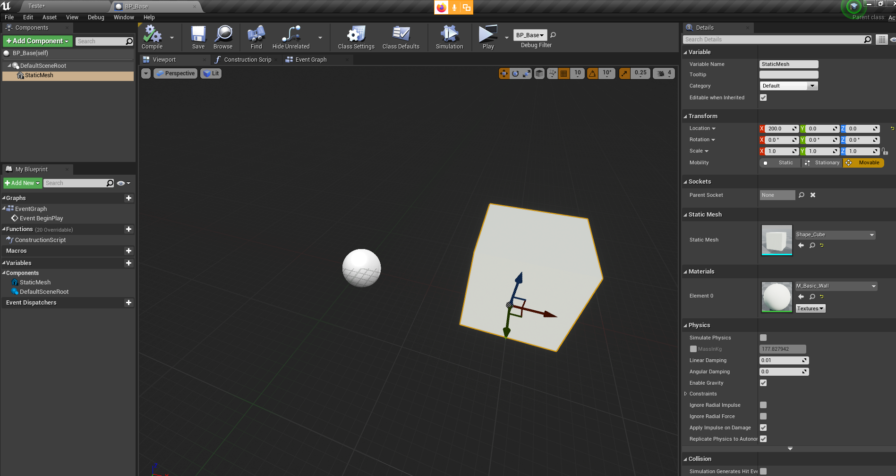  

***

## Posição
- Posicionamento do ator no mundo.  
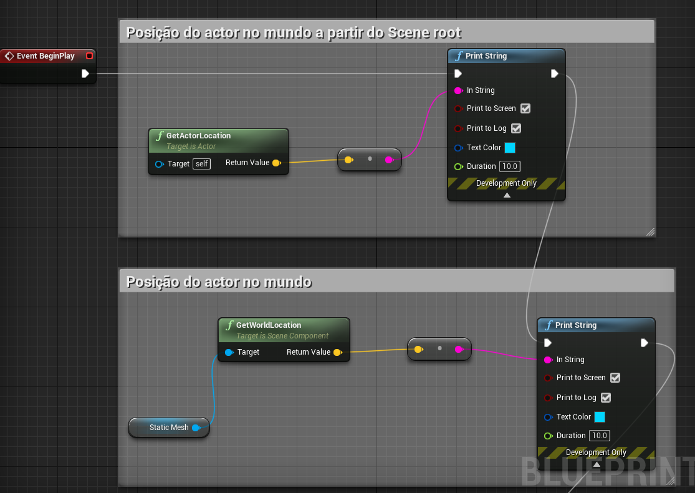

- Posição relativa no mundo  
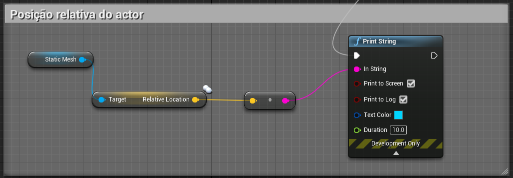

***

## Herança
- o Componente *ChildActor* implementa a ligação com outro ator.  
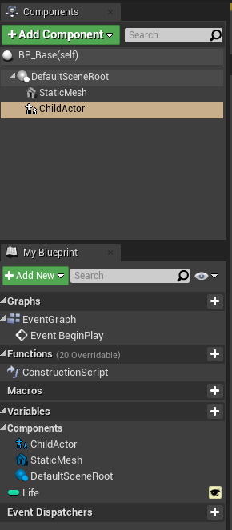

- Herança de propriedades e métodos.  
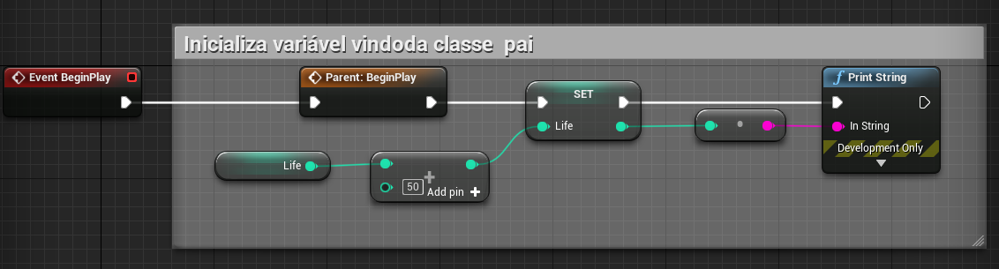

- Referências de atores e componentes.  
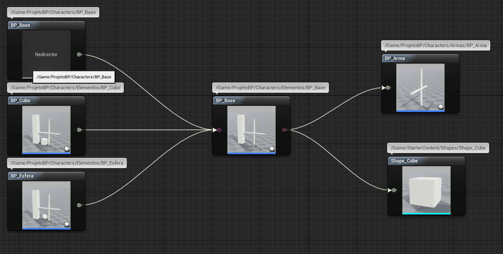

***
## Adicionando atores
- Criando e destruindo atores.  
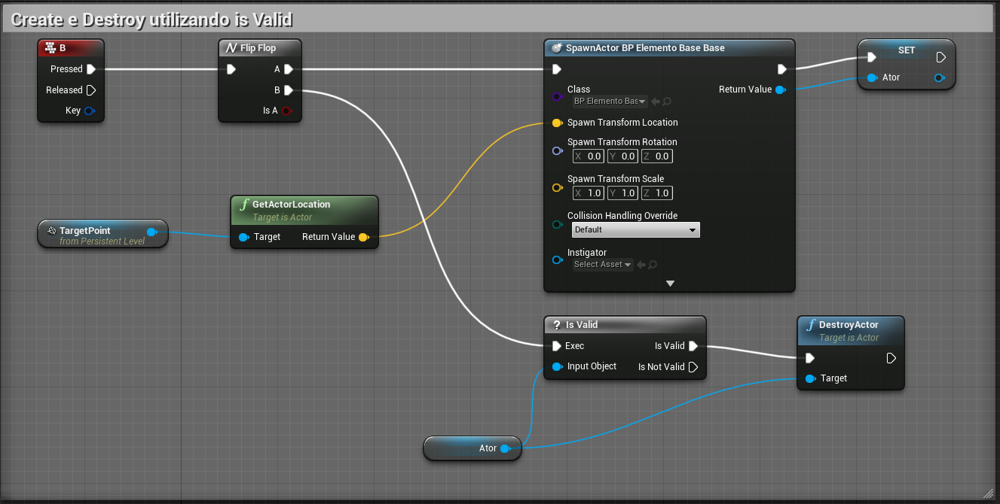
- Utilizando o *Level Bluprint* podemos implementar o código abaixo.
- Ao pressionar a tecla o ator e criado na cena utilizando as coordenadas do **targetPoint**
- O comando **flip/flop** e utilizado para intercalar entre criar e destruir o ator.
- Usamos **isvalid** para verificar se o ator existe na cena.

## Listando atores
- Por classe  
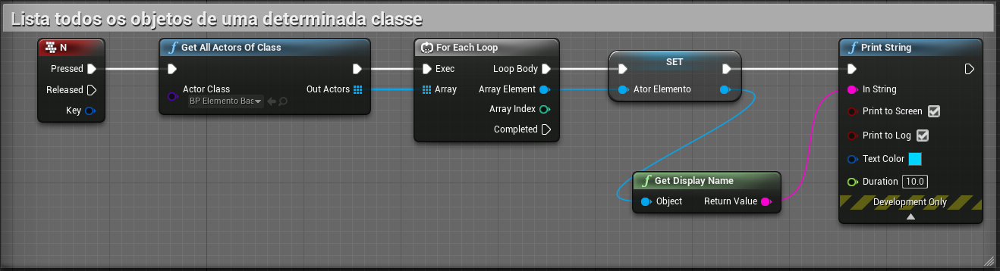

- Utilizando *tag* (etiquetas)  
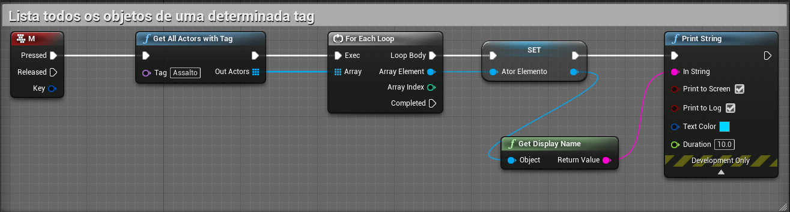

## Coordenadas

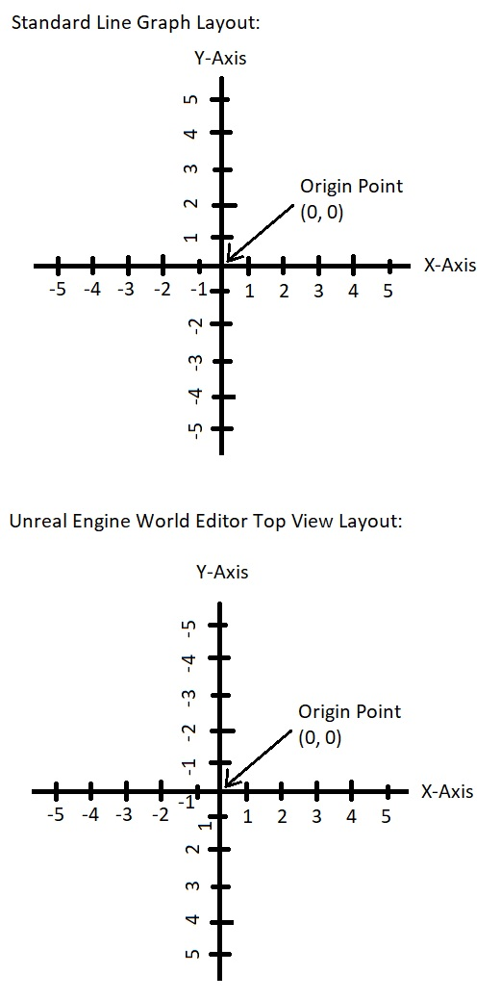

## Colisões
- Simplex collision
- Complex collision

## Default pawn

## Câmera

## Player input
- Estrutura

- Mapeamento de transformações
- Menu **Project->Input**  
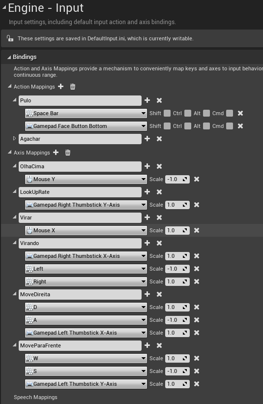

- Mapeamento de um evento a um botão
 - Valores 0 e 1
 - Exemplo:
  1. Tecla Espaço = Pulo
  1. Tecla Enter = Disparo
  1. Tecla C  = Agachar
- Mapeamento de Movimentação nos eixos
 - Mapeamento de um evento a um botão ou a um eixo de controle
 - É atualizado constantemente
 - Escala de valores
 - Exemplo:
  1. Tecla W = MoverDireita
  1. Tecla D = MoverEsquerda

## GameMode
 - Definido por *level*
 - Pode ser para definido para o todo o projeto;
 - Menu **Project**  
 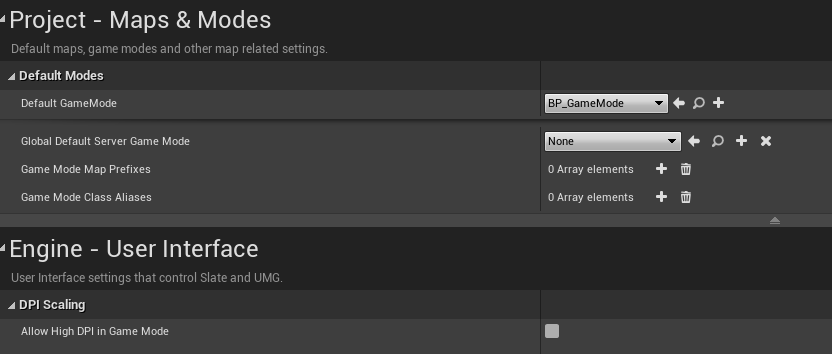

1. PlayerController
 - Controlador do jogador definido por *Level*
 

## Movimentação de peão *Pawn*
- Componentes  
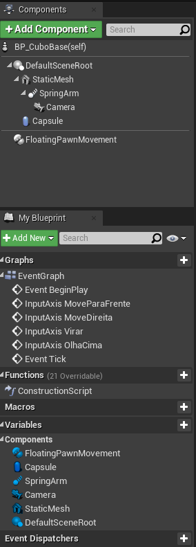
- Habilitando a entrada de comandos   
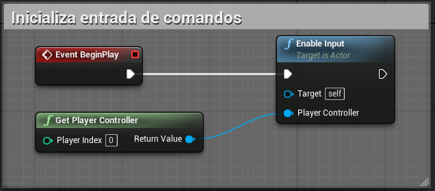
- Implementando movimentação com teclado  
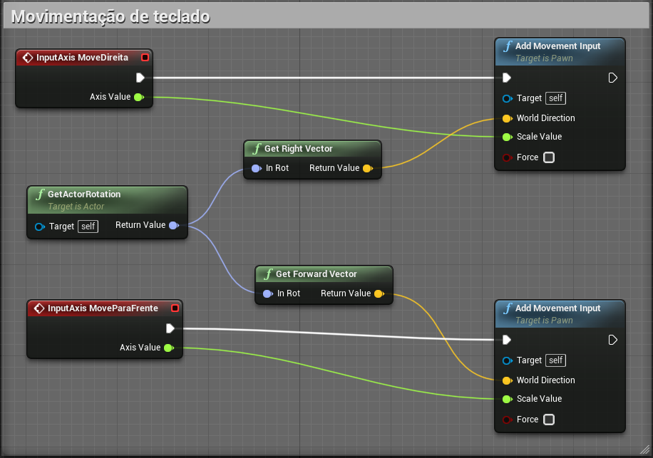
- Captura as coordenadas do ator para que possamos utilizar os métodos de movimentação **Virar** e **OlhaCima**  
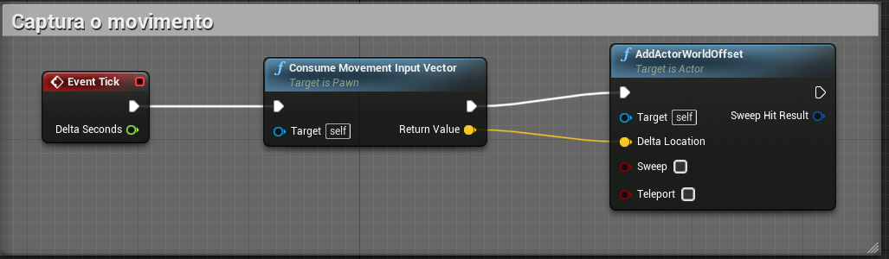
- Movimentação utilizando mouse  
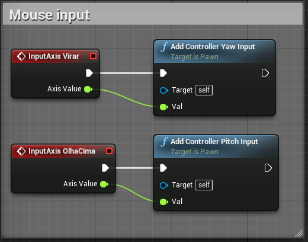
- Controle de movimentação do ator (Classe) - Caso as opções *Use controller rotation pitch/Yaw* estiverem ativas (**true**) a cápsula do ator irá sem movimentar no seu próprio eixo.    
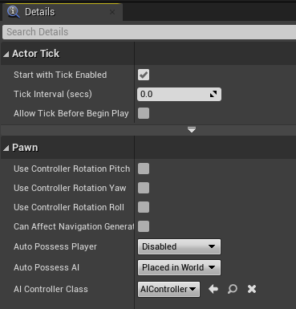

- Controle de movimentação do braço que sustenta a câmera **SpringArm**  
- Quando verdadeiro *Use Pawn control Rotation* somente o braço com a câmera são movimentados.  
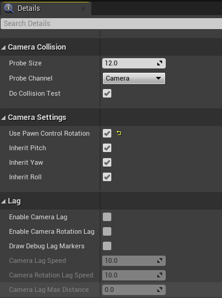
- **Enumeration** para registro de poses/estados do personagem.    
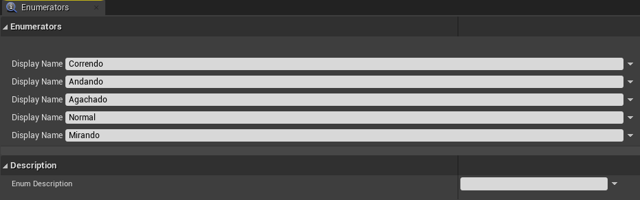

## Referências
- [Game mode](https://docs.unrealengine.com/en-US/Gameplay/Framework/GameMode/index.html)
- [Arms](https://docs.unrealengine.com/en-US/Gameplay/HowTo/UsingCameras/SpringArmComponents/index.html)
- [CharacterMovement](https://docs.unrealengine.com/en-US/Gameplay/HowTo/CharacterMovement/Blueprints/index.html)
- [PlayerInput](https://docs.unrealengine.com/en-US/Programming/Tutorials/PlayerInput/index.html)
- [Spawned no cliente](https://docs.unrealengine.com/en-US/Gameplay/HowTo/SpawnAndDestroyActors/Blueprints/index.html)
- [Enabled Input](https://docs.unrealengine.com/en-US/Gameplay/HowTo/ActorInput/Blueprints/index.html)
- [Mapeando de comandos](https://docs.unrealengine.com/en-US/Gameplay/Input/index.html)
- [Editor](https://docs.unrealengine.com/en-US/Engine/Content/Types/StaticMeshes/Editor/index.html)
- [Static Mesh](https://www.youtube.com/watch?v=8WvwFPN1XNA)
- [Static Mesh Actors](https://docs.unrealengine.com/en-US/Engine/Actors/StaticMeshActor/index.html)
- [Skeletal Mesh Actors](https://docs.unrealengine.com/en-US/Engine/Actors/SkeletalMeshActors/index.html)
-[Create a Free camera pawn with custom inputs](https://isaratech.com/ue4-create-a-free-camera-pawn-with-custom-inputs/)
