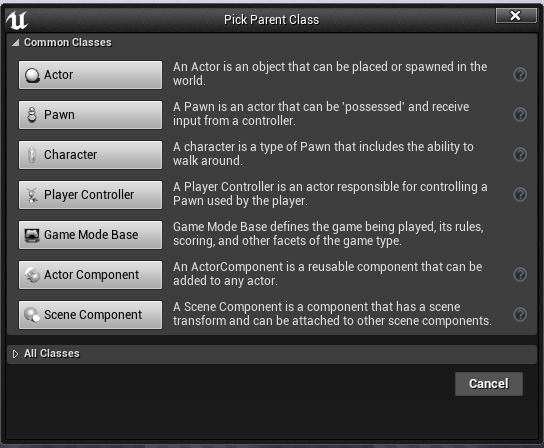
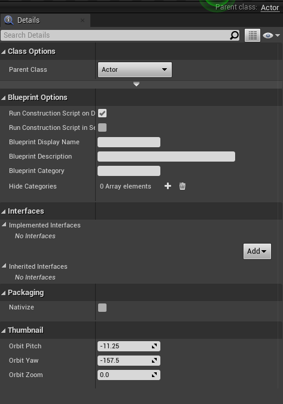
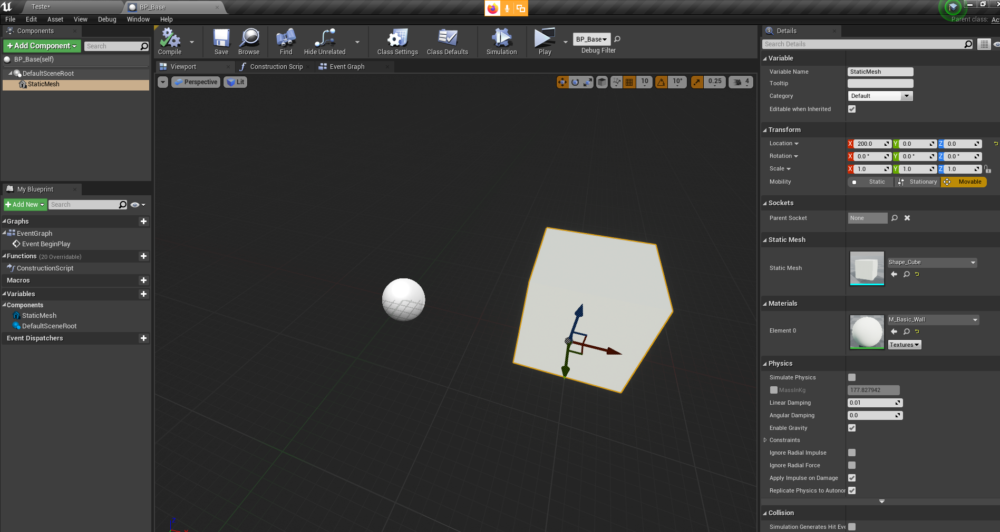
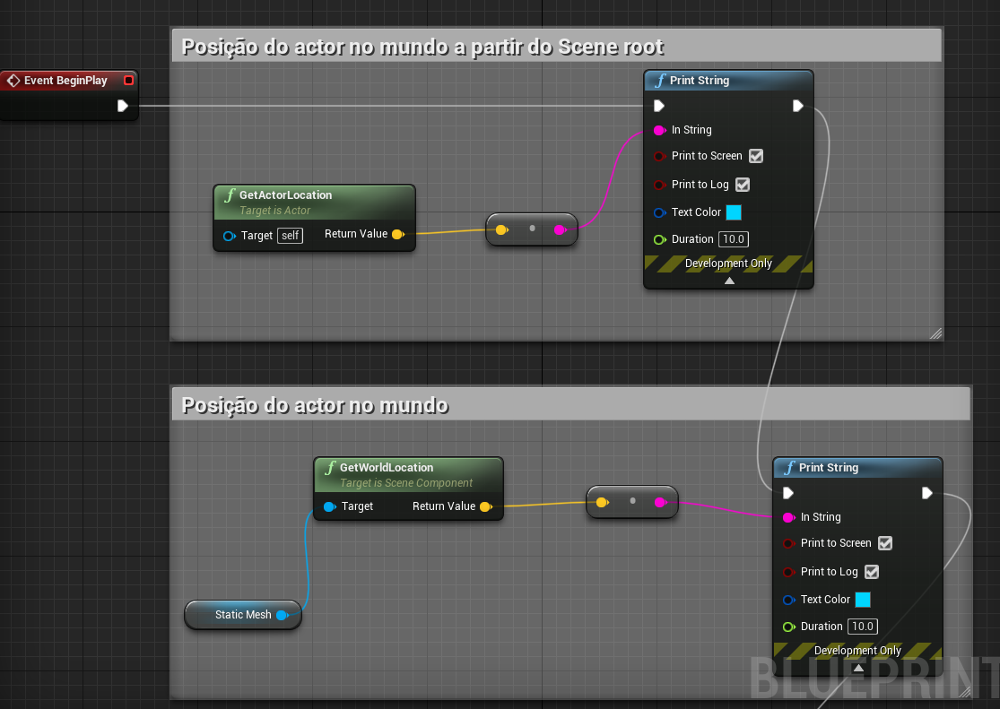
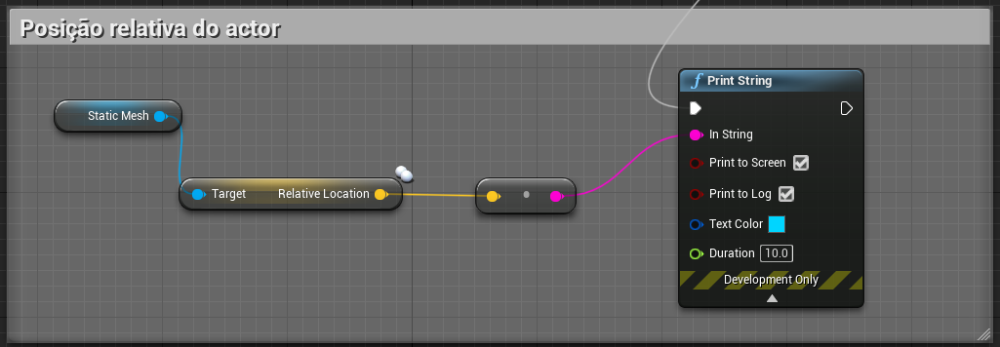
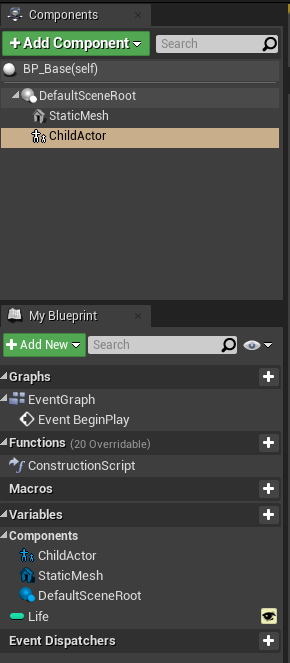

### Actors
1. Atores;
1. Atributos e eventos;
1. Herança;

Hierarquia

- UObject C++
 - Actor C++
    - Pawn
    - Character
    - GameController

- UObject C++
  - Actor BP
    - Pawn BP
    - Character BP
    - GameController BP

- Character componentes e controles
  - Movimentação
  - É controlado pelo PlayerController

- PlayerController
  - Character
- IAController
  - Character

- Actor
  - Actor Child
  - Component
  - Static Mesh

- Base - Andar, Correr e Pular
  - Mago
  - Guerreiro
  - Arqueiro

## Static Mesh
1. [Editor](https://docs.unrealengine.com/en-US/Engine/Content/Types/StaticMeshes/Editor/index.html)
1. [Static Mesh](https://www.youtube.com/watch?v=8WvwFPN1XNA)
1. [Static Mesh Actors](https://docs.unrealengine.com/en-US/Engine/Actors/StaticMeshActor/index.html)

## Skeletal mesh
1. [Skeletal Mesh Actors](https://docs.unrealengine.com/en-US/Engine/Actors/SkeletalMeshActors/index.html)

## Transformação
- Principal grupo de classes de atores.    
    

- A classe *Actor* .    
   

- Editor de objetos e componentes.   
   

- Posicionamento do ator no mundo.  
 
- Posição relativa no mundo
 
- Janela de gerencimento.  
 
 - o Componente *ChildActor* implementa a ligação com outro ator.
 

- Herança de propriedades e métodos  

## Adicionar atores na cena
spawn and destroy

## Isvalid

## Get All Actors of Class

## Tag
Has Tag

## Colisões
- Simplex collision
- Complex collision

## Game Mode

[Game mode](https://docs.unrealengine.com/en-US/Gameplay/Framework/GameMode/index.html)
## Default pawn

## Câmera
[Arms](https://docs.unrealengine.com/en-US/Gameplay/HowTo/UsingCameras/SpringArmComponents/index.html)

## Player input
1. [Spawned no cliente](https://docs.unrealengine.com/en-US/Gameplay/HowTo/SpawnAndDestroyActors/Blueprints/index.html)
1. [Enabled Input](https://docs.unrealengine.com/en-US/Gameplay/HowTo/ActorInput/Blueprints/index.html)
- Habilitando entradas de controles
1. [Mapeando de comandos](https://docs.unrealengine.com/en-US/Gameplay/Input/index.html)
- Mapeamento de ações
 - Mapeamento de um evento a um botão
 - Valores 0 e 1
 - Exemplo:
  1. Tecla Espaço = Pulo
  1. Tecla Enter = Disparo
  1. Tecla C  = Agachar
- Mapeamento de Movimentação nos eixos
 - Mapeamento de um evento a um botão ou a um eixo de controle
 - É atualizado constantemente
 - Escala de valores
 - Exemplo:
  1. Tecla W = MoverDireita
  1. Tecla D = MoverEsquerda

1. [Movimentação]([Unreal Engine CharacterMovement](https://docs.unrealengine.com/en-US/Gameplay/HowTo/CharacterMovement/Blueprints/index.html))
1.[PlayerInput](https://docs.unrealengine.com/en-US/Programming/Tutorials/PlayerInput/index.html)
