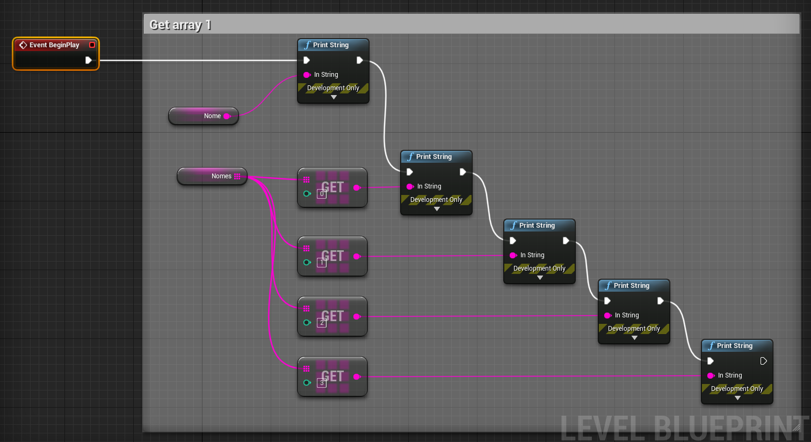
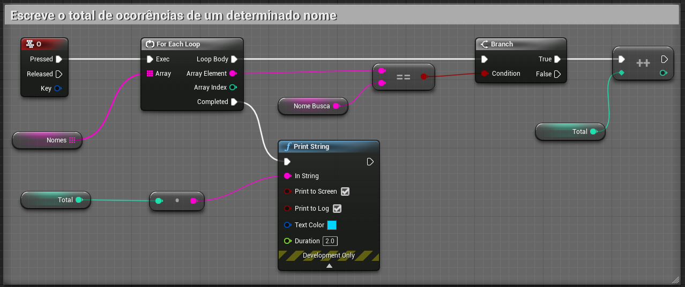

### Dificuldade : **Nível 5**   

1. Conceito e implementação
- É um conjunto de variáveis do mesmo tipo agrupadas  
Exemplo:  
Números inteiros
a = ( 5,2,7,3,9)  
Números *float*  
a = ( 5.1,2.9,7.0,3.121,9.43)  
Números *String*  
s = ( 'Ana','José','Hugo','Hulda')

- Podemos representar os arrays da seguinte forma:  
|   |   |   |   |   |
|---|---|---|---|---|
|valor   |'Ana'   |'José'   |'Hugo'   |'Hulda'   |
|  índice |  0 | 1  | 2  | 3  |

Em c++ para Unreal Engine

```c++
FString  pessoas[4] = { 'Ana','José','Hugo','Hulda'};

int  pessoas[3] = { 4,3,7};
```

Utilizando Blueprints


1. Método *Get* para *arrays*
Para acessar qualquer elemento dentro *array* é necessários utilizar o índice.  

Em c++ para Unreal Engine
```c++
FString s = pessoa[0];
UE_LOG(LogTemp, Warning, TEXT("O nome é %s",*s);
// Esecreve "Ana"
```
Em c++
```c++
cout << pessoa[0];
```

- Get  
Blueprints

```c++
```

- Get utilizando uma variável como índice


- Último índice e a quantidade de elementos do *array*


- Removendo elementos


- Listando todos os elementos utilizando *for*




1. Adicionando e removendo elementos
1. Procurando elementos
1. Tamanho do *array*
1. Limpando e acrescentando no *array*

### Referências

[Unreal Engine Blueprints Array](https://docs.unrealengine.com/en-US/Engine/Blueprints/UserGuide/Arrays/index.html)

[Unreal Engine Array Nodes](https://docs.unrealengine.com/en-US/Engine/Blueprints/UserGuide/Arrays/ArrayNodes/index.html)

[C++](https://www.codegrepper.com/code-examples/cpp/ue4+c%2B%2B+array)
