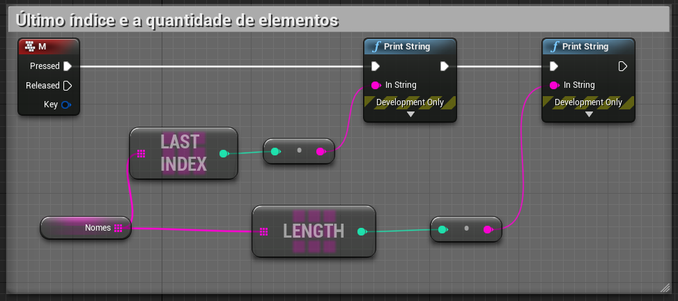

[Home](https://myerco.github.io/unreal-engine) / [Estrutura](https://myerco.github.io/unreal-engine/1-estrutura.html)
# Manipulando Arrays
### Dificuldade : **Nível 5**   
Neste capitulo serão apresentados os conceitos de estruturas de arrays ou vetores e
suas funções para manipulação.
Os tópicos apresentados :
1. Conceito e implementação;
1. Declaração
1. Método Get para arrays;
1. Get utilizando uma variável como índice;
1. Último índice e a quantidade de elementos do array;
1. Removendo elementos;
1. Listando todos os elementos utilizando for
;
1. Usando o comando *find*;
1. Comando remove *index*
1. Limpando o *clear*;
1. Atualiza o *array* nome clássicos com dados do *array* de nome;
1. Contando elementos dentro de um *array*;


## 1. Conceito e implementação
- É um conjunto de variáveis do mesmo tipo agrupadas  
Exemplo:  
Números inteiros
a = ( 5,2,7,3,9)  
Números *float*  
a = ( 5.1,2.9,7.0,3.121,9.43)  
Números *String*  
s = ( 'Ana','José','Hugo','Hulda')

- Podemos representar os arrays da seguinte forma:

|valor|Ana   |José |Hugo   |Hulda|
|índice|  0 | 1  | 2  | 3  |

## 2. Declaração
- Blueprints  

- Em C++  
```c++
FString  pessoas[4] = { 'Ana','José','Hugo','Hulda'};
int  pessoas[3] = { 4,3,7};
```

## 3. Método *Get* para *arrays*
Para acessar qualquer elemento dentro *array* é necessários utilizar o índice.  

- Blueprints  

- Em c++  
```
FString s = pessoa[0];
UE_LOG(LogTemp, Warning, TEXT("O nome é %s",*s);
```  

## 4. Get utilizando uma variável como índice


## 4. Último índice e a quantidade de elementos do *array*


## 5. Removendo elementos


## 6. Listando todos os elementos utilizando *for*


## 7. Usando o comando *find*
- Blueprint  

- c++
```
int32 Index;
if (StrArr.Find(TEXT("Hello"), Index))
{
    // Index == 3
}
```
## 8. Comando *remove index*

## 9. Comando *remove*

## 10. Limpando o *clear*

## 11. Atualiza o *array* **nome clássicos** com dados do *array* de **nome**


## 12. Contando elementos dentro de um *array*


### Referências

[Unreal Engine Blueprints Array](https://docs.unrealengine.com/en-US/Engine/Blueprints/UserGuide/Arrays/index.html)

[Unreal Engine Array Nodes](https://docs.unrealengine.com/en-US/Engine/Blueprints/UserGuide/Arrays/ArrayNodes/index.html)

[C++](https://www.codegrepper.com/code-examples/cpp/ue4+c%2B%2B+array)
