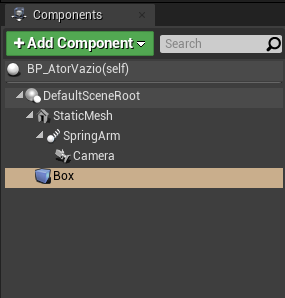
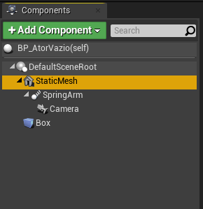
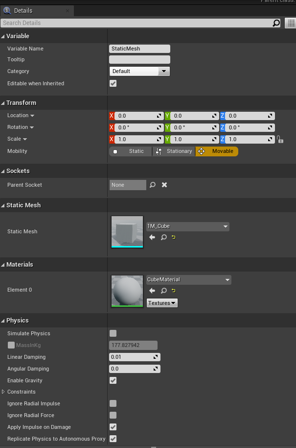
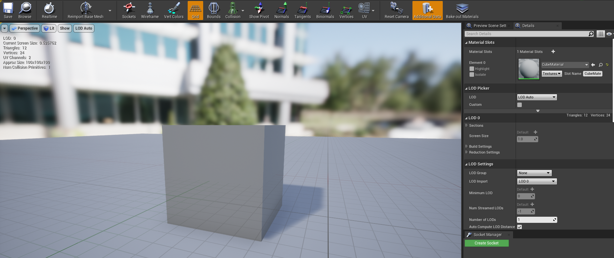
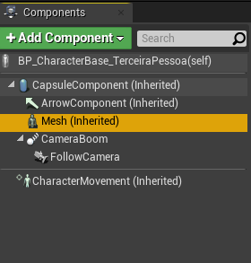
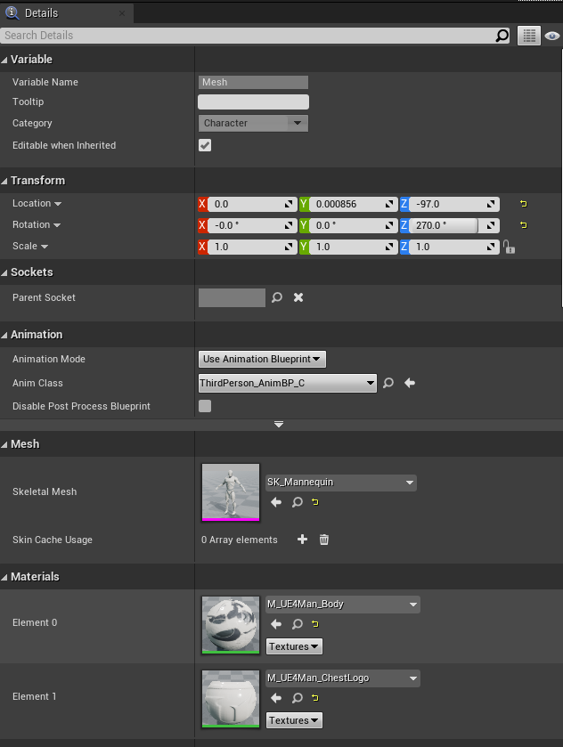
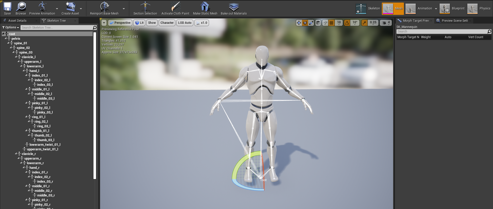

[Home](https://myerco.github.io/unreal-engine) / [Unreal](https://myerco.github.io/unreal-engine/unreal.html)

# Atores
Neste capitulo serão apresentados e implementados os atores *Actors* do seu
projeto.

## Íncide
> 1. [Conceituando atores](#1)
> 1. [Malhas](#2)
> 1. [Classes)](#3)
> 1. [Posição e coordenadas](#4)
> 1. [Herança](#5)
> 1. [Adicionando atores](#5)
> 1. [Listando atores](#6)
> 1. [Mapeamento de ações](#7)
> 1. [Movimentação de peão **Pawn**](#8)

## 1. Conceituando atores
- Um ator é qualquer objeto que pode ser colocado em um nível. Atores são uma classe genérica que oferece suporte a transformações 3D, como translação, rotação e escala. Atores podem ser criados (gerados) e destruídos por meio de código de jogo (C ++ ou Blueprints). Em C ++, AActor é a classe base de todos os atores.
- É composto por Atributos, componentes  e eventos;
- Permitem Herança;

### 1.2. Herança
- UObject C++
 - Actor C++
    - Pawn
    - Character
    - GameController
- UObject C++
  - Actor BP
    - Pawn BP
    - Character BP
    - GameController BP

### 1.3 Componentes e controles da classe *Character*
Os componentes são um tipo especial de objeto que os atores podem anexar a si próprios como subobjetos. Os componentes são úteis para compartilhar comportamentos comuns, como a capacidade de exibir uma representação visual e reproduzir sons. Eles também podem representar conceitos específicos do projeto, como a maneira como um veículo interpreta a entrada e muda sua própria velocidade e orientação. Por exemplo, um projeto com carros, aeronaves e barcos controláveis pelo usuário pode implementar as diferenças no controle e movimento do veículo, alterando qual componente um ator do veículo usa.   

Exemplo:  

  

Exemplo de Componentes :

- Actor Child: Componente associa outro ator a classe principal.

- Static Mesh : Adiciona um objeto de 3D

## 2. Malhas **Static Mesh**  
- Componente  
  
- Detalhes  
  
- Estruturas   
  
## 3 Skeletal mesh
- Componente  
  
- Detalhes  
  
- Estruturas   
  

## 3. Classes
- Principal grupo de classes de atores.  
  

- Detalhes da classe *Actor* .  
  

- Editor de objetos e componentes.  
  

***

## 4. Posição e coordenadas
- Posicionamento do ator no mundo.  

- Posição relativa no mundo  

***

## 5. Herança
- o Componente *ChildActor* implementa a ligação com outro ator.  

- Herança de propriedades e métodos.  

- Referências de atores e componentes.  

***

## 6. Adicionando atores
- Criando e destruindo atores.  

- Utilizando o *Level Bluprint* podemos implementar o código acima.
- Ao pressionar a tecla **H** o ator e criado na cena utilizando as coordenadas de um componente **targetPoint** adicionando na cena.
- O comando **flip/flop** é utilizado para intercalar entre criar e destruir o ator, com os métodos **SpawnActor** e **DestroyActor** respectivamente.
- Usamos **IsValid** para verificar se o ator existe na cena.
***

## 7. Listando atores
- Por classe  

- Utilizando *tag* (etiquetas)  

***

## Colisões
- Simplex collision
- Complex collision  

## Default pawn

## Câmera

***

## Referências
- [Game mode](https://docs.unrealengine.com/en-US/Gameplay/Framework/GameMode/index.html)  
- [Arms](https://docs.unrealengine.com/en-US/Gameplay/HowTo/UsingCameras/SpringArmComponents/index.html)  
- [Spawned no cliente](https://docs.unrealengine.com/en-US/Gameplay/HowTo/SpawnAndDestroyActors/Blueprints/index.html)  
- [Editor](https://docs.unrealengine.com/en-US/Engine/Content/Types/StaticMeshes/Editor/index.html)  
- [Static Mesh](https://www.youtube.com/watch?v=8WvwFPN1XNA)  
- [Static Mesh Actors](https://docs.unrealengine.com/en-US/Engine/Actors/StaticMeshActor/index.html)
- [Skeletal Mesh Actors](https://docs.unrealengine.com/en-US/Engine/Actors/SkeletalMeshActors/index.html)  
- [Componentes](https://docs.unrealengine.com/en-US/Programming/UnrealArchitecture/Actors/Components/index.html)
