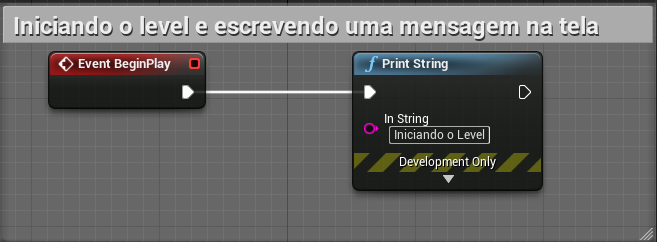
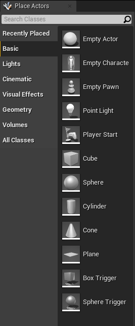
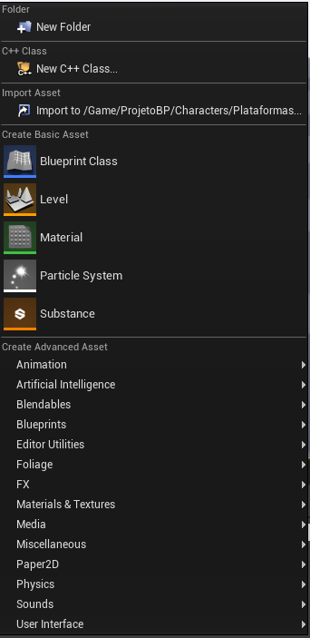
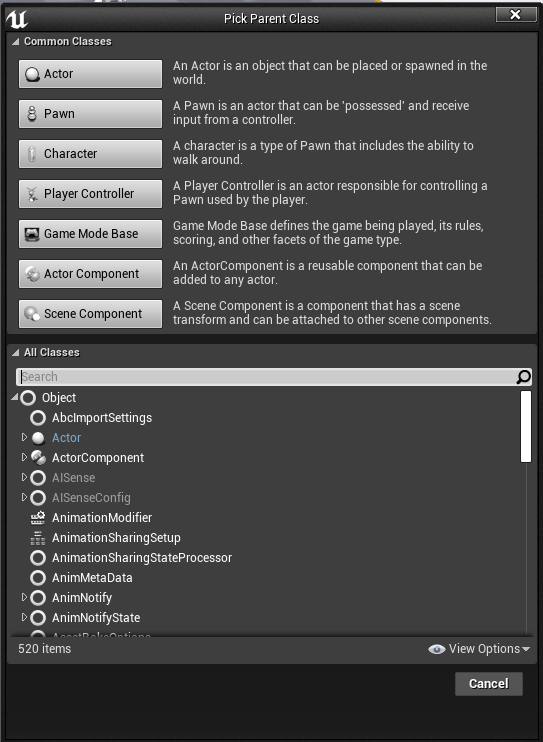
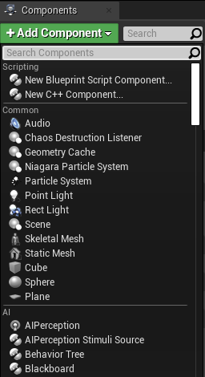
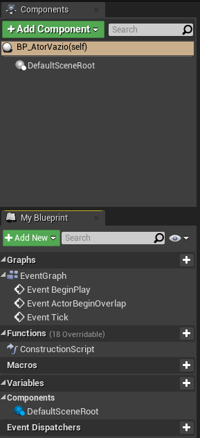
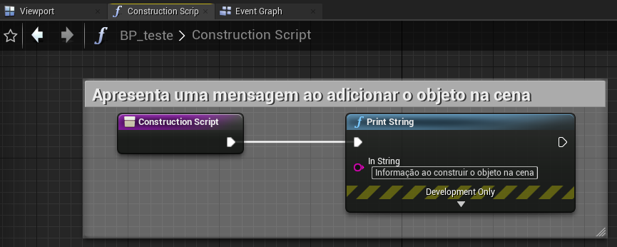
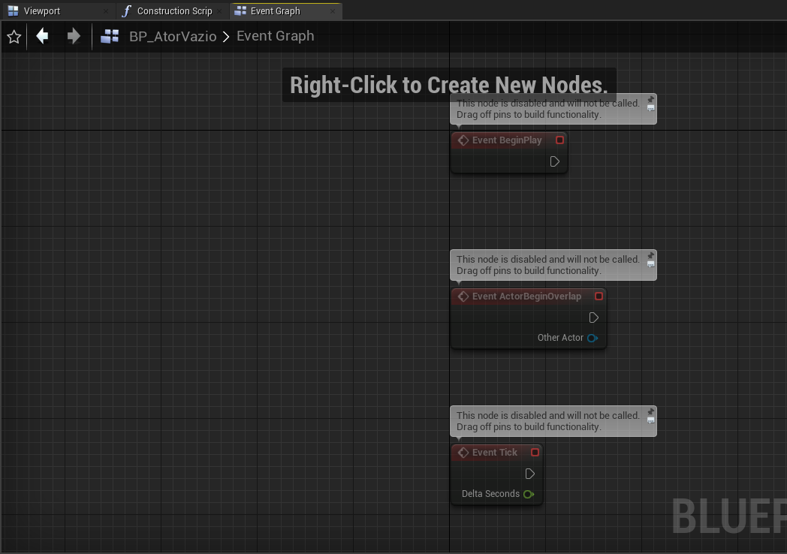
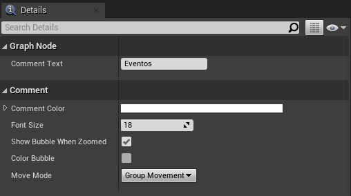

[Home](https://myerco.github.io/unreal-engine) / [Unreal](https://myerco.github.io/unreal-engine/unreal.html)

# Blueprints
Neste capítulo será apresenta o modelo da lógica de programação utilizando **Blueprint** e os seus elementos.

## Índice
>1. [Introdução ao *Blueprints Visual Scripting*](#1)  
>   1. [Características](#11)  
>   1. [Construção](#12)  
> 1. [Level Blueprint](#2)  
>   1. [Utilizando o level Blueprint para escrever mensagens na tela](#21)  
> 1. [Blueprint de atores](#3)
>   1. [Place Actors](#31)  
>   1. [Blueprint Class](#32)  
>   1. [Components](#33)  
>   1. [Components e My Blueprint](#34)  
>   1. [Representação da organização do objeto](#35)  
>   1. [Construction Script](#36)  
>   1. [Event Graph](#37)  
> 1. [Utilizando o level Blueprint para escrever   mensagens na tela](#4)
> 1. [Comentários](#4)

<a name="1"></a>
## 1. Introdução ao *Blueprints Visual Scripting*
O sistema *Blueprints Visual Scripting* no *Unreal Engine* é um sistema completo de script de jogo baseado no conceito de usar uma interface baseada em nó para criar elementos de jogo a partir do *Unreal Editor*. Como acontece com muitas linguagens de script comuns, ele é usado para definir classes orientadas a objetos (OO) ou objetos no mecanismo. Ao usar o UE4, você frequentemente descobrirá que os objetos definidos usando o Blueprint são coloquialmente chamados apenas de "Blueprints".

<a name="11"></a>
### 1.1 Características
- Blueprints foca em ser acessível, versátil para qualquer membro do projeto.  
- Simplifica tarefas para programadores de engenheiros de projeto.
- Fácil de entender, interagir e construir.  

<a name="12"></a>
### 1.2 Construção
Abaixo da estrutura de elementos.
```
|-- C++  
|   |-- Herança - Classes derivam e herdam de suas classes pai  
|   |   |-- Framework - Classes Padrão  
|   |   |   |-- Actor  
|   |   |   |   |-- GameMode
|   |   |   |   |   |-- Pawn
|   |   |   |   |   |-- Controller
|   |   |   |   |   |-- GameState
|   |   |   |   |   |-- PlayerState
|   |   |   |   |-- GameInstance
|   |   |-- Events/Functions/Var - Eventos, funções e variáveis.
|   |-- Blueprint
|   |   |-- Components
|   |   |   |-- Static Mesh
|   |   |   |-- Emiter
|   |   |-- Editores
|   |   |   |-- Timeline
|   |   |   |-- Componentes
|   |   |   |-- Editor de script
|   |   |-- Communication BP to BP - Comunicação entre Blueprints
|   |   |   |-- Casting
|   |   |   |-- Interface
|   |   |   |-- Event Dispacher
|   |-- Compilação - Compilação do Bytecode.
|   |   |-- Navitization - Durante o processo de preparação, o Blueprint pode ser cruzado para c ++ e nativizado*
|   |-- VM - Executado em uma máquina virtual
```
- [Arquivo Referência](../files/Blueprint_poster_18x24.pdf)

> A nativização é uma funcionalidade relativamente nova na Unreal Engine, que permite aos desenvolvedores converter suas classes criadas em Blueprint para código nativo C++ no momento em que é construído o pacote final do jogo. Isso faz com que seja possível aliar a facilidade de prototipação dos Blueprints ao desempenho do C++, acelerando o processo dedesenvolvimento e também reduzindo a possibilidade de erros na programação, levando em consideração que ao desenvolver em Blueprint todas as entradas e saídas de dados, assim como o fluxo das operações são verificados pela máquina virtual enquanto os testes estão sendo realizados, isso permite garantir que tudo funcione conforme o esperado, ou na pior das hipóteses, alerte ao desenvolvedor caso algo não saia como o esperado, por meio de mensagens intuitivas e claras

<a name="2"></a>
## 2. Level Blueprint  
Um Level Blueprint é um tipo especializado de Blueprint que atua como um gráfico de evento global em todo o nível. Cada nível em seu projeto tem seu próprio Level Blueprint criado por padrão, que pode ser editado no *Unreal Editor*, no entanto, novos *Level Blueprints* não podem ser criados por meio da interface do editor.  

 

<a name="21"></a>
## 2.1 Utilizando o level Blueprint para escrever   mensagens na tela
Utilizando o evento **BeginPlay** e conectando o nó **Print String** para escrever uma mensagem na tela.

 

<a name="3"></a>
## 3. Blueprint de atores
Atores são objetos que são adicionados na cena. São classes de objetos que suportam vários componentes, métodos e variáveis. A lógica de programação é expressada em Blueprint.  

<a name="31"></a>
### 3.1 Place Actors
No nível mais fundamental, um ator é qualquer objeto que você pode colocar em um nível e esta página irá mostrar os vários métodos em que você pode colocar esses atores dentro de seus níveis.  
   

<a name="32"></a>
### 3.2 Blueprint Class
Uma classe Blueprint, muitas vezes abreviada como Blueprint, é um ativo que permite que os criadores de conteúdo adicionem funcionalidade facilmente às classes de jogo existentes. Os projetos são criados dentro do Unreal Editor visualmente, em vez de digitar o código, e salvos como ativos em um pacote de conteúdo. Essencialmente, eles definem uma nova classe ou tipo de ator que pode então ser colocado em mapas como instâncias que se comportam como qualquer outro tipo de ator.  
1. Menu de acesso rápido  
  

1. Escolha de Classe de atores  


<a name="33"></a>
### 3.3 Components
Os *Components* ou componentes são um tipo especial de objeto que os atores podem anexar a si próprios como subobjetos. Os componentes são úteis para compartilhar comportamentos comuns, como a capacidade de exibir uma representação visual e reproduzir sons. Eles também podem representar conceitos específicos do projeto, como a maneira como um veículo interpreta a entrada e muda sua própria velocidade e orientação. Por exemplo, um projeto com carros, aeronaves e barcos controláveis pelo usuário pode implementar as diferenças no controle e movimento do veículo, alterando qual componente um ator do veículo usa.



<a name="34"></a>
### 3.4 Components e My Blueprint    
- Components - Apresenta todos os componentes anexados ao objeto principal.
- My Blueprint - Apresenta os eventos, funções, macros e variáveis presentes dentro do objeto.  



<a name="35"></a>
### 3.5 Representação da organização do objeto

```
|-- Objeto
|   |-- Events
|   |   |-- BeginPlay
|   |   |-- ActorBeginOverlap
|   |   |-- Tick
|   |-- Functions
|   |   |-- ConstructionScript
|   |-- Variables      
|   |   |-- VariavelLocal
```

<a name="36"></a>
### 3.6 Construction Script
Lógica de que é executada na construção do objeto, similares ao eventos **Construtor** em C++.  

**Exemplo**

 

<a name="37"></a>
### 3.7 Event Graph
Contém um gráfico de nós e suas ligações representando a lógica de um Blueprint.     


**BeginPlay**   
Este evento é acionado para todos os Atores quando o jogo é iniciado, quaisquer Atores gerados após o jogo ser iniciado terão isso chamado imediatamente.

**ActorBeginOverlap**   
Este evento será executado quando uma série de condições forem atendidas ao mesmo tempo:
  - A resposta à colisão entre os atores deve permitir sobreposições.
  - Ambos os Atores que devem executar o evento têm que gerar Eventos de Sobreposição definido como verdadeiro.
  - E, finalmente, a colisão de ambos os Atores começa a se sobrepor; movendo-se juntos ou um é criado sobrepondo-se ao outro.

**Tick**   
Este é um evento simples que é chamado em todos os quadros do jogo.


<a name="5"></a>
## 5. Comentários   
Os comentários podem ser incluídos diretamente em nós **Blueprint** únicos ou podem ser incluídos como caixas de comentários para agrupar nós relacionados e fornecer descrições sobre sua funcionalidade. Eles podem ser usados apenas para fins organizacionais para tornar os gráficos mais legíveis, mas também podem ser usados para fins informativos, pois permitem que descrições textuais sejam adicionadas da mesma forma que adicionar comentários ao código.

- Selecione os nós e digite "C" no teclado para adicionar um comentário.
- Podemos adicionar Características aos comentários que detalham melhor a lógica dos nós envolvidos, como por exemplo adicionando cores.  
  **Vermelho** - Lógica principal ou crítica.  
  **Azul** - Lógica de atores.  
  **Verde** - Lógica de estruturas de controle.  



***
## Referências
- [Blueprint](https://docs.unrealengine.com/en-US/Engine/Blueprints/index.html)
- [Level Blurprint](https://docs.unrealengine.com/en-US/Engine/Blueprints/UserGuide/Types/LevelBlueprint/index.html)
- [Actors](https://docs.unrealengine.com/en-US/Programming/UnrealArchitecture/Actors/index.html)
- [Components](https://docs.unrealengine.com/en-US/Programming/UnrealArchitecture/Actors/Components/index.html)
- [Event Graph](https://docs.unrealengine.com/en-US/Engine/Blueprints/UserGuide/EventGraph/index.html)
- [Placing Actors](https://docs.unrealengine.com/en-US/Engine/Actors/Placement/index.html)
- [Blueprint Class](https://docs.unrealengine.com/en-US/Engine/Blueprints/UserGuide/Types/ClassBlueprint/index.html)
- [Comments](https://docs.unrealengine.com/en-US/Engine/Blueprints/UserGuide/Comments/index.html)
- [Events](https://docs.unrealengine.com/en-US/ProgrammingAndScripting/Blueprints/UserGuide/Events/index.html)
- [Nativização](https://bibliotecadigital.ipb.pt/bitstream/10198/18264/4/pauta-relatorio-9.pdf)
