# Comunicação entre Blueprint

> 1. [Conceito ](#1)  
> 1. [Preparando o ambiente de testes ](#1)  
> 1. [Comunicação direta ](#1)  
> 1. [Blueprint Interface](#2)  
> 1. [Event Dispatcher](#3)  

## 1. Conceito
- Um meio para objetos individuais separados interagirem uns com os outros
  - Imagine um Light Blueprint e um LightSwitch Blueprint
    Como você faria um trabalhar com o outro?

- Útil para fazer coisas como:
  - Transmitindo um evento para vários ouvintes
  - Dizendo a um objeto específico para fazer algo
  - Consultando outro objeto por
    Status
    Estado
    Valores de propriedade
    Valores variáveis
    Resultados
- UE4 não tem como apenas “enviar um sinal amplo para todos”
    Curiosidades: fizemos isso há muito tempo na UE2, mas não é muito eficiente
- A comunicação sempre envolverá o seguinte:
  - Um projeto de envio
  - Pelo menos um Receiving Blueprint
- A comunicação sempre exigirá uma referência em algum ponto
  - Em outras palavras, uma das partes - o remetente ou o receptor - deve tomar conhecimento da outra
  - Isso ocorre porque, como afirmado acima, não existe um sistema de comunicação de amplo espectro
- Toda a comunicação do Blueprint é unilateral
  - Blueprints podem enviar dados para frente e para trás, mas requer que ambos os Blueprints configurem seus próprios caminhos individuais de comunicação
  - As consultas são possíveis, mas são iniciadas pelo remetente (ainda unidirecional)    

## 2. Preparando o ambiente de testes
1. Crie um **Blueprint Actor** com os seguintes parâmetros para que funcione como controlador de objetos.
  1. Adicione e configure um Static Mesh
  1. Adicione e configure um Box Colision

1. Implemente a função para desligar e ligar a iluminação os objetos **Light Point** passados como parâmetro.  

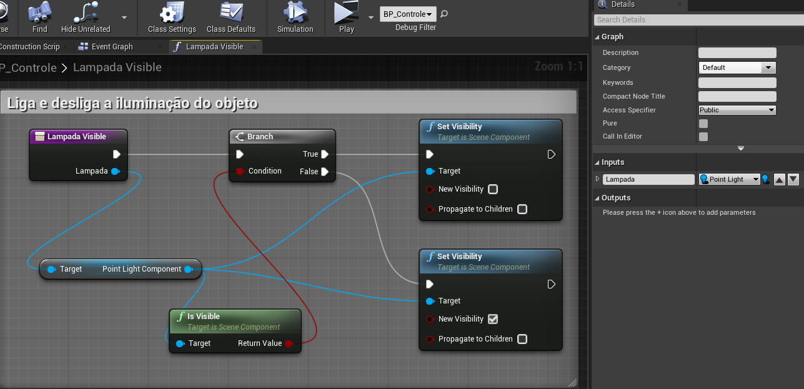    
1. Adicione a variável *Lampada* do tipo **Point Light** e configure **Instance Editable** para *true*.

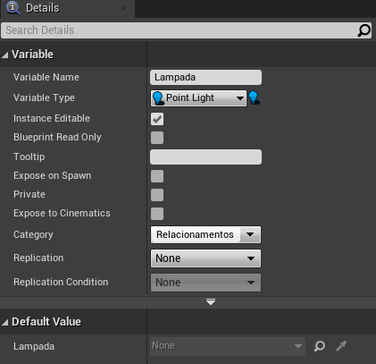      
1. Adicione dois objetos **Light Point**.
1. Em um dos objetos de iluminação adicione a **tag** *lampada*.

## 3. Acesso direto
Usaremos o evento **OnBeginOverLap** para alterar o estado da lâmpada de ligado para desligado acessando diretamente o objeto pois o mesmo é passado como parâmetro.  

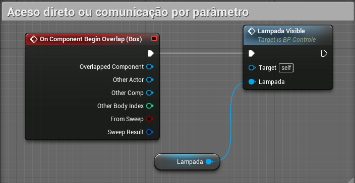      

## 4. Utilizando CAST
Usaremos o evento **OnEndOverlap** para ler todos os objetos que tem a **tag** *lampada* da cena e carregar em um array de objetos. Para cada objeto será executado o comando **Cast** informando o **type** para ter acesso a todas a funcionalidades do objeto.

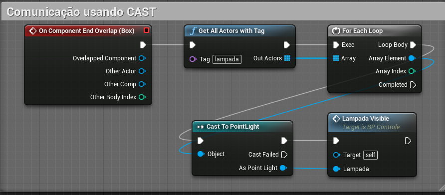      

## 5. Utilizando Interface
**Blueprint interface** permite que vários tipos diferentes de objetos compartilhem e sejam acessados através de uma interface comum. Simplificando, as interfaces do Blueprint permitem que diferentes Blueprints compartilhem e enviem dados entre si.
1. Implemente um **Blueprint interface** Utilizando o menu de contexto.

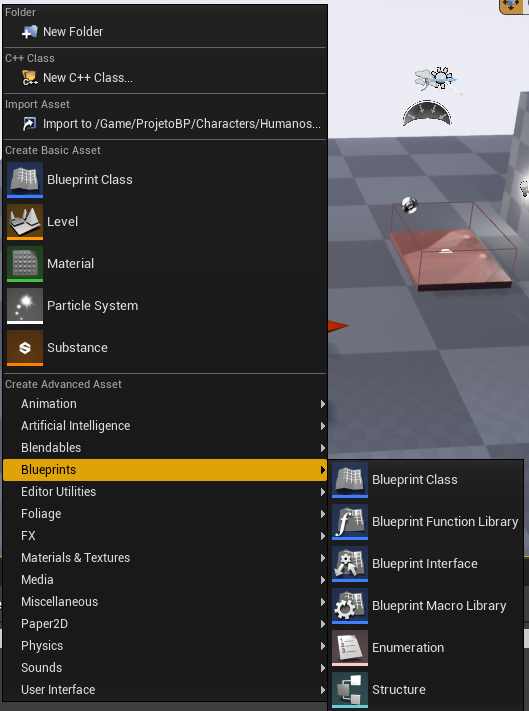    
  1. Nome do objeto *BPI_Colecionaveis*
  1. Adicione uma função *Nome*

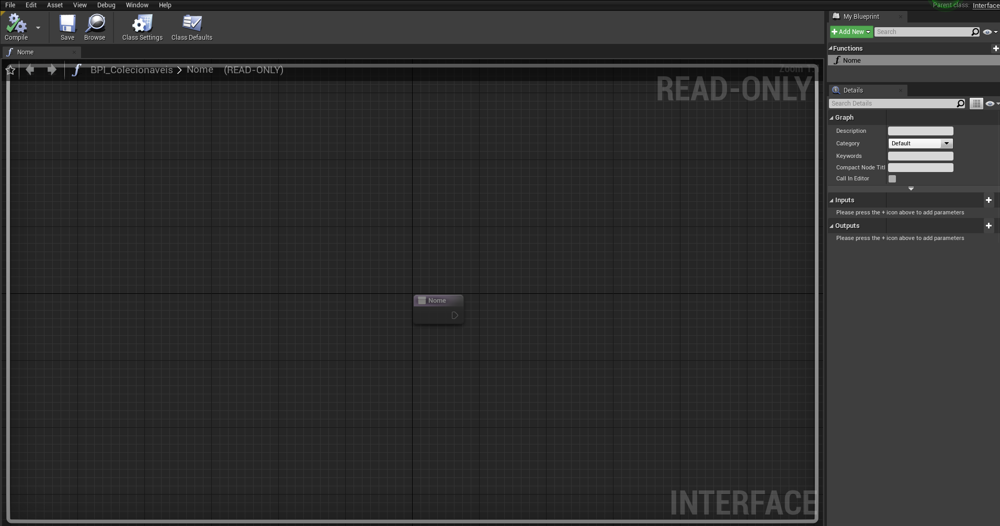      

  > Perceba que o objeto não tem lógica pois neste caso o objeto funciona como uma ponte para eventos em outros objetos que deverão ter sua própria lógica.

1. Crie um **Blueprint Actor** com os seguintes parâmetros para que funcione como controlador de objetos.
  1. Adicione e configure um **Static Mesh** com um malha de uma cadeira ou mesa.
  1. Utilizando a opção **Class Settings** adicione a interface *BPI_Colecionaveis*.
  1. Uma vez a interface configurada as funções de  *BPI_Colecionaveis* ficarão disponíveis através de eventos.   

  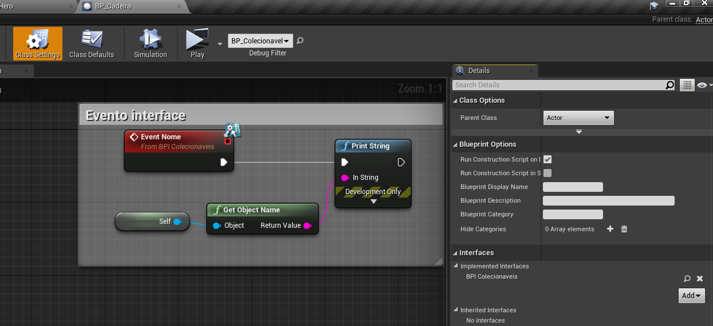     

1. Adicione no **Character** jogável *BP_Hero* e implemente a lógica abaixo.   
  1. A função *Nome* da interface fica disponível para ser chamada.
  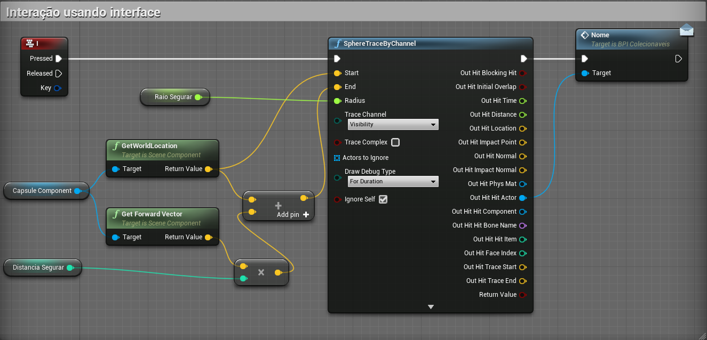     

1. Interface com parâmetros.
  1. Implemente a função *ExecutaAcao* com parâmetro *Acao* do tipo **string**, usaremos esse parâmetro para determinar ações que o objeto pode executar.  
  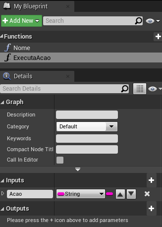   
  1. Ao chamar a função é fornecido um valor.
  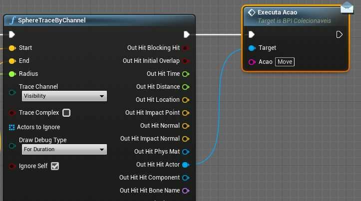     
  1. Implemente a lógica de tratamento do parâmetro dentro do objeto cadeira ou mesa.
  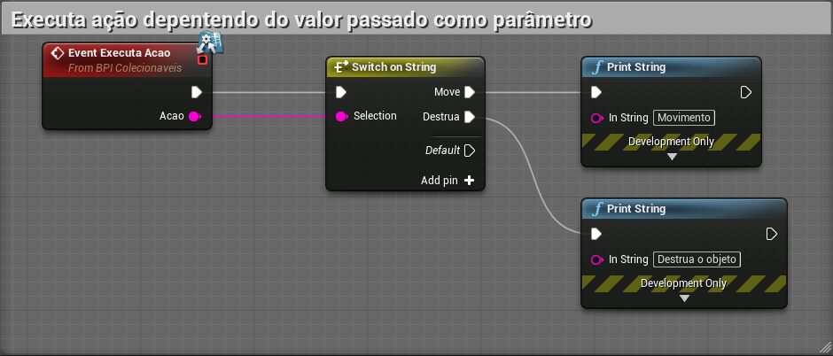  
  > Podemos melhorar o controle utilizando uma variável **enumeration** para parametrizar as ações.   

## 6. Event Dispatcher
Vinculando um ou mais eventos a um Event Dispatcher, você pode fazer com que todos esses eventos sejam disparados assim que o Event Dispatcher for chamado. Esses eventos podem ser vinculados a uma classe Blueprint, mas os Event Dispatchers também permitem que eventos sejam disparados dentro do Level Blueprint.

***
## Referências
- [Types of Blueprints](https://docs.unrealengine.com/en-US/ProgrammingAndScripting/Blueprints/UserGuide/Types/index.html)
- [Blueprint interface](https://docs.unrealengine.com/en-US/ProgrammingAndScripting/Blueprints/UserGuide/Types/Interface/index.html)
- [Event Dispatcher](https://docs.unrealengine.com/en-US/ProgrammingAndScripting/Blueprints/UserGuide/EventDispatcher/index.html)
