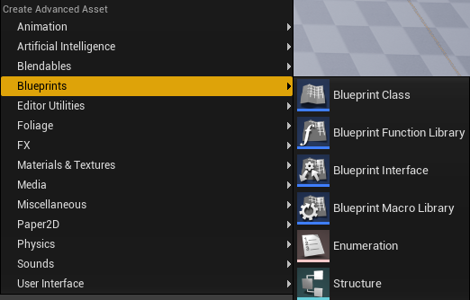
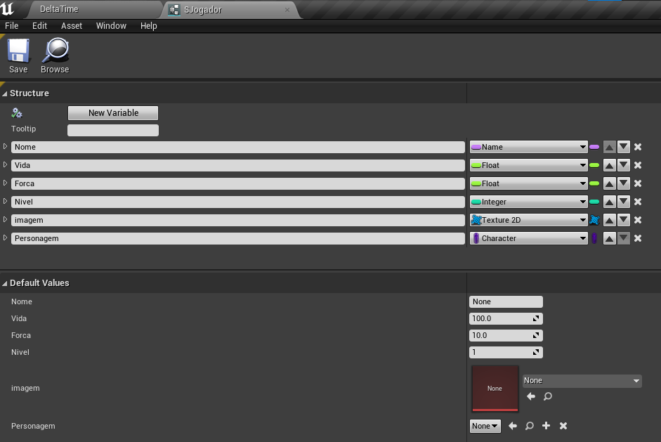
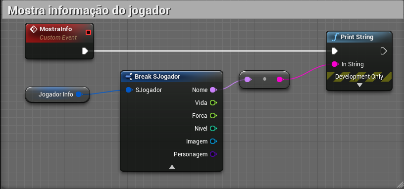
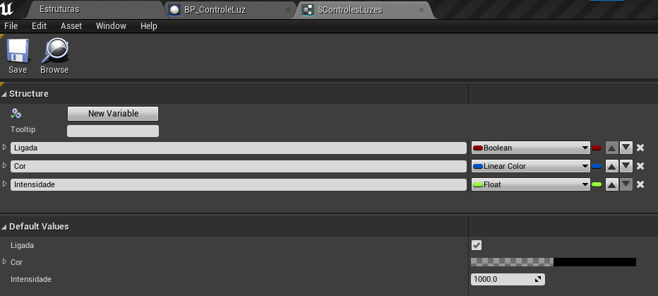
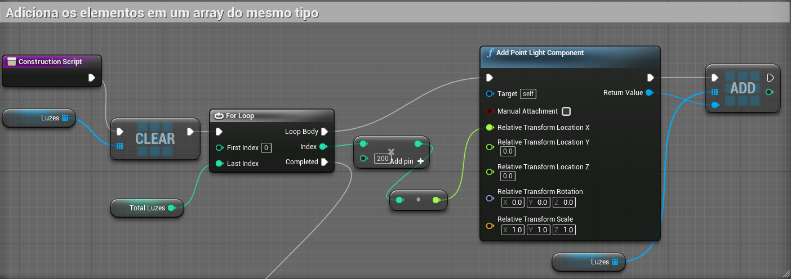
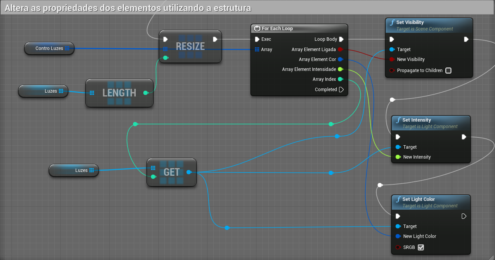

[Home](https://myerco.github.io/unreal-engine) / [Unreal](https://myerco.github.io/unreal-engine/unreal.html)

# Variáveis estruturadas
Structure, é um tipo de dados definido pelo usuário disponível em C++. Ele permite que um usuário combine itens de dados de (possivelmente) diferentes tipos de dados sob um único nome.

1. Criando *SJogador* do tipo **Structure**. 

1. Definindo variáveis dentro da estrutura.
  
  1. Nome do tipo **Name** - Armazena o nome do jogador
  1. Vida do tipo **Float** - Total de vida do jogador.
  1. Forca do tipo **Float** - Total de força do jogador.
  1. Nivel do tipo **Integer** - O Nível que o jogador se encontra.
  1. Imagem do tipo **Texture2D/References** - Armazena imagem 2d que representa o jogador.
  1. Personagem do tipo **Character/Class** - Armazena a classe de objeto do personagem do jogador.

1. Apresentado variáveis.  
  

## Exemplo utilizando **Point Light Component**
As variáeis envolvidas no exemplo serão:
1. Luzes - um *array* de tipo **Point Light Component**
1. ControLuzes - um *array* de tipo **SControleLuzes**

1. Criando a estrutura *SControleLuzes*.
  

1. Na construção do objeto (*Construction Script*) adicionamos elementos *Point light component* na cena e logo em seguida no array *Luzes*
    

1. Ao terminar o primeiro *loop* reconstruímos o array de controle *ControLuzes* e o percorremos em conjunto com o array *luzes* para configurar as propriedades dos elementos.
    

***

## Referências
- [Struct Variables in Blueprints](https://docs.unrealengine.com/en-US/ProgrammingAndScripting/Blueprints/UserGuide/Variables/Structs/index.html)
- [How to use Structs in Unreal Engine 4](https://couchlearn.com/how-to-use-structs-in-unreal-engine-4/)
- [Using structs in Blueprints ](https://romeroblueprints.blogspot.com/2015/08/using-structs-in-blueprints.html)
1. [Unreal Engine 4 em Português - Estrutura - Olha Que Fácil #47](https://www.youtube.com/watch?v=IWAhdY6Vlzo)
