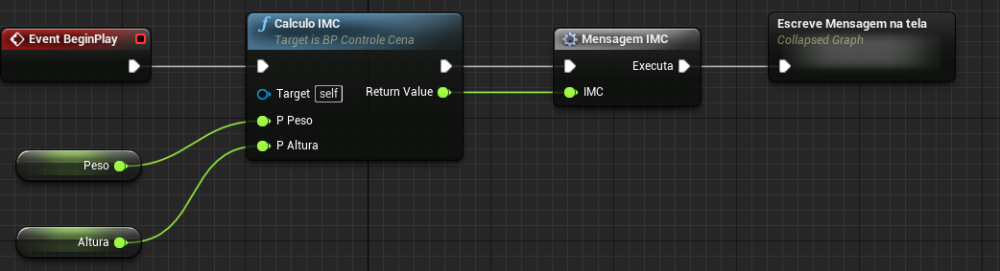

[Home](https://myerco.github.io/unreal-engine) / [Unreal](https://myerco.github.io/unreal-engine/unreal.html)

# Eventos, funções e macros
>1. [Conceito](#1)
>    1. [Programação Orientada a Objetos](#11)
>    1. [Métodos](#12)
>    1. [Funções](#13)
>1. [*Collapse Nodes*](#1);
>1. Eventos;
>1. Eventos customizados;
>1. Entrada de eventos;
>1. Funções;
>1. Funções com parâmetros e saída;
>1. Macros;

<a name="1"></a>
## 1. Conceito
Para entender melhor a estrutura de programação que representa a construção de eventos e funções vamos abordar alguns conceitos de programação.

<a name="11"></a>
## 1.1 Programação Orientada a Objetos  
Um método é um procedimento ou função em Conceitos de **Programação Orientada a Objetos**. Considerando que uma função é um grupo de código reutilizável que pode ser usado em qualquer parte do programa. Isso ajuda na necessidade de escrever o mesmo código repetidamente. Ajuda os programadores a escrever códigos modulares.

<a name="12"></a>
## 1.2 Métodos
Um método também funciona da mesma forma que o da função.  
Um método é definido dentro de uma classe. Por exemplo: main () em Java  
Um método pode ser privado, público ou protegido.
O método é invocado apenas por sua referência / objeto. Por exemplo: se a classe tem *obj* como um nome de objeto, o método é chamado por:
obj.method ();  
Um método é capaz de operar em dados que estão contidos na classe.    
Cada objeto tem seu próprio método que está presente na classe.

<a name="13"></a>
## 1.3 Funções
Uma função é um bloco de instruções que recebe uma entrada específica, faz alguns cálculos e, finalmente, produz a saída.  
Uma função é definida independentemente. Por exemplo: main () em C ++  
Por padrão, uma função é pública.
Ele pode ser acessado em qualquer lugar em todo o programa.  
É chamado pelo próprio nome.  
Ele tem a capacidade de retornar valores, se necessário.
Se uma função for definida, ela será a mesma para todos os objetos criados.  

<a name="1"></a>
# Eventos (**Events**)
Os eventos são nós chamados a partir do código do jogo para iniciar a execução de uma rede individual dentro do *EventGraph*. Eles permitem que os *Blueprints* executem uma série de ações em resposta a certos eventos que ocorrem dentro do jogo, como quando o jogo começa, quando um nível é reiniciado ou quando um jogador sofre dano.

Os eventos podem ser acessados dentro do *Blueprints* para implementar novas funcionalidades ou para substituir ou aumentar a funcionalidade padrão. Qualquer número de eventos pode ser usado em um único *EventGraph*; embora apenas um de cada tipo possa ser usado.

- Evento de dano  no personagem


- Chamando o evento


### Evento e Métodos
Os métodos são procedimentos ou funções que realizam as ações próprias do objeto. Assim, os métodos são as ações que o objeto pode realizar. Tudo o que o objeto faz é através de seus métodos, pois é através dos seus métodos que um objeto se manifesta, através deles que o objeto interage com os outros objetos.  
**C++**
```cpp
class Actor {
  void BeginPlay()
  void Tick()
  void BeginOverlap()
  void Identificar delegate
}

class ExemploEventos : public Actor {

}
```

```cpp

void AProjeto::BeginPlay() {
  Super::BeginPlay();
}

void AProjeto::DestruaMundoNerd(World* mundo ) {
   destroy();
}

// Called every frame
void AProjeto::Tick(float DeltaTime)
{
	Super::Tick(DeltaTime);

}

```

# Funções (**functions**)
- Pedaços de código que retornam algum valor
para o programa que executou a chamada.
- São mini programas com as características de alocação de memória, estruturas internas de código e variáveis locais.
- Podem receber parâmetros externos.  
- Funções não suportam o nó **Delay** ou eventos de temporização.
- Funções podem ter ser replicadas
em jogos multiplayer.
- Não aceitam eventos customizados.

**C++**   
```cpp
// Função com parâmetros
void CalculoIMC(float pPeso, float pAltura) {
  // Variável local
  float resultado;
  resultado =  (pAltura * pAltura) / pPeso;
  return = resultado
}  
```
**Blueprint**   


## Macros
- São essencialmente código colapsado.
- São basicamente um modelo *Template* de código ou nós.
- Não suportam o nó **Delay**.
- Não aceitam eventos customizados.
- Não podem ser replicados em jogos multiplayer.

Exemplo:  
**C++**
```c++
  #define MIN(a,b) (((a)<(b)) ? a : b)

  std::cout << "The minimum is " << MIN(42, 8) << endl;
```

**Blueprint**


## Colapse Nodes
- Organização de código, escondendo nós da estrutura principal.
- Aceitam parâmetros de entrada e saída.  


## Executando a função e a macros  


***
## Referências
- [Best Practices](https://docs.unrealengine.com/en-US/Engine/Blueprints/BestPractices/index.html)
- [Managing complexity in Blueprints](https://www.unrealengine.com/en-US/blog/managing-complexity-in-blueprints?sessionInvalidated=true)
- [Events](https://docs.unrealengine.com/en-US/Engine/Blueprints/UserGuide/Events/index.html)
- [Methods vs. Functions in C++ with Examples](https://www.geeksforgeeks.org/methods-vs-functions-in-c-with-examples/)
