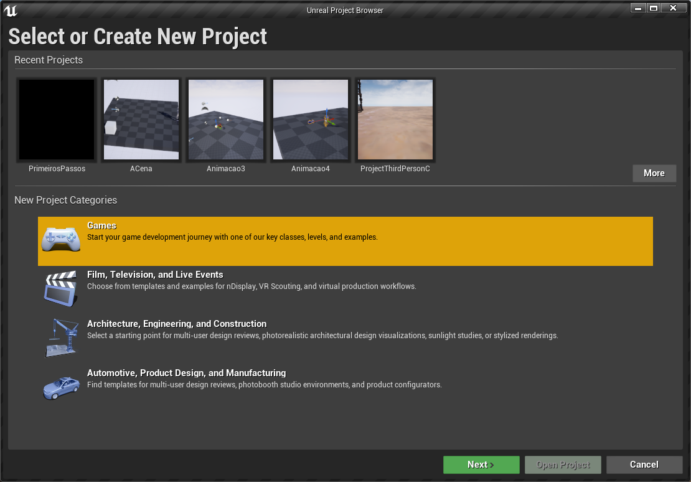
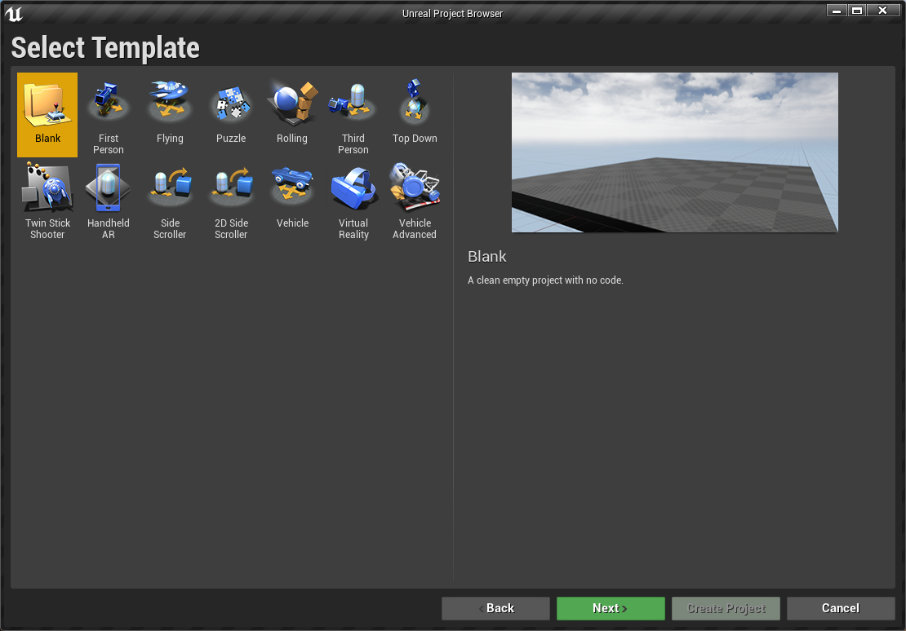
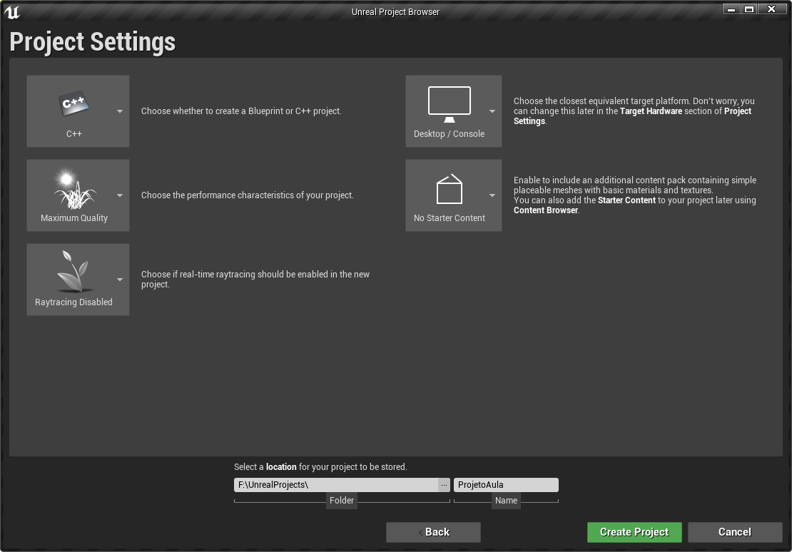
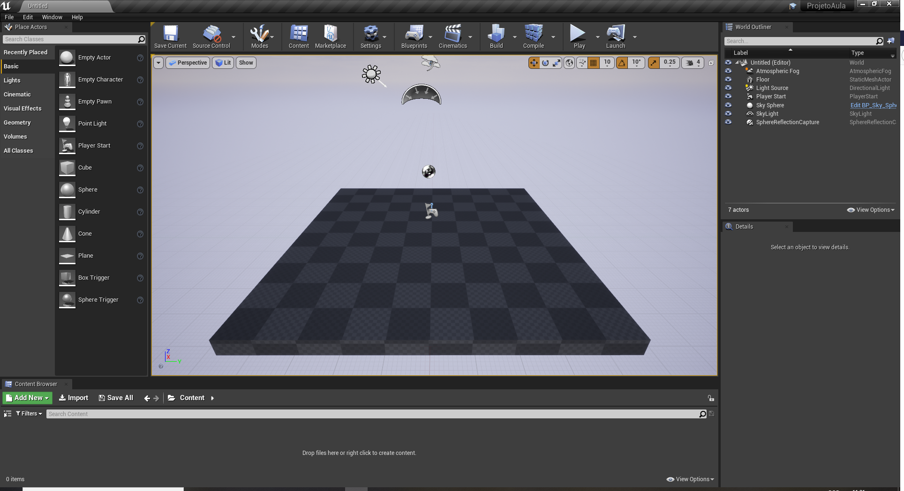
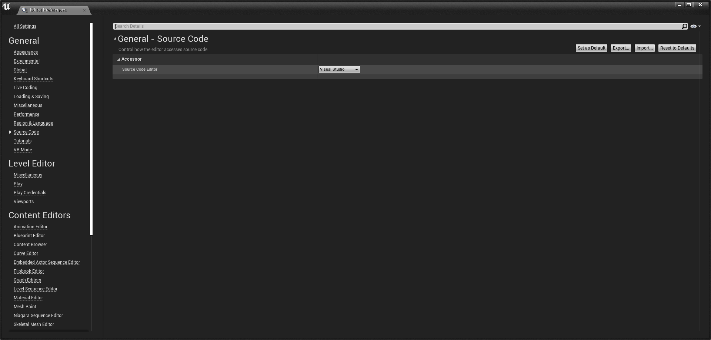

[Home](https://myerco.github.io/unreal-engine) / [Unreal](https://myerco.github.io/unreal-engine/unreal.html)
# Instalando
Neste capítulo vamos instalar, criar um projeto bem como entender como as pastas são organizadas.
Serão apresentados os seguintes tópicos:
> 1. [Instalando o Unreal e o Visual Studio](#1)
> 1. [Criando o projeto **ProjetoAula**](#2)
> 1. [Verificando as pastas criadas](#3)
> 1. [Configurando o editor de código](#4)

***
<a name="1"></a>
## 1. Instalando o Unreal e o Visual Studio
1. [Instalando o Uneal Engine](https://docs.unrealengine.com/en-US/GettingStarted/Installation/index.html)
1. Instalando os pacotes e o Visual Studio para programação com C++
  - [Visual Studio](https://visualstudio.microsoft.com/pt-br/?rr=https%3A%2F%2Fwww.google.com%2F)
  - [Unreal e Visual Studio](https://docs.unrealengine.com/en-US/Programming/Development/VisualStudioSetup/index.html)
  - Selecione os pacotes : Desenvolvimento para Desktop com C++ e Desenvolvimento de jogos com C++
***
<a name="2"></a>
## 2. Criando o projeto ProjetoAula
- Selecionando o tipo de projeto  


- Escolha um rojeto em branco (Blank)  
 

- Em configuração de projeto escolha C++ e *No Starter Content* e a pasta do projeto   


- Tela inicial  


***
<a name="3"></a>
## 3. Verificando as pastas criadas
Utilizando o *explorer* navegue até a pasta do projeto:
```sh
.vs
Binaries
Config
Content
Intermediate
Saved
Source
ProjetoAula.sln
ProjetoAula.uproject
```
- A pasta *Source* contém arquivos com código
fonte em **c++** e arquivo com extensão *uproject* é o principal arquivo do projeto.

- É recomendado que os arquivos e pastas devam ter um padrão de nomenclatura
para melhor organização do projeto. Abaixo o recomendado pelos desenvolvedores:  
[Estrutura do diretório](https://docs.unrealengine.com/en-US/Engine/Basics/DirectoryStructure/index.html).
- Os diretórios abaixo podem ser removidos pois podemos construir a qualquer momento
quando compilar o projeto.
```sh
Binaries
Build
Intermediate
Saved
```
- Para recompilar o projeto e recriar os arquivos siga os seguintes passos utilizando o
explorer no Windows:
  1. Apague as pastas *Binaries, Build, Intermediate* e *Saved*;
  1. Click com botão direito do mouse no arquivo **ProjetoAula.uproject**;
  1. Escolha a opção **Generate Visual Studio project files**;
  1. Aguarde o termino da operação e abra o projeto;

***
<a name="4"></a>
## 4. Configurando o editor de código
- Para configura o editor de código **c++** acesse ```Menu->Editor Preferences->General``` e ``Source Code`` e escolha **Visualstudio**.

  
