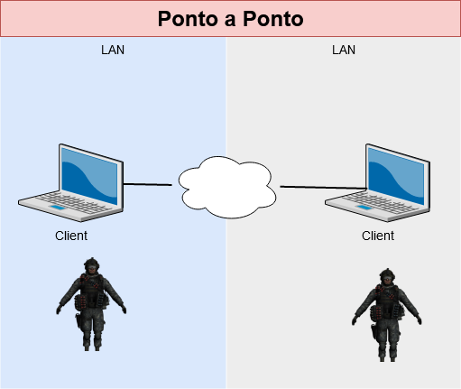

[Home](https://myerco.github.io/unreal-engine) / [Unreal](https://myerco.github.io/unreal-engine/unreal.html)

# Multiplayer

Neste capítulo vamos implementar e organização elementos para conexão, replicação e
inicialização de um jogo multiplayer.

Vamos implementar os seguintes elementos :

1. Criando sessões.
1. Conectando usando IP.
1. Buscando sessões ativas
1. Procurando outros servidores
1. Instalar o SteamSDK.
1. VPN para compartilhamento de conexões

<a name="ind"></a>
## Índice

> 1. [Tipos de Conexão](#1)
> 1. [Configurando o projeto](#2)
> 1. [Menu](#3)
> 1. [Executando o projeto](#4)

<a name="1"></a>
## 1. Tipos de Conexão
- A conexão somente é possível com versões do mesmo programa.
- Cliente e Servidor: Programa cliente se conecta através de uma rede a um programa servidor;
  - Servidor pode ficar somente no atendimento ou pode realizar tarefas
  - Diagrama   
        
  - Ponto a Ponto: Programa cliente se conecta com outro computador ouvindo a rede
    - Os computadores ficam operantes;
    - Diagrama  
    

1. Implementação no jogo
- Servidor (Host) - Jogo em modo escuta **listen**
- Cliente - Jogo tem que conectar em um outro através de um endereço de rede
- Busca servidores
- Exemplo:  
Servidor
  ```sh
  C:\Program Files\UE_4.17\Engine\Binaries\Win64\UE4Editor.exe
  C:\PATH_TO_MY_PROJECT.uproject /Game/ThirdPersonCPP/Maps/ThirdPersonExampleMap -server -log -port=8003
  ```
cliente
  ```sh
  C:\Program Files\UE_4.17\Engine\Binaries\Win64\UE4Editor.exe
C:\PATH_TO_MY_PROJECT.uproject 192.168.1.90:8003 -game -log
  ```
<a name="2"></a>
## 2.Configurando o projeto
- Implementação das estruturas de controle do game   

- Criando o GameInstance  

- Implementando o evento **OpenMenu**  

- Configurando o projeto com GameInstance  


<a name="3"></a>
## 3. Menu
- Implementando os mapas  

- Implementando a lógica de chamada do menu no level **Menu** utilizando o **Open Level Blueprints**  

- Widget WBP_Menu


- Implementar os seguintes elementos no diagrama  


- Implementar os eventos para instanciar uma conexão   


- Conectar ao servidor utilizando IP  


<a name="4"></a>
## 4. Executando o jogo
- Executando o jogo   

- Adicionar dois **PlayerStart**  


***

Referências

[Getting Started with Unreal Multiplayer in C++](https://www.unrealengine.com/en-US/tech-blog/getting-started-with-unreal-multiplayer-in-cpp?sessionInvalidated=true)   
[Multiplayer Prorgamming Quick Start](https://docs.unrealengine.com/en-US/Gameplay/Networking/QuickStart/index.html)   
[Networking Guide](http://www.zachmetcalfgames.com/wp-content/uploads/2014/12/zmg_Unreal_Networking_Guide.pdf)   
[Multiplayer Damage and Health System in Unreal Engine 4](https://couchlearn.com/multiplayer-damage-and-health-system-in-unreal-engine-4/)  
