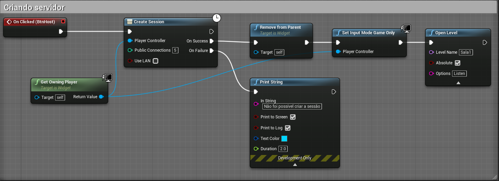

[Home](https://myerco.github.io/unreal-engine) / [Estrutura](https://myerco.github.io/unreal-engine/1-estrutura.html)
# Multiplayer

1. Conexão
  - Cliente e Servidor: Programa cliente se conecta através de uma rede a um programa servidor;
    - Servidor pode ficar somente no atendimento ou pode realizar tarefas
  - Ponto a Ponto: Programa cliente se conecta com outro computador ouvindo a rede
    - Os computadores ficam operantes;
  - A conexão somente é possível com versões do mesmo programa.
1. Implementação no jogo
  - Servidor (Host) - Jogo em modo escuta **listen**
  - Cliente - Jogo tem que conectar em um outro através de um endereço de rede
  - Busca servidores
  - Exemplo:  
  Servidor
  ```sh
  C:\Program Files\UE_4.17\Engine\Binaries\Win64\UE4Editor.exe
  C:\PATH_TO_MY_PROJECT.uproject /Game/ThirdPersonCPP/Maps/ThirdPersonExampleMap -server -log -port=8003
  ```
  cliente
  ```sh
  C:\Program Files\UE_4.17\Engine\Binaries\Win64\UE4Editor.exe
C:\PATH_TO_MY_PROJECT.uproject 192.168.1.90:8003 -game -log
  ```
1. Implementando o menu
  - &&
1. GameInstance.





1. Importando o manequim terceira pessoa.
1. Criando sessões.
1. Conectando usando IP.
1. Buscando sessões ativas
1. Procurando outros servidores
1. Instalar o SteamSDK.
1. VPN para compartilhamento de conexões
