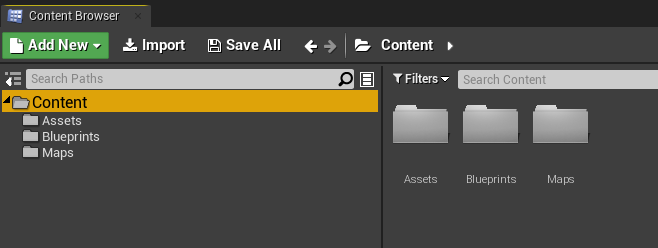
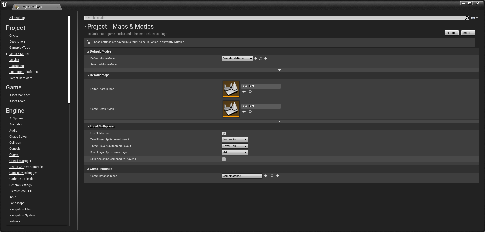

[Home](https://myerco.github.io/unreal-engine) / [Unreal](https://myerco.github.io/unreal-engine/unreal.html)

# Organizando o projeto
Neste capitulo vamos organizar o projeto do > *ProjetoAula* e alguns elementos da interface.

## Índice
> 1. [Criando pastas de trabalho](#1)
> 1. [Level e Inicialização](#2)
> 1. [Preparando o projeto](#3)  
> 1. [Pastas de trabalho e nomenclatura](#4)
> 1. [Configurando o ícone do projeto](#5)


<a name="1"></a>
## 1. Criando pastas de trabalho
- Na aba *Content Browser* utilizando botão direito do mouse clique em *New Folder* e crie as seguintes pastas:   




<a name="2"></a>
## 2. *Level* e Inicialização
Para que um *level* ou mapa seja carregado ao iniciar o projeto siga os seguintes passos:  
1. Salve o *level* atual na pasta Maps **File->Save Current** com o nome LevelTest
1. Para configurar a inicialização do projeto utilizando o LevelTest.
	- Edit->Project Settings
	- Maps & Modes
	- Edit Startup Level : LevelTest
	- Game default Map : LevelTest  

	

## 3. Pastas de nomenclatura
Para um maior gerenciamento podem ser definidas pastas com nomenclaturas adequadas ao projeto, abaixo vamos relacionar algumas sugestões.

1. Sugestão 1
```
|-- Content
		|-- Blueprints
		|		|-- Core
		|		|-- Characters
		|		|-- Elements
		|-- Assets
		|		|-- Images
		|		|-- StructureMesh
		|		|-- Materials
		|-- Maps
		|		|-- Level1
		|-- UI
		|-- Animations
```

1. Sugestão 2
```
|-- Content
		|-- ProjetoAula
				|-- Art
				|		|-- Industrial
				|		|		|-- Ambient
				|   |		|-- Machinery
				|  	|		|-- Pipes
			  |		|-- Nature
			  |  	|		|-- Ambient
			  |  	|		|-- Foliage
			  |  	|		|-- Rocks
			  |  	|		|-- Trees
			  |  	|-- Office
				|-- Characters
				|   |-- Bob
				|   |-- Common
				|   |   |-- Animations
				|   |   |-- Audio
				|   |-- Jack
				|   |-- Steve
				|   |-- Zoe						
				|-- Core
				|		|-- Characters
        |		|-- Engine
        |		|-- GameModes
        |		|-- Interactables
        |		|-- Pickups
        |		|-- Weapons
				|-- Maps
				|	 	|-- Level1
				|	 	|-- Level2
```

<a name="4"></a>
## 4. Configurando o ícone do projeto


***
## Referências
- [Directory Structure](https://docs.unrealengine.com/en-US/Engine/Basics/DirectoryStructure/index.html)  
- [Editor Preferences](https://docs.unrealengine.com/en-US/Engine/UI/index.html)  
- [Style Guide](https://github.com/Allar/ue4-style-guide/blob/master/README.md)  
- [Controles de navegação](https://docs.unrealengine.com/en-US/Engine/UI/LevelEditor/Viewports/ViewportControls/index.html)
