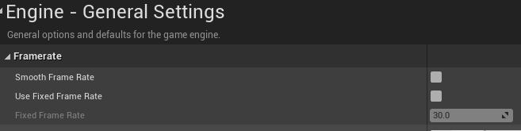
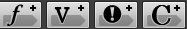
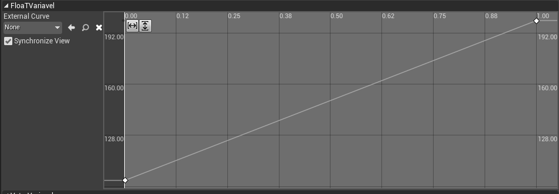
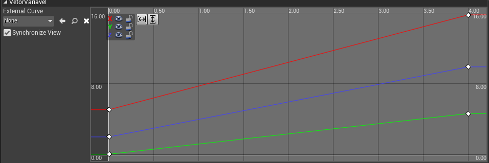
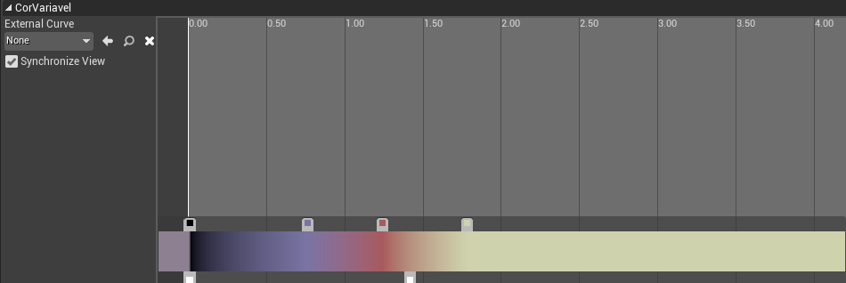
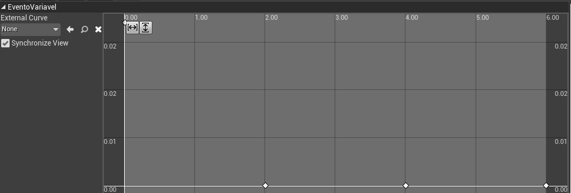
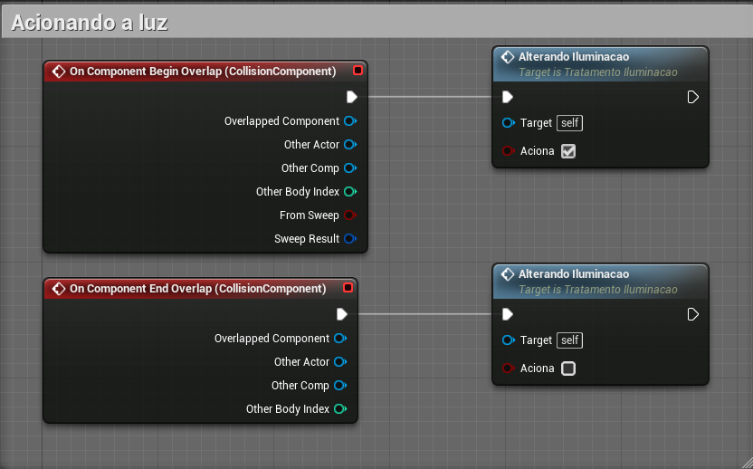
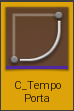
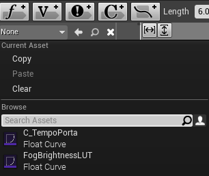

[CafeGeek](https://myerco.github.io/unreal-engine)  / [Desenvolvimento de jogos utilizando Unreal Engine 4](https://myerco.github.io/unreal-engine/unreal.html)

# Tempo e espaço
Neste capítulo será apresentados os elementos de controle de frames e sua execução.

## Índice
>1. [Delta time](#1)
>1. [Lista de comandos do console](#2)
>1. [Delta seconds](#3)
>     1. [Tabela de velocidade](#31)
>     1. [Utilizando o Delta seconds](#32)
>     1. Fixando o FPS do projeto](#33)
>1. [Timeline](#4)
>     1. [Utilizando variáveis no Timeline](#41)
>     1. [Acionando o evento para alterar a iluminação](#42)
>     1. [Funções Blueprint para tratamento](#43)
> 1. [Abrindo portas deslizando](#5)
> 1. [Abrindo portas girando](#6)
> 1. [Curves](#7)   
> 1. [Velocidade](#8)   

<a name="1"></a>
## 1. Delta Time
É o tempo entre cada frame.  
Frame: Um quadro ou imagem apresentada, uma animação é composta por vários frames.

**Exemplo**

|  |  |  |  |  |  |  |  |  |  | |
|:-:|-|-|-|-|-|-|-|-|-|-|
|Frames  | 1 | 2 | 3 | 4 | 5 | 6 | 7 | 8 | 9 | 10 |
| Delta | 1 | 2 | 3 |4  | 5 | 6 | 7 | 8 | 9 |  |

- 10 Fps = 10 frames a cada segundo.
1 segundo / 9 = 0,1 segundo ou 100ms.
- 100 FPS = 100 frames a cada segundo
1 segundo /99 = 0,01 segundo ou 10ms
- 30 FPS = 1/29 , 0.034 34ms
- 60 FPS = 1/59 , 0.017 17ms

<a name="2"></a>
## 2. Lista de comandos do console
Vamos habilitar o console de comandos para verificar e alterar o *FPS* do jogo.  

1. Menu Editor preferences->Open.   
  

1. Apresenta o valor de FPS.

```
stat ftps
```
1. Altera o valor de FPS para 100
```
t.MaxFPS 100
```
1. Exibe informações de desempenho para os threads Frame, Game, Draw, GPU, RHIT e DynRes do projeto.
```
stat unit
```
1. Comando->stat game
```
stat game
```

<a name="3"></a>
## 3. Delta seconds
Delta Seconds é a quantidade de tempo decorrido desde o último evento Tick. Ao multiplicar seu deslocamento por Delta Seconds, seu movimento será independente da taxa de quadros.
Por exemplo, seu peão tem uma velocidade máxima de 100. Se um segundo tivesse se passado desde o último tique de evento, seu peão moveria todas as 100 unidades. Se meio segundo tivesse passado, ele moveria 50 unidades.

<a name="31"></a>
### 3.1 Tabela de velocidade
Delta seconds = Intervalo entre os quadros.

|Distância  | Velocidade | Distância/Velocidade |  FPS | Delta Seconds | Y |
|:-:|-|-|-|-|-|
|100  | 10 | 10 | 100 | 0,1 | 1 |
|100  | 10 | 10 | 60 | 0,166 | 1,6 |
|100  | 10 | 10 | 30 | 0,333 | 3 |
|100  | 10 | 10 | 20 | 0,5 | 5 |

<a name="32"></a>
### 3.2  Utilizando o **Delta seconds**
Vamos controlar o movimento do objeto independente do *FPS*.  


- **Distancia** - Valor = 100
- **Velocidade** - Valor = 10
- O resultado esperado é que mesmo com um *FPS* baixo o movimento ainda se mantem uniforme.

<a name="33"></a>
### 3.3 Fixando o *FPS* do projeto
Menu Project settings->Use fixed frame rate.  



<a name="4"></a>
## 4. Timeline
Os nós da linha de tempo são nós especiais dentro de Blueprints que permitem que uma animação simples baseada em tempo seja projetada e reproduzida rapidamente com base em eventos no jogo. As linhas do tempo são como sequências de matinê simples, pois permitem que valores simples sejam animados e que eventos sejam disparados ao longo do tempo. Eles podem ser editados diretamente dentro do editor Blueprint clicando duas vezes na Linha de tempo na guia Gráfico ou na guia Meu Blueprint. Eles são especificamente construídos para lidar com tarefas simples e não cinematográficas, como abrir portas, alterar luzes ou executar outras manipulações centradas no tempo para atores em uma cena.

<a name="41"></a>
### 4.1 Utilizando variáveis no Timeline
Para este exemplo vamos utilizar um objeto *Lampada* do tipo **Light Component**  para apresentar a estrutura de nó *TratamentoLuz* do tipo **TimeLine**.


- Variáveis   
  

  - FloatVariavel - Controla a intensidade da luz durante o tempo 1.   
  
  - Vetorvariavel - Altera o valor das coordenadas durante o tempo 4s.    
    
  - CorVariavel - Altera as cores da luz conforme o tempo passa.  
    
  - EventoVariavel - Dispara um evento no tempo 2,4 e 6.   
  

<a name="42"></a>
### 4.2 Acionando o evento para alterar a iluminação


<a name="43"></a>
### 4.3 Funções Blueprint para tratamento
- **SetLooping**
- **SetTimeLength**
- **GetTimeLength**
- **GetPlaybackPosition**
- **Auto play**
- **Ignore time dilation**
- **Set timer by event e clear timer**
- **SetTimerbyEvent**
- **ClearAndInvalidateTimerByHandle**
- **SetTimerbyFunction**

<a name="5"></a>
## 5 Abrindo portas deslizando
Neste exemplo vamos implementar um movimento no eixo Y de abertura de uma porta.
1. Adicionando o elemento Movimentando (**timeline**) e alerando a posição do objeto.


1. **Movimentando** utiliza a variável Movimento do tipo *Vector*. Somente o valor de Y é alterado.


1. Salvamos a posição inicial do objeto.


<a name="6"></a>
## 6 Abrindo portas girando
Neste exemplo vamos implementar um movimento no eixo Z, girando e abrindo a porta.
1. Utilizamos a função **MakeRotator**.


1. Movimentando utiliza a variável *Angulo* do tipo *Vector*.


1. Acionando a porta.


<a name="7"></a>
## 7. Curves
Podemos criar um tipo de objeto **Curve** para que possamos utilizar em vários Blueprints.

1. Miscelanios->Curve.


1. Objeto C_TempoPorta.



1. Associando o objeto **C_TempoPorta** a **Movimentando**.



- **SetVectorCurve**

<a name="8"></a>
## 8. Velocidade
Exemplo de calculo de velocidade.  


***
## Referências
- [Delta timing](https://en.wikipedia.org/wiki/Delta_timing)
- [Understanding Delta time in Games](https://dev.to/dsaghliani/understanding-delta-time-in-games-3olf)
- [How to use delta time](https://answers.unrealengine.com/questions/38798/how-to-use-delta-time.html)
- [Tutorial enentendo o que é o deltatime](https://www.fabricadejogos.net/posts/tutorial-entendo-o-que-o-deltatime/)
- [fps vs capacidade humana](http://teclab.net.br/fps-vs-capacidade-humana/)
-[Timelines](https://docs.unrealengine.com/en-US/ProgrammingAndScripting/Blueprints/UserGuide/Timelines/index.html)

***
## Tags
[Blueprint](https://myerco.github.io/unreal-engine/modulo1/blueprint.html), [Unreal Engine](https://myerco.github.io/unreal-engine/unreal.html), [CafeGeek](https://myerco.github.io/unreal-engine/)
