[Home](https://myerco.github.io/unreal-engine) / [Desenvolvimento de jogos utilizando Unreal Engine 4](https://myerco.github.io/unreal-engine/unreal.html)

# Temo e espaço
Neste capítulo será apresentados os elementos de controle de frames e sua execução.

## Índice
> 1. [Delta time](#1)
> 1. [Causando dano com *Set Timer By Event*](#1)
> 1. [*Time Line*](#1)
> 1. [FPS e *Delta Time*](#1)
> 1. [Configurando o *Frame Rate*](#1)
> 1. [Vetores](#1)
> 1. [Distância, Direção e movimentação](#1)
> 1. [Ajustando o *Delta Time*](#1)   

<a name="1"></a>
## 1. Delta Time
É o tempo entre cada frame.  
Frame: Um quadro ou imagem apresentada, uma animação é composta por vários frames.

### Exemplos 1 Frames:

|  |  |  |  |  |  |  |  |  |  | |
|:-:|-|-|-|-|-|-|-|-|-|-|
|Frames  | 1 | 2 | 3 | 4 | 5 | 6 | 7 | 8 | 9 | 10 |
| Delta | 1 | 2 | 3 |4  | 5 | 6 | 7 | 8 | 9 |  |

- 10 Fps = 10 frames a cada segundo.
1 segundo / 9 = 0,1 segundo ou 100ms.
- 100 FPS = 100 frames a cada segundo
1 segundo /99 = 0,01 segundo ou 10ms
- 30 FPS = 1/29 , 0.034 34ms
- 60 FPS = 1/59 , 0.017 17ms

### Exemplos 2 Espaço:

|  |  |  |  |  |  |  |  |  |  | |
|:-:|-|-|-|-|-|-|-|-|-|-|
|Centímetros  | 1 | 2 | 3 | 4 | 5 | 6 | 7 | 8 | 9 | 10 |
|Segundos | 1 | 2 | 3 |4  | 5 | 6 | 7 | 8 | 9 |   |

- 1 cm/s = Total: 10s

|  |  |  |  |  |  |  |  |  |  | |
|:-:|-|-|-|-|-|-|-|-|-|-|
|Centímetros  | 1 | 2 | 3 | 4 | 5 | 6 | 7 | 8 | 9 | 10 |
|Frames | 1 | 2 | 3 |4  | 5 | 6 | 7 | 8 | 9 | 10 |

- 1 cm/frame = total: ?

- 100FPS = 1 cm/10ms = total:0,1s
- 10FPS = 1 cm/100ms = total:1s

<a name="3"></a>
## 3. Lista de comandos do console
Vamos habilitar o console de comandos para verificar e alterar o *FPS* do jogo.
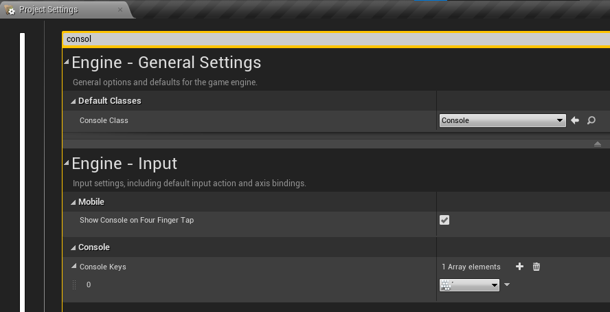
- Menu Editor preferences->Open

1. Apresenta o valor de FPS
```
stat ftps
```
1. Altera o valor de FPS para 100
```
t.MaxFPS 100
```
1. Exibe informações de desempenho para os threads Frame, Game, Draw, GPU, RHIT e DynRes do projeto.
```
stat unit
```
1. Comando->stat game
```
stat game
```

<a name="3"></a>
## 3. Delta seconds
Delta Seconds é a quantidade de tempo decorrido desde o último evento Tick. Ao multiplicar seu deslocamento por Delta Seconds, seu movimento será independente da taxa de quadros.
Por exemplo, seu peão tem uma velocidade máxima de 100. Se um segundo tivesse se passado desde o último tique de evento, seu peão moveria todas as 100 unidades. Se meio segundo tivesse passado, ele moveria 50 unidades.
Delta seconds = Intervalo entre os quadros.

### 2.1  Utilizando o **Delta seconds**
Vamos controlar o movimento do objeto independente do *FPS*.  
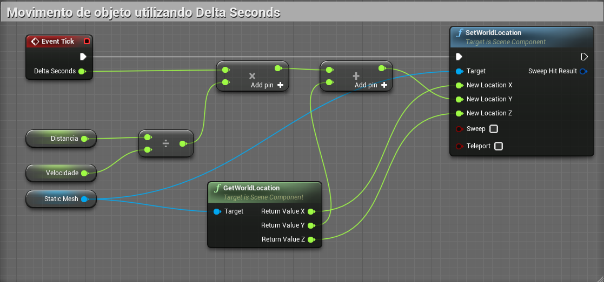
- **Distancia** - Valor = 100
- **Velocidade** - Valor = 10
- O resultado esperado é que mesmo com um *FPS* baixo o movimento ainda se mantem uniforme.

### 2.2 Fixando o *FPS* do projeto
- Project settings->Use fixed frame rate

<a name="3"></a>
## 3. Timeline

<a name="31"></a>
### 4.1 Utilizando variáveis no Timeline
- Float variável
- Vetor variável
- Cor variável
- Evento variável
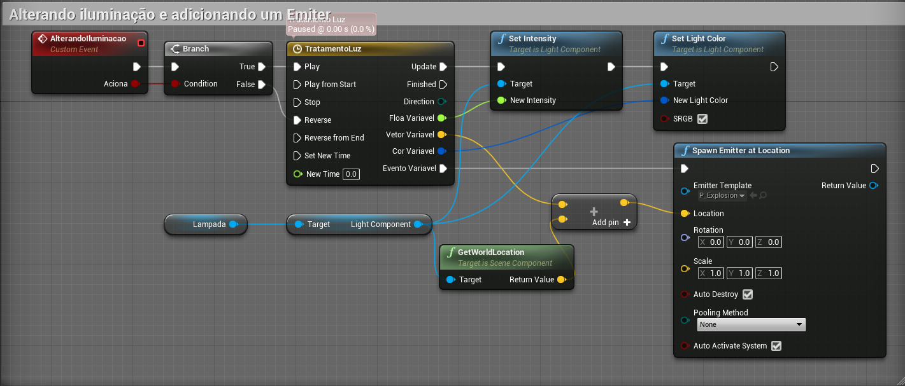

- Loop BP->TimeLine->SetLooping
- Length BP->Timeline->SetTimeLength
  - >BP->Timeline->GetTimeLength
- 5.Playback Position
  - ->BP->Timeline->GetPlaybackPosition
- 6.Auto play
- 7.Ignore time dilation
- 8.Set timer by event e clear timer
  - ->BP->SetTimerbyEvent
  - ->BP-ClearAndInvalidateTimerByHandle
- 9.Set timer by function e Clear timer
  - ->BP->SetTimerbyFunction

<a name="42"></a>
### 4.2 Abrindo portas deslizando
1. Adicionando o elemento Movimentando (**timeline**) e alerando a posição do objeto.
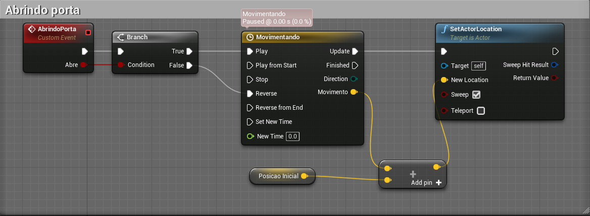

1. Movimentando utiliza a variável Movimento do tipo *Vector*. Somente o valor de Y é alterado.
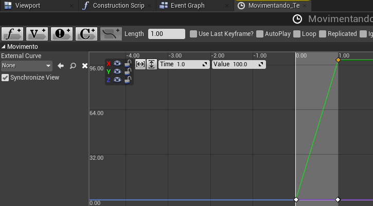

1. Salvamos a posição inicial do objeto.
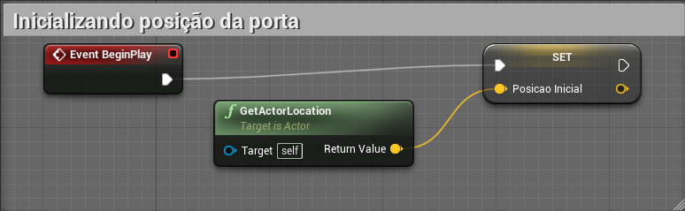

<a name="43"></a>
### 4.3 Abrindo portas girando
1. Utilizamos a função **MakeRotator**
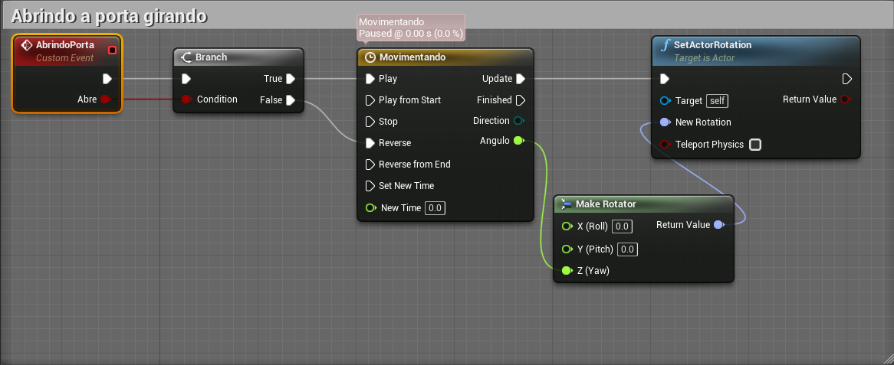

1. Movimentando utiliza a variável *Angulo* do tipo *Vector*.
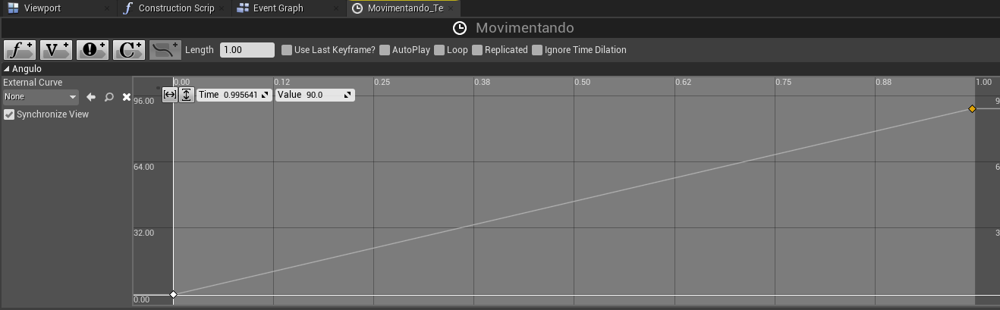

1. Acionando a porta
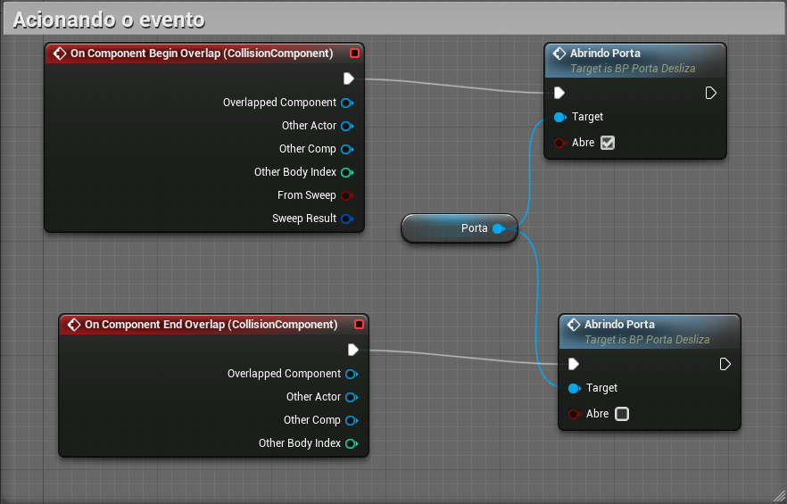

<a name="6"></a>
## 6. Curves
- Miscelanios->Curve  
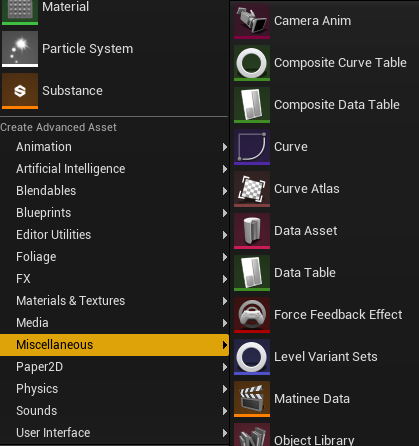

- ->Time->External->Curve
- ->BP->Timeline->SetVectorCurve

<a name="7"></a>
## 7. Custon Curves

<a name="8"></a>
## 8. Velocidade
- ->BP->Event Tick->PrintString(delta seconds)
- ->BP ->Get World Delta Seconds
- 12. Tick - movimento
- 13. Tick - velocidade constante
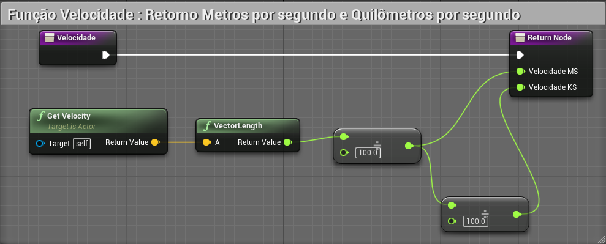

***
## Referências
- [Delta timing](https://en.wikipedia.org/wiki/Delta_timing)
- [Understanding Delta time in Games](https://dev.to/dsaghliani/understanding-delta-time-in-games-3olf)
- [How to use delta time](https://answers.unrealengine.com/questions/38798/how-to-use-delta-time.html)
- [Tutorial enentendo o que é o deltatime](https://www.fabricadejogos.net/posts/tutorial-entendo-o-que-o-deltatime/)
- [fps vs capacidade humana](http://teclab.net.br/fps-vs-capacidade-humana/)
-[Timelines](https://docs.unrealengine.com/en-US/ProgrammingAndScripting/Blueprints/UserGuide/Timelines/index.html)
