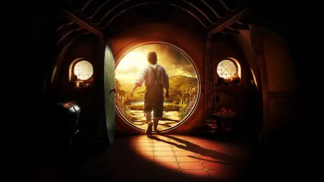
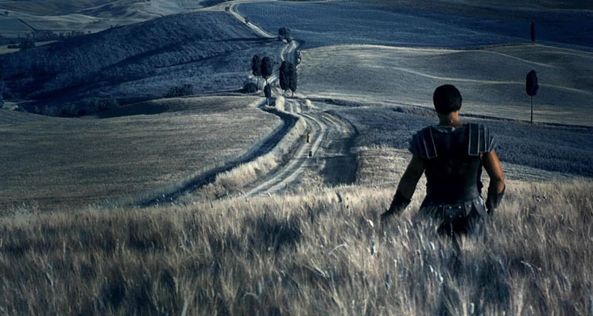
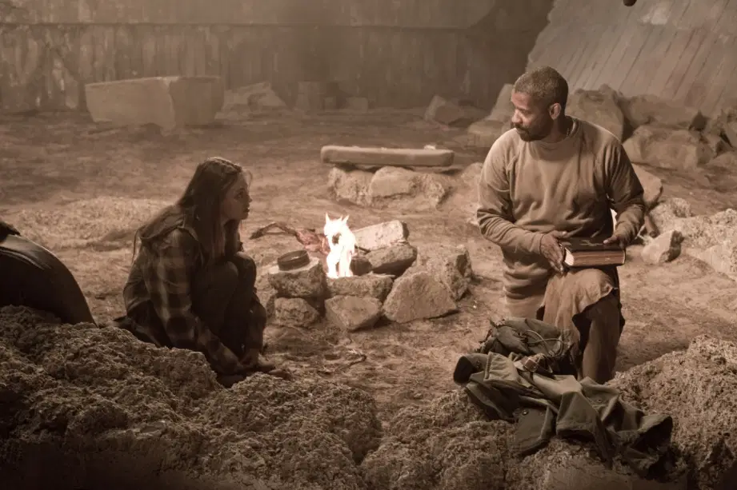

# Me conta uma História

1. A Jornada do herói ainda é válida?
  
Sim, porque passamos por ela todos os dias e nos identificamos com o que passamos ou mesmo sendo um desejo.
  - Acordamos com uma percepção das coisas
  - Somos chamados para a escola, trabalho onde teremos novos desafios
  - Um mestre ou tutor se apresenta para nos guiar
  - Os aliados e amigos que nos ajudam na jornada
  - Amamos e brigamos durante o percurso;
  - Morremos, no final algumas ideias e crenças morrem dentro da gente.
  - Renascemos novamente com um nova percepção.  

No final, será combinação e construção desses passos o diferencial da sua história.

[Jornada do Herói: as 12 etapas de Christopher Vogler e Joseph Campbell para contar uma história impecável!](https://comunidade.rockcontent.com/jornada-do-heroi/)

# 1. O que te motiva?
1. Vingança
1. Salvar a amada ou amigo
1. Sobrevivência
1. Salvar o mundo

## 1. Vingança
### 1. Gladiador
A busca pela vingança fez o personagem trilhar o caminho cegamente e violentamente.
  

A vingança tem que ser justificada no roteiro, o mau é sempre mau e faz coisas de vilão.

## 1. Salvar a amada ou amigo
### 1. O  Livro de Eli
Salvando um amigo e a si mesmo.  
  
O personagem central só consegue enxergar o seu real caminho quando percebe que ele não fez o que o livro ensinava, ajudar o outro e se conectar com alguém.    
Cumprir a sua missão o tinha transformado em **um** individuo alheio aos problemas dos outros, nas palavras dele "Siga seu caminho, não é da sua conta"  
- [IMDB **6,9**](https://www.imdb.com/title/tt1037705/)
- [Metacritic **53**](https://www.metacritic.com/movie/the-book-of-eli)
