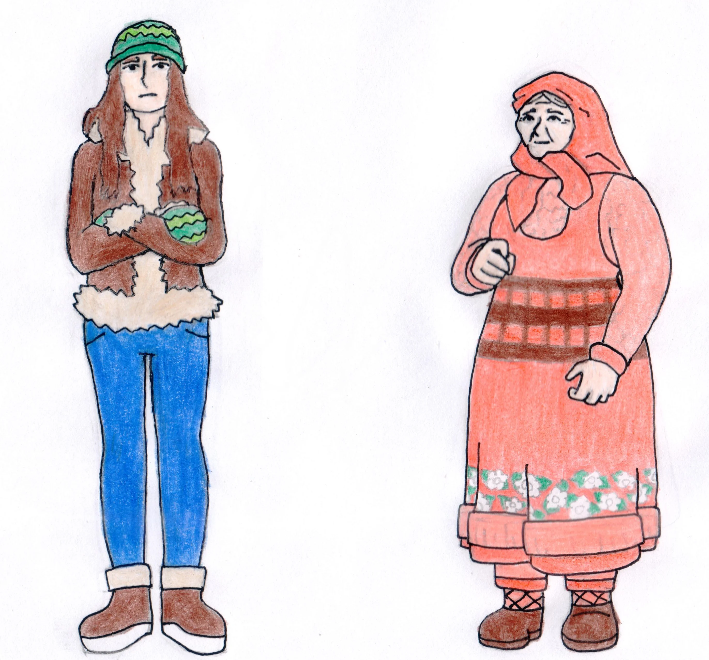
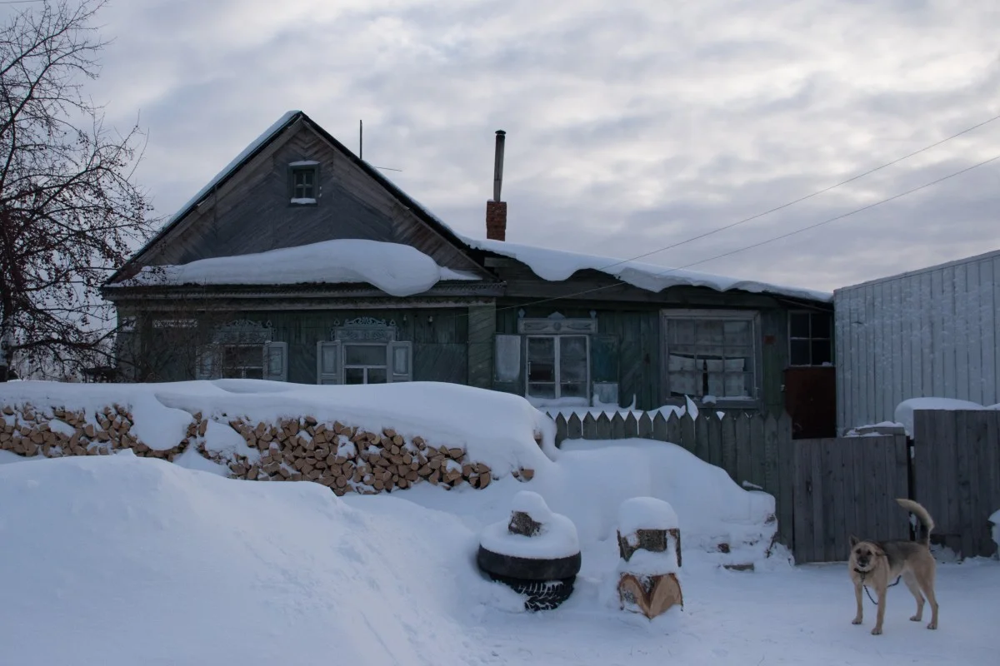

## Preceitos:
- A casa é transportada por um mecanismo do 2o andar.
- Para poder transportar a casa, todas as portas e janelas pro exterior devem ser fechadas.
- Até agora, todos as cenas de crime encontradas já tinham sido alteradas pela polícia (coleta de evidência, transporte do corpo etc.).

## A história

- A protagonista transporta a casa para a Sibéria. Há um ruído no andar inferior. A protagonista desce para investigar.
- Lá, descobre que uma janela estava aberta, e um copo que estava na mesa foi derrubado pelo vento.
- Ela fecha a janela para parar o vento frio, e vê uma senhorinha andando pela neve, que cai.
Ela procura e veste roupas de frio, e sai da casa para ajudá-la.
- Quando ela abre a porta da frente de novo, a casa mágica não está mais lá. É o casebre da senhorinha, que entra feliz com a chegada da "neta".
- A senhorinha confundiu a protagonista com a própria neta. A protagonista segue na onda.

Este incidente revela pro jogador que, ao chegar na Sibéria, alguém entrou na casa e a transportou para outro local.

- A senhorinha deposita as coisas que carregava na mesa, olha pra protagonista e a chama para conversar à frente da lareira.
- Ela começa a discutir sobre a família, dizendo que é uma imensa falta de respeito a terem ignorado por tantos anos. Segue dizendo que é muito grata pela neta continuar a visitando periodicamente.
- Ela oferece presentes e comida, mas nota que o fogo está ficando baixo. Pede para a "neta" buscar madeira, pela porta dos fundos.
- Ao lado da pilha de madeira, a cena do crime. O corpo da verdadeira neta, assassinada recentemente. A protagonista pega a lenha e traz para dentro.

Isso insinua ao jogador que o assassino estava com a protagonista e aproveitou a viagem à Sibéria para cometer esse assassinato. A protagonista sente culpa.

Analisando a cena do crime, o jogador pode descobrir como o assassino mata (mortes rápidas e silenciosas), descobrir a marca que deixa. Tudo em uma cena não alterada.

A senhorinha está preparando comida. O jogador pode continuar na onda, fingindo ser a neta, ou revelar para a senhora que a verdadeira neta foi assassinada. De qualquer forma, a certo ponto o jogador deve revelar que a neta não irá mais visitar, e enterrar o corpo:

- Contar que ela (a "neta") não pode mais visitar, e esconder o cadáver para a senhorinha não o encontrar;
- Contar a situação da neta, e fazer um enterro próprio para a neta.

Existem vários desenrolares do diálogo, mas não são relevantes para a história geral (apenas para as emoções do jogador).

O que aconteceu fora da câmera?

- A protagonista transportou a casa, o que assustou o assassino que estava no andar de baixo.
- No susto, o assassino derrubou um copo, e escapou pela janela.
- Fora da casa, encontrou a neta, e a matou. O tempo da protagonista encontrar as roupas de frio foi mais que o suficiente.
- Enquanto a protagonista ajudava a senhorinha,
- O assassino retornou à casa, e a transportou para outro lugar.

---
## EXT. RUA FRENTE DA CASA LAB4

<small><a style="text-decoration:none;color:#86848b;" target="_blank" href="https://www.homify.com.br/projetos/198516/residencia-avs"> Residência AVS, A/ZERO Arquitetura </a>por<a style="text-decoration:none;color:#86848b;" target="_blank" href="https://www.homify.com.br/profissionais/618107/a-zero-arquitetura" > A/ZERO Arquitetura </a></small>

A casa LAB4 fica localizada em uma esquina, entre ruas pouco movimentas em um bairro afastado da cidade.

Algo dentro do imóvel permite que ele e as pessoas que entram na casa, se desloquem pelo tempo e espaço.

O mecanismo que faz com que a casa se transporte levando seus ocupantes para viagens temporais é um mistério, mas aparentemente o mecanismo e acionado quando todas as janelas estão fechadas.

A casa foi palco de uma investigação policial, um crime foi cometido dentro dela.

>**DESCONHECIO (V.O)**
>
> Faixas policiais sinalizam para ninguém entrar na casa, pois ainda estão investigando o crime, não encontraram nada, as pistas já não estão mais lá.

Uma figura feminina se aproxima a passos firmes, ignorando as faixas e avisos que estavam no local entra na casa.

O mecanismo de transporte é acionado quando ela fecha a porta principal , a casa é transportada para a Sibéria.

>**DESCONHECIO (V.O)**
>
> Sibéria?

## INT. DENTRO DA CASA LAB4

A mulher entra na casa e começa a basculhar todos os quartos, no andar de cima estão localizados os quartos então a mulher desconhecida demora mais tempo procurando algo.

Há um ruído no andar inferior, a mulher desce para investigar.

Lá, descobre que uma janela estava aberta e um copo quebrado de vidro no chão, aparentemente estava na mesa foi derrubado pelo vento.

Ela fecha a janela para parar o vento frio, e vê uma senhorinha andando pela neve, que cai. Ela procura e veste roupas de frio, e sai da casa para ajudá-la.

## INT. CABANA DA SIBERIA

Quando a mulher abre a porta da frente novamente, a casa mágica não está mais lá. É o casebre da senhorinha.

>**MULHER DESCONHECIDA**
>
> Aconteceu novamente, mas por que aqui?

 A senhorinha, entra feliz com a chegada da "neta".

 >**SENHORINHA**
 >
 > Ana, você veio, estou tão feliz de te ver novamente, que felicidade..
 >

A senhorinha confundiu a protagonista com a própria neta. A mulher não quer quebrar esse momento feliz da senhorinha, então, não fala nada e dá um grande sorriso.

>**MULHER DESCONHECIDA**
>
> Alguém entrou na casa enquanto eu estava no andar de cima, e acionou o mecanismo, por que?

A senhorinha deposita as coisas que carregava na mesa, olha pra protagonista e a chama para conversar à frente da lareira.

Ela começa a discutir sobre a família, dizendo que é uma imensa falta de respeito a terem ignorado por tantos anos. Segue dizendo que é muito grata pela neta continuar a visitando periodicamente.

Ela oferece presentes e comida, mas nota que o fogo está ficando baixo. Pede para a "neta" buscar madeira, pela porta dos fundos.

## EXT. CABANA DA SIBERIA

Ao lado da pilha de madeira, a cena do crime. O corpo da verdadeira neta, assassinada recentemente.

>**MULHER DESCONHECIDA**
>
> Essa deve ser a neta...

A protagonista pega a lenha e traz para dentro como se não tivesse acontecido.

Isso insinua ao jogador que o assassino estava com a protagonista e aproveitou a viagem à Sibéria para cometer esse assassinato. A protagonista sente culpa.

Analisando a cena do crime, o jogador pode descobrir como o assassino mata (mortes rápidas e silenciosas), descobrir a marca que deixa. Tudo em uma cena não alterada.

A senhorinha está preparando comida. O jogador pode continuar na onda, fingindo ser a neta, ou revelar para a senhora que a verdadeira neta foi assassinada. De qualquer forma, a certo ponto o jogador deve revelar que a neta não irá mais visitar, e enterrar o corpo:

- Contar que ela (a "neta") não pode mais visitar, e esconder o cadáver para a senhorinha não o encontrar;
- Contar a situação da neta, e fazer um enterro próprio para a neta.

Existem vários desenrolares do diálogo, mas não são relevantes para a história geral (apenas para as emoções do jogador).

## INT. DENTRO DA CASA LAB4

O que aconteceu fora da câmera?

A protagonista transportou a casa, o que assustou o assassino que estava no andar de baixo.

No susto, o assassino derrubou um copo, e escapou pela janela.

Fora da casa, encontrou a neta, e a matou. O tempo da protagonista encontrar as roupas de frio foi mais que o suficiente.

Enquanto a protagonista ajudava a senhorinha,

O assassino retornou à casa, e a transportou para outro lugar.
