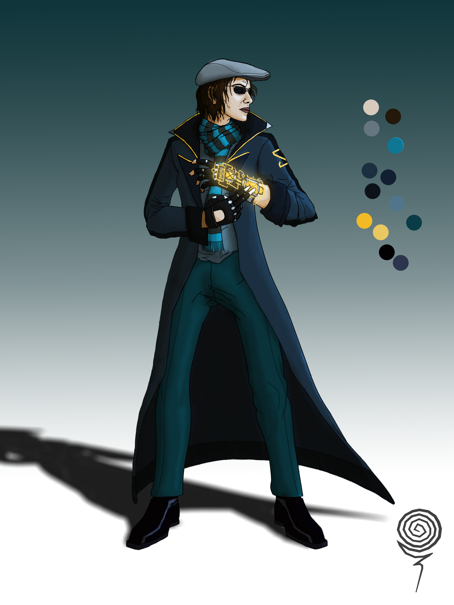

---

SATURNO

Um roteiro

De

Gibran

Copyright by Gibran 2022 Porto Velho

Todos direitos reservados

---

## 1. EXT. O "CRONODOMO", A SEDE DA INICIATIVA SATURNO - 2058, Londres

A INICIATIVA SATURNO, batizada em nome do titã romano do tempo, é uma organização multinacional fundada em 2045 para organizar, estudar e controlar a então criada tecnologia de viagem no tempo.

Em 2043, um grupo de cientistas revolucionou a ciência humana ao descobrir o chamado “Backlog do Universo”.
A cada evento ou ação que acontece no universo, uma reação dela, em forma de frequência, é criada e “registrada” em uma dimensão extra espacial. E esta dimensão existe externa ao fluxo do tempo, ou seja, uma frequência criada em um momento pode ser visualizada tanto depois do acontecimento quando antes.

Os cientistas também descobriram como não só ler e traduzir estas frequências, mas também como interferir e até reescrever algumas delas.

É assim que as viagens no tempo funcionam, pode-se conectar à frequência espacial do passado e viajar diretamente no tempo, ou, conectar e sequestrar as frequências cerebrais de uma pessoa no passado e "possuí-la" para uma viagem indireta.

- VIAGEM DIRETA: o viajante sintoniza com as frequências de espaço e massa e se teletransporta diretamente dentro da linha do tempo. Pode ter efeitos colaterais na saúde do viajante, provocar alterações temporais e ter consequências catastróficas. Chamada tecnicamente de “EXPEDIÇÃO INTERTEMPORAL".
- VIAGEM INDIRETA: o viajante interfere nas frequências cerebrais de uma pessoa já existente na linha do tempo e as substitui com as suas próprias frequências, permitindo que o viajante “possua” e assuma controle da pessoa passada. Muito mais seguro e controlado do que a viagem direta.

A viagem indireta não apresenta efeitos colaterais para a pessoa possuída além de um pequeno lapso de memória proporcional à duração da viagem.

A viagem indireta pode ter efeitos colaterais e pode ser perigosa se experienciada extensamente, tanto por várias viagens em sequência em um curto espaço de tempo ou uma viagem que demore muito.

A viagem indireta tem sido a principal ferramenta do chamado "PROJETO REVELAÇÃO". Considerado o projeto científico mais ambicioso de todos os tempos, é dedicado a desvendar os mistérios e perguntas sem resposta da história humana: (como as pirâmides foram construídas, porque os Maias desapareceram, a verdadeira natureza de Jesus Cristo, além de muitos outros).

Uma subseção desse trabalho é chamada de "Forense Intertemporal", dedicada especialmente a solucionar crimes não solucionados da história. Foi usada para revelar Jack o Estripador e o Assassino do Zodíaco

## 2. INT. DIRETOR DA INICIATIVA SATURNO :  ()

>**William Gerhingham (V.O)**
>
> Um atual membro de destaque e uma de suas melhores funcionárias é a Primeira Detetive Atemporal **REBECCA EINCHENBERG**.

### REBECCA EINCHENBERG

- Nascida 18/04/2011 em Hanôver, Alemanha.
- 47 anos.
- Residente em Londres, Reino Unido.
- 1.76 de altura. Cabelo curto marrom escuro. Um pouco pálida. Olhos estreitos. Sobrancelhas fortes e expressivas. Lábios finos e escuros. Rosto fino e afiado. Voz meio profunda e ríspida.

Foi uma criança superdotada, mas depois sucumbiu sob a pressão de viver à altura das expectativas e entrou em depressão durante a juventude. Mesmo assim, ainda mantém um Qi alto.

Muitos arrependimentos na vida, já teve o desejo de poder voltar ao passado e fazer diferente. Hoje em dia já tenta não se apegar ao passado.
Já teve um casamento perturbado no passado.

Humor seco, extremamente sarcástica e cínica.

Não é uma pessoa muito social, preferindo passar a maior parte do tempo sozinha em casa ou andando pelas ruas e parques da cidade (preferencialmente à noite), é uma pessoa primariamente noturna.

Não gosta de não saber ou não ser informada das coisas, não tolera pontas soltas ou tarefas inacabadas, um dos motivos dela ter se juntado à forense intertemporal.

Não gosta que perturbem no trabalho ou nas coisas dela.

Extremamente perfeccionista e pontual, tudo tem que estar no lugar certo e na hora certa.

Ironicamente, não tem uma boa rotina de sono. Costuma ficar por dias sem dormir, pois fica trabalhando por horas a fim.

Por isso sofre de insônia, é viciada em cafeína e energéticos e possui olheiras constantes.

Um pouco desnutrida, possui dores de cabeça, pressão baixa e estresse constantes. Toma remédios constantemente.

Desenvolveu alta sensibilidade à luz por passar tanto tempo no escuro.

Mora sozinha em um apartamento extremamente apertado em Londres, acompanhada apenas de um camaleão chamado Tesla.

Nas poucas horas que tem de tempo livre, gosta de ler livros, assistir documentários sobre temas variados de ciência e história, e jogar videogames casuais (preferencialmente simuladores ou jogos de puzzles).

Gosta de ouvir jazz e blues, recentemente tem se interessado em Electroswing.

Trabalhou como investigadora privada por alguns anos, adquiriu assim a habilidade de se disfarçar e observar sem ser percebida, o que é uma habilidade muito útil quando se viaja no tempo.

Antes de trabalhar para a Saturno, foi também oficial de polícia e perita criminal.

Rebecca é apenas a 7ª pessoa na história a ser atribuída o cargo de Detetive Atemporal, já que essa exótica profissão só aceita os investigadores mais inteligentes e capazes do mundo.

No começo de agosto de 2058, Rebecca foi chamada para investigar mais um assassinato no passado. Este caso parecia bastante mundano e irrelevante para merecer uma expedição intertemporal, porém uma análise prévia do acontecido havia revelado detalhes intrigantes.

Ao viajar até o local e época e analisar o crime, ela percebeu que as características do assassinato eram bastante incomuns. Os métodos pareciam estranhamente modernos, e o criminoso deixara pistas bizarras.

Voltando ao presente, Rebecca ouviu falar de um caso similar sendo investigado por outro detetive. Ela decidiu assumir a investigação e, ao investigar a cena deste crime, encontrou circunstâncias extremamente similares às do caso anterior.

Rebecca então chegou a uma surpreendente conclusão: ambos os crimes só poderiam ter sido cometidos pela mesma pessoa, mesmo estando a séculos de distância um do outro.
Isso só poderia significar uma coisa: Um assassino em série que consegue viajar no tempo.

O perigo de uma série de pequenas intrusões ao longo do tempo causarem sérias repercussões no tecido temporal já era motivo para deixar a Iniciativa em alerta máxima. Mas havia ainda outro motivo para a preocupação dos superiores.

A Iniciativa Saturno já vinha sofrendo críticas da mídia e de pessoas públicas, alguns incidentes colocaram em dúvida a capacidade da organização de manusear e supervisionar suas tecnologias.

A ideia de que havia tecnologia de viagem no tempo fora do controle da Iniciativa e sendo usada para cometer atrocidades por toda a história humana poderia ser a gota d'água para a organização. O que dá mais um motivo para que eles desejem a solução imediata deste caso.
E Rebecca não só tinha motivação moral e ética para capturar o assassino, como ela também tinha lealdade pela organização. Ela acreditava na integridade dos seus superiores.
