[CafeGeek](https://myerco.github.io/unreal-engine)  / [Desenvolvimento de jogos utilizando Unreal Engine 4](https://myerco.github.io/unreal-engine/unreal.html)

# Manipulando Arrays
Neste capitulo serão apresentados os conceitos de estruturas de *arrays* ou vetores e suas funções para manipulação.

## Índice
>1. [Conceito e implementação](#1)
>     1. [Exemplo de números inteiros](#11)
>     1. [Exemplo de números Números float](#12)
>     1. [Exemplo com String](#13)
>     1. [Representação](#14)
>1. [Declarando arrays](#2)
>1. [Método Get para arrays](#3)
>1. [Get utilizando uma variável como índice](#4)
>1. [Último índice e a quantidade de elementos do *array*](#5)
>1. [Removendo elementos utilizando *Remove*](#6)
>1. [Listando todos os elementos utilizando **For**](#7)
>1. [Usando o comando **Find**](#8)
>1. [Comando remove *index*](#9)
>1. [Comando remove](#10)
>1. [Limpando o *clear*](#11)
>1. [Atualiza o *array* nome clássicos com dados do *array* de nome](#12)
>1. [Contando elementos dentro de um *array*](#13)

<a name="1"></a>
## 1. Conceito e implementação
É um conjunto de variáveis do mesmo tipo agrupadas.   

<a name="11"></a>
### 1.1 Exemplo de números inteiros  
```
a = ( 5,2,7,3,9)  
```
<a name="12"></a>
### 1.2 Exemplo de números Números *float*  
```
a = ( 5.1,2.9,7.0,3.121,9.43)  
```
<a name="13"></a>
### 1.3 Exemplo com *String*  
```
s = ( "Ana","José","Hugo","Hulda")
```
<a name="14"></a>
### 1.4 Representação
Podemos representar os arrays da seguinte forma:

| s |  s[0] |s[1]   |s[2]    | s[3]  |
|---|---|---|---|---|
|**Valor**|Ana|José|Hugo|Hulda|
|**Índice**|  0 | 1  | 2  | 3  |

- s[0] - O valor entre colchetes indica a posição (índice) do elemento no array.
- O índice em C++ inicia com o valor 0.

<a name="2"></a>
## 2. Declarando arrays
**Blueprint**  

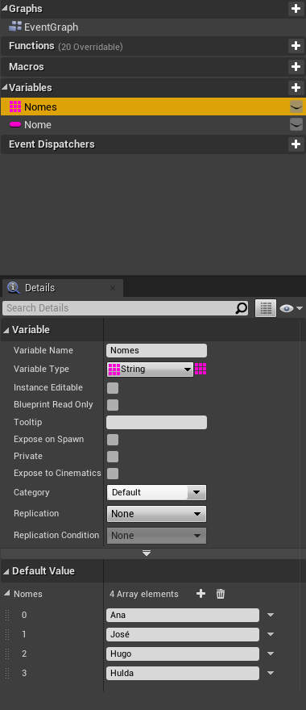

**C++**  
```cpp
FString  pessoas[4] = { "Ana","José","Hugo","Hulda"};
int  pessoas[3] = { 4,3,7};
```

<a name="3"></a>
## 3. Método *Get* para *arrays*
Para acessar qualquer elemento dentro *array* é necessários utilizar o índice.  

**Blueprint**  
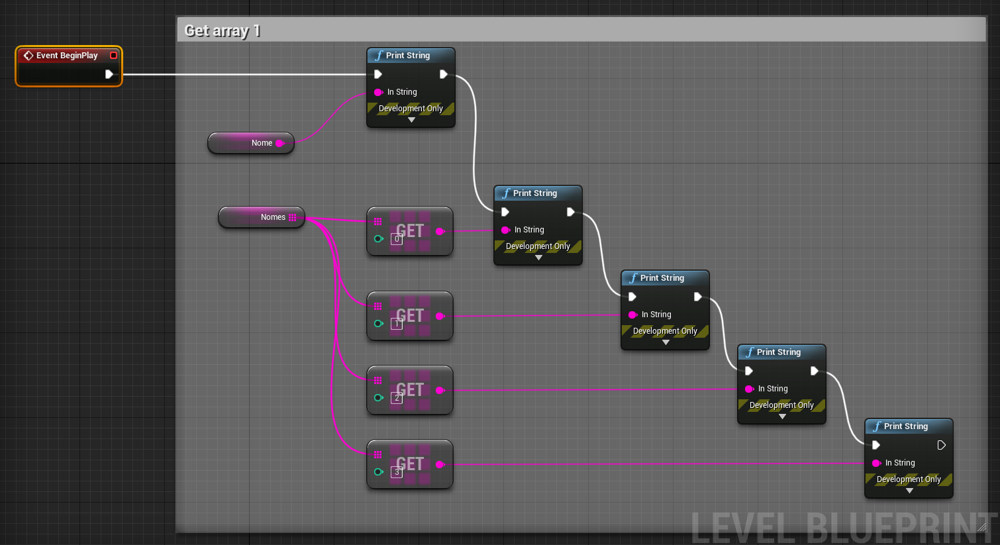

**C++**  
```
FString s = pessoa[0];
UE_LOG(LogTemp, Warning, TEXT("O nome é %s",*s);
```  

<a name="4"></a>
## 4. Get utilizando uma variável como índice
Podemos utilizar uma variável para acessar elementos do array.
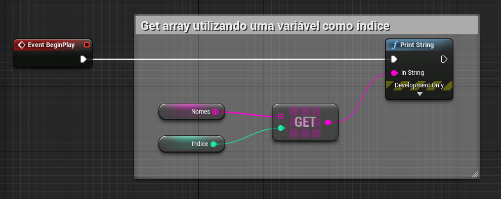

<a name="5"></a>
## 5. Último índice e a quantidade de elementos do *array*
O comando **Last Index** retorna o valor do último índice, o comando **Length** retorna a quantidade de elementos do array.

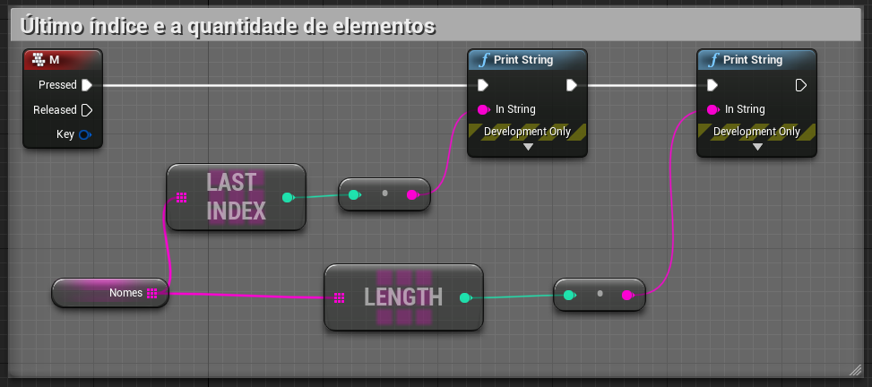

<a name="6"></a>
## 6. Removendo elementos utilizando *Remove*


<a name="7"></a>
## 7. Listando todos os elementos utilizando *For*
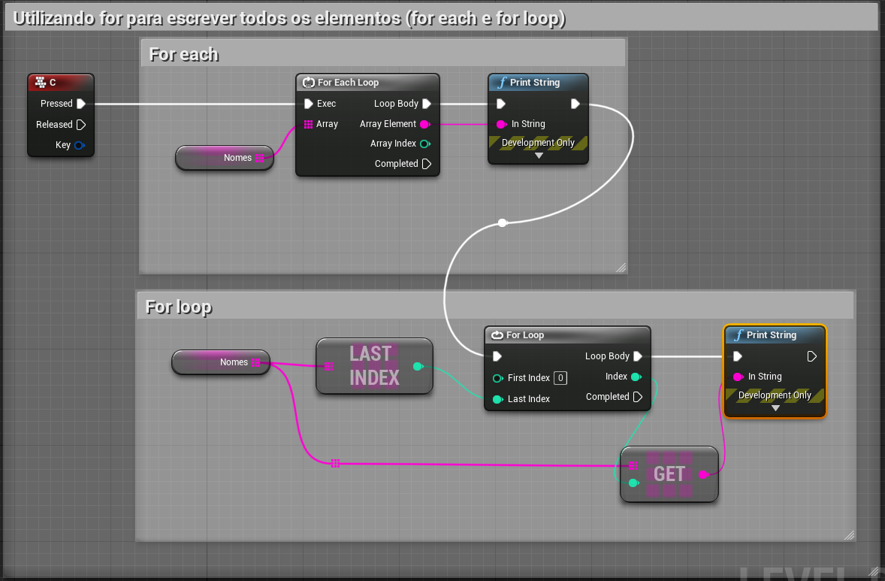

<a name="8"></a>
## 8. Usando o comando *Find*

**Blueprint**  

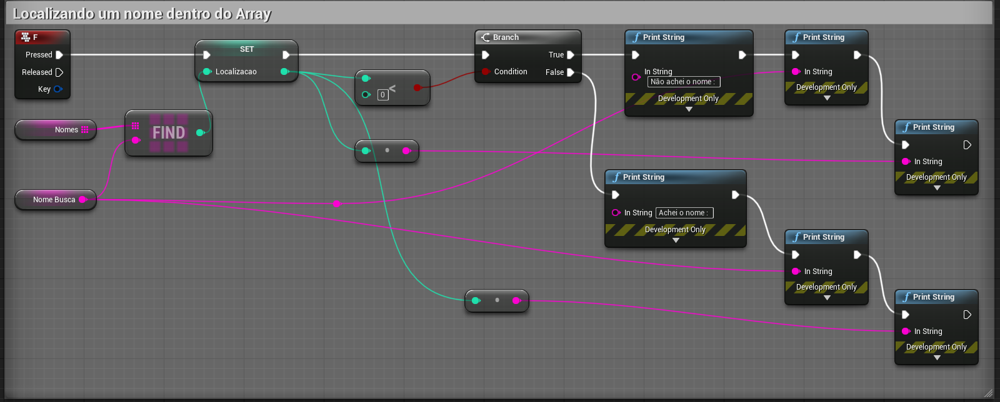

**C++**
```cpp
int32 Index;
if (StrArr.Find(TEXT("Hello"), Index))
{
    // Index == 3
}
```

<a name="9"></a>
## 9. Comando *remove index*
Utilizando um valor para remover um elemento do array.
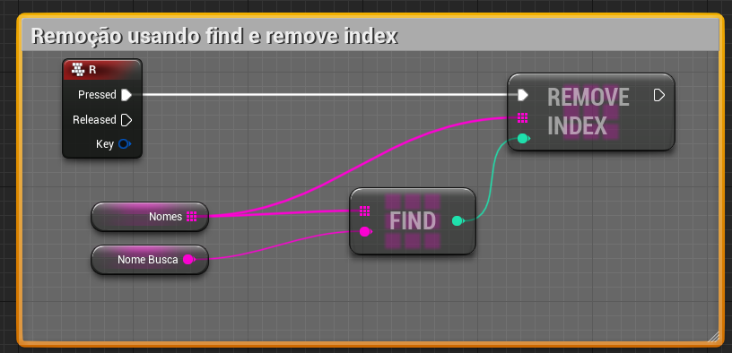

<a name="10"></a>
## 10. Comando *remove*
O comando **Remove** executa uma busca utilizando um paramentro, **NomeBusca** e o remove do array.

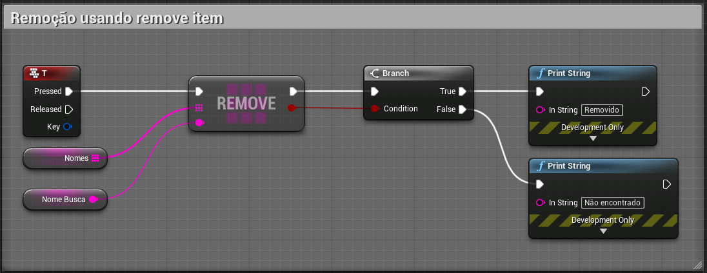

<a name="11"></a>
## 11. Limpando o *clear*
O comando **Clear** remove todos os elementos do array.

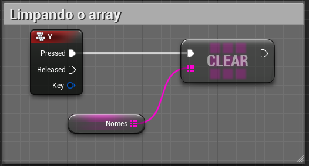

<a name="12"></a>
## 12. Atualiza o *array* **nome clássicos** com dados do *array* de **nome**

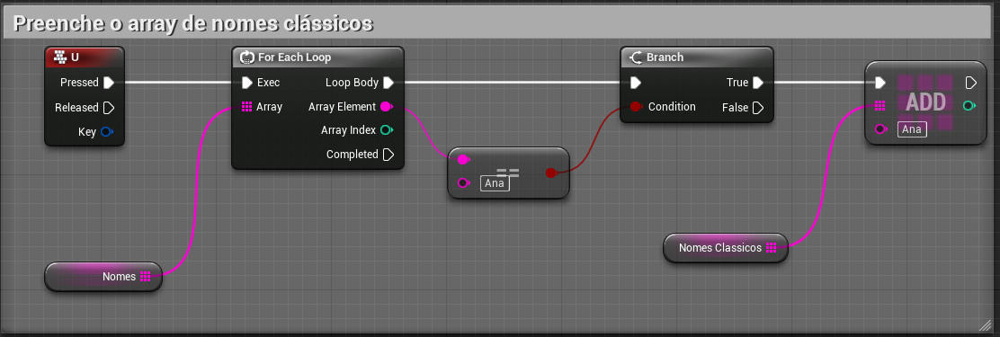

<a name="13"></a>
## 13. Contando elementos dentro de um *array*
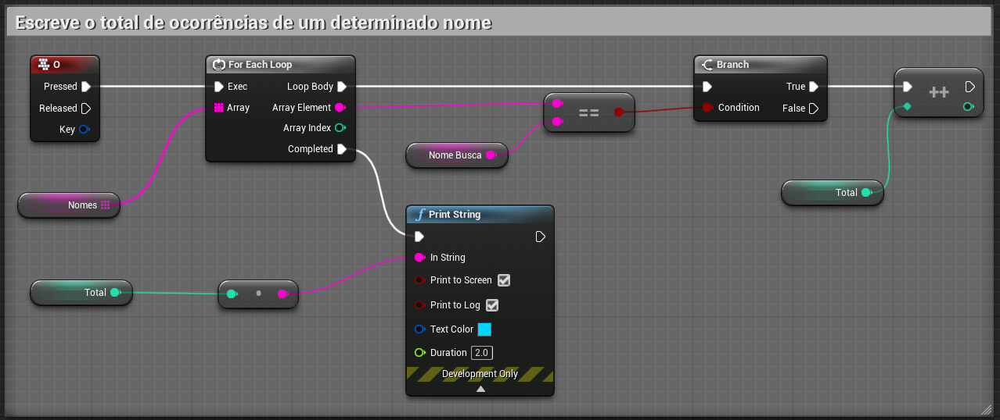

***
### Referências
- [Unreal Engine Blueprints Array](https://docs.unrealengine.com/en-US/Engine/Blueprints/UserGuide/Arrays/index.html)   
- [Unreal Engine Array Nodes](https://docs.unrealengine.com/en-US/Engine/Blueprints/UserGuide/Arrays/ArrayNodes/index.html)    
- [C++](https://www.codegrepper.com/code-examples/cpp/ue4+c%2B%2B+array)

***
## Tags
[Blueprint](https://myerco.github.io/unreal-engine/ue4_blueprint/blueprint.html), [Unreal Engine](https://myerco.github.io/unreal-engine/unreal.html), [CafeGeek](https://myerco.github.io/unreal-engine/)
