[CafeGeek](http://CafeGeek.eti.br)  / [Desenvolvimento de jogos utilizando Unreal Engine 4](http://cafeGeek.eti.br/ue4_blueprint/index.html)

# Comunicação entre Blueprint
Neste capítulo será apresentadas técnicas de programação para comunicação entre Blueprints.

## Índice
1. [Como facilitar a comunicação entre objetos Blueprint? ](#1)  
1. [Estrutura da comunicação entre Blueprints](#2)
1. [Preparando o ambiente de testes ](#3)  
1. [Comunicação utilizando Acesso direto](#4)  
    1. [Chamando a função LampadaVisible](#4.1)  
    1. [Vídeo](#4.2)  
1. [Utilizando CAST](#5)      
    1. [Cast do objeto PointLight](#5.1)  
    1. [Vídeo](#5.2)  
1. [Utilizando o objeto Blueprint Interface](#6)  
    1. [Menu Blueprint/Blueprint Interface](#6.1)  
    1. [Editor de Blueprint Interface](#6.2)  
    1. [Implementando o objeto com a interface](#6.3)      
    1. [Interface com parâmetros](#6.4)          
    1. [Vídeo](#6.5)  
1. [Event Dispatcher](#7)  
    1. [O Character BP_Hero será o emissor dos eventos](#7.1)          
    1. [Lógica dos objetos que vão interagir com o personagem](#7.2)
    1. [Vídeo](#7.3)               

<a name="1"></a>
## 1. Como facilitar a comunicação entre objetos Blueprint?
Construindo um meio para que objetos individuais separados interagirem uns com os outros.  
Útil para fazer coisas como:
- Transmitindo um evento para vários ouvintes.
- Dizendo a um objeto específico para fazer algo.
- Consultando outro objeto por:   
  - Estado.    
  - Valores de propriedade.    
  - Valores variáveis.   
  - Resultados.   

<a name="2"></a>  
## 2. Estrutura da comunicação entre Blueprints
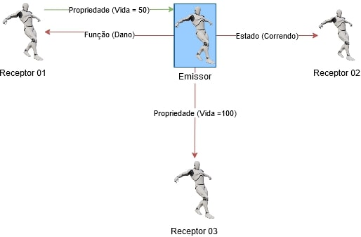
*Figura: Comunicação entre Blueprints - Autor*

A comunicação envolverá o seguinte:
- Um projeto de envio, um remetente de informações (Emissor).
- Pelo menos um **Receiving Blueprint** para receber as informações (Receptor).
- A comunicação exigirá uma referência em algum ponto.    
  Em outras palavras, uma das partes, o remetente ou o receptor,  deve tomar conhecimento da outra, isso ocorre porque, como afirmado acima, não existe um sistema de comunicação de amplo espectro.
- Toda a comunicação do **Blueprint** é unilateral.
  - **Blueprints** podem enviar dados para frente e para trás, mas requer que ambos os **Blueprints** configurem seus próprios caminhos individuais de comunicação.
  - As consultas são possíveis, mas são iniciadas pelo remetente (ainda unidirecional).   

<a name="3"></a>
## 3. Preparando o ambiente de testes
Vamos criar um ator com os seguintes parâmetros para que funcione como controlador de objetos.
1. Crie um **Blueprint Actor** com nome *ControleLuz*.
1. Adicione e configure um **Static Mesh**.
1. Adicione e configure um **Box Colision**.
1. Implemente a função *LampadaVisible* para desligar e ligar a iluminação os objetos **Light Point** passados como parâmetro.    
      
1. Adicione a variável *Lampada* do tipo **Point Light** e configure **Instance Editable** para *true*.         
  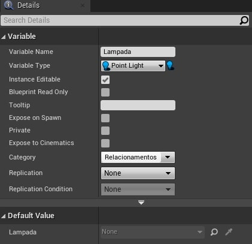      
1. Adicione dois objetos **Light Point** na cena.
1. Em um dos objetos de iluminação adicione a **tag** *lampada*.
1. Associe um objeto na cena com a propriedade *Lampada* do *ControleLuz*.

<a name="4"></a>
## 4. Comunicação utilizando Acesso direto
Nesta passo iremos acessar diretamente o objeto e suas propriedades, usando o evento **OnBeginOverLap** para alterar o estado da lâmpada de ligado para desligado pois o mesmo é passado como parâmetro.  

<a name="4.1"></a>
### 4.1 Chamando a função LampadaVisible
Criando um referência do objeto é possível acessar a função **LampadaVisible**.

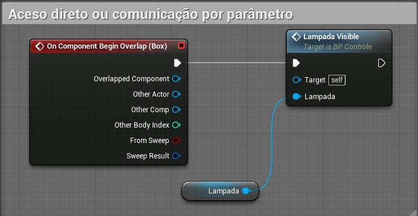   

Quando qualquer objeto colidir com o *ControleLuz* a lâmpada ira desligar ou ligar.   

<a name="4.2"></a>
### 4.2 Vídeo
[](https://youtu.be/td6_Nm2tYfc)   
*Vídeo: Comunicação entre Blueprints | Comunicação utilizando Acesso direto| 02 | Unreal Engine*

<a name="5"></a>
## 5. Utilizando CAST
**CAST** ou conversão é um operador especial que força um tipo de dados a ser convertido em outro.

**Unreal C++**   
```cpp
AStaticMeshActor* StaticMesh = Cast<AStaticMeshActor>(SM);
```
O comando acima inicializa o objeto *StaticMesh* do tipo *AStaticMeshActor*.

Para este passo usaremos o evento **OnEndOverlap** para ler todos os objetos que tem a **tag** *lampada* da cena e carregar em um *array* de objetos. Para cada objeto será executado o comando **CAST** informando o **type** para ter acesso a todas a funcionalidades do objeto.

<a name="5.1"></a>
### 5.1 CAST do objeto PointLight
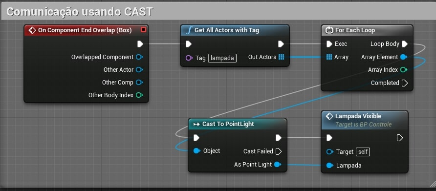      
- **GetAllActorWithTag** - Retorna um array com todos os objetos da cena com a **tag** passada como parâmetro, no caso *Lampada*.

<a name="5.2"></a>
### 5.2 Vídeo
[](https://youtu.be/VT6uob6UiSQ)    
*Vídeo: Comunicação entre Blueprints | Usando Cast 03 Unreal Engine*

<a name="6"></a>
## 6. Utilizando o objeto Blueprint Interface
**Blueprint interface** permite que vários tipos diferentes de objetos compartilhem e sejam acessados através de uma interface comum. Simplificando, as **Blueprint interfaces** permitem que diferentes **Blueprints** compartilhem e enviem dados entre si.

<a name="6.1"></a>
### 6.1 Menu Blueprint/Blueprint Interface
Implemente um **Blueprint interface** Utilizando o menu de contexto.

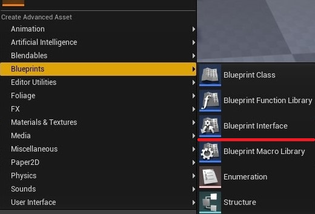    
1. Nome do objeto *BPI_Colecionaveis*.

<a name="6.2"></a>
### 6.2 Editor de Blueprint Interface
Perceba que o objeto não tem lógica pois neste caso o objeto funciona como uma ponte para eventos em outros objetos que deverão ter sua própria lógica.

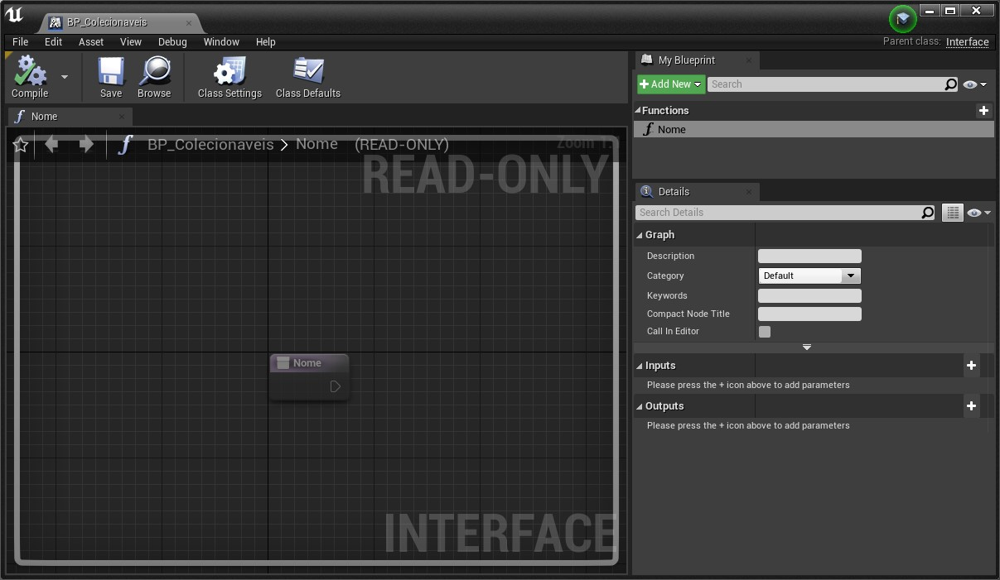      

1. Adicione uma função *Nome*.

<a name="6.3"></a>
### 6.3 Implementando o objeto com a interface
1. Crie o ator *BP_Cadeira* do tipo **Blueprint Actor**.
1. Adicione e configure um **Static Mesh** com um malha de uma cadeira ou mesa.
1. Utilizando a opção **Class Settings** adicione a interface *BPI_Colecionaveis*.
1. Uma vez a interface configurada as funções de  *BPI_Colecionaveis* ficarão disponíveis através de eventos.   
       
1. Adicione no **Character** jogável *BP_Hero* e implemente a lógica abaixo.   
  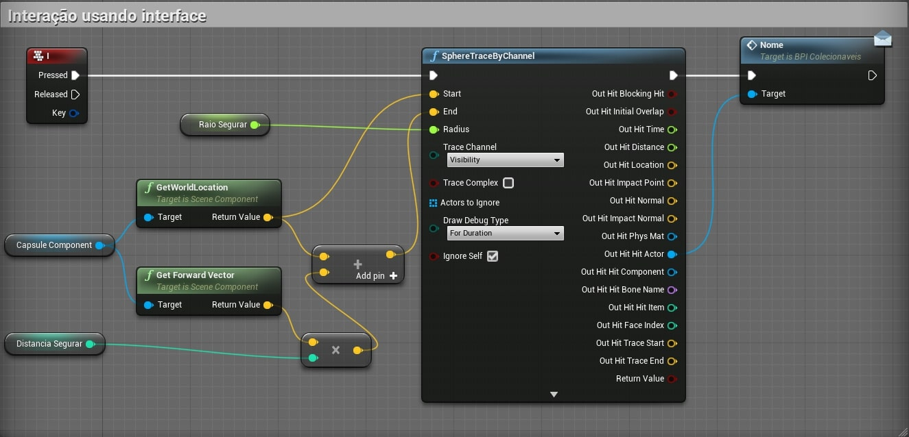     
  - **RaioSegurar** - Raio da esfera que é disparada.
  - **DistanciaSegurar** - Distância do raio disparado.
  - **Nome** - A função *Nome* da interface ficará disponível para ser chamada.     

<a name="6.4"></a>
### 6.4 Interface com parâmetros.
1. Implemente a função *ExecutaAcao* com parâmetro *Acao* do tipo **string**, usaremos esse parâmetro para determinar ações que o objeto pode executar.       
   
1. Ao chamar a função é fornecido um valor.   
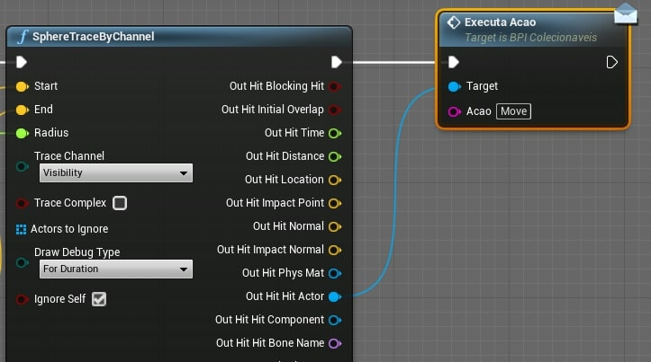     
1. Implemente a lógica de tratamento do parâmetro dentro do objeto cadeira ou mesa.        
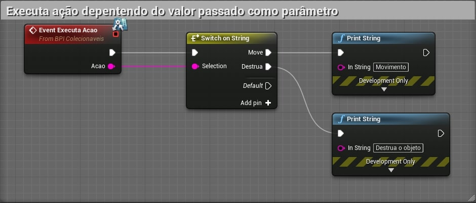  

> Podemos melhorar o controle utilizando uma variável **enumeration** para parametrizar as ações.  

<a name="6.5"></a>
### 6.5 Vídeo
[](https://youtu.be/ugqPc5-YQV4)      
*Vídeo: Comunicação entre Blueprints | Utilizando o objeto Blueprint Interface| 04 | Unreal Engine*

<a name="7"></a>
## 7. Event Dispatcher
São eventos que transmitem mensagens para outros Blueprints, os receptores "ouvem" as mensagens e podem implementar a sua própria lógica de tratamento.   
Vinculando um ou mais eventos a um **Event Dispatcher** , você pode fazer com que todos esses eventos sejam disparados assim que o **Event Dispatcher** for chamado.     
Esses eventos podem ser vinculados a uma classe **Blueprint**, mas os **Event Dispatchers** também permitem que eventos sejam disparados dentro do *Level Blueprint*.

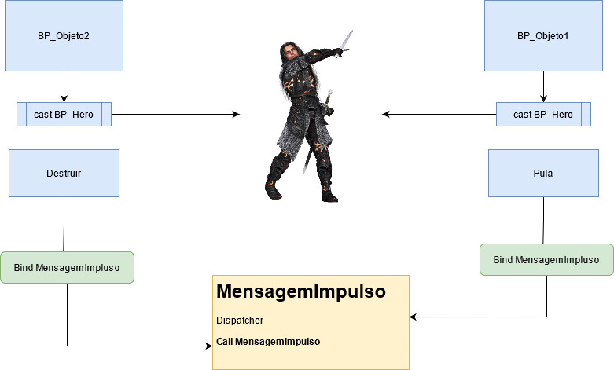

<a name="7.1"></a>
### 7.1 O Character *BP_Hero* será o emissor dos eventos
1. Adicionamos **EventDispatcher**.
1. No **Event Graph** implementados a chamada do evento utilizando **Call** (Call nome do evento).     
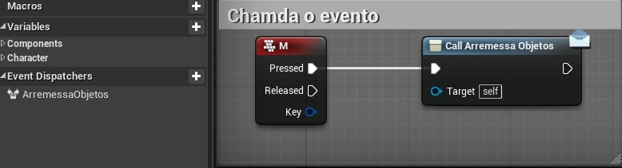    

<a name="7.2"></a>
### 7.2 Lógica dos objetos que vão interagir com o personagem
1. No objeto **BP_Cubo** por exemplo adicionamos referência ao personagem **BP_Hero** usando *cast* para ter acesso ao evento registrado no *dispatcher*.     
      

1. Implementamos **Bind Event** do disptacher para  associar um evento a chamada.     

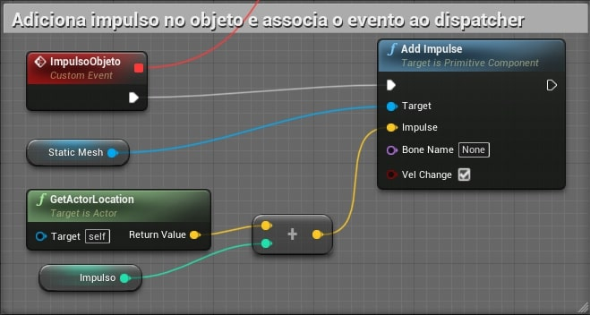

<a name="7.3"></a>
### 7.3 Vídeo
[](https://youtu.be/bmxFZH3hFxc)   
*Vídeo: Comunicação entre Blueprints | Event Dispatcher| 05 | Unreal Engine*    

***
## Referências
- [Types of Blueprints](https://docs.unrealengine.com/en-US/ProgrammingAndScripting/Blueprints/UserGuide/Types/index.html)
- [Blueprint interface](https://docs.unrealengine.com/en-US/ProgrammingAndScripting/Blueprints/UserGuide/Types/Interface/index.html)
- [Event Dispatcher](https://docs.unrealengine.com/en-US/ProgrammingAndScripting/Blueprints/UserGuide/EventDispatcher/index.html)
- [Binding and Unbind](https://docs.unrealengine.com/en-US/ProgrammingAndScripting/Blueprints/UserGuide/EventDispatcher/BindingAndUnbinding/index.html)
- [Unreal Engine 4 em Português - Event Dispatcher](https://www.youtube.com/watch?v=qHYA4dLnVAA)

***
## Tags
[Blueprint](https://myerco.github.io/CafeGeek/ue4_blueprint/blueprint.html), [Unreal Engine](https://myerco.github.io/CafeGeek/ue4_blueprint/index.html), [CafeGeek](https://myerco.github.io/CafeGeek/)
