[CafeGeek](https://myerco.github.io/CafeGeek)  / [Desenvolvimento de jogos utilizando Unreal Engine 4](https://myerco.github.io/CafeGeek/ue4_blueprint/index.html)

# Comunicação entre Blueprint
Neste capítulo será apresentadas técnicas de programação para comunicação entre Blueprints.

## Índice
1. [Como facilitar a comunicação entre objetos Blueprint? ](#1)  
    1. [Útil para fazer coisas como](#11)  
    1. [A comunicação sempre envolverá o seguinte](#12)
    1. [A comunicação sempre exigirá uma referência em algum ponto](#13)          
    1. [Toda a comunicação do Blueprint é unilateral](#14)      
1. [Preparando o ambiente de testes ](#2)  
1. [Comunicação utilizando Acesso direto](#3)  
    1. [Chamando a função LampadaVisible](#31)  
1. [Utilizando CAST](#4)      
    1. [Cast do objeto PointLight](#41)  
1. [Utilizando o objeto Blueprint Interface](#5)  
    1. [Menu Blueprint/Blueprint Interface](#51)  
    1. [Editor de Blueprint Interface](#52)  
    1. [Implementando o objeto com a interface](#53)      
    1. [Interface com parâmetros](#54)          
1. [Event Dispatcher](#6)  
    1. [O Character BP_Hero será o emissor dos eventos](#61)          
    1. [Lógica dos objetos que vão interagir com o personagem](#62)              

## 1. Como facilitar a comunicação entre objetos Blueprint?
Construindo um meio para que objetos individuais separados interagirem uns com os outros.  

### 1.1 Útil para fazer coisas como
- Transmitindo um evento para vários ouvintes.
- Dizendo a um objeto específico para fazer algo.
- Consultando outro objeto por:   
  Status    
  Estado    
  Valores de propriedade    
  Valores variáveis   
  Resultados    

  
### 1.2 A comunicação sempre envolverá o seguinte
- Um projeto de envio.
- Pelo menos um **Receiving Blueprint**.

    
### 1.3 A comunicação sempre exigirá uma referência em algum ponto
- Em outras palavras, uma das partes - o remetente ou o receptor - deve tomar conhecimento da outra
- Isso ocorre porque, como afirmado acima, não existe um sistema de comunicação de amplo espectro.

    
### 1.4 Toda a comunicação do Blueprint é unilateral
- Blueprints podem enviar dados para frente e para trás, mas requer que ambos os **Blueprints** configurem seus próprios caminhos individuais de comunicação
- As consultas são possíveis, mas são iniciadas pelo remetente (ainda unidirecional)    

## 2. Preparando o ambiente de testes
Vamos criar um **Blueprint Actor** com os seguintes parâmetros para que funcione como controlador de objetos.
1. Adicione e configure um **Static Mesh**.
1. Adicione e configure um **Box Colision**.
1. Implemente a função para desligar e ligar a iluminação os objetos **Light Point** passados como parâmetro.    
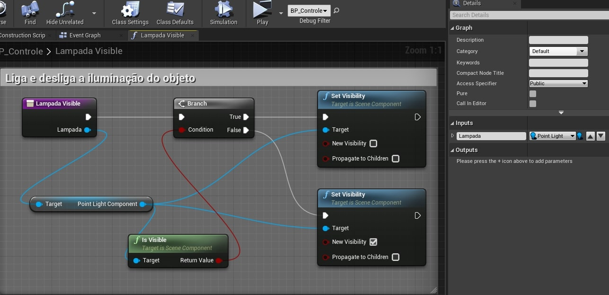    
1. Adicione a variável *Lampada* do tipo **Point Light** e configure **Instance Editable** para *true*.         
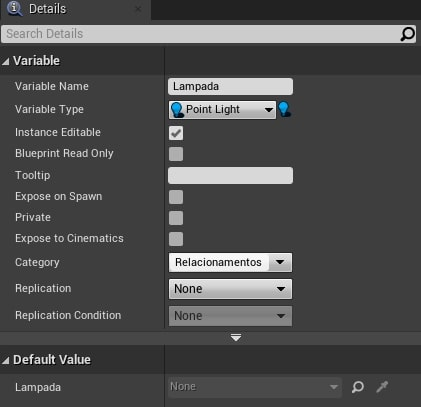      
1. Adicione dois objetos **Light Point** na cena.
1. Em um dos objetos de iluminação adicione a **tag** *lampada*.

## 3. Comunicação utilizando Acesso direto
Usaremos o evento **OnBeginOverLap** para alterar o estado da lâmpada de ligado para desligado acessando **diretamente** o objeto pois o mesmo é passado como parâmetro.  

### 3.1 Chamando a função LampadaVisible
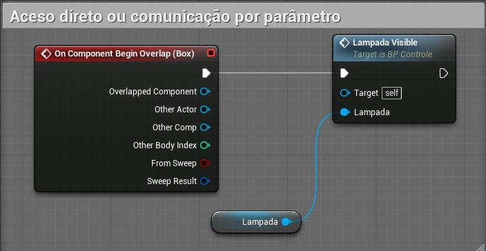      

## 4. Utilizando CAST
Usaremos o evento **OnEndOverlap** para ler todos os objetos que tem a **tag** *lampada* da cena e carregar em um array de objetos. Para cada objeto será executado o comando **Cast** informando o **type** para ter acesso a todas a funcionalidades do objeto.

### 4.1 Cast do objeto PointLight
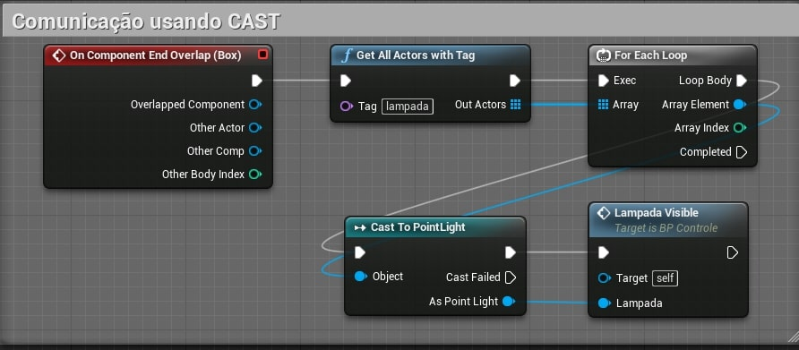      
- **GetAllActorWithTag** - Retorna um array com todos os objetos da cena com a *tag* passada como parâmetro, no caso "Lampada".

## 5. Utilizando o objeto Blueprint Interface
**Blueprint interface** permite que vários tipos diferentes de objetos compartilhem e sejam acessados através de uma interface comum. Simplificando, as interfaces do **Blueprint** permitem que diferentes **Blueprints** compartilhem e enviem dados entre si.

Implemente um **Blueprint interface** Utilizando o menu de contexto.
### 5.1 Menu Blueprint/Blueprint Interface
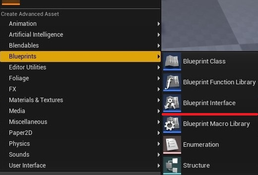    
  1. Nome do objeto *BPI_Colecionaveis*
  1. Adicione uma função *Nome*

### 5.2 Editor de Blueprint Interface
Perceba que o objeto não tem lógica pois neste caso o objeto funciona como uma ponte para eventos em outros objetos que deverão ter sua própria lógica.   
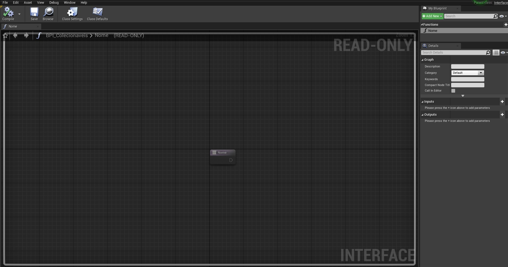      

### 5.3 Implementando o objeto com a interface
1. Crie BP_Cadeira do tipo **Blueprint Actor**.
1. Adicione e configure um **Static Mesh** com um malha de uma cadeira ou mesa.
1. Utilizando a opção **Class Settings** adicione a interface *BPI_Colecionaveis*.
1. Uma vez a interface configurada as funções de  *BPI_Colecionaveis* ficarão disponíveis através de eventos.   
  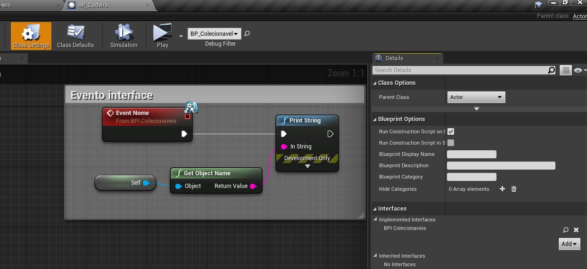     
1. Adicione no **Character** jogável *BP_Hero* e implemente a lógica abaixo.   
1. A função *Nome* da interface ficará disponível para ser chamada.     
  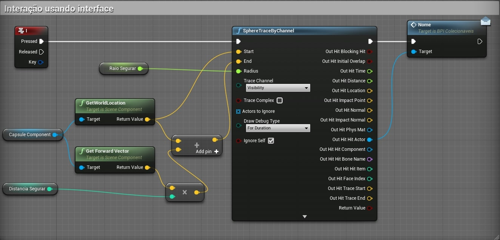     

### 5.4 Interface com parâmetros.
1. Implemente a função *ExecutaAcao* com parâmetro *Acao* do tipo **string**, usaremos esse parâmetro para determinar ações que o objeto pode executar.       
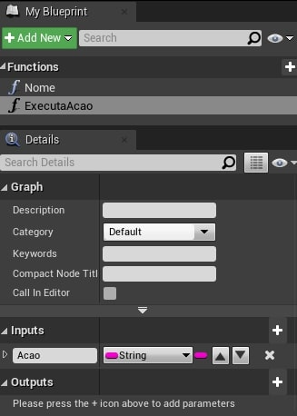   
1. Ao chamar a função é fornecido um valor.   
     
1. Implemente a lógica de tratamento do parâmetro dentro do objeto cadeira ou mesa.        
  

> Podemos melhorar o controle utilizando uma variável **enumeration** para parametrizar as ações.   

## 6. Event Dispatcher
Vinculando um ou mais eventos a um Event Dispatcher, você pode fazer com que todos esses eventos sejam disparados assim que o Event Dispatcher for chamado. Esses eventos podem ser vinculados a uma classe **Blueprint**, mas os **Event Dispatchers** também permitem que eventos sejam disparados dentro do Level Blueprint.

### 6.1 O Character *BP_Hero* será o emissor dos eventos
1. Adicionamos **EventDispatcher**
1. No **Event Graph** implementados a chamada do evento utilizando **Call** (Call nome do evento)
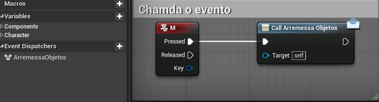    

### 6.2 Lógica dos objetos que vão interagir com o personagem
1. Adicionamos referência ao personagem usando *cast* para ter acesso ao evento registrado no dispatcher.     
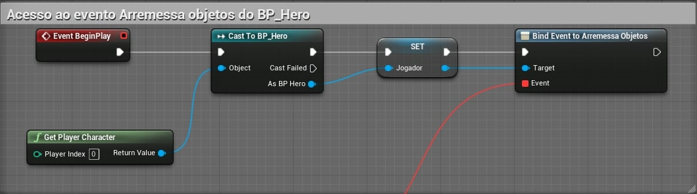      

1. Implementamos **Bind Event** do disptacher para  associar um evento a chamada.     
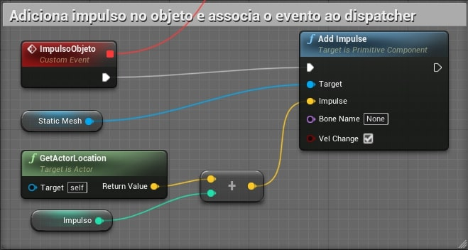        

***
## Referências
- [Types of Blueprints](https://docs.unrealengine.com/en-US/ProgrammingAndScripting/Blueprints/UserGuide/Types/index.html)
- [Blueprint interface](https://docs.unrealengine.com/en-US/ProgrammingAndScripting/Blueprints/UserGuide/Types/Interface/index.html)
- [Event Dispatcher](https://docs.unrealengine.com/en-US/ProgrammingAndScripting/Blueprints/UserGuide/EventDispatcher/index.html)
- [Binding and Unbind](https://docs.unrealengine.com/en-US/ProgrammingAndScripting/Blueprints/UserGuide/EventDispatcher/BindingAndUnbinding/index.html)
- [Unreal Engine 4 em Português - Event Dispatcher](https://www.youtube.com/watch?v=qHYA4dLnVAA)

***
## Tags
[Blueprint](https://myerco.github.io/CafeGeek/ue4_blueprint/blueprint.html), [Unreal Engine](https://myerco.github.io/CafeGeek/ue4_blueprint/index.html), [CafeGeek](https://myerco.github.io/CafeGeek/)
