[CafeGeek](https://myerco.github.io/CafeGeek)  / [Desenvolvimento de jogos utilizando Unreal Engine 4](https://myerco.github.io/CafeGeek/ue4_blueprint/index.html)

# Data tables - Tabelas de dados
Neste capitulo vamos explorar os objetos do tipo **Data tables** que são basicamente estruturas de tabelas de dados disponíveis para os desenvolvedores e são definidas por tipos *Structure*.  

## Índice
1. [O que são Data Tables?](#1)
1. [Criando um objeto do tipo Data Table](#2)
1. [Inserindo dados no objeto do tipo Data Table](#3)
1. [Exemplo de utilização de Data Table](#4)
    1. [Implementando o objeto BP_Vida](#4.1)
    1. [Implementando o objeto BP_Elementos](#4.2)
    1. [Lógica da carga dos dados](#4.3)

## 1. O que são Data Tables?
**Data Tables** são estruturas de dados com vários tipos de variáveis agrupados e podem ser utilizadas para armazenamento de forma estática informações dos personagens e suas características, recursos do jogo como espadas, escudos, magias, propriedades do jogo como níveis, dificuldades e pontuação.

## 2. Criando um objeto do tipo Data Table
1. Primeiramente devemos implementar o **SElementos** do tipo *Structure* que servirá como base para o objeto **Data Table**.     

      
1. Vamos definir as seguintes variáveis.      
  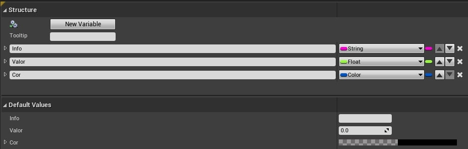   
1. Utilizando o menu de contexto escolha *Miscellaneous/Data Table*.          
  
1. Devemos definir a estrutura de dados da tabela utlizando o variável **SElementos** do tipo **Structure**.    

  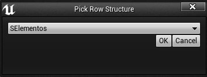   
1. *DTElementos* do tipo *Data Tables*.   

  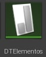

## 3. Inserindo dados no objeto do tipo Data Table
Ao abrir o objeto de Data Table é apresentado um editor para manipulação de dados, inserindo, removendo e alterando as linhas.  
A coluna **RowName** não pode ser repetida, funcionado como identificador único da linha.
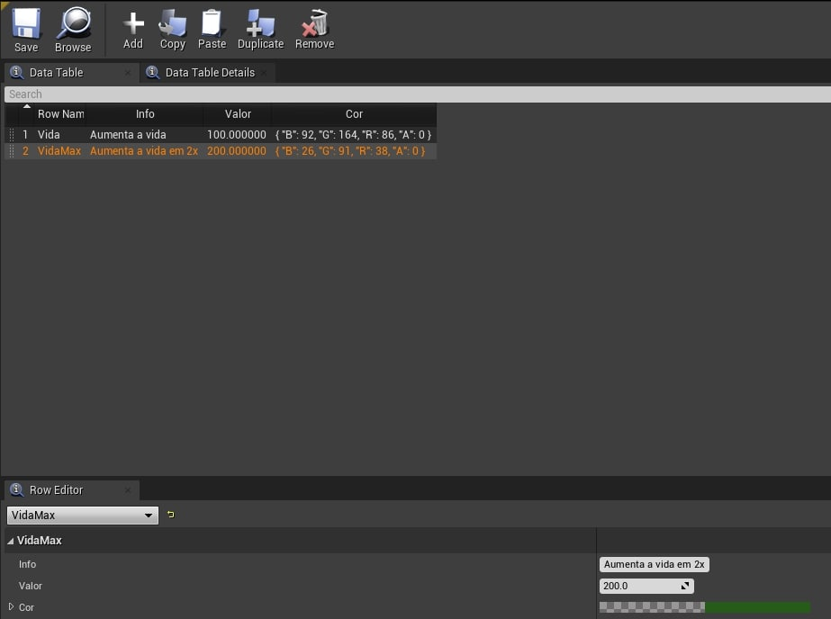

## 4. Exemplo de utilização de Data Table
Para este exemplo vamos implementar um objeto para automaticamente adicionar outros objetos (Vida) na cena, a posição dos objetos pode se controlada com um vetor de coordenadas.  

### 4.1 Implementando o objeto *BP_Vida*
Este objeto deverá estar na cena para interação com o jogador pois pode aumentar o valor da vida do personagem.
1. Variáveis e componentes.  
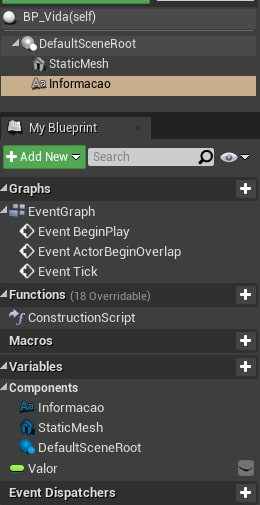

## 4.2 Implementando o objeto *BP_Elementos*
Este objeto serve como referência na cena para posicionamento de ojetos *BP_Vida*.
1. Variáveis e componentes.   
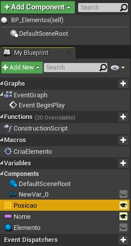
- Observe que a variável **Posicao** é do tipo vector e te a propriedade **Show 3D Widget** esta habilitada para facilitar o posicionamento do elemento na cena.  
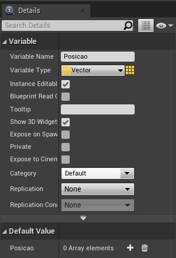   

- O Vetor **Posicao** na cena.   
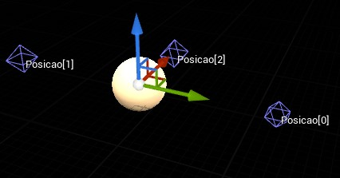

- Detalhes.   
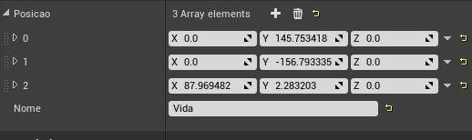

## 4.3 Logíca da carga dos dados.
Para cada elemento do vetor *Posicao* é implementado um objeto do tipo BP_vida nas coordenadas de vetor.   
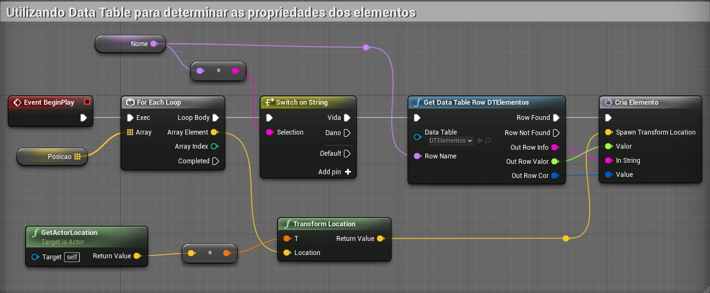

- **Get data Table Row** - Tenta recuperar uma linha da **DataTable** por meio de texto em **RowName**.  
No exemplo a linha recuparada deve coincidir com uma variável passada como parâmetro.

- Para cada objeto adicionado na cena são definidas propriedades.    
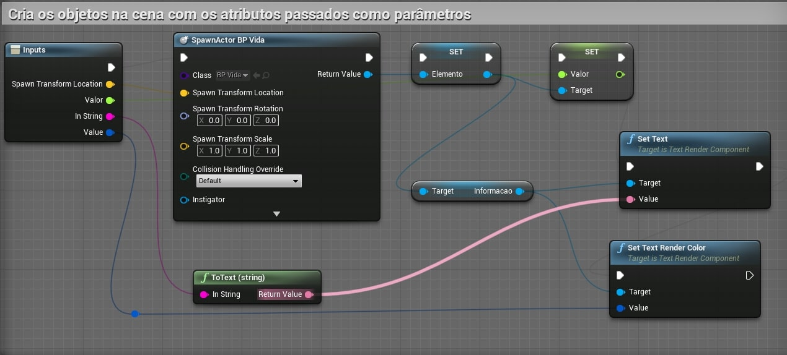

***
## Referências
- [Data Driven Gameplay Elements](https://docs.unrealengine.com/en-US/InteractiveExperiences/DataDriven/index.html)
- [Get Data Table Row](https://docs.unrealengine.com/en-US/BlueprintAPI/Utilities/GetDataTableRow/index.html)

***
## Tags
[Blueprint](https://myerco.github.io/CafeGeek/ue4_blueprint/blueprint.html), [Unreal Engine](https://myerco.github.io/CafeGeek/ue4_blueprint/index.html), [CafeGeek](https://myerco.github.io/CafeGeek/)
