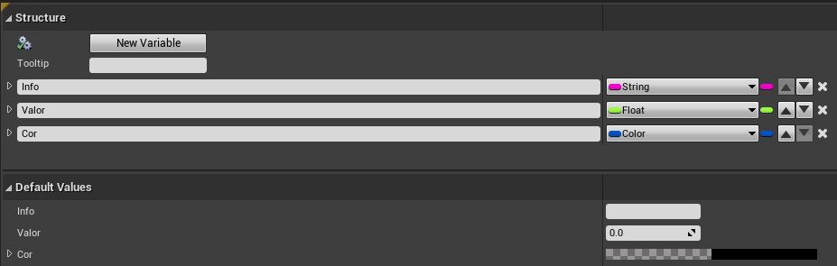
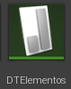
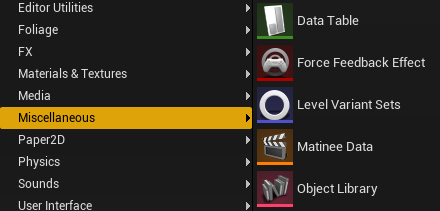
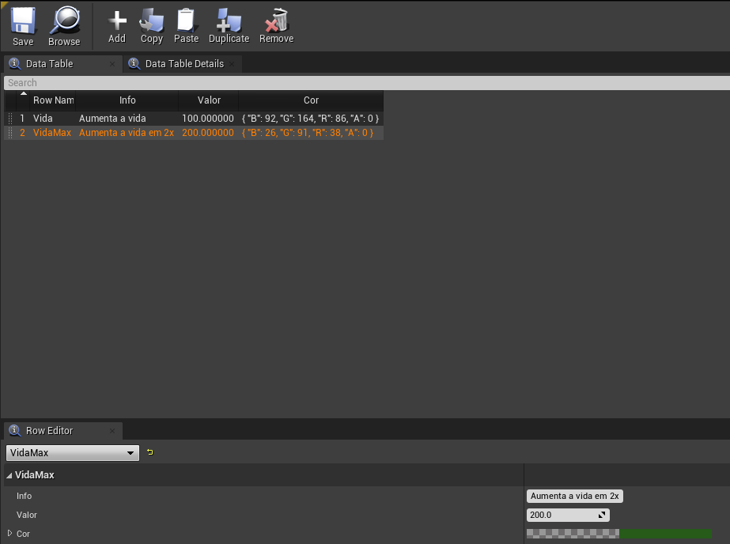
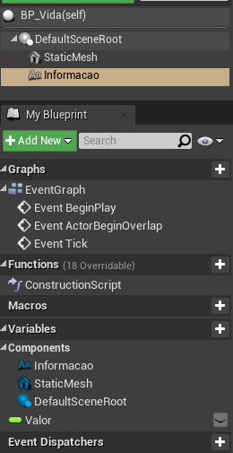
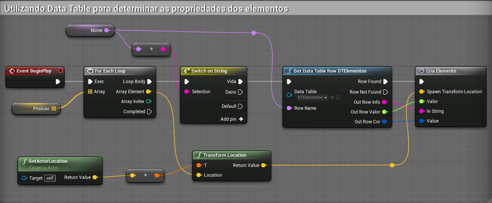
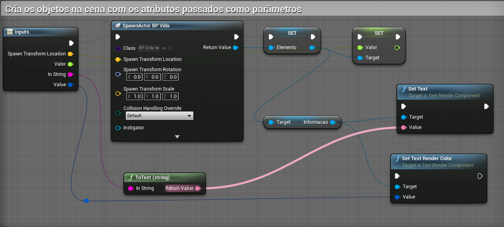

[CafeGeek](https://myerco.github.io/unreal-engine)  / [Desenvolvimento de jogos utilizando Unreal Engine 4](https://myerco.github.io/unreal-engine/unreal.html)

# Data tables

## Conceito
*Data tables* são basicamente estruturas de tabelas de dados disponíveis para os desenvolvedores.  
Definimos variáveis do tipo *Structure* para definir a estrutura das tabelas.

## Criando data tables
1. Objeto *SElementos* do tipo *Structure*.  
  - Variáveis :
  

1. *DTElementos* do tipo *Data Tables*. 
- Menu *Miscellaneous/Data Table*

  
- Devemos definir a estutura de dados da tabela.  
  

- Os dados devem ser inseridos.  

## Implementando o objeto *BP_Vida*
Este objeto deverá estar na cena para interação com o jogador.
  - Variáveis e componentes.  
  

## Implementando o objeto *BP_Elementos*
Este objeto serve como referência na cena para posicionamento de ojetos *BP_Vida*.
  - Variáveis e componentes.

  
  - Observe que a variável *Posicao* é do tipo vector e te a propriedade **Show 3D Widget** esta habilitada para facilitar o posicionamento do elemento na cena.

  

## Implementando a carga dos dados.

  - Para cada elemento do vetor *Posicao* é implementado um objeto do tipo BP_vida nas coordenadas de vetor.

  

  - **Get data Table Row** - Tenta recuperar uma linha da **DataTable** por meio de texto em **RowName**.
  No exemplo a linha recuparada deve coincidir com uma variável passada como parâmetro.

  - Para cada objeto adicionado na cena são definiddas propriedades.

***
## Referências
- [Data Driven Gameplay Elements](https://docs.unrealengine.com/en-US/InteractiveExperiences/DataDriven/index.html)
- [Get Data Table Row](https://docs.unrealengine.com/en-US/BlueprintAPI/Utilities/GetDataTableRow/index.html)
