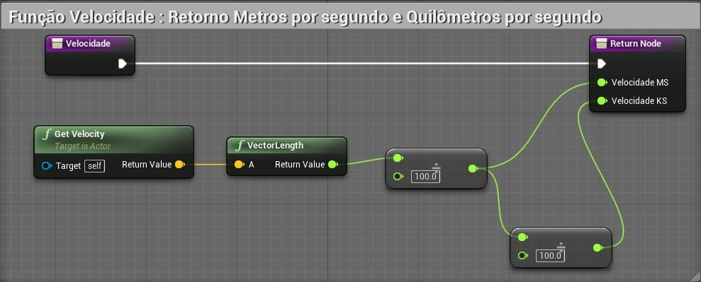

[CafeGeek](https://myerco.github.io/CafeGeek)  / [Desenvolvimento de jogos utilizando Unreal Engine 4](https://myerco.github.io/CafeGeek/ue4_blueprint/index.html)

# Delta time e sistema de coordenadas
Neste capítulo serão apresentados os elementos de controle de tempo (Delta Time) dentro do **Unreal Engine** e utilizar para  implementar movimentação de objetos.
Apresentaremos também como funciona o sistema de coordenadas dos objetos.

## Índice
1. [O que é Delta time?](#1)
1. [Lista de comandos do console](#2)
1. [Delta seconds](#3)
    1. [Tabela de velocidade](#3.1)
    1. [Utilizando o Delta seconds](#3.2)
    1. [Fixando o FPS do projeto](#3.3)
    1. [Vídeo](#3.4)
1. [Timeline](#4)
    1. [Utilizando variáveis no Timeline](#4.1)
    1. [Acionando o evento para alterar a iluminação](#4.2)
    1. [Funções Blueprint para tratamento](#4.3)
    1. [Vídeo](#4.4)
1. [Abrindo portas deslizando](#5)
1. [Abrindo portas girando](#6)
1. [Curves](#7)   
1. [Velocidade](#8)
1. [Sistema de coordenadas](#9)  
    1. [Plano Cartesiano](#9.1)  
    1. [Posição dos elementos](#9.2)  
    1. [Movimento no sistema coordenadas X,Y](#9.3)
    1. [Magnitude](#9.4)  
    1. [Normalização](#9.5)
    1. [Calculando distância](#9.6)
    1. [Verificando para onde o ator está apontando](#9.7)
    1. [Acompanhando o movimento de um objeto.](#9.8)    

<a name="1"></a>
## 1. O que é Delta Time?
É o tempo entre cada frame.  
Frame: Um quadro ou imagem apresentada, uma animação é composta por vários frames.

**Exemplo**

|  |  |  |  |  |  |  |  |  |  | |
|:-:|-|-|-|-|-|-|-|-|-|-|
|Frames  | 1 | 2 | 3 | 4 | 5 | 6 | 7 | 8 | 9 | 10 |
| Delta | 1 | 2 | 3 |4  | 5 | 6 | 7 | 8 | 9 |  |

- 10 Fps = 10 frames a cada segundo.
1 segundo / 9 = 0,1 segundo ou 100ms.
- 100 FPS = 100 frames a cada segundo
1 segundo /99 = 0,01 segundo ou 10ms
- 30 FPS = 1/29 , 0.034 34ms
- 60 FPS = 1/59 , 0.017 17ms

<a name="2"></a>
## 2. Lista de comandos do console
1. Devemos habilitar o console de comandos para verificar e alterar o *FPS* do jogo utilizando o Menu **Project Settings->Open**.   

1. Presionando a tecla  **´** , configurada anteriormente, o editor de comandos aparece na tela.
1. Apresenta o valor de FPS.
```bash
stat fps
```
1. Altera o valor de FPS para 100.
```bash
t.MaxFPS 100
```
1. Exibe informações de desempenho para os threads Frame, Game, Draw, GPU, RHIT e DynRes do projeto.
```bash
stat unit
```
1. Fornece feedback sobre quanto tempo os vários *Ticks* de jogo estão demorando.
```bash
stat game
```

<a name="3"></a>
## 3. Delta seconds
**Delta Seconds** é a quantidade de tempo decorrido desde o último evento **Tick**. Ao multiplicar seu deslocamento por **Delta Seconds**, seu movimento será independente da taxa de quadros.    
Por exemplo, seu peão tem uma velocidade máxima de 100. Se um segundo tivesse se passado desde o último tique de evento, seu peão moveria todas as 100 unidades. Se meio segundo tivesse passado, ele moveria 50 unidades.

<a name="3.1"></a>
### 3.1 Tabela de velocidade

|Distância  | Velocidade | Distância/Velocidade |  FPS | Delta Seconds | Y |
|:-:|-|-|-|-|-|
|100  | 10 | 10 | 100 | 0,1 | 1 |
|100  | 10 | 10 | 60 | 0,166 | 1,6 |
|100  | 10 | 10 | 30 | 0,333 | 3 |
|100  | 10 | 10 | 20 | 0,5 | 5 |

Delta seconds = Intervalo entre os quadros.


<a name="3.2"></a>
### 3.2  Utilizando o **Delta seconds**
Vamos controlar o movimento do objeto independente do *FPS*.  


- **Distancia** - Valor = 1000
- **Velocidade** - Valor = 10
- O resultado esperado é que mesmo com um *FPS* baixo o movimento ainda se mantenha uniforme.

<a name="3.3"></a>
### 3.3 Fixando o *FPS* do projeto
Podemos fixar o *FPS* do projeto utilizando o menu **Project settings->Use fixed frame rate**.  


<a name="3.4"></a>
### 3.4 Vídeo
[](https://youtu.be/gQdT8rah4CU)


<a name="4"></a>
## 4. Timeline
Os nós da linha de tempo são nós especiais dentro de Blueprints que permitem que uma animação simples baseada em tempo seja projetada e reproduzida rapidamente com base em eventos no jogo. As linhas do tempo são como sequências de matinê simples, pois permitem que valores simples sejam animados e que eventos sejam disparados ao longo do tempo.

<a name="4.1"></a>
### 4.1 Utilizando variáveis no Timeline
Para este exemplo vamos utilizar um objeto *Lampada* do tipo **Light Component**  para apresentar a estrutura de nó *TratamentoLuz* do tipo **TimeLine**.

1. Criamos o objeto *BP_ControleLuz* do tipo **Box Trigger**.   
      
  
1. Em *BP_ControleLuz* adicionamos a variável *Lampada* do tipo **PointLight** e a configuramos como publica.
1. Adicionamos na cena um componente **PointLight**.
1. Adicionamos o BP_ControleLuz na cena e associamos o objeto **PointLight** na propriedade *Lampada*.    
  
1. Em *BP_ControleLuz* adicionamos a lógica do tratamento de luz.   
  
1. Variáveis do objeto **TimeLine**.    
  
  - **FloatVariavel** - Controla a intensidade da luz durante o tempo 1.   
  
  - **Vetorvariavel** - Altera o valor das coordenadas durante o tempo 4.    
    
  - **CorVariavel** - Altera as cores da luz conforme o tempo passa.  
    
  - **EventoVariavel** - Dispara um evento no tempo 2,4 e 6.   
  

<a name="4.2"></a>
### 4.2 Acionando o evento para alterar a iluminação


<a name="4.3"></a>
### 4.3 Funções Blueprint para tratamento
- **SetLooping**
- **SetTimeLength**
- **GetTimeLength**
- **GetPlaybackPosition**
- **Auto play**
- **Ignore time dilation**
- **Set timer by event e clear timer**
- **SetTimerbyEvent**
- **ClearAndInvalidateTimerByHandle**
- **SetTimerbyFunction**

<a name="4.4"></a>
### 4.4 Vídeo
[](https://youtu.be/qOUYp-XWUtw)
[](https://youtu.be/EJQwXxjiS58)
[](https://youtu.be/YkvP6tMMly0)
[](https://youtu.be/w5VpoM95B-Q)


<a name="5"></a>
## 5. Abrindo portas deslizando
Neste exemplo vamos implementar um movimento no eixo Y de abertura de uma porta.

1. Adicionando o elemento Movimentando **timeline** e alerando a posição do objeto.   

1. *Movimentando* utiliza a variável Movimento do tipo *Vector*. Somente o valor de Y é alterado.   

1. Salvamos a posição inicial do objeto.    


<a name="6"></a>
## 6. Abrindo portas girando
Neste exemplo vamos implementar um movimento no eixo Z, girando e abrindo a porta.
1. Utilizamos a função **MakeRotator**.   

1. Movimentando utiliza a variável *Angulo* do tipo *Vector*.   

1. Acionando a porta.   


<a name="7"></a>
## 7. Curves
Podemos criar um tipo de objeto **Curve** para que possamos utilizar em vários Blueprints.

1. Miscelanios->Curve.    

1. Objeto C_TempoPorta.       

1. Associando o objeto **C_TempoPorta** a **Movimentando**.   


- **SetVectorCurve**

<a name="8"></a>
## 8. Velocidade
Exemplo de calculo de velocidade.  



<a name="9"></a>
## 9. Sistema de coordenadas
O sistema de coordenadas descreve uma maneira de usar números para especificar a localização de um ponto (ou pontos) no espaço 2D ou 3D. Em um motor de jogo, é função do sistema de coordenadas definir a localização de cada objeto e para qual **direção** ele está voltado. Com esses dados você podemos calcular a distância entre objetos, rotação, velocidade e todos os tipos de outras informações úteis.

<a name="9.1"></a>
### 9.1 Plano Cartesiano   
Para demonstrar vamos utilizar um vetor de 2D (x,y).

|  |  |  |  |  | (Y) |  |  |  |  |  ||
|:-:|-|-|-|-|-|-|-|-|-|-|-|
|  |  |  |  |  |  **5**|  |  |  | D |  ||
|  |  |  |  |  |  **4**|  |  |  |  |  ||
|  |  |  | B |  |  **3**|  |  |  |  |  ||
|  |  |  |  |  | **2** |  |  | C |  |  ||
| |  |  |  |  | **1** |  |  |  |  |  |  |
|**-5** | **-4** | **-3** | **-2** | **-1** | **0** |  **1** | **2** |**3**  |**4**  | **5** |  **(X)**|
|  |  |  |  |  | **-1** |  |  |  |  |  |  |
| |  |  |  |  | **-2** |  |  |  |  |  |  |
|  |  |  |  |  | **-3** |  |  |  |  |  ||
|  | A |  |  |  | **-4** |  |  |  |  |  ||
|  |  |  |  |  | **-5** |  |  |  |  |  ||

<a name="92"></a>
### 9.2 Posição dos elementos
- v = v(x,y)
- A = a(-4,-4)
- B = b(-2,3)
- C = b(3,2)
- D = b(4,5)

<a name="9.3"></a>
### 9.3 Movimento no sistema coordenadas X,Y
Uma direção nos diz como nos mover no sistema de coordenadas x, y. Um valor positivo nos diz para nos movermos na direção positiva e um valor negativo nos diz para nos movermos na direção negativa (com base no sistema de coordenadas).

**Movimentando o elemento B**  
- B = b(-2,3) **->** b(-1,4)

<a name="94"></a>
### 9.4 Magnitude
A Magnitude nos diz o quanto nos movemos. A distância de um movimento provará ser muito útil e pode ser calculada apenas com o vetor. Isso é feito usando o Teorema de Pitágoras. Assuma um objeto na posição (50, 25) e queremos movê-lo para (53, 23). Isso significa um Vetor de (3, -2).

- A = a(-4,-4) **->** a(2,-1)  
  O objeto se deslocou de (-4,-4) até a nova posição (2,1)  
  Andou 6 posições em X e 5 em Y

- Direção de A = (6,5)  
- Distância percorrida = raiz_quadrada(6 ^ *2* + 5 ^*2*) = **7.8**
> Você pode usar isso para calcular novas posições e movimentos. Suponha que você tenha um objeto na posição (12, 4) e deseja movê-lo na direção (3,2), mas deseja que a distância seja 4 vezes a distância normal. Para fazer isso funcionar e obter a nova posição, você multiplica o vetor pelo escalar.V = (3 * 4, 2 * 4) (12, 8) A nova posição no sistema de coordenadas x / y é obtida adicionando este vetor para a posição original: (12 + 12, 4 + 8) (24, 12)

<a name="9.5"></a>
### 9.5 Normalização
Aprendemos que um vetor é um par de números que contém uma direção e que pode ser usado para derivar uma magnitude. Quando um vetor contém um par de números, como (10, 5), ele indica que o movimento será de 10 unidades na direção X positiva e 5 unidades na direção Y positiva. Este vetor especifica quantas unidades mover, mas também indica uma direção geral em porcentagens. Essa é a proporção de movimento de 10 por 5. O cálculo dessa porcentagem de movimento é chamado de Normalização de um vetor.  
O vetor normalizado é um par de números, cada um deles menor que um. Você pode criar um vetor normalizado obtendo a magnitude de um vetor e dividindo cada valor do Vetor pela magnitude. Com um vetor de (3,4) a magnitude é 5.

- 5 = raiz_quadrada(3 ^ *2* + 4 ^*2*)
- (3/5, 4/5) => (.6,.8)

**Resultado**  
O vetor normalizado das coordenadas (3,4) é (-.6,.8).

<a name="9.6"></a>
### 9.6 Calculando distância
- **Cube**  
  **a**=GetActorLocation(0,-600,70)

- **Cube2**  
  **b**=GetActorLocation(600,600,70)

- **Resultado**  
  Resultado =  a - b
  > (600,1200,0)  


- **VectorLength**  
  Calcula o comprimento do vetor.  
  Comprimento = VectorLength(Resultado)
  >  1341.64078


- **GetDistanceTo**    
  Distancia = GetDistanceTo(Cubo,Cubo2)
  > 1341.64078


- **Normalize**  
  **a** = Cubo.GetActorLocation(0,-600,70)   
  Resultado = Normalize(**a**,0)
  > (0,0.99,0.16)
  > Os valores variam entre 0 e 1.


<a name="9.7"></a>
### 9.7 Verificando para onde o ator está apontando
Usaremos várias funções para demonstrar como verificar a direção que o ator está apontando.

- **GetActorForwardVector**   

  **a** = Cubo.GetActorForwardVector()
  > 1,0,0

- **GetActorUpVector**  
    **a** = Cubo.GetActorUpVector()
    > 0,0,1

- **GetActorRightVector**  
  **a** = Cubo.GetActorRightVector()
  > 0,1,0


<a name="9.8"></a>
### 9.8 Acompanhando o movimento de um objeto.
Usaremos a função **FindLookAtRotation**. No exemplo o **Cubo3** vai apontar para a face.      

- Personagem é do tipo **Character**.

***
## Referências
- [Delta timing](https://en.wikipedia.org/wiki/Delta_timing)
- [Understanding Delta time in Games](https://dev.to/dsaghliani/understanding-delta-time-in-games-3olf)
- [How to use delta time](https://answers.unrealengine.com/questions/38798/how-to-use-delta-time.html)
- [Tutorial enentendo o que é o deltatime](https://www.fabricadejogos.net/posts/tutorial-entendo-o-que-o-deltatime/)
- [fps vs capacidade humana](http://teclab.net.br/fps-vs-capacidade-humana/)
- [Timelines](https://docs.unrealengine.com/en-US/ProgrammingAndScripting/Blueprints/UserGuide/Timelines/index.html)
- [Vectors and Unity](http://staffwww.fullcoll.edu/dcraig/csharp/Vectors%20and%20Unity.pdf)
- [Stat Commands](https://docs.unrealengine.com/en-US/TestingAndOptimization/PerformanceAndProfiling/StatCommands/index.html)

***
## Tags
[Blueprint](https://myerco.github.io/CafeGeek/ue4_blueprint/blueprint.html), [Unreal Engine](https://myerco.github.io/CafeGeek/ue4_blueprint/index.html), [CafeGeek](https://myerco.github.io/CafeGeek/),[Vector](#)
