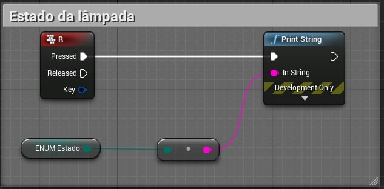

[CafeGeek](http://CafeGeek.eti.br)  / [Desenvolvimento de jogos utilizando Unreal Engine 4](http://cafeGeek.eti.br/ue4_blueprint/index.html)

# Enums - Enumerations

Neste capitulo serão apresentados Enumerações (*Enumeration*). Enumeração é algo como nomear ou numerar um a um (geralmente em uma lista).

## Índice
1. [O que são Enums?](#1)
1. [Criando Enums com Blueprint](#2)
1. [Exemplos de uso (Lâmpada)](#3)
1. [Exemplos de uso (A pedra das emoções)](#4)

<a name="1"></a>
## 1. O que são Enums?
Uma enumeração é um tipo definido pelo usuário que consiste em um conjunto de constantes integrais nomeadas que são conhecidas como enumeradores.

Exemplo:
```cpp
enum cores = { vermelho,amarelo, azul, verde = 20, preto}
```
<a name="2"></a>
## 2. Criando Enums com Blueprint
Execute o comando **blueprints->Enumeration** e logo depois preencha os valores conforme a tela abaixo.  


Objeto criado EN_Estado e EN_Pedra.  


<a name="3"></a>
## 3. Exemplos de uso (Lâmpada)
1. Verificando o estado de uma lâmpada.  

1.  Ligando e desligando.    
   
1.  Verificando o estado utilizando o *enum*.   
  
1.  Ligando e desligando utilizando o *enum*.   


<a name="4"></a>
## 4. Exemplos de uso (A pedra e as emoções)
1. Alterando o estado emocional da pedra.    


1. Apresentando o estado emocional da pedra.   


1. Alterando as cores da pedra conforme a emoção.  


***
## Referências
- [Enums in unreal Engine](https://couchlearn.com/enums-in-unreal-engine-4-blueprints/)

***
## Tags
[Blueprint](https://myerco.github.io/CafeGeek/ue4_blueprint/blueprint.html), [Unreal Engine](https://myerco.github.io/CafeGeek/ue4_blueprint/index.html), [CafeGeek](https://myerco.github.io/CafeGeek/)
