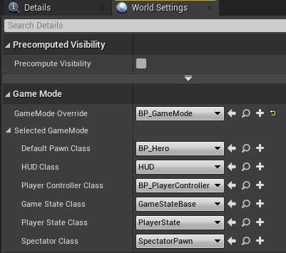
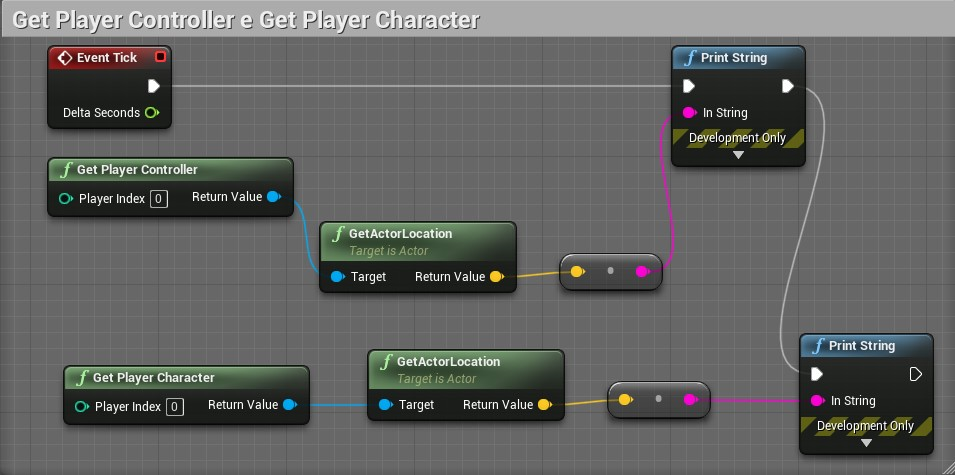
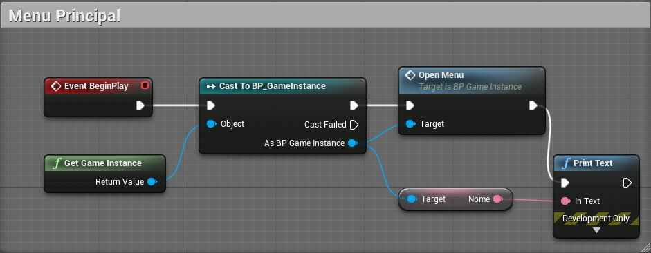

[CafeGeek](https://myerco.github.io/unreal-engine)  / [Desenvolvimento de jogos utilizando Unreal Engine 4](https://myerco.github.io/CafeGeek/ue4_blueprint/index.html)

# Game Instance, Game State e Game Mode
Na estrutura da **Unreal Engine** existem classes para controlar regras do jogo (**GameMode**) e o personagem bem como classes com visibilidade global (**GameInstance**), neste capítulo iremos apresentar estas classes e suas funcionalidades.

## Índice
1. [A organização de classes do Framework](#1)
1. [Como funciona Game Mode e Game State?](#2)
1. [Implementando o GameMode](#3)
    1. [Criando o GameMode](#31)
    1. [GameMode por Level em Word Settings](#32)
    1. [GameMode para o projeto inteiro](#33)
1. [O que é PlayerController?](#4)
    1. [PlayerController vs PlayerCharacter](#41)
1. [GameInstance](#5)    
    1. [Criando GameInstance](#51)
    1. [Adicionando um evento dentro da GameInstance](#52)    
    1. [Chamando a GameInstance para acessar os seus elementos](#53)   

## 1. A organização de classes do Framework
O fluxograma abaixo apresenta como as principais classes de jogo se relacionam entre si.

## 2. Como funciona Game Mode e Game State?
O conceito de "jogo" é dividido em 2 classes. O modo de jogo e o estado são a definição do jogo, incluindo coisas como as regras do jogo e as condições de vitória. Ele só existe no servidor. Normalmente não deve ter muitos dados que mudam durante o jogo e, definitivamente, não deve ter dados transitórios que os clientes precisem saber.

- **GameMode** - Controla como os jogadores entram no jogo utilizando as classes:   
  InitGame, PreLogin, PostLogin e Logout.
- **GameState** - O GameState é responsável por permitir que os clientes monitorem o estado do jogo.  Ele pode controlar as propriedades do jogo, como a lista de jogadores conectados, pontuação da equipe no Capture The Flag, missões que foram concluídas em um jogo de mundo aberto e assim por diante.   

>O **GameState** não é o melhor lugar para controlar coisas específicas do jogador, como quantos pontos um jogador específico marcou para o time em uma partida do Capture The Flag porque isso pode ser tratado de forma mais limpa pelo **PlayerState**. Em geral, o GameState deve rastrear propriedades que mudam durante o jogo e são relevantes e visíveis para todos. Embora o modo Jogo exista apenas no servidor, o Game State existe no servidor e é replicado para todos os clientes, mantendo todas as máquinas conectadas atualizadas conforme o jogo avança.

- **PlayerState** - É o estado de um participante do jogo, como um jogador humano ou um bot que está simulando um jogador.Os dados apropriados em um PlayerState incluem o nome do jogador, pontuação, nível de jogo ou se o jogador esta carregando a bandeira em um jogo CTF.

- **PlayerController** -
Jogadores humanos que entram no jogo são associados a PlayerControllers. Esses PlayerControllers permitem que os jogadores possuam peões no jogo para que possam ter representações físicas no nível. Os PlayerControllers também fornecem aos jogadores controles de entrada (teclado, mouse e etc), um HUD (heads-up display ou interface com o jogador) e um PlayerCameraManager para lidar com as visualizações da câmera.

## 3. Implementando o GameMode
Existem duas formas de informar qual GameMode a jogo deve utilizar, por *Level* e projeto.

### 3.1 Criando o GameMode
Utilizando o menu de contexto escolhemos **Game Mode Base**.

### 3.2 GameMode por Level em Word Settings
 
 - **BP_Hero** - Objeto do tipo **Character**.
 - **BP_PlayerController** - Objeto do tipo **PlayerController**

### 3.3 GameMode para o projeto inteiro
Utilizamos o Menu **Project/Maps & Modes**.  

## 4. O que é PlayerController?
Um **PlayerController** é a interface entre o **Pawn** e o jogador humano que o controla. O **PlayerController** representa essencialmente a vontade do jogador humano é definido por *Level*.

### 4.1 PlayerController vs  PlayerCharacter
Se você deseja implementar alguma funcionalidade de entrada complexa (por exemplo, se houver vários jogadores em um cliente de jogo ou houver uma necessidade de alterar os personagens dinamicamente em tempo de execução), é melhor (e às vezes necessário) usar PlayerController. Neste caso, o PlayerController lida com a entrada e emite comandos para o Pawn.

Por exemplo, em jogos *deathmatch*, o **Pawn** pode mudar durante o jogo, mas o **PlayerController** geralmente permanece o mesmo.

A classe **Character** representa o jogador no mundo do jogo. Ele fornece funcionalidade para animação, colisão, movimento e rede básica e modos de entrada. Portanto, se sua entrada não for complicada e não houver necessidade de alterar o caractere dinamicamente em tempo de execução, a classe de caractere é mais adequada. Por exemplo, você pode usá-lo no jogo de tiro em primeira pessoa para um único jogador.  

- **GetPlayerController** - As coordenadas apresentadas no nó **Print String** serão as coordenadas iniciais do **Pawn**.

- **GetPlayerCharacter** - As coordenadas apresentadas no nó **Print String** variam conforme a movimentação do **Pawn**.

## 5. GameInstance
**GameInstance** é criada quando o jogo é inicializado e ela será válida durante todo o tempo do jogo, similarmente a uma classe GLOBAL para o projeto, permitindo o compartilhamento das variáveis, eventos e funções contidas na **GameInstance** por todos os Levels.   
Tem seu próprio **Event Graph** para permitir desenvolvimento.  

>**Então, para que GameInstance?**
>Para compartilhar variáveis, eventos e funções por todos os levels possibilitando uma programação mais otimizada evitando retrabalho.

### 5.1 Criando GameInstance
Utilizando o menu de contexto escolhemos Bluprint Class e logo em seguida procuramos a classe GameInstance básica.   

### 5.2 Adicionando um evento dentro da GameInstance
Como explicado anteriormente, os eventos e objetos ficaram disponíveis para o projeto. Para este exemplo vamos utilizar um evento customizado **Add Custom Event** no **Event Graph** da **GameInstance**.  

Vamos adicionar uma variável para exemplificar.   

### 5.3 Chamando a GameInstance para acessar os seus elementos
Para este exemplo criamos um Level Vazio e no **Open Level Blueprint** vamos executar a chamada da **GameInstance**.

1. Antes de executar a chamada da **GameInstance** dentro dos objetos é necessário informar para o projeto qual a **GameInstance** padrão.    

1. Logo após podemos utilizar a função **GetGameInstance** que retorna a **GameInstance** definida anteriormente para o projeto.   

***
## Referências
- [Game Mode and Game State](https://docs.unrealengine.com/en-US/InteractiveExperiences/Framework/GameMode/index.html)
- [PlayerController vs Character](https://answers.unrealengine.com/questions/216113/playercontroller-vs-character.html)

***
## Tags
[Blueprint](https://myerco.github.io/CafeGeek/ue4_blueprint/blueprint.html), [Unreal Engine](https://myerco.github.io/CafeGeek/ue4_blueprint/index.html), [CafeGeek](https://myerco.github.io/CafeGeek/)
