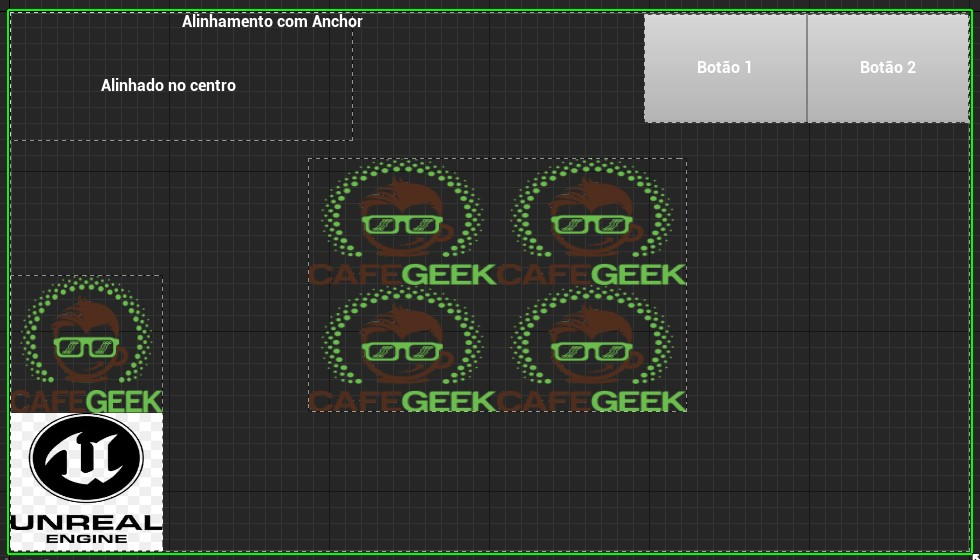
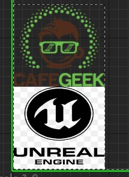

[CafeGeek](https://myerco.github.io/unreal-engine)  / [Desenvolvimento de jogos utilizando Unreal Engine 4](https://myerco.github.io/unreal-engine/ue4_blueprint/index.html)

# HUD - Interface com o jogador
HUD (Heads-up Display) ou UI (Use Interface) é um objeto especial da **Unreal Engine** para apresentar informações sobrepostas na tela e interagir com o jogador.

Vamos apresentar formas de interação e depois construir objetos os necessários.

## Índice
1. [Como interagir com o jogador?](#1)
    1. [Menos é Melhor](#11)
1. [Implementando o Widget para o construir o menu do jogo](#2)
    1. [Criando o Widget](#21)
    1. [Editor de de Widget](#22)
    1. [Hierarquia de elementos](#23)
    1. [Entendo alinhamento utilizando Anchors](#24)            
    1. [Horizontal ou Vertical Box](#25)    
    1. [Grid Panel](#26)    
1. [Lógica de programação do Widget - Graph](#3)
    1. [Event Construct para inicializar variáveis utilizadas no Widget](#31)
    1. [Button e eventos](#32)
    1. [Acionando o botão para abrir um Level](#33)    
    1. [Acionando o botão Sair para finalizar o jogo](#34)        
1. [ Criando um Level Vazio para adicionar o Widget](#4)

## 1. Como interagir com o jogador?
Durante o tempo do jogo é necessário interagir com o jogador de diversas formas, informando status de jogo, personagem e até mesmo guias de missões. Geralmente são informações em formatado texto e imagens 2D que se sobrepõe a tela para informar o jogador.       

De outra forma, o comunicação de ações globais do jogo como por exemplo iniciar uma missão, salvar o jogo, sair do jogo e gerenciamento de configuração são formas de interação jogo vs player que utilizam menus através de botões, caixas rolantes e outros componentes.

## 1.1 Menos é Melhor!
Uma dica simples, segundo as boas práticas de IHC (Interface Homem Computador), é **"Menos é melhor"**, onde devemos apresentar somente o necessário para o jogador e deixar a maior parte da experiência do jogador para o *Gameplay*.

## 2. Implementando o Widget para o construir o menu do jogo

### 2.1 Criando o Widget
Utilizando o **Context Menu** escolha a opção **User Interface/Widget Blueprint**.   

### 2.2 Editor de de Widget
O editor de Widget é divido em :
- **Designer** para apresentação e manipulação de elementos visualmente.
- **Graph** para inserir a lógica de ações utilizando **Blueprint**.      
  

### 2.3 Hierarquia de elementos
Os elementos apresentados na Widget seguem uma hierarquia que determina o posicionamento relativo na tela.  

- Observe que tem vários objetos alinhados hierarquicamente e que neste caso vão nos ajudar e organizar a tela, sendo a raiz da árvore o objeto **BP_HUD_demo**.
- **Canvas Panel, Horizontal Box, Vertical Box Grid Panel** tem propriedades para alinhamento dos elementos hierarquicamente abaixo.
- **Grid Panel** está hierarquicamente superior ao **Image_968"**, isso significa que o texto deverá ser alinhado em relação ao **Grid Panel**
- Abaixo a apresentação dos elementos.  

### 2.4 Entendo alinhamento utilizando Anchors
Para gerenciar melhor o posicionamento de objetos no **Widget Designer** vamos entender o objeto **Anchor** (Âncora).   

- Ancorar um elemento é definir uma posição predefinida na tela.   

- No exemplo abaixo o elemento **Text** está posicionado na tela respeitando a âncora predefinida. A âncora pode ser alterada.  

- Observe os valores de **Position** **X** e **Y** são zero, isso nos diz que a texto esta totalmente alinhado a âncora.  

- Agora vamos dividir a âncora e alinhar o texto dentro das fronteiras da âncora.   

- Agora temos as propriedades **Offset Left** e **Right** com um valor que determina a posição do texto entre as fronteiras da âncora.   

### 2.5 Horizontal ou Vertical Box
Ao adicionar elementos hierarquicamente abaixo de um **Vertical** ou **Horizontal box** eles serão organizados um ao lado do outro.   
     

- Nas propriedades do elemento dentro do **Vertical Box** selecione **Size Fill** para preencher todo espaço do painel.  

### 2.6 Grid Panel
Como o nome anuncia, os elementos hierarquicamente agrupados abaixo do painel serão organizados em forma de um grid (matriz).   

- **Grid Panel** tem uma propriedade especial que determina qual o valor de preenchimento de cada coluna ou linha dentro do grid. O valor varia de 0 a 1, onde 0,5 é metade do espaço e 1 totalmente preenchido.  

- O elemento agrupado também terá as propriedades **Row** e **Col** preenchidas sinalizando qual a posição do elemento dentro do grid.    
]

## 3.  Lógica de programação do Widget - Graph
A lógica de controle de ações dos botões e a inicialização está em **Graph**, onde encontramos alguns eventos já conhecidos como por exemplo **Event Construct** e **Tick**.    

### 3.1 Event Construct para inicializar variáveis utilizadas no Widget

- Ao iniciar o Widget definimos uma variável **Jogador** do tipo **BP_Hero** para que possamos ter acesso as propriedades nome e vida por exmeplo.

### 3.2 Button e eventos
Os elementos do tipo **Button** tem eventos relacionados na sua estrutura, como por exemplo:**On Clicked**,**On Pressed** e outros.

### 3.3 Acionando o botão para abrir um Level
Vamos utilizar o evento OnClick para executar a função **Open Level**. Deverá ser informado o nome do *Level* que queremos abrir.   

### 3.4 Acionando o botão Sair para finalizar o jogo
Ao clicar no botão Sair vamos chamar a função **Quit Game** que finaliza do jogo.  

## 4. Criando um Level Vazio para adicionar o Widget
Neste passo vamos criar um *Level* Vazio para que possamos adicionar a lógica de chamada do Widget menu.   

Caso o Widget seja o menu principal que deverá ser chamado no início do jogo é necessário adicionar o mesmo em [Level e inicialização](https://myerco.github.io/unreal-engine/ue4_blueprint/organizando.html#2)

***
## Referências
- [1.1 - HUD Example](https://docs.unrealengine.com/en-US/Resources/ContentExamples/Blueprints_HUD/1_1/index.html)
- [User Interfaces & HUDs](https://docs.unrealengine.com/en-US/InteractiveExperiences/Framework/UIAndHUD/index.html)
-[Anchors](https://docs.unrealengine.com/en-US/InteractiveExperiences/UMG/UserGuide/Anchors/index.html)
- [Quick Start](https://docs.unrealengine.com/en-US/InteractiveExperiences/UMG/QuickStart/index.html)

***
## Tags
[Blueprint](https://myerco.github.io/unreal-engine/ue4_blueprint/blueprint.html), [Unreal Engine](https://myerco.github.io/unreal-engine/ue4_blueprint/index.html), [CafeGeek](https://myerco.github.io/unreal-engine/)
