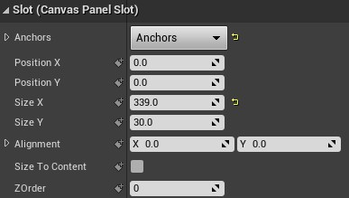
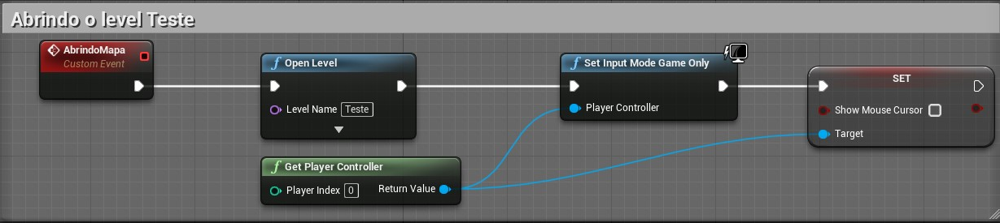
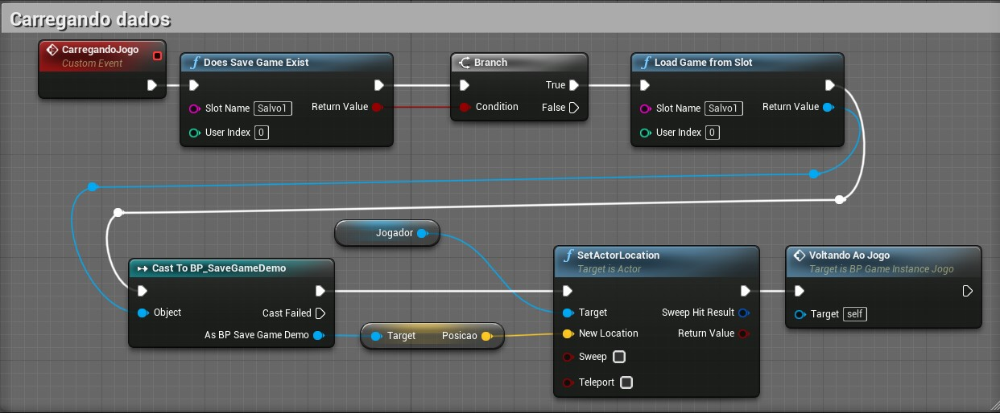
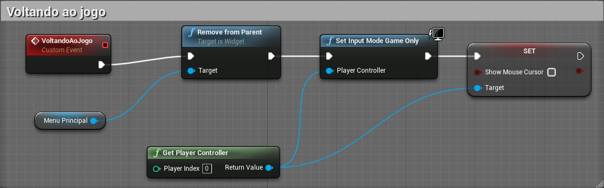
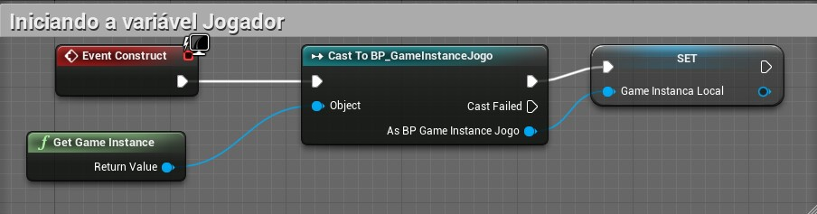

[CafeGeek](https://myerco.github.io/CafeGeek)  / [Desenvolvimento de jogos utilizando Unreal Engine 4](https://myerco.github.io/CafeGeek/ue4_blueprint/index.html)

# HUD - Interface com o jogador
HUD (*Heads-up Display*) ou UI (*Use Interface*) é um objeto especial da **Unreal Engine** para apresentar informações sobrepostas na tela e interagir com o jogador.

Vamos apresentar formas de interação e depois construir objetos os necessários.

## Índice
1. [Como interagir com o jogador?](#1)
    1. [Menos é Melhor](#11)
1. [Implementando o Widget para o construir o menu do jogo](#2)
    1. [Criando o Widget](#21)
    1. [Editor de de Widget](#22)
    1. [Hierarquia de elementos](#23)
    1. [Entendo alinhamento utilizando Anchors](#24)            
    1. [Horizontal ou Vertical Box](#25)    
    1. [Grid Panel](#26)    
1. [Lógica de programação do Widget - Graph](#3)
    1. [Event Construct para inicializar variáveis utilizadas no Widget](#31)
    1. [Button e eventos](#32)
    1. [Acionando o botão para abrir um Level](#33)    
    1. [Acionando o botão Sair para finalizar o jogo](#34)        
1. [Executando o menu](#4)
1. [Apresentando informações para o jogador](#5)
    1. [Barra de vida do jogador](#51)
    1. [O nome do jogador](#52)
1. [Organizando os objetos](#6)
    1. [Criando o objeto SaveGame para salvar dados do jogo](#61)    
    1. [Evento para apresentar o menu na tela](#62)    
    1. [Evento para abrir um Level](#63)    
    1. [Salvando dados](#64)    
    1. [Voltando ao jogo](#65)    
    1. [Evento para carregar dados](#66)        
    1. [Iniciando GameInstance no Widget](#67)                    
    1. [Efetuando as chamadas das funções](#68)                    

## 1. Como interagir com o jogador?
Durante o tempo do jogo é necessário interagir com o jogador de diversas formas, informando status de jogo, personagem e até mesmo guias de missões. Geralmente são informações em formatado texto e imagens 2D que se sobrepõe a tela para informar o jogador.       

De outra forma, o comunicação de ações globais do jogo como por exemplo iniciar uma missão, salvar o jogo, sair do jogo e gerenciamento de configuração são formas de interação jogo vs player que utilizam menus através de botões, caixas rolantes e outros componentes.

## 1.1 Menos é Melhor!
Uma dica simples, segundo as boas práticas de IHC (Interface Homem Computador), é **"Menos é melhor"**, onde devemos apresentar somente o necessário para o jogador e deixar a maior parte da experiência do jogador para o *Gameplay*.

## 2. Implementando o Widget para o construir o menu do jogo

### 2.1 Criando o Widget
Utilizando o **Context Menu** escolha a opção **User Interface/Widget Blueprint**.   

### 2.2 Editor de de Widget
O editor de Widget é divido em :
- **Designer** para apresentação e manipulação de elementos visualmente.
- **Graph** para inserir a lógica de ações utilizando **Blueprint**.

  

### 2.3 Hierarquia de elementos
Os elementos apresentados na Widget seguem uma hierarquia que determina o posicionamento relativo na tela.    

- Observe que tem vários objetos alinhados hierarquicamente e que neste caso vão nos ajudar e organizar a tela, sendo a raiz da árvore o objeto **BP_HUD_demo**.
- **Canvas Panel, Horizontal Box, Vertical Box Grid Panel** tem propriedades para alinhamento dos elementos hierarquicamente abaixo.
- **Grid Panel** está hierarquicamente superior ao **Image_968"**, isso significa que o texto deverá ser alinhado em relação ao **Grid Panel**
- Abaixo a apresentação dos elementos.  

### 2.4 Entendo alinhamento utilizando Anchors
Para gerenciar melhor o posicionamento de objetos no **Widget Designer** vamos entender o objeto **Anchor** (Âncora).   

- Ancorar um elemento é definir uma posição predefinida na tela.   

- No exemplo abaixo o elemento **Text** está posicionado na tela respeitando a âncora predefinida. A âncora pode ser alterada.  

- Observe os valores de **Position** **X** e **Y** são zero, isso nos diz que a texto esta totalmente alinhado a âncora.  

- Agora vamos dividir a âncora e alinhar o texto dentro das fronteiras da âncora.   

- Agora temos as propriedades **Offset Left** e **Right** com um valor que determina a posição do texto entre as fronteiras da âncora.   

### 2.5 Horizontal ou Vertical Box
Ao adicionar elementos hierarquicamente abaixo de um **Vertical** ou **Horizontal box** eles serão organizados um ao lado do outro.   
     

- Nas propriedades do elemento dentro do **Vertical Box** selecione **Size Fill** para preencher todo espaço do painel.  

### 2.6 Grid Panel
Como o nome anuncia, os elementos hierarquicamente agrupados abaixo do painel serão organizados em forma de um grid (matriz).   

- **Grid Panel** tem uma propriedade especial que determina qual o valor de preenchimento de cada coluna ou linha dentro do grid. O valor varia de 0 a 1, onde 0,5 é metade do espaço e 1 totalmente preenchido.  

- O elemento agrupado também terá as propriedades **Row** e **Col** preenchidas sinalizando qual a posição do elemento dentro do grid.    

## 3.  Lógica de programação do Widget - Graph
A lógica de controle de ações dos botões e a inicialização está em **Graph**, onde encontramos alguns eventos já conhecidos como por exemplo **Event Construct** e **Tick**.    

### 3.1 Event Construct para inicializar variáveis utilizadas no Widget

- Ao iniciar o Widget definimos uma variável **Jogador** do tipo **BP_Hero** para que possamos ter acesso as propriedades nome e vida por exmeplo.

### 3.2 Button e eventos
Os elementos do tipo **Button** tem eventos relacionados na sua estrutura, como por exemplo:**On Clicked**,**On Pressed** e outros.

### 3.3 Acionando o botão para abrir um Level
Vamos utilizar o evento OnClick para executar a função **Open Level**. Deverá ser informado o nome do *Level* que queremos abrir.   

### 3.4 Acionando o botão Sair para finalizar o jogo
Ao clicar no botão Sair vamos chamar a função **Quit Game** que finaliza do jogo.  

## 4. Executando o menu
Neste passo vamos criar um Level Vazio executar o menu.   
Caso o Widget seja o menu principal que deverá ser chamado no início do jogo é necessário adicionar o mesmo em [Level e inicialização](https://myerco.github.io/CafeGeek/ue4_blueprint/organizando.html#2)
1. *Empty Level* (Level Vazio).    

1. Em **Open Level blueprint** vamos adicionar a lógica para criar um objeto do tipo **BP_HUD_Demo** e adicionar na tela com a função **AddToViewPort**.   

## 5. Apresentando informações para o Jogador
Para este passo vamos implementar os seguintes elementos.    

- **TextBlock** - Para apresentar o nome do jogador.
- **ProgressBar** - Para apresentar a vida do jogador.

### 5.2 Fazendo a ligação do elemento da interface com uma função
Devemos conectar os elementos da interface com funções por meio de uma propriedade **Bind**.   

### 5.1 Função do calculo de vida do jogador
Abaixa a lógica a função associada a elemento **ProgressBar**.    

### 5.2 Função para pegar o nome do jogador

- Podemos utilizar [Variáveis estruturadas](https://myerco.github.io/CafeGeek/ue4_blueprint/structure_variaveis_estruturadas.html) para manipulação das propriedades do jogador.   

## 6 Organizando os objetos
Vamos organizar todos os objetos criados para controlar melhor a lógica de programação de cada elemento, considerando:  
- Separação da lógica de negócios e os visuais de sua IU
- Permite iteração rápida de layout e visuais
- Depuração eficaz da lógica de negócios
- Performance

### 6.1 Criando o objeto SaveGame para salvar dados do jogo
Para exemplificar algumas funções do menu como por exemplo salvar dados do jogo vamos realizar as seguintes operações.

1.  Implementar um objeto BP_SaveGameDemo do tipo **SaveGame**, para isso utilizamos o menu de contexto e escolhemos **Blueprint**.    

1. Adicionamos variáveis dentro do objeto para definir o que deve ser salvo, neste exemplo utilizaremos a variável **JogadorInfo** do tipo **S_jogador** que é uma [Variável Structure](https://myerco.github.io/CafeGeek/ue4_blueprint/structure_variaveis_estruturadas.html).               

  

Nos próximos passos vamos criar o objeto *BP_GameInstanceJogo* do tipo [**GameInstance**](https://myerco.github.io/CafeGeek/ue4_blueprint/gameinstance_state_mode.html#5) e adicionar os eventos customizados (*Add custon event*) a seguir.

### 6.2 Evento para apresentar o menu na tela
Implementamos um evento customizado para adicionar lógica dos eventos.

- **Show Mouse Cursor** - Esta variável é uma propriedade de **PlayerController**  e Configurando para **true** o ponteiro do mouse deve aparecer na tela.
- **Set Input Mode UI Only** - Esta função determina que o controle de entrada de dados será somente pelo **Widget**.

### 6.3 Evento para abrir um Level

- **Open Level** - Função para abrir um *Level* do jogo. É necessário informar o nome do leveel no parâmetro *Level Name*.
- **Set Input Mode Game Only** - Esta função determina que o controle de entrada de dados será somente pelo jogo.

### 6.4 Salvando dados

- **Create Save Game Object** - Cria um objeto do tipo **BP_SaveGameDemo**, definido anteriormente.
- **Save Game to Slot** - Salva os dados e cria um **Slot Name** *Salvo1*.

### 6.5 Evento para carregar dados

- **Does Save Game Exist** - Retorna verdadeiro se encontra um jogo salvo com o nome *Salvo1* informado em **Slot Name**.
- **Load Game from Slot** - Carrega as variáveis salvas em **Slot Name**, neste caso *Salvo1*.

### 6.6 Voltando ao jogo

- **Remove from Parent** - Remove o widget de seu **Widget** pai. Se este **widget** foi adicionado à tela do jogador ou à janela de visualização, ele também será removido desses recipientes.

### 6.7 Iniciando GameInstance no Widget
No objeto BP_HUD_Demo vamos substituir ou adicionar a lógica dos botões, mas antes devemos inicializar a **GameInstance**.    

### 6.8 Efetuando as chamadas das funções
No evento click dos botões vamos adicionar os eventos construidos dentro da gameinstance isolando a regra de negócios (dados e lógica e manipulação).   

> Repetimos esse processo para associar todos os eventos aos botões.

***
## Referências
- [1.1 - HUD Example](https://docs.unrealengine.com/en-US/Resources/ContentExamples/Blueprints_HUD/1_1/index.html)
- [User Interfaces & HUDs](https://docs.unrealengine.com/en-US/InteractiveExperiences/Framework/UIAndHUD/index.html)
-[Anchors](https://docs.unrealengine.com/en-US/InteractiveExperiences/UMG/UserGuide/Anchors/index.html)
- [Quick Start](https://docs.unrealengine.com/en-US/InteractiveExperiences/UMG/QuickStart/index.html)

***
## Tags
[Blueprint](https://myerco.github.io/CafeGeek/ue4_blueprint/blueprint.html), [Unreal Engine](https://myerco.github.io/CafeGeek/ue4_blueprint/index.html), [CafeGeek](https://myerco.github.io/CafeGeek/)
