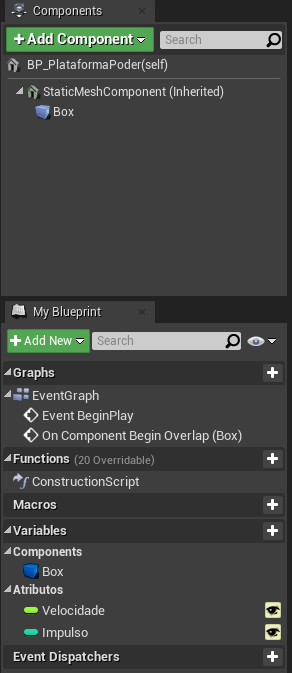
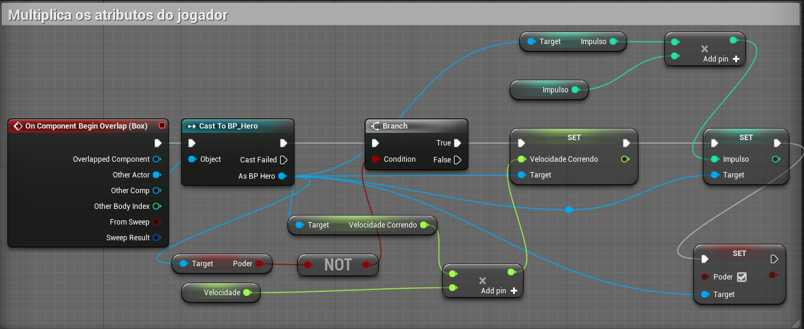
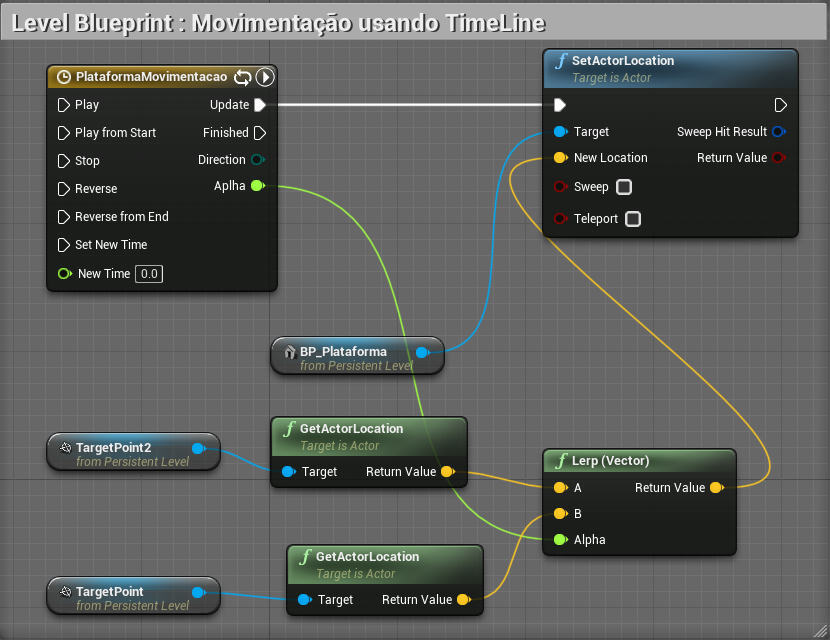
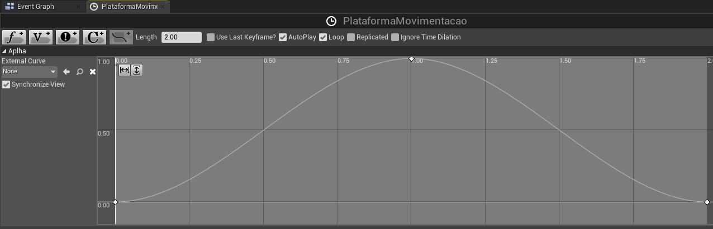
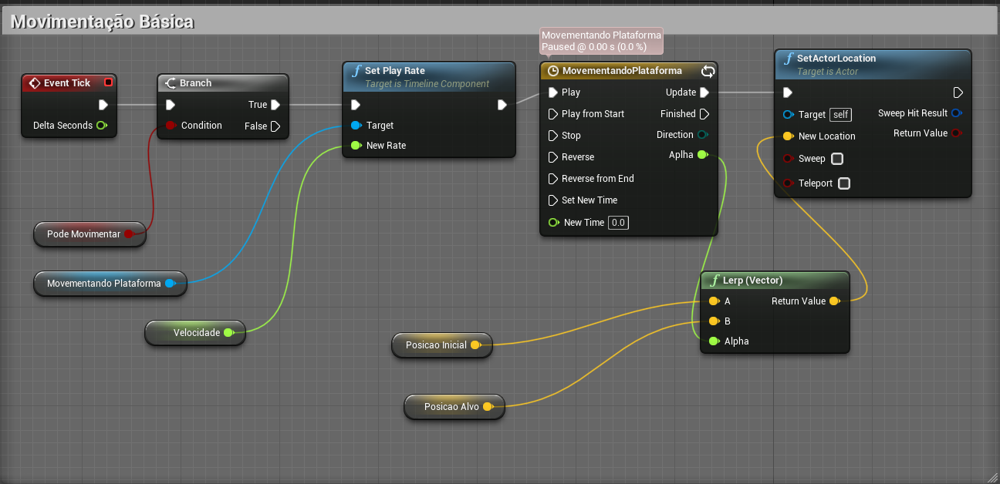

# Movimentação estruturada

> 1. 

## Os objetos

1. Plataforma de Poder *PowerUp*
- StaticMeshActor <- Actor
  - Static Mesh   
  
- Aumentando a  velocidade de corrida e
força de impulso   

1. Plataforma de desafio *Movement Plataform*
- A movimentação tem que ser interpolada, quer dizer que as coordenadas tem que ser atualizadas.
- Exemplos de coordenadas:
|| X |Y  |Z  |
|:-:|:-:|:-:|:-:|
|Início|1  | 1 | 1 |
|| 1 | **2** | 1 |
|| 1 | **3** | 1 |
|| 1 | **4** | 1|
|Fim| 1 | 5  | 1 |  

### Características
- Determinar o destino da movimentação.
- Implementar a lógica de movimentação usando *timeline*.
- Declarar a variável *Velocidade* para controle da velocidade de movimentação.

1. Plataforma de gatilho *Trigger Plataform*

## 1. Preparando componentes

## 2. TimeLine

## 3. Controles

## Referências
- [Setting Up Character Movement](https://docs.unrealengine.com/en-US/InteractiveExperiences/HowTo/CharacterMovement/index.html)
- [Grabbing Objects](https://www.youtube.com/watch?v=HnR1Gf5gXcY)
