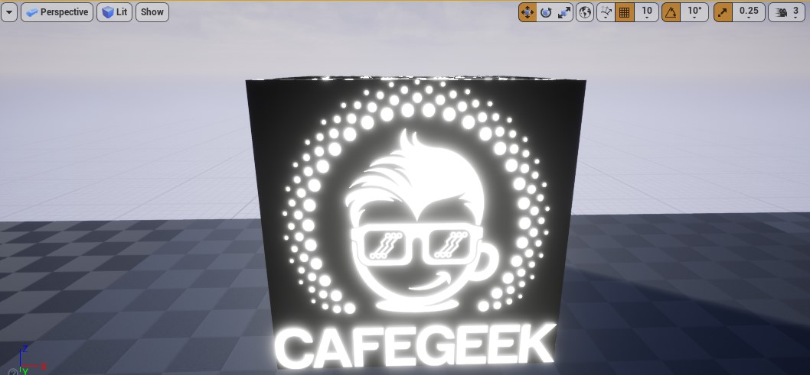
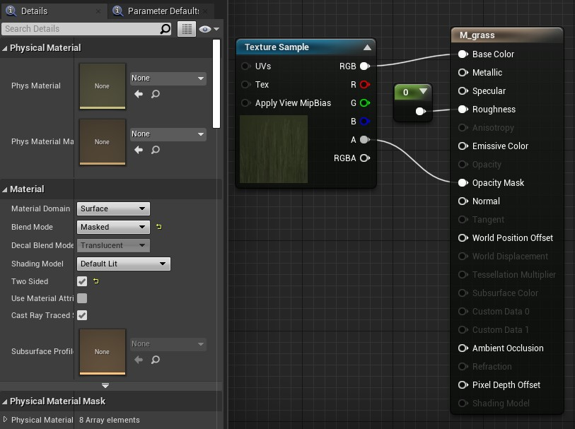
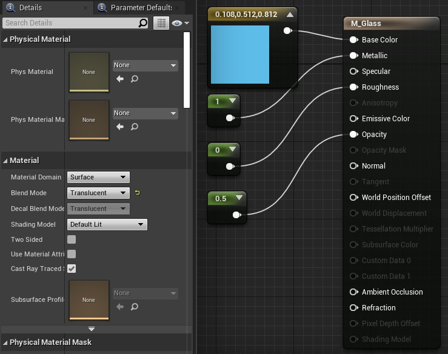
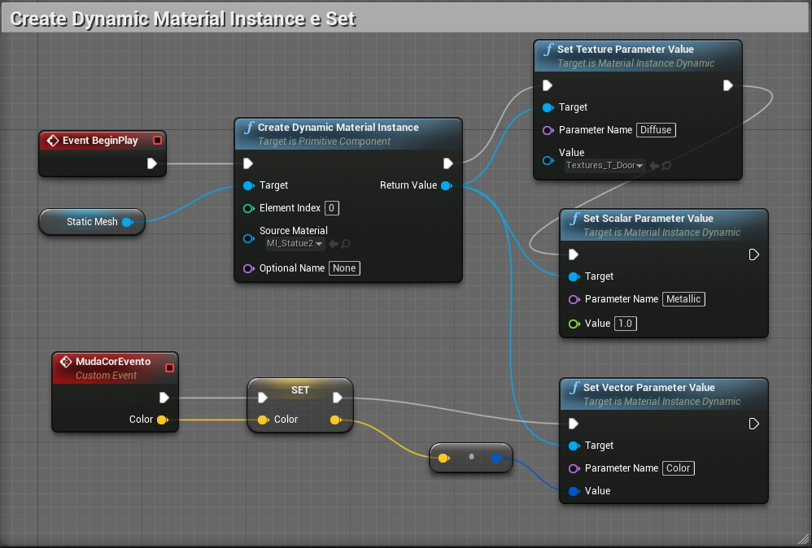

[CafeGeek](https://myerco.github.io/CafeGeek)  / [Desenvolvimento de jogos utilizando Unreal Engine 4](https://myerco.github.io/CafeGeek/ue4_blueprint/index.html)

# Trabalhando com Materiais

## Índice
1. Editor de materiais;
1. Material Instance;
1. Materiais e Blueprint;
1. Material Function;


<a name="1"></a>
## 1. O que é um material?
Podemos definir como uma coleção de imagens e instruções computacionais que são adicionadas a superfícies poligonais.


No exemplo acima podemos verificar uma esfera com diferentes tipos de materiais adicionados na sua superfície, onde cada um interage de forma diferente a iluminação.
Podemos definir o material como uma pintura que é aplicada em superfícies.
Contudo materiais não são somente cores mas representação de imperfeições da superfície a qual foram aplicadas, como por exemplo, rasuras, aspereza e transparência.
Atualmente os materiais são baseados em simulações físicas do mundo.

<a name="2"></a>
## 2 Materiais de base física - PBR
PBR significa P hysically B ased R endering e significa que o material descreve as propriedades visuais de uma superfície de uma maneira realmente plausível, de modo que os resultados realistas sejam possíveis em todas as condições de iluminação. A maioria dos mecanismos de jogo e ferramentas de criação de conteúdo modernos dão suporte aos materiais do PBR porque eles são considerados a melhor aproximação de cenários do mundo real para renderização em tempo real.

<a name="2"></a>
## 2. Estrutura do Material no Unreal Engine 4
A primeira e mais importante coisa a saber sobre os Materiais é que eles não são construídos por meio de código, mas por meio de uma rede de nós de script visual (chamados de Expressões de Material) dentro do Editor de Material. Cada nó contém um fragmento de código HLSL, designado para executar uma tarefa específica. Isso significa que, conforme você constrói um Material, está criando código HLSL por meio de scripts visuais.

<a name="2"></a>
## 3. Editor de materiais
1. Menu de contexto para criar um material.     

  

1. Salve o material como *M_Base*

<a name="3"></a>
## 3. Atributos importantes
Abaixo citamos os mais importantes atributos dos materiais.
- Base Color
- Metallic   Valores entre 0 e 1
- Roughness   Valores entre 0.1 e 0.9
- Emissive     Valores entre 0 e 1
- Normals

1. O nó principal e suas propriedades.

  

<a name="4"></a>
## 4. Valores que determinam a física
- Constant 1

  

- Constant 2

  

- Constant 3

  


<a name="5"></a>
## 5. Texture samples


## Texturas
- Tamanhos :
  1x1, 2x2, 4x4, 1024x1024 e 8192x8192
  - As texturas serão importadas em qualquer tamanho, mas não serão mipmaps.
- Formatos
- Importando
- Compressão

## 6. Material expressions
Os nós de Expressão de Material contêm pequenos fragmentos de código HLSL que realizam tarefas muito específicas dentro de um Material. Os materiais são construídos usando combinações de nós de Expressão de Material que são combinados para realizar certas tarefas.

### 6.1 Conectando material Expressions
Abaixo um exemplo de conexão.


  - Botão direito do mouse em qualquer área de trabalho (RMB) abre a lista de nós disponíveis.
  - É possível fazer a busca de nós na aba **Palette** e arrastar com o mouse na área de trabalho.

### 6.2 Combinando material Expressions
A área de trabalho é um modelo de programação visual que permite combinar variáveis e funções para construir a estrutura final. Cada nó apresenta uma saída para o próximo nó.    

**Lógica**
```c++
M_Base =  ( TexturaSample( panner(TexCoord(),0.1,0) ) * Vetor3(0.0664,0.0366,0.401));
```
> **Atenção**
devemos considerar o tipo de valor de retorno do nó no momento da conexão para evitar erros de tipos conflitantes, por exemplo float3 * float2.

**Gráfico de nós**


- **Panner** - Produz coordenadas de textura UV que podem ser usadas para criar texturas panorâmicas ou móveis.
- **Multiply** - Pega duas entradas, multiplica-as juntas e produz o resultado. Quando você passa valores de cor como entrada, os resultados são semelhantes aos resultados do modo de mesclagem de camada Multiply no Photoshop.   
Se você passar valores com vários canais, cada canal será multiplicado separadamente. Por exemplo, se você passar valores de cor RGB para cada entrada, o canal R da primeira entrada é multiplicado pelo canal R da segunda entrada e o resultado é armazenado no canal R da saída; o canal G da primeira entrada é multiplicado pelo canal G da segunda entrada e o resultado é armazenado no canal G da saída e assim por diante.      
Ambas as entradas devem ter o mesmo número de valores, a menos que um dos valores seja um único valor flutuante. Nesse caso, cada canal da entrada multicanal é multiplicado pelo valor flutuante único e armazenado em um canal separado do valor de saída.
- **TexCoord** - Gera coordenadas de textura UV na forma de um valor vetorial de dois canais, permitindo que os materiais usem diferentes canais UV, especifiquem ladrilhos e, de outra forma, operem nos UVs de uma malha.

### 6.2 Exemplo do nó Lerp
Interpola Linearmente entre A e B com base em Alfa (100% de A quando Alfa = 0 e 100% de B quando Alfa = 1)


## 7. Texturas


### 7.1 Roughness - rugosidade


### 7.2 Normal - Coordenadas normals


### 7.3 Metallic - Metálica


## 8. Aplicando o material no objeto


## 8. Material Inputs
Nem todas as entradas serão úteis para cada tipo de material que você criar. Por exemplo, ao desenvolver uma Função de Luz - um Material que é aplicado a uma luz - você só pode usar a entrada Cor Emissiva no material e nada mais, visto que outras entradas, como Metálico ou Aspereza, não seriam aplicáveis. Por isso, é importante saber que tipo de material você está criando antes de começar a se preocupar muito com as entradas. As três propriedades de controle primárias são:

- Blend Mode - controla como o seu material se mesclará com os pixels por trás dele.
- Shading Model - define como a luz é calculada para a superfície do material.
- Material Domain - controla como o material deve ser usado, por exemplo, se ele deve fazer parte de uma superfície, uma função leve ou um material pós-processamento.

  

### 8.1 Inputs
- **Base Color** - A Cor Base define a cor geral do Material, obtendo um valor Vector3 (RGB) em que cada canal é automaticamente fixado entre 0 e 1.
- **Normal maps** - A entrada Normal leva em um mapa normal, que é usado para fornecer detalhes físicos significativos para a superfície, perturbando o "normal", ou direção de frente, de cada pixel individual.
- **Emissive** - Dá aos artistas uma maneira muito barata e eficaz de dar a ilusão de que um Material está lançando luz quando na verdade não está. Os materiais emissivos fazem isso permitindo que o artista empurre os valores da entrada emissiva acima de 1,0, o que empurrará o material para a faixa HDR, emitindo um efeito Bloom que você pode ver ao olhar para uma fonte de luz muito brilhante.   


- **World position Offset** - Permite que os vértices de uma malha sejam manipulados no espaço do mundo pelo Material. Isso é útil para fazer objetos se moverem, mudarem de forma, girarem e uma variedade de outros efeitos. Isso é útil para coisas como animação ambiente.

Os valores do nó Constant Vector 3, representam as coordenadas de posição do mundo (x,y,z) respectivamente.

  Exemplo:    

  


## 9. Material propriedades
- **Unlit Shading Model** - Produz apenas Emissivo para cores, tornando-o perfeito para efeitos especiais como fogo ou iluminação de objetos. Observe que, neste exemplo, o Material não está projetando luz na cena. Em vez disso, seu alto valor Emissivo resulta em um efeito de brilho, que também é captado pela Máscara de Sujeira aplicada à câmera. Parece iluminar, mas nenhuma luz ou sombra será projetada por este objeto.

  

  

- **Masked Blend Mode** - É usado para objetos nos quais você precisa controlar seletivamente a visibilidade de forma binária (liga / desliga). Por exemplo, considere um material que simula uma cerca de arame ou grade. Você terá algumas áreas que parecem sólidas, enquanto outras são invisíveis. Esses materiais são perfeitos para o modo de mesclagem mascarada.     
  

  

- **Translucent Blend Mode** - É usado para objetos que requerem alguma forma de transparência.
    

Resultado

    

## 4. Material Instance;
A *Mateial Instance* ou Instanciação de Material é uma maneira de criar um Material pai, que pode então ser usado como base para fazer uma ampla variedade de Materiais filhos de aparência diferente. Para obter essa flexibilidade, o *Material Instancing* usa um conceito chamado herança: as propriedades do pai são fornecidas aos seus filhos. Aqui está um exemplo de herança de material em ação.

### 4.1 Preparando o Material
1. Criamos uma copia de M_Base com o nome M_Base_parametros.
1. Convertemos os nós em parâmetros para que possam ser manipulados posteriormente pelo material instance.    
  
1. Definimos os seguintes atributos nos parâmetros:
  - **Parameter name** - Escolha um nome para o parâmetro que representa o input do material.
  - **Group** - Usado para agrupar os parâmetros por um determinado valor ou tema.
    Sugestão de grupos:
      - Texture Parameter Values.
        - Diffuse,NormalMap, Rough Texture
      - Scalar Parameter Values.
        - Metallic, Roughness
      - Vector Parameter Values.
        - Color (R,G,B,A), UVTiling(R,G,B,A)

### 4.1 Criando material instance
Selecione o material M_Base ou outro material e com o botão direito acione o menu de contexto e escolha **Create Material Instance**.     

  

### 4.2 Editor de material Instance

  

- **Details** - Propriedades
- **Basico** - Grupo definido nos parâmetros dentro do material pai.
- **Color, Metallic, Roughness, Specular** - Parâmetros criados dentro do material pai. Podem ser alterados e até salvos.
- **Parent** - Material pai.

### 4.3 Parâmetros

## 5. Materiais e Blueprint
- Create material instance->Set Texture Parameter Value


- No Level Blueprint implemente a lógica para chamar o Evento **MudaCorEvento**.

  


## 6. Material Function;

***

## Referências
- [Shaders: o que são e para que servem?](https://www.tecmundo.com.br/voxel/especiais/182970-shaders-o-que-sao-e-para-que-servem-.htm)
- [Physically Based Materials](https://docs.unrealengine.com/en-US/RenderingAndGraphics/Materials/PhysicallyBased/index.html)
- [Texture Import Guide](https://docs.unrealengine.com/en-US/RenderingAndGraphics/Textures/Importing/index.html)
- [Material Expression Reference](https://docs.unrealengine.com/en-US/RenderingAndGraphics/Materials/ExpressionReference/index.html)
- [Coordinates Expressions](https://docs.unrealengine.com/en-US/RenderingAndGraphics/Materials/ExpressionReference/Coordinates/index.html)
- [Math Expressions](https://docs.unrealengine.com/en-US/RenderingAndGraphics/Materials/ExpressionReference/Math/index.html#power)
- [1.10 - World Position Offset](https://docs.unrealengine.com/en-US/Resources/ContentExamples/MaterialNodes/1_10/index.html)
- [1.9 - Normal](https://docs.unrealengine.com/en-US/Resources/ContentExamples/MaterialNodes/1_9/index.html)
- [Material Blend Modes](https://docs.unrealengine.com/en-US/RenderingAndGraphics/Materials/MaterialProperties/BlendModes/index.html)
- [Creating and Using Material Instances](https://docs.unrealengine.com/en-US/RenderingAndGraphics/Materials/HowTo/Instancing/index.html)
