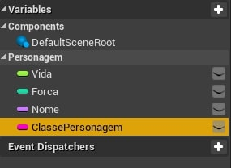
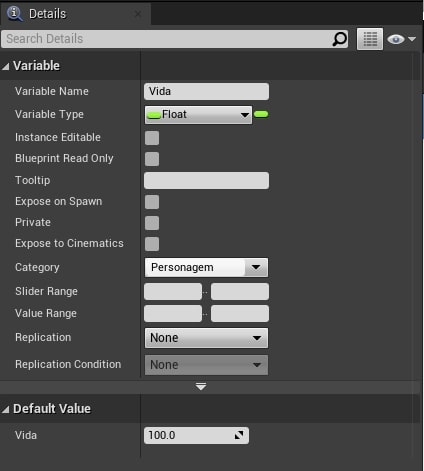
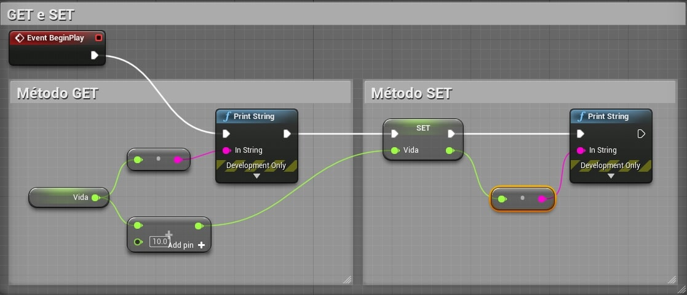
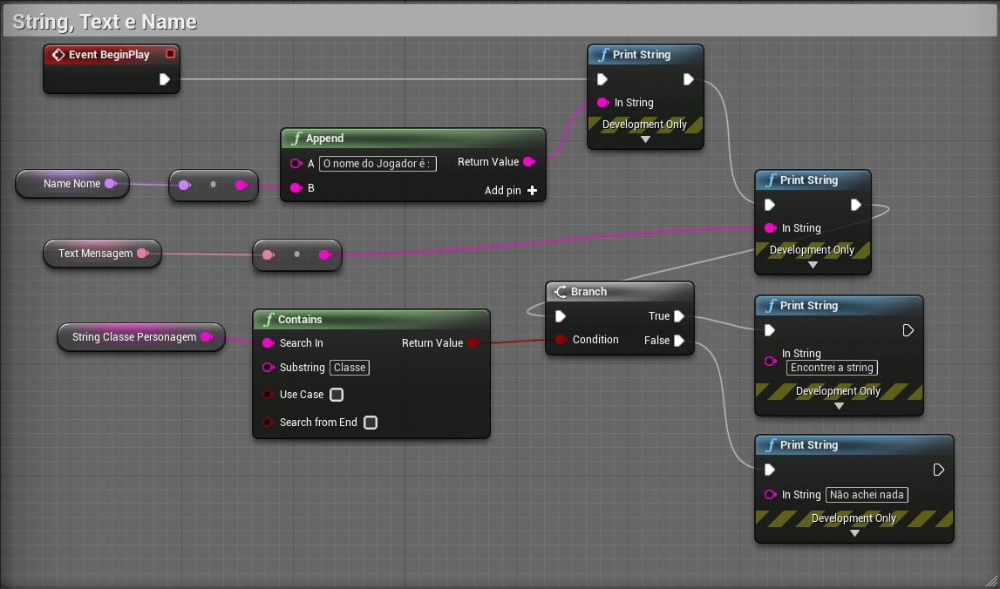
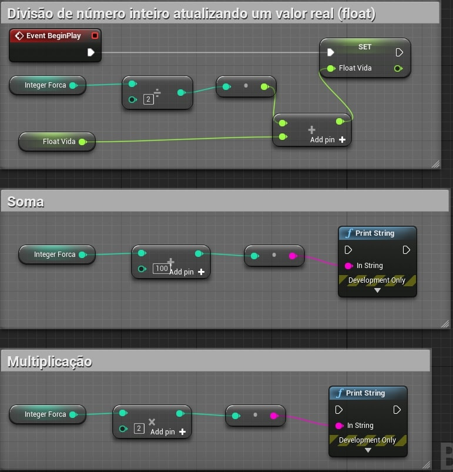
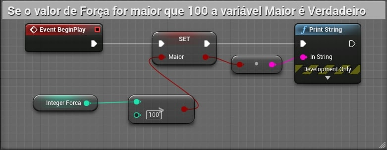
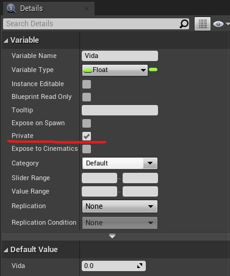
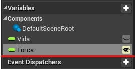

[CafeGeek](https://myerco.github.io/unreal-engine)  / [Desenvolvimento de jogos utilizando Unreal Engine 4](https://myerco.github.io/unreal-engine/ue4_blueprint/index.html)

# Trabalhando com variáveis
Neste capítulo serão descritas as estruturas de armazenamento em memória e a sua manipulação.

## Índice
1. [O que são variáveis?](#1)  
1. [Tipos de variáveis](#2)  
1. [Declarando variáveis](#3)  
1. [Métodos Get e Set](#4)  
1. [String, Name e Text](#5)  
     1. [Tratamento de strings](#51)  
1. [Integer e Float](#6)  
1. [Boolean](#7)
1. [Variável Pública e Privada](#8)

<a name="1"></a>
## 1. O que são variáveis?
Variáveis são propriedades que contêm um valor ou fazem referência a um objeto ou ator no mundo. Essas propriedades podem ser acessíveis internamente ao **Blueprint** que as contém, ou podem ser tornadas acessíveis externamente para que seus valores possam ser modificados por designers que trabalham com instâncias do **Blueprint** colocadas em um nível.

<a name="2"></a>
## 2. Tipos de Variáveis
Para armazenar qualquer informação na memória devemos definir um tipo de dados primitivo ou mesmo uma estrutura de dados, a seguir alguns tipos de dados:

**Boolean**  
Armazena valores falso ou verdadeiro (true e false).
```cpp
  bool VariavelBoolean;
  VariavelBoolean = true;
```
**Integer**   
Valores inteiros entre −2.147.483.648 e 2.147.483.647
```cpp
  int VariavelInt;
  VariavelInt = 1;
```
**Float**   
Valores com casas decimais tal como 0,0553, 101,2887 e -78,322 .
```cpp
  float VariavelFloat;
  VariavelFloat = 2.4;
```
**String**   
Grupo de caracteres alfanuméricos.
```cpp
  FString VariavelString ;
  VariavelString = "Alo mundo!!";
```
<a name="3"></a>
## 3. Declarando variáveis   
Declarando variáveis informamos ao computador que estamos reservando um espaço de memória temporário.  



1. Propriedades   
As variáveis tem tipos e propriedades que determinam o sua utilização.  


> Observe que a propriedade **Category** agrupa as variáveis por uma categoria.

<a name="4"></a>
## 4. Métodos Get e Set
Para acessar as variáveis utilizamos os métodos **Get** e **Set**.
- **Get**: Obtém o valor de uma variável.
- **Set**: Atualiza o valor da variável.



<a name="5"></a>
## 5. String, Name e Text
O armazenamento de caracteres alfanuméricos, *string*, apresetam diversas estruturas para melhor utilização e armazenamento.

| Variável |Tamanho  |  |
|:-:|-|-|
| **Text** | 40 Bytes | Podemos adicionar opções avançadas como exemplo **String Table**, ideal para textos longos que podem variar conforme a lingua definida pelo jogador.  |
| **String** | 16 Bytes | Armazenamento e consumo de memória mediano |
| **Name**| 8 Bytes |  Cadeias de caracteres  curtas que ocupam pouca memória.|

<a name="51"></a>
### 5.1 Tratamento de strings

- **Append** - Concatena duas ou mais strings.
- **Contains** - Procura uma sequencia de caracteres dentro de uma string.

<a name="6"></a>
## 6. Integer e Float
Valores numéricos utilizam operadores matemáticos para a sua manutenção.  

- (+) - soma.
- (*) - Multiplicação.
- (/) - Divisão.

<a name="7"></a>
## 7. Boolean
Armazena dois valores : falso (*false*) ou verdadeiro (*true*).  



<a name="8"></a>
## 8. Variável Pública e Privada
Como especificar quais variáveis de um objeto um usuário pode acessar e quais estão fora dos limites? - usando os especificadores de controle de acesso público e privado.

**Privada**  
Com a opção Privada marcada em uma variável, isso evita que a variável seja modificada de **Blueprints** externos.  


**Pública**  
Para permitir que uma variável seja modificada de fora de seu **Blueprint**, torne-a pública.  


***

## Referências
- [Blueprint Variables](https://docs.unrealengine.com/en-US/Engine/Blueprints/UserGuide/Variables/index.html)
- [Coding Standard](https://docs.unrealengine.com/en-US/Programming/Development/CodingStandard/index.html)
- [Properties](https://docs.unrealengine.com/en-US/Programming/UnrealArchitecture/Reference/Properties/index.html)
- [String](https://docs.unrealengine.com/en-US/BlueprintAPI/Utilities/String/index.html)
- [Srting Tables](https://docs.unrealengine.com/en-US/Gameplay/Localization/StringTables/index.html)
- [Integer](https://docs.unrealengine.com/en-US/BlueprintAPI/Math/Integer/index.html)
- [Float](https://docs.unrealengine.com/en-US/BlueprintAPI/Math/Float/index.html)

***
## Tags
[Blueprint](https://myerco.github.io/unreal-engine/ue4_blueprint/blueprint.html), [Unreal Engine](https://myerco.github.io/unreal-engine/ue4_blueprint/index.html), [CafeGeek](https://myerco.github.io/unreal-engine/)
