# Como são formados os objetos em gráficos 3D?
Neste capitulo será apresentados os elementos que constituem uma imagem 3D utilizando como exemplo softwares como o Unreal Engine e Maya Autodesk.

## Índice
1. [Quais são os elementos que compõem imagens?](#1)
1. [O que são Pontos?](#2)
    1. [Pixel](#1)
    1. [Bits por pixel](#1)    
    1. [Unreal Engine com pixel](#1)        
1. [Linhas, raios e segmentos](#1)
1. [Planos e Triângulos](#2)
1. [Polígonos](#3)
1. [Valores de ponto flutuante](#3)
1. [Cor](#5)  
1. [Transparência com Alpha](#6)
1. [Sistemas de coordenadas](#4)
    1. [À esquerda e à direita serão entregues de coordenadas](#41)
1. [Processamento de imagens](#5)
    1. Pipeline
    1. CPU.
    1. GPU.

## 1. Quais são os elementos que compõem imagens?
Imagens apresentadas nos dispositivos de saída são formadas por pontos  construídos e organizados pelas seguintes estruturas:

### 1.1 Bitmap
Um bitmap é um tipo de imagem que é usado para armazenamento de imagens e pode ser definindo como um mapa de bits.
Cada pedaço da imagem é composto por um ponto chamado de pixel.

### 1.2 Vector Graphics
São arquivos de imagens que são utilizados que calculam a posição dos pontos.   
Em um programa de gráficos vetoriais, fornecemos o ponto inicial e o ponto final e o programa faz o resto.

Mas tem outra vantagem. Se aplicarmos zoom a uma imagem bitmap, podemos ver os pixels e teremos uma imagem ruim. Em gráficos vetoriais, ampliar uma imagem não envolve uma imagem ruim porque a imagem é criada por uma fórmula matemática.

### 1.3 Lista de formatos que o Unreal Engine  suporta
- .bmp - Bitmap
- .float
- .pcx
- .png
- .psd - Vector Graphics
- .tga
- .jpg - Bitmap com metadados e compressão
- .exr

## 2. O que são Pontos?
Na geometria, um ponto é representado por sua coordenada no espaço. Geometria usa um sistema de coordenadas cartesianas, onde as coordenadas de um ponto em espaço são representados pela distância ao longo de cada um dos eixos principais para o ponto.

Pontos são representados por pixels em monitores.

### 1.1 Pixel
Pixel é o menor elemento em um dispositivo de exibição, sendo que cada pixel é composto por um conjunto de 3 pontos: verde, vermelho e azul.

Um exemplo de formação de imagens.    

### 1.2 Bits por pixel
As cores do pixel dependem da quantidade de bits por pixel (bpp).

- 1 bpp, 2(1) = 2 colors (monochrome)
- 2 bpp, 2(2) = 4 colors
- 3 bpp, 2(3) = 8 colors
- 4 bpp, 2(4) = 16 colors
- 8 bpp, 2(8) = 256 colors
- 16 bpp, 2(16) = 65,536 colors ("Highcolor" )
- 24 bpp, 2(24) = 16,777,216 colors ("Truecolor")

Aumentando a qualidade de cores a imagem terá uma aparencia mais realista mas consumira mais memória e processamento.

### 1.3 Uma dica para utilizar texturas no Unreal Engine
Formatos de textura menores resultam em materiais mais rápidos (por exemplo, [DXT1](https://www.khronos.org/opengl/wiki/S3_Texture_Compression) é de 4 bits por pixel, DXT5 é de 8 bpp, ARGB descompactado é de 32 bpp).

>**DXT1**   
Compressão de imagens que usam blocos de bits.    
**GIMP**    
[Exportando imagens do **Gimp** com compressão DXT1](
https://wiki.thedarkmod.com/index.php?title=DDS_Creation_with_GIMP)

## 2. Linhas, raios e segmentos
Uma linha tem direção e comprimento infinito. A direção de uma linha pode ser definido por dois pontos distintos pelos quais a linha passa.    
Um raio começa em um ponto e se estende infinitamente em uma direção distante do ponto. Um raio é definido por um ponto e uma direção.    
Um segmento de linha é uma linha de comprimento finito definida por seus dois pontos finais.    
>Em computadores, devemos lidar com quantidades finitas, então não podemos tirar o total extensão de uma linha ou raio de acordo com sua definição matemática. No computador gráficos quando nos referimos a “linhas”, geralmente nos referimos a segmentos de linha.

## 3. Planos e Triângulos
Um plano é uma folha orientada em 3 espaços sem espessura e com uma extensão infinita.
Um plano é definido por três pontos não colineares que cruzam o plano ou por um ponto no plano e uma direção perpendicular ao plano.      
A direção perpendicular a um plano é chamado de **Normal** ao plano.    
Um triângulo também é definido por três pontos no espaço 3 chamados **Vértices** (singular vértice). O triângulo está para o plano assim como o segmento de reta está para a reta. UMA triângulo envolve uma área finita definida pela região interior delimitada pela linha
segmentos que unem seus vértices.

## 4. Polígonos (Polygon)
As imagens tridimensionais formatas no computador são compostas por polígonos.
Polígonos são uma coleção de vértices, arestas e faces que definem a forma do objeto poliédrico.

### 4.1 Polígonos no Maya
Utilizando as opções em **Poly Modeling** podemos definir uma séria de elementos poligonais.      
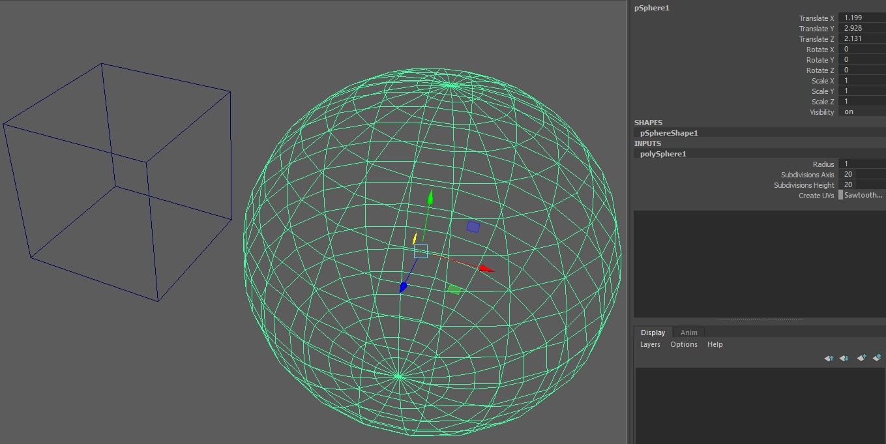

- **Channel Box/Layer Editor** - Propriedades do objeto com a sua quantidade de subdivisões, estes valores podem ser manipulados aumentando ou diminuindo a quantidade de arestas.
- Apresentado a quantidade de vértices e arestas.   
  **Display > Heads up display > Poly Count**.      

  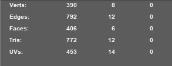

### 4.2 Polígonos no Unreal Engine
Selecionando **Brush Wireframe** no **View Port** ou pressionando *Alt+2* a estrutura de malha de vértices dos polígonos na cena.       
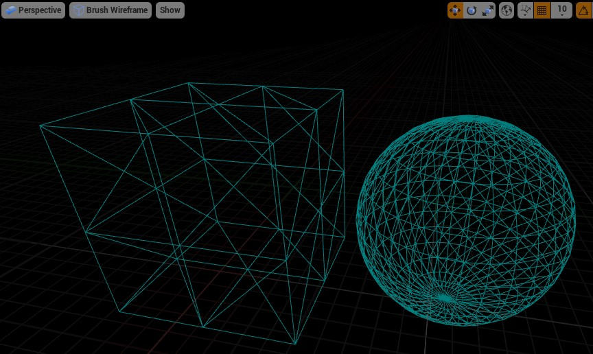

- Apresentado a quantidade de vértices e arestas.   
  **Window > Statistics**.      

  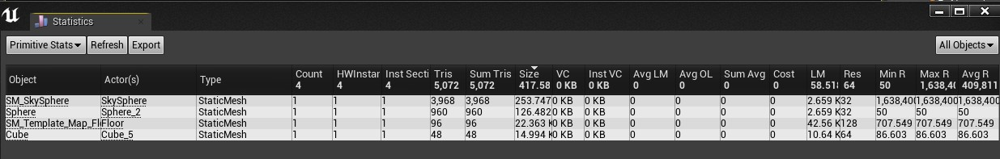

## 5. Face
São as superfícies planas que constituem um sólido. Consistem em triângulos (malha de triângulo), quadriláteros ou outros polígonos convexos simples, uma vez que isso simplifica a renderização.

### 5.1 Faces no Maya
Com botão direito pressionado (RMB) escolha **Face** para selecionar  a face.   
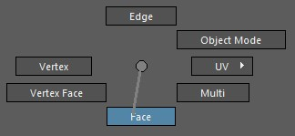   
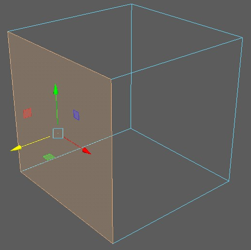

### 5.2 Faces no Unreal Engine
Somente é possível selecionar faces e vértices de objetos do tipo **Geometry** em **Place Actors**.   
É necessário habilitar as opções de edição em **Modes >  Brush Editing**.   

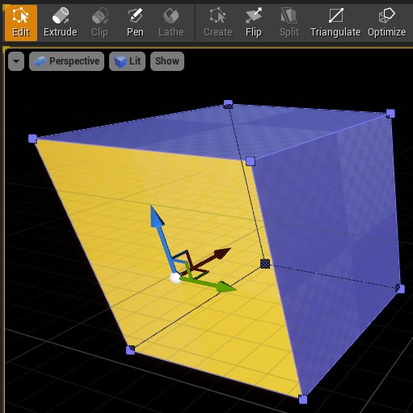

## 6. Aresta
São segmentos de reta que são as intersecções de duas faces contíguas.

### 6.1 Arestas no Maya
Selecionamos com RMB a opção **Edge**.    

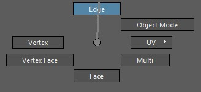     
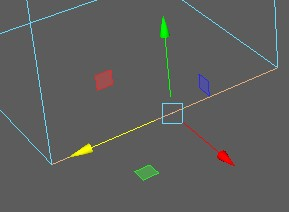

### 6.2 Arestas no Unreal Engine
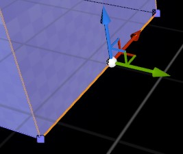

## 7. Vértices
São os pontos de encontro das arestas.

### 7.1 Arestas no Maya
Selecionamos com RMB a opção **Vertex**.    

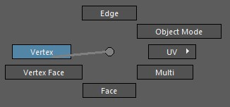     
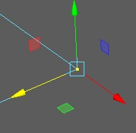

### 7.2 Arestas no Unreal Engine

## 8. Valores de ponto flutuante
Na matemática, todos os cálculos são exatos e realizam aritmética sobre os valores e não alteram sua precisão. No entanto, os computadores armazenam aproximações para números reais como valores de ponto flutuante e realizando operações aritméticas podem fazer com que sua precisão mude. Nem todos os números reais podem ser representados exatamente por uma representação de ponto flutuante. Números como π e outros transcendentais os números têm uma expansão decimal infinita.
A natureza aproximada dos números de ponto flutuante geralmente levanta sua cabeça ao comparar números de ponto flutuante e outras estruturas compostas de números de pontos, como pontos, vetores, retas, planos, matrizes e assim por diante.

## 9. Sistemas de coordenadas
Objetos em Computação Gráfica possuem descrições numéricas (modelos) que caracterizam suas formas e dimensões. Esses números se referem a um sistema de coordenadas, normalmente o sistema Cartesiano de coordenadas: x, y e z.  Em alguns casos, precisamos de mais de um sistema de coordenadas:–  Um sistema local para descrever partes individuais de uma máquina, por exemplo, que pode ser montada especificando-se a relação de cada sistema local das várias peças.   

Normalmente, os softwares de elementos gráficos 3D, como por exemplo Maya ou Blender,  usam um dos dois tipos de sistemas de coordenadas cartesianas de esquerda e direita. Em ambos os sistemas de coordenadas, o eixo x positivo aponta para a direita e o eixo y positivo aponta para cima.

### 9.1 À esquerda e à direita serão entregues de coordenadas
Você pode lembrar para qual direção o eixo z positivo aponta, apontando os dedos de sua mão direita ou esquerda na direção x positiva e curvando-os na direção y positiva. A direção do seu polegar aponta em sua direção ou para longe de você, é a direção em que o eixo z positivo aponta para esse sistema de coordenadas. A ilustração a seguir mostra esses dois sistemas de coordenadas.   

- **Unreal Engine** - Utiliza o sistema de coordenadas *Left-Handed*.
- **Maya** - Utiliza o sistema de coordenadas *Right-Handed*

## 10. Cor
Uma cor é descrita para o computador como uma tupla ordenada de valores de um **cor space** (espaço de cor). Os próprios valores são chamados de **components**(componentes) e são coordenados no espaço de cores. O GDI do Windows representa as cores como uma tupla ordenada de componentes vermelhos, verdes e azuis com cada componente no intervalo [0 . 0 , 1 . 0] representado como uma quantidade de bytes sem sinal no intervalo [0 , 255].
Por padrão, o Windows GDI usa o espaço de cores RGB.

Em computação gráfica, muitas vezes é conveniente usar as cores HLS e HSV.
HLS: matiz, leveza, saturação
HSV: matiz,saturação,valor

## 11. Transparência com Alpha
Muitas vezes, em computação gráfica, desejamos combinar pixels como se eles fossem pintados em folhas transparentes empilhadas umas sobre as outras. No Direct3D, a transparência é representada como um canal adicional de informações que representam a quantidade de transparência do pixel.   
Quando um pixel é totalmente opaco, seu valor alfa é 1 . 0 e este pixel completamente obscurece qualquer coisa por trás dele. Quando um pixel é totalmente transparente, seu valor alfa é 0 . 0 e tudo por trás do pixel aparece. Quando o valor alfa é entre 0 e 1, o pixel é parcialmente transparente. O valor alfa de um pixel pode ser usado para combinar o primeiro plano do pixel com algum plano de fundo baseado
na seguinte fórmula:
C = αC f + (1 - α ) C b
Quando α = 0, a cor resultante C não contém nenhuma quantidade de primeiro plano
cor C f e toda a cor de fundo C b . Quando α = 0 . 5, a cor resultante
contém uma mistura igual de C f e C b . Quando α = 1 . 0, a cor resultante contém
apenas a cor de primeiro plano C f e nenhuma quantidade da cor de fundo C b .
O canal alfa de um pixel também pode ser usado para mascaramento generalizado e fosco
efeitos, além de simples transparência. Nestes casos, uma fórmula diferente
é usado para combinar pixels de primeiro e segundo plano. O alfa de um pixel é
independente do espaço de cor do qual o pixel é desenhado

***

## Referências
- [Game Engine Overview](https://www.slideshare.net/sharadmitra/game-engine-overview)
- [Polygon Mesh](https://pt.qaz.wiki/wiki/Polygon_mesh)
- [How to Prepare Textures](https://vvvv.org/documentation/howto-prepare-textures)
- [Computer Graphics. image treatment](https://www.petervaldivia.com/computer-graphics/)
