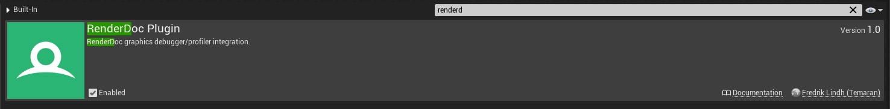
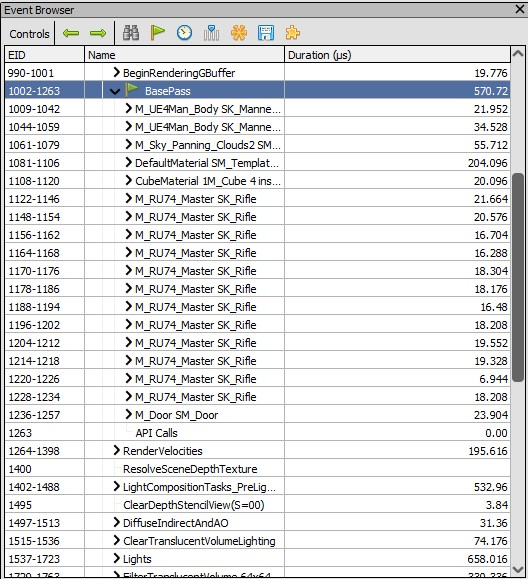

# Entendendo o processo de renderização

## Índice
1. [O processo de renderização](#1)
    1. [RTR - Real-time Rendering](#1.1)
    1. [Pipeline](#1.1)
    1. [Deferred shading](#1.1)
    1. [Forward shading](#1.1)    
1. [GBuffer](#2)            
1. [Geometry Rendering](#2)    
    1. [Drawcalls](#2.1)
    1. [Renderdoc](#2.1)    
    1. [Performance](#2.1)        
1. [Vertex Shaders](#3)        
1. [Rasterizing e Overshading](#3)     

1. O custo para renderizar muitos poligonos é muitas vezes menor que o Drawcall.
1. 50.000 triângulos podem rodar pior que 50 milhões dependendo da implementação.
1. drwacall tem uma despesa básica, portanto, otimizar poli de baixo para super poli pode fazer nenhuma diferença.  

## 1. O aplicativo e plugin Renderdoc
1. Ativando o Plugin no Unreal Engine 4.
  
  *Figura: Edit->Plugins*  

1. Instalação do aplicativo no Windows.
Baixe aqui
1. Capturando o frame desejado.
        
  *Figura: Icon no Viewport*  

1. Carregando o frame capturado.
  
  *Figura: Aba Localhost - UEEditor*  

1. Apresentando a textura carregada e suas saídas por processamento.
  
  *Figura: A aba Textures Viewer*  
1. Lista de elementos renderizados por ordem de execução.
      
  *Figura: Event Browser*  
  - Para apresentar o tempo de duração de cada Drawcall clique em **Time Durations for the Drawcalls**.

1. Componentes = DrawCalls
1. Componentes ocluem e são renderizados um por um.
1. Mesclar em um único ator geralmente não faz diferença para a renderização.
1. para diminuir o drawcalls é melhor usar menos modelos maiores do que muitos modelos pequenos.
1. você não pode fazer muito isso, no entanto, isso afeta todo o resto negativamente.
  - pior para oclusão.   
  a oclusão é mais rápida por si só, mas não será capaz de fazer um trabalho bom o suficiente, tem menos objetos que precisam ser verificados quanto à oclusão, mas tem uma chance menor de realmente ocluir alguma coisa
  - pior para o lightmapping      
  lightmap tem uma quantidade limite de espaço, a quantidade máxima de espaço é a textura do mapa de luz, independentemente da resolução, o mapa de luz também tem um limite de resolução superior.
  Por exemplo imagens de 4k, 4.096 já é enorme para um lightmap.
  Se você fizer modelos muito grandes, eventualmente eles simplesmente ficarão sem espaço UV.
  - pior para calculo de colisão.
  - pior para memoria.

## Referências

1. [Real-Time Rendering Fundamentals](https://www.unrealengine.com/en-US/onlinelearning-courses/real-time-rendering-fundamentals)
1. [How Unreal Renders a Frame](https://interplayoflight.wordpress.com/2017/10/25/how-unreal-renders-a-frame/)
1. [Introduction to Decal Rendering](https://samdriver.xyz/article/decal-render-intro)
