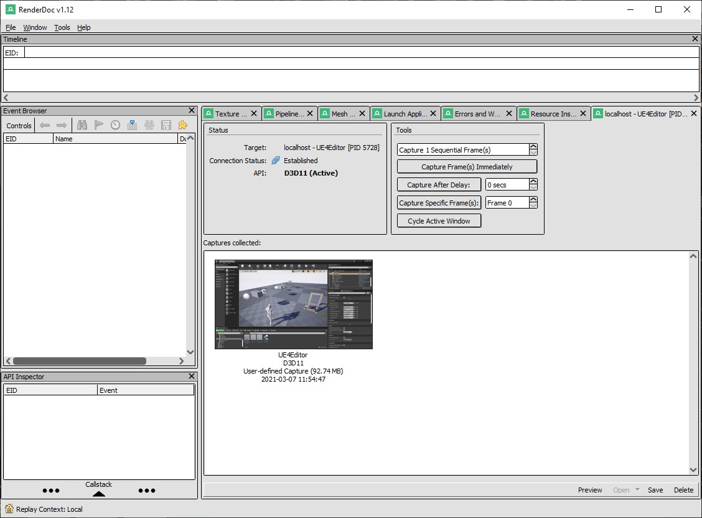

# Entendendo o processo de renderização
Neste capitulo serão apresentados quais são os passos para processamento de imagens no computador.

## Índice
1. [Entendendo como os processos são executados pelo sistema operacional](#1)
1. [O processo de renderização pela GPU](#2)
    1. [Aplicação](#2.1)
    1. [Geometria](#2.2)    
    1. [Renderização](#2.3)        
    1. [Conclusão](#2.4)            
1. [O aplicativo e plugin Renderdoc](#3)    
    1. [Ativando o Plugin no Unreal Engine 4](#3.1)
    1. [Conclusão](#3.2)           
1. [GBuffer](#2)            
1. [Geometry Rendering](#2)    
    1. [Drawcalls](#2.1)
    1. [Renderdoc](#2.1)    
    1. [Performance](#2.1)        
1. [Vertex Shaders](#3)        
1. [Pixel Shaders](#4)
1. [Rasterizing e Overshading](#3)     

## 1. Entendendo como os processos são executados pelo sistema operacional
Em computação, um processo é uma instância de um programa de computador que está sendo executada. Ele contem o código do programa e sua atividade atual. Dependendo do sistema operacional, um processo pode ser feito de várias linhas de execução que executam instruções concorrentemente. O sistema operacional seleciona um processo da fila de aptos para receber o processador. O processo selecionado passa do estado de apto para o estado executando. O módulo do sistema operacional que faz essa seleção é chamado de escalonador.

   
*Figura: Fila de Processos  - Autor*

- **Criado** - Enquanto o processo está sendo criado, esse é seu estado.
- **Apto** -Esse é como um estado de ponto de partida, aqui ficam os processos que estão prontos para serem processados.
- **Espera** - Esse é um estado especial que na verdade está mais para uma característica de outros estados, basta observar os processos que estão nos estado de prontidão e os que estão aguardando eventos, pois ambos também estão em um estado de espera.
- **Execução** - Quando o processo está sendo executado, seu estado passa a ser este.
- **Encerrado** -Esse é o último estado  de um processo, sua finalização, seja de forma voluntária, como quando ele não é mais necessário ou de forma involuntária, como as ocasionadas por um erro.
- **RPC** - Remote Procedure Call (Chamada de Procedimento Remoto) é uma tecnologia para a criação de programas distribuídos servidor/cliente que provê um paradigma de comunicação de alto nível no sistema operacional, á presumindo a existência de um protocolo de transporte, como TCP/IP ou UDP, para carregar a mensagem entre os programas comunicantes.
- **Threads** - Thread é um pequeno programa que trabalha como um subsistema, sendo uma forma de um processo se auto dividir em duas ou mais tarefas. É o termo em inglês para Linha ou Encadeamento de Execução. Essas tarefas múltiplas podem ser executadas simultaneamente para rodar mais rápido do que um programa em um único bloco ou praticamente juntas, mas que são tão rápidas que parecem estar trabalhando em conjunto ao mesmo tempo.

## 2. O processo de renderização pela GPU
A renderização GPU torna possível usar sua placa de vídeo para renderização, ao invés da CPU. Isso pode acelerar a renderização, porquê as GPUs modernas são desenhadas para fazer muito processamento de números. Por outro lado, elas também têm algumas limitações na renderização de cenas complexas devido à memória mais limitada, e questões com interatividade quando usando a mesma placa de vídeo para visualização e renderização. A renderização ocorre mediante o envio de comandos para a GPU, que gera a tela de forma assíncrona. Em algumas situações, a GPU pode ter muito trabalho para fazer, e a CPU terá de aguardar antes de enviar novos comandos.

    
*Figura: Pipeline de computação de gráfica - autor*

### 2.1 Aplicação
Etapa de toda a lógica da mecânica dos elementos que são apresentados.

- **Animations** - Animações calcula quando as Animações iniciam e terminam.
- **System Coordinates** - Posição de modelos calcula a posição dos objetos e sua influência.
- **Artificial intelligence** - Inteligência Artificial determina como o objeto se movimenta e qual o seu estado.
- **Spawn and Hide objects** - Ou Criar e destruir objetos é a lógica necessária para determinar onde os objetos aparecem no mundo.

### 2.2 Geometria
A etapa de geometria (com pipeline de geometria), que é responsável pela maioria das operações com polígonos e seus vértices (com pipeline de vértices), pode ser dividida nas tarefas a seguir. Depende da implementação específica de como essas tarefas são organizadas como etapas reais do pipeline paralelo.

- **Model 3D** - Modelo 3D é o processo onde os objetos são desenhados na cena, entre eles vértices, triângulos e o sistema de coordenadas.
- **Distance Culling** - *Distance Culling* ou Corte de Distância Remove objetos que estão além de um valor X da câmera.
- **Frustim Culling** - *Frustim Culling* ou Corte de câmera remove objetos que não estão a frente da câmera.
- **Occlusion Culling** - *Occlusion Culling* ou Corte de oclusão é o processo que desativa a renderização de objetos quando eles não são vistos pela câmera porque estão obscurecidos (obstruídos) por outros objetos. Isso não acontece automaticamente na computação gráfica 3D, pois na maioria das vezes os objetos mais distantes da câmera são desenhados primeiro e os objetos mais próximos são desenhados por cima deles (isso é chamado de “overdraw”).

### 2.3 Renderização
- **DrawCalls** - Grupo de polígonos que compartilham a mesmo material. Os desenhos de chamadas, em uma tradução pé da letra, basicamente são quantos objetos estão sendo desenhados na tela. Você deseja manter esse número baixo para manter um bom desempenho, portanto, nas luzes dos pixels, fazem os objetos serem desenhados tantas vezes quanto as luzes que os afetam.
  
  *Figura: Drawcalls - Unreal Tips*
- **Vertex Shaders** - É uma função de processamento gráfico usada para adicionar efeitos especiais a objetos em um ambiente 3D executando operações matemáticas nos dados de vértice dos objetos. Cada vértice pode ser definido por muitas variáveis diferentes. Por exemplo, um vértice é sempre definido por sua localização em um ambiente 3D usando as coordenadas x-, y- e z-. Os vértices também podem ser definidos por cores, texturas e características de iluminação. Os Vertex Shaders não alteram realmente o tipo de dados; eles simplesmente mudam os valores dos dados, de modo que um vértice emerge com uma cor diferente, texturas diferentes ou uma posição diferente no espaço.

    
  *Figura: Phong-shading - wikipedia*
- **Pixel Shader** - Os Pixel Shader, calculam a cor e outros atributos de cada "fragmento": uma unidade de trabalho de renderização que afeta no máximo um único pixel de saída. Os tipos mais simples de sombreadores de pixel geram um pixel da tela como um valor de cor; sombreadores mais complexos com várias entradas / saídas também são possíveis. Os sombreadores de pixel variam desde simplesmente sempre a saída da mesma cor, até a aplicação de um valor de iluminação, até o mapeamento de saliências, sombras, realces especulares, translucidez e outros fenômenos. Eles podem alterar a profundidade do fragmento (para buffer Z) ou produzir mais de uma cor se vários destinos de renderização estiverem ativos.
     
  *Figura: Shading_models - wikipedia*
- **Geometry Shaders** - Recebe como entrada um conjunto de vértices que formam uma única primitiva, por exemplo, um ponto ou triângulo. O sombreador de geometria pode então transformar esses vértices conforme achar necessário antes de enviá-los para o próximo estágio de sombreador. O que torna o shader de geometria interessante é que ele é capaz de converter a primitiva original (conjunto de vértices) em primitivas completamente diferentes, possivelmente gerando mais vértices do que os inicialmente dados.
  
  *Figura: Pipeline OpenGL*
- **Fragment Shader** - É uma unidade programável da GPU que opera em cada fragmento produzido durante a rasterização e seus dados associados.
- **Rasterization** - O termo rasterização, em geral, pode ser aplicado a qualquer processo pelo qual informações tipo vetorial podem ser convertidas num formato de pontos ou pixels.
Um exemplo seria uma reta descrita matematicamente é infinitesimalmente contínua, não importa o quão pequeno um trecho da reta é observado, é impossível determinar qual é o próximo ponto depois de um determinado ponto; não existem quebras.   
     
  *Figura: Rasterization - scratchapixel*

### 2.4 Conclusão
1. O custo para renderizar muitos poligonos é muitas vezes menor que o Drawcall.
1. 50.000 triângulos podem rodar pior que 50 milhões dependendo da implementação.
1. drwacall tem uma despesa básica, portanto, otimizar poli de baixo para super poli pode fazer nenhuma diferença.  

## 3. O aplicativo e plugin Renderdoc
**RenderDoc** é uma ferramenta de depuração de quadros de código aberto e gratuita que pode ser usada para analisar quadros únicos gerados por outros programas de software, como jogos.

### 3.1 Ativando o Plugin no Unreal Engine 4
1. Plugin     
    

    *Figura: Edit->Plugins*  
1. Instalação do aplicativo no Windows.       
  [Baixe aqui](https://renderdoc.org/)
1. Capturando o frame desejado.        
        

    *Figura: Icon no Viewport*

1. Carregando o frame capturado.        
  

    *Figura: Aba Localhost - UEEditor*  

1. Apresentando a textura carregada e suas saídas por processamento.        
  

    *Figura: A aba Textures Viewer*  
1. Lista de elementos renderizados por ordem de execução.   
  

    *Figura: Event Browser*  
  - Para apresentar o tempo de duração de cada Drawcall clique em **Time Durations for the Drawcalls**.

### 3.2 Conclusão
- Componentes = DrawCalls
- Componentes ocluem e são renderizados um por um.
- Mesclar em um único ator geralmente não faz diferença para a renderização.
- Para diminuir o drawcalls é melhor usar menos modelos maiores do que muitos modelos pequenos, você não pode fazer muito isso, no entanto, isso afeta todo o resto negativamente,
  - pior para oclusão - A oclusão é mais rápida por si só, mas não será capaz de fazer um trabalho bom o suficiente, tem menos objetos que precisam ser verificados quanto à oclusão, mas tem uma chance menor de realmente ocluir alguma coisa
  - pior para o lightmapping - Lightmap tem uma quantidade limite de espaço, a quantidade máxima de espaço é a textura do mapa de luz, independentemente da resolução, o mapa de luz também tem um limite de resolução superior.
  Por exemplo imagens de 4k, 4.096 já é enorme para um lightmap.
  - Se você fizer modelos muito grandes, eventualmente eles simplesmente ficarão sem espaço UV.
    - pior para calculo de colisão.
    - pior para memoria.

## Referências

1. [Real-Time Rendering Fundamentals](https://www.unrealengine.com/en-US/onlinelearning-courses/real-time-rendering-fundamentals)
1. [How Unreal Renders a Frame](https://interplayoflight.wordpress.com/2017/10/25/how-unreal-renders-a-frame/)
1. [Introduction to Decal Rendering](https://samdriver.xyz/article/decal-render-intro)
1. [Vertex Shaders](https://www.nvidia.com/en-us/drivers/feature-vertexshader/)
1. [Verttex Shaders](https://pt.wikipedia.org/wiki/Vertex_shader)
1. [Deferred Shading](https://learnopengl.com/Advanced-Lighting/Deferred-Shading)
1. [Normal Mapping](https://learnopengl.com/Advanced-Lighting/Normal-Mapping)
1. [General-purpose computing on graphics processing units](https://en.wikipedia.org/wiki/General-purpose_computing_on_graphics_processing_units)
1. [gpu-rendering-and-game-graphics-explained](https://www.gamersnexus.net/guides/2429-gpu-rendering-and-game-graphics-explained)
1. [feature-vertexshader](https://www.nvidia.com/en-us/drivers/feature-vertexshader/)
1. [General-purpose_computing_on_graphics_processing_units](https://en.wikipedia.org/wiki/General-purpose_computing_on_graphics_processing_units)
1. [articles/forward-rendering-vs-deferred-rendering--gamedev-12342](https://gamedevelopment.tutsplus.com/articles/forward-rendering-vs-deferred-rendering--gamedev-12342)
1. [Graphics_pipeline](https://en.wikipedia.org/wiki/Graphics_pipeline)
1. [Vertex_pipeline](https://en.wikipedia.org/wiki/Vertex_pipeline)
1. [vertex-shader](https://www.pcmag.com/encyclopedia/term/vertex-shader)
1. [video-game-e-jogos/863-o-que-e-vertex-shading](https://www.tecmundo.com.br/video-game-e-jogos/863-o-que-e-vertex-shading-.htm)
1. [Geometry_Shader](https://www.khronos.org/opengl/wiki/Geometry_Shader)
1. [Fragment_Shader](https://www.khronos.org/opengl/wiki/Fragment_Shader)
1. [computer_graphics](https://en.wikipedia.org/wiki/Rendering_(computer_graphics))
1. [what-are-draw-calls](https://unreal.tips/en/what-are-draw-calls/)
1. [RPC](https://deinfo.uepg.br/~alunoso/2017/RPC/)
1. [pixels](https://bassemtodary.wordpress.com/tag/pixels/)
1. [RenderDoc](https://en.everybodywiki.com/RenderDoc)
