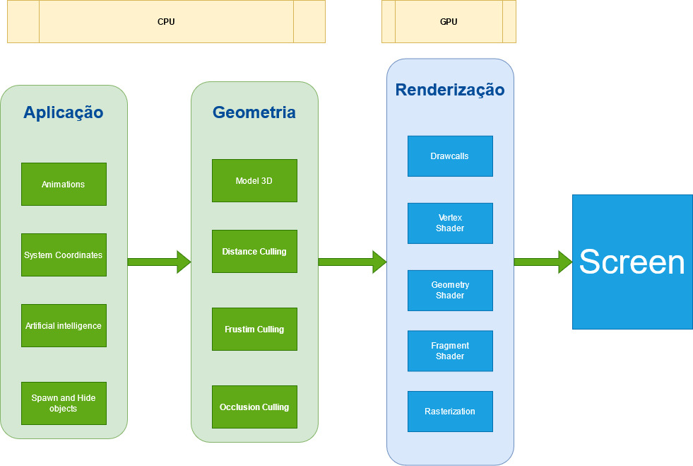

# Entendendo o processo de renderização

## Índice
1. [O processo de renderização](#1)
    1. [RTR - Real-time Rendering](#1.1)
    1. [Pipeline](#1.1)
    1. [Deferred shading](#1.1)
    1. [Forward shading](#1.1)    
1. [GBuffer](#2)            
1. [Geometry Rendering](#2)    
    1. [Drawcalls](#2.1)
    1. [Renderdoc](#2.1)    
    1. [Performance](#2.1)        
1. [Vertex Shaders](#3)        
1. [Pixel Shaders](#4)
1. [Rasterizing e Overshading](#3)     

## 1. Entendendo como os processos são executados

### 1.1 Criado
### 1.2 Apto
### 1.3 Execução
### 1.4 Bloqueado
### 1.5 Destruição
### 1.6 RPC
### 1.7 Threads

## 2. O processo de renderização

### 2.1 Animações
### 2.2 Posição de modelos
### 2.3 Inteligência Artificial
### 2.4 Criar e destruir objetos
### 2.5 Modelo 3D
### 2.6 Corte de distancia
### 2.7 Corte de câmera
### 2.8 Corte de oclusão
### 2.9 DrawCalls
### 2.9 Vertex Shaders
### 2.10 Geometry Shaders
### 2.11 Fragment Shader
### 2.12 Rasterização

- Vertex Shaders - é uma função de processamento gráfico usada para adicionar efeitos especiais a objetos em um ambiente 3D executando operações matemáticas nos dados de vértice dos objetos. Cada vértice pode ser definido por muitas variáveis diferentes. Por exemplo, um vértice é sempre definido por sua localização em um ambiente 3D usando as coordenadas x-, y- e z-. Os vértices também podem ser definidos por cores, texturas e características de iluminação. Os Vertex Shaders não alteram realmente o tipo de dados; eles simplesmente mudam os valores dos dados, de modo que um vértice emerge com uma cor diferente, texturas diferentes ou uma posição diferente no espaço.
- Geometry Program - recebe como entrada um conjunto de vértices que formam uma única primitiva, por exemplo, um ponto ou triângulo. O sombreador de geometria pode então transformar esses vértices conforme achar necessário antes de enviá-los para o próximo estágio de sombreador. O que torna o shader de geometria interessante é que ele é capaz de converter a primitiva original (conjunto de vértices) em primitivas completamente diferentes, possivelmente gerando mais vértices do que os inicialmente dados.

1. O custo para renderizar muitos poligonos é muitas vezes menor que o Drawcall.
1. 50.000 triângulos podem rodar pior que 50 milhões dependendo da implementação.
1. drwacall tem uma despesa básica, portanto, otimizar poli de baixo para super poli pode fazer nenhuma diferença.  

## 1. O aplicativo e plugin Renderdoc
1. Ativando o Plugin no Unreal Engine 4.
  
  *Figura: Edit->Plugins*  

1. Instalação do aplicativo no Windows.
Baixe aqui
1. Capturando o frame desejado.
        
  *Figura: Icon no Viewport*  

1. Carregando o frame capturado.
  
  *Figura: Aba Localhost - UEEditor*  

1. Apresentando a textura carregada e suas saídas por processamento.
  
  *Figura: A aba Textures Viewer*  
1. Lista de elementos renderizados por ordem de execução.
      
  *Figura: Event Browser*  
  - Para apresentar o tempo de duração de cada Drawcall clique em **Time Durations for the Drawcalls**.

1. Componentes = DrawCalls
1. Componentes ocluem e são renderizados um por um.
1. Mesclar em um único ator geralmente não faz diferença para a renderização.
1. para diminuir o drawcalls é melhor usar menos modelos maiores do que muitos modelos pequenos.
1. você não pode fazer muito isso, no entanto, isso afeta todo o resto negativamente.
  - pior para oclusão.   
  a oclusão é mais rápida por si só, mas não será capaz de fazer um trabalho bom o suficiente, tem menos objetos que precisam ser verificados quanto à oclusão, mas tem uma chance menor de realmente ocluir alguma coisa
  - pior para o lightmapping      
  lightmap tem uma quantidade limite de espaço, a quantidade máxima de espaço é a textura do mapa de luz, independentemente da resolução, o mapa de luz também tem um limite de resolução superior.
  Por exemplo imagens de 4k, 4.096 já é enorme para um lightmap.
  Se você fizer modelos muito grandes, eventualmente eles simplesmente ficarão sem espaço UV.
  - pior para calculo de colisão.
  - pior para memoria.

## Referências

1. [Real-Time Rendering Fundamentals](https://www.unrealengine.com/en-US/onlinelearning-courses/real-time-rendering-fundamentals)
1. [How Unreal Renders a Frame](https://interplayoflight.wordpress.com/2017/10/25/how-unreal-renders-a-frame/)
1. [Introduction to Decal Rendering](https://samdriver.xyz/article/decal-render-intro)
1. [Vertex Shaders](https://www.nvidia.com/en-us/drivers/feature-vertexshader/)
1. [Verttex Shaders](https://pt.wikipedia.org/wiki/Vertex_shader)
1. [Deferred Shading](https://learnopengl.com/Advanced-Lighting/Deferred-Shading)
1. [Normal Mapping](https://learnopengl.com/Advanced-Lighting/Normal-Mapping)

1. [General-purpose computing on graphics processing units](https://en.wikipedia.org/wiki/General-purpose_computing_on_graphics_processing_units)

https://www.gamersnexus.net/guides/2429-gpu-rendering-and-game-graphics-explained
https://www.nvidia.com/en-us/drivers/feature-vertexshader/
https://en.wikipedia.org/wiki/General-purpose_computing_on_graphics_processing_units
https://gamedevelopment.tutsplus.com/articles/forward-rendering-vs-deferred-rendering--gamedev-12342
https://en.wikipedia.org/wiki/Graphics_pipeline
https://en.wikipedia.org/wiki/Vertex_pipeline
https://www.pcmag.com/encyclopedia/term/vertex-shader
https://www.tecmundo.com.br/video-game-e-jogos/863-o-que-e-vertex-shading-.htm
https://www.khronos.org/opengl/wiki/Geometry_Shader
https://www.khronos.org/opengl/wiki/Fragment_Shader
https://en.wikipedia.org/wiki/Rendering_(computer_graphics)
