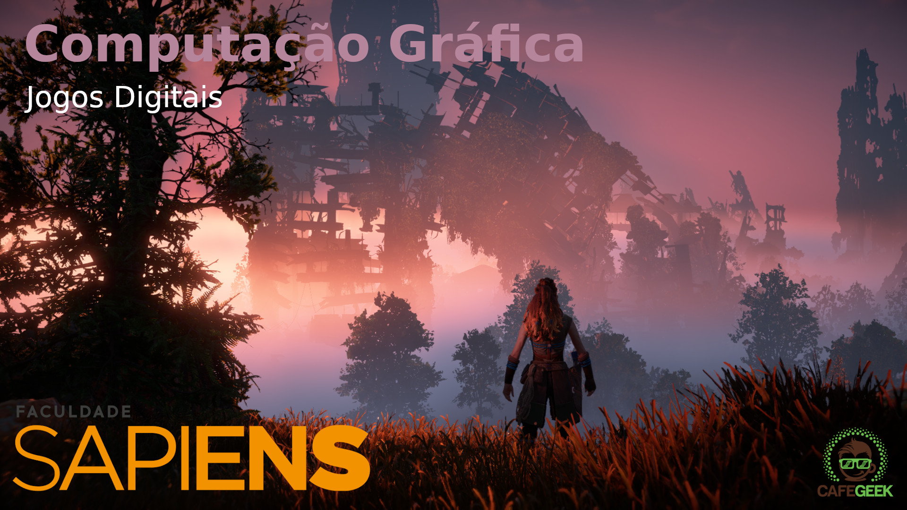

[CafeGeek](https://myerco.github.io/CafeGeek)

# Computação Gráfica com Unreal Engine e Autodesk Maya

## Conteúdo do curso
1. [Introdução](introducao_computacao_grafica.html)
1. [Como são formados os objetos em gráficos 3D?](como_sao_formados_objetos3d.html)
1. [Processamento de imagens](processamento_de_imagens.html)
1. [Entendendo o processo de renderização](entendo_processo_renderizacao.html)
1. [Visibilidade de objetos](visibilidade_objetos.html)
1. [Trabalhando com Texturas e materiais](#1)
1. [Tipos de iluminação](#1)
1. [Reflexão](#1)
1. [PósProcessamento](#1)
