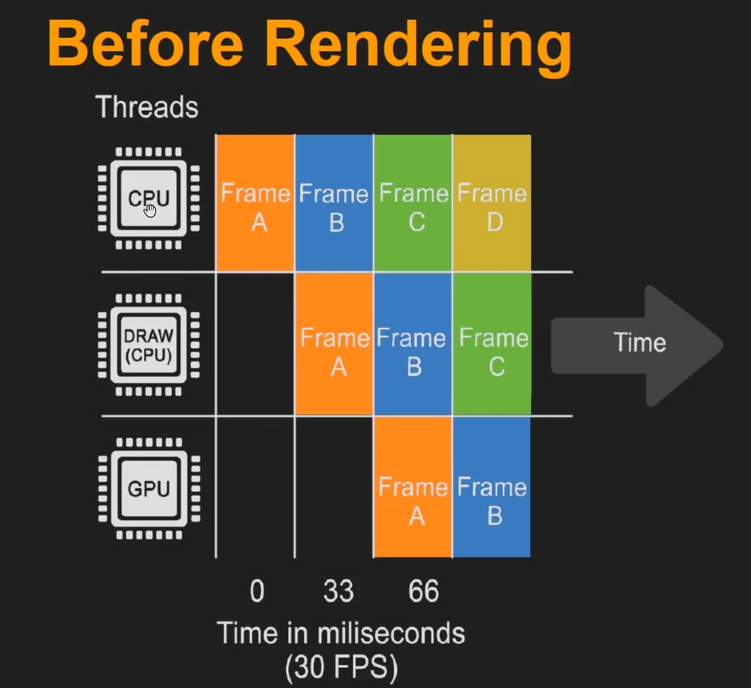

[CafeGeek](https://myerco.github.io/unreal-engine)  / [Computação Gráfica com Unreal Engine e Autodesk Maya](https://myerco.github.io/unreal-engine/ue4_computacao_grafica/index.html)

# Processamento de imagens
Neste capitulo vamos analisar como é realizado o processamento de imagens pela CPU e GPU.

## Índice

