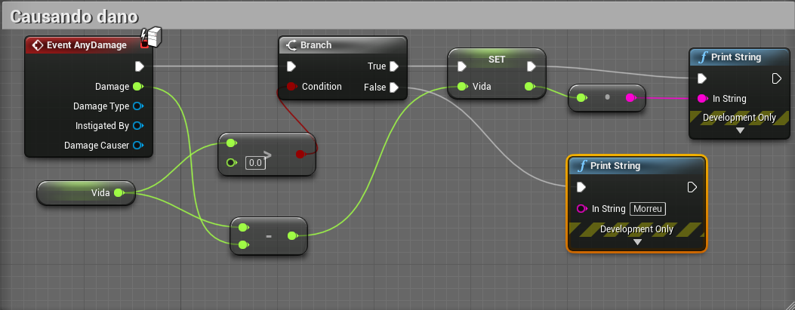
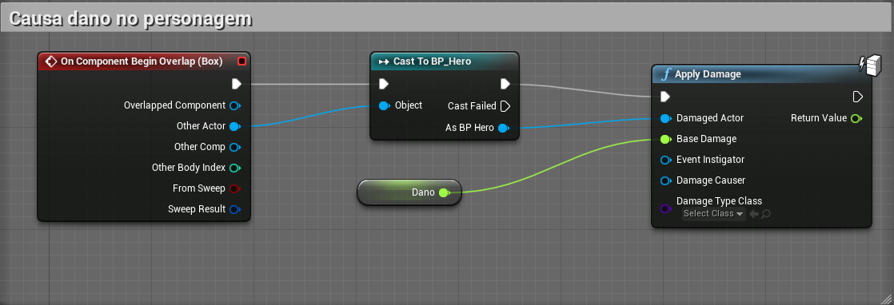

# Causando dano

## Implementando o dano
Declare as variáveis :
- Vida do tipo **float** no Personagem.
- Dano do tipo **float** no objeto que deverá causar o dano.
Para este exemplo utilizaremos um Actor com Static Mesh e Box Colision para
detectar a colisão.

1. O dano no Personagem

1. O objeto que causa o dano

***
## Referências
