Aprenda estruturas de desenvolvimento e lógicas de programação, utilizando *Blueprints* e *C++*.  

**Habilidades que serão aprendidas**

- Configuração e organização de projetos;
- Analisar e aplicar lógica de programação utilizando *Blueprint* e *C++*;
- Implementar regras de tempo e espaço;
- Implementar interface do usuário;
- Estruturar e configurar materiais, terrenos e iluminação;
- Implementar ambientes Multijogador;
- Implementar inteligência artificial;
- Construir a animação de personagens;
- Implementar Efeitos especiais.

***

<a name="capitulo1"></a>
[**CAPÍTULO 1 - Desenvolvendo jogos digitais**](#1)

***

&nbsp;&nbsp;[1.1 O que é uma Engine e Framework?](#1.1)

&nbsp;&nbsp;[1.2 Ciclo da lógica do desenvolvimento de um jogo](#1.2)

&nbsp;&nbsp;[1.3 O que é Unreal Engine?](#1.3)

***

<a name="capitulo2"></a>
[**CAPÍTULO 2 - Trabalhando com o Unreal Engine e Visual Studio**](#2)

***


&nbsp;&nbsp;[2.1 Como instalar o Unreal Engine?](#2.1)

&nbsp;&nbsp;[**2.2 Criando um projeto para jogos no Unreal Engine**](#2.2)    

&nbsp;&nbsp;&nbsp;&nbsp;&nbsp;&nbsp;[2.2.1 Selecionando o tipo de projeto](#2.2.1)

&nbsp;&nbsp;&nbsp;&nbsp;&nbsp;&nbsp;[2.2.2 Escolhendo o Template](#2.2.2)

&nbsp;&nbsp;&nbsp;&nbsp;&nbsp;&nbsp;[2.2.3 Configurando o projeto inicialmente](#2.2.2)

&nbsp;&nbsp;&nbsp;&nbsp;&nbsp;&nbsp;[2.2.4 Tela inicial do Unreal Engine](#2.2.4)

&nbsp;&nbsp;&nbsp;&nbsp;&nbsp;&nbsp;[2.2.5 Iniciando um projeto no Unreal Engine 5](#2.2.5)

&nbsp;&nbsp;&nbsp;&nbsp;&nbsp;&nbsp;[2.2.6 Configurando o editor de código](#2.2.6)

&nbsp;&nbsp;[**2.3 Entendo as pastas criadas**](#2.3)

&nbsp;&nbsp;&nbsp;&nbsp;&nbsp;&nbsp;[2.3.1 Pasta de código C++ - Source](#2.3.1)

&nbsp;&nbsp;&nbsp;&nbsp;&nbsp;&nbsp;[2.3.2 Pasta principal do projeto - Content](#2.3.2)

&nbsp;&nbsp;&nbsp;&nbsp;&nbsp;&nbsp;[2.3.3 Pastas temporárias que podem ser removidas](#2.3.3)

&nbsp;&nbsp;&nbsp;&nbsp;&nbsp;&nbsp;[2.3.4 Nomenclatura de pastas](#2.3.4)

&nbsp;&nbsp;&nbsp;&nbsp;&nbsp;&nbsp;[2.3.5 Compilando o projeto usando o Windows Explorer](#2.3.5)

&nbsp;&nbsp;[**2.4 Atividade - Instale o Unreal Engine com Visual Studio**](#2.4)

&nbsp;&nbsp;[**2.5 Organizando pastas e logo do projeto**](#2.5)

&nbsp;&nbsp;&nbsp;&nbsp;&nbsp;&nbsp;[2.5.1 Como criar pastas de trabalho?](#2.5.1)

&nbsp;&nbsp;&nbsp;&nbsp;&nbsp;&nbsp;[2.5.2 Defina e utilize uma Nomenclatura e organização de pastas](#2.5.2)

&nbsp;&nbsp;&nbsp;&nbsp;&nbsp;&nbsp;[2.5.3 Os benefícios da organização de pastas](#2.5.3)    

&nbsp;&nbsp;&nbsp;&nbsp;&nbsp;&nbsp;[2.5.4 Configurando o projeto](#2.5.4)    

&nbsp;&nbsp;&nbsp;&nbsp;&nbsp;&nbsp;[2.5.5 Adicionando um Level na inicialização do projeto](#2.5.5)

&nbsp;&nbsp;&nbsp;&nbsp;&nbsp;&nbsp;[2.5.6 Configurando as imagens do projeto](#2.5.6)

&nbsp;&nbsp;[**2.6. Atividade - Configure as pastas de seu projeto**](#2.6)

***

<a name="capitulo3"></a>
[**CAPÍTULO 3 - Controle de versão com GitHub e Unreal Engine**](#3)

***

&nbsp;&nbsp;[3.1 Ferramentas para controle de versão](#3.1)

&nbsp;&nbsp;[3.2 Estrutura do GIT](#3.2)

&nbsp;&nbsp;[3.3 Entendo o fluxo de trabalho](#3.3)

&nbsp;&nbsp;[**3.4 Começando a trabalhar com o Git e o Unreal Engine**](#3.4)    

&nbsp;&nbsp;&nbsp;&nbsp;&nbsp;&nbsp;[3.4.1 Criando uma conta e o projeto no Github](#3.4.1)

&nbsp;&nbsp;&nbsp;&nbsp;&nbsp;&nbsp;[3.4.2 Instalando Git Client e GitHub Desktop](#3.4.2)

&nbsp;&nbsp;&nbsp;&nbsp;&nbsp;&nbsp;[3.4.3 Configurando Unreal Engine para utilizar o Git](#3.4.3)

&nbsp;&nbsp;&nbsp;&nbsp;&nbsp;&nbsp;[3.4.4 Configurando o Github Desktop e adicionando o projeto](#3.4.4)

&nbsp;&nbsp;&nbsp;&nbsp;&nbsp;&nbsp;[3.4.5 Criando o projeto remoto e atualizando os arquivos](#3.4.5)

&nbsp;&nbsp;&nbsp;&nbsp;&nbsp;&nbsp;[3.4.6 Testando a configuração do Git com o Unreal Engine](#3.4.6)  

&nbsp;&nbsp;[3.5 Utilizando comandos do PowerShell para utilizar o Git Client](#3.5)  

&nbsp;&nbsp;[3.6 Ignorando pastas e arquivos](#3.6)

&nbsp;&nbsp;[**3.7 Atividade - Crie um projeto no Unreal Engine e o configure para utilizar o Git**](#3.7)

***

<a name="capitulo4"></a>
[**CAPÍTULO 4 -  O Unreal Engine e sua lógica de programação**](#4)

***

&nbsp;&nbsp;[4.1 Interface e Editores](interface_e_editores.html)  

&nbsp;&nbsp;[4.2 O que são Blueprints e Visual Scripting?](#4.2)  

&nbsp;&nbsp;[**4.3 Trabalhando com Levels**](#4.3)      

&nbsp;&nbsp;&nbsp;&nbsp;&nbsp;&nbsp;[4.3.1 Criando Levels](#4.3.1)  

&nbsp;&nbsp;&nbsp;&nbsp;&nbsp;&nbsp;[4.3.2 Salvando Levels](#4.3.2)  

&nbsp;&nbsp;&nbsp;&nbsp;&nbsp;&nbsp;[4.3.3 Carregando Levels](#4.3.3)    

&nbsp;&nbsp;[4.4 O que é Level Blueprint? ](#4.4)

&nbsp;&nbsp;[**4.5 Atores e Classes utilizando Blueprints**](#4.5)

&nbsp;&nbsp;&nbsp;&nbsp;&nbsp;&nbsp;[4.5.1 Atores predefinidos ou Place Actors](#4.5.1)  

&nbsp;&nbsp;&nbsp;&nbsp;&nbsp;&nbsp;[4.5.2 Classes Blueprint ou Blueprint Class](#4.5.2)  

&nbsp;&nbsp;[**4.6 Componentes - Components**](#4.6)

&nbsp;&nbsp;&nbsp;&nbsp;&nbsp;&nbsp;[4.6.1 Components e a aba My Blueprint](#4.6.1)  

&nbsp;&nbsp;[**4.7 Estrutura da classe Actor no Unreal Engine**](#4.7)  

&nbsp;&nbsp;&nbsp;&nbsp;&nbsp;&nbsp;[4.7.1 Construction Script](#4.7.1)  

&nbsp;&nbsp;&nbsp;&nbsp;&nbsp;&nbsp;[4.7.2 Event Graph](#4.7.2)

&nbsp;&nbsp;&nbsp;&nbsp;&nbsp;&nbsp;[4.7.3 BeginPlay](#4.7.3)  

&nbsp;&nbsp;&nbsp;&nbsp;&nbsp;&nbsp;[4.7.4 ActorBeginOverlap](#4.7.4)  

&nbsp;&nbsp;&nbsp;&nbsp;&nbsp;&nbsp;[4.7.5 Tick](#4.7.5)      

&nbsp;&nbsp;[4.8 Comentários](#4.8)

&nbsp;&nbsp;[**4.9 Atividades - Crie um level para apresentar uma mensagem na tela**](#4.9)

***

<a name="capitulo5"></a>
[**CAPÍTULO 5 -  Programação C++ no Unreal Engine**](#5)

***

&nbsp;&nbsp;[5.1 Mas quanto usar a linguagem  C++?](#5.1)  

&nbsp;&nbsp;[5.2 O fluxo de desenvolvimento e Herança](#5.2)  

&nbsp;&nbsp;[5.3 Tipos de variáveis](#5.3)  

&nbsp;&nbsp;[**5.4 Construindo classes C++ no Unreal Engine**](#5.4)  

&nbsp;&nbsp;&nbsp;&nbsp;&nbsp;&nbsp;[5.4.1 Pasta privada com os arquivos header das classes](#5.4.1)  


&nbsp;&nbsp;&nbsp;&nbsp;&nbsp;&nbsp;[5.4.2 Exemplo de um arquivo header com variáveis](#5.4.2)  

&nbsp;&nbsp;[**5.5 Sintaxe da linguagem e C++ e macros do Unreal Engine**](#5.5)

&nbsp;&nbsp;&nbsp;&nbsp;&nbsp;&nbsp;[5.5.1 Include](#5.5.1)  

&nbsp;&nbsp;&nbsp;&nbsp;&nbsp;&nbsp;[5.5.2 Encapsulamento](#5.5.2)  

&nbsp;&nbsp;&nbsp;&nbsp;&nbsp;&nbsp;[5.5.3 UCLASS](#5.5.3)  

&nbsp;&nbsp;&nbsp;&nbsp;&nbsp;&nbsp;[5.5.4 UFUNCTION](#5.5.4)

&nbsp;&nbsp;&nbsp;&nbsp;&nbsp;&nbsp;[5.5.5 UPROPERTY](#5.5.5)

&nbsp;&nbsp;[5.6 Funções Virtuais](#5.6)

***

<a name="capitulo6"></a>
[**CAPÍTULO 6 -  Estruturas de programação no Unreal Engine**](#6)

***

&nbsp;&nbsp;[6.1 que são variáveis?](#6.1)  

&nbsp;&nbsp;[**6.2 Variáveis no Unreal Engine**](#6.2)  

&nbsp;&nbsp;&nbsp;&nbsp;&nbsp;&nbsp;[6.2.1 Tipos de variáveis](#6.2.1)  

&nbsp;&nbsp;&nbsp;&nbsp;&nbsp;&nbsp;[6.2.2 Declarando variáveis](#6.2.2)  

&nbsp;&nbsp;[6.3 Métodos Get e Set](#6.3)  

&nbsp;&nbsp;[**6.4 Tratamento e armazenamento de texto no Unreal Engine**](#6.4)  

&nbsp;&nbsp;&nbsp;&nbsp;&nbsp;&nbsp;[6.4.1 Concatenando textos usando a função Append](#6.4.1)  

&nbsp;&nbsp;&nbsp;&nbsp;&nbsp;&nbsp;[6.4.2 Procurando texto dentro de uma string](#6.4.2)  

&nbsp;&nbsp;[6.5 Variáveis do tipo numéricas Integer e Float](#6.5)  

&nbsp;&nbsp;[6.6 Armazenando valores lógicos com Boolean](#6.6)

&nbsp;&nbsp;[6.7 Controle de acesso a variáveis](#6.7)

&nbsp;&nbsp;&nbsp;&nbsp;&nbsp;&nbsp;[6.7.1 Variáveis Privadas](#6.7.1)  

&nbsp;&nbsp;&nbsp;&nbsp;&nbsp;&nbsp;[6.7.2 Variáveis Públicas](#6.7.2)  

&nbsp;&nbsp;[**6.8 Atividade - Crie um projeto que implemente vários tipos de variáveis**](#6.8)  

&nbsp;&nbsp;[6.2 Estruturas de controle de fluxo](unreal_engine_estruturas_de_controle_de_fluxo.html)

&nbsp;&nbsp;[6.3 Manipulando Arrays](unreal_engine_manipulando_array.html)  

&nbsp;&nbsp;[6.4 Utilizando Enums](unreal_engine_enum.html)    

***

<a name="capitulo7"></a>
[**CAPÍTULO 7 - Atores e movimentação**](#7)

***

&nbsp;&nbsp;[7.1 Implementando Atores](actor_atores.html)

&nbsp;&nbsp;[7.2 Utilizando Eventos, funções e macros](estruturando_logica_utilizando_eventos_funcoes_macros.html)  

&nbsp;&nbsp;[7.3 Implementando a movimentação do personagem](trabalhando_com_logica_movimentacao_de_personagem.html)    

&nbsp;&nbsp;[7.4 Comunicação entre Blueprints](comunicacao_entre_blueprint.html)    

&nbsp;&nbsp;[7.5 Delta time e sistema de coordenadas](deltatime_sistema_coordenadas.html)

***

<a name="capitulo8"></a>
[**CAPÍTULO 8 - Estruturas de dados e Interface com usuário**](#8)

***

&nbsp;&nbsp;[8.1 Variáveis estruturadas ou Structure](structure_variaveis_estruturadas.html)  

&nbsp;&nbsp;[8.2 Tabelas de dados ou Data tables - ](data_tables.html)

&nbsp;&nbsp;[8.3 Game Instance, Game State e Game Mode](unreal_engine_gameinstance_state_mode.html)

&nbsp;&nbsp;[8.4 Implementando a Interface com o jogador](unreal_engine_hud_interface.html)

&nbsp;&nbsp;[8.5 Lógica de programação dos objetos da interface](unreal_engine_hud_logica.html)

***

<a name="capitulo9"></a>
[**CAPÍTULO 9 - Materiais e Landscape**](#9)

***

&nbsp;&nbsp;[9.1 Introdução aos Materiais](unreal_engine_material_introducao_aos_materiais.html)

&nbsp;&nbsp;[9.2 Construindo Materiais e entendo a lógica](unreal_engine_material_construindo_materiais_entendendo_a_logica.html)

&nbsp;&nbsp;[9.3 Material Instance](unreal_engine_material_instance.html)

&nbsp;&nbsp;[9.4 Materiais e Blueprint](unreal_engine_material_blueprint.html)

&nbsp;&nbsp;[9.5 Trabalhando com Iluminação](iluminacao.html)

&nbsp;&nbsp;[9.6 Criando terrenos - Landscape](landscape.html)  

***

<a name="capitulo10"></a>
[**CAPÍTULO 10 - Animação de personagens**](#10)

***

&nbsp;&nbsp;[10.1 Introdução a animação de personagens](unreal_engine_animacao_introducao.html)

&nbsp;&nbsp;[10.2 Preparando o projeto](unreal_engine_animacao_preparando_o_projeto.html)

&nbsp;&nbsp;[10.3 Utilizando Blend Space](unreal_engine_animacao_blend_space.html)        

&nbsp;&nbsp;[10.4 Implementando a Lógica da animação](unreal_engine_animacao_animation_blueprint.html)        

&nbsp;&nbsp;[10.5 Implementando a mira](unreal_engine_animacao_aim_offset.html)

&nbsp;&nbsp;[10.6 Trabalhando com Animação 2D](unreal_engine_animacao2d.html)

***

<a name="capitulo11"></a>
[**CAPÍTULO 11 - Inteligência Artificial**](#11)

***

&nbsp;&nbsp;[11.1 Inteligência Artificial](inteligenciaartificial.html)

***

<a name="capitulo2"></a>
[**Capítulo 12 - Multiplayer em C++**](#12)            

***

&nbsp;&nbsp;[12.1 Multiplayer](multiplayer.html)

***

<a name="capitulo13"></a>
[**CAPÍTULO 13 - Efeitos especiais**](#13)

***

&nbsp;&nbsp;[14.1. Sequencer](#)

&nbsp;&nbsp;[15.1 Utilizando Niagara](#)

<a name="1"></a>
## CAPÍTULO 1 - Desenvolvendo jogos digitais


> *Figura: So, You Want to Be a Game Developer? - https://medium.com/swlh/so-you-want-to-be-a-game-developer-e3b7f9f4ac70 .*

O desenvolvimento de jogos digitais envolve diversas áreas de conhecimento como por exemplo:
- Programação de computadores;
- Arte 3D e 2D;
- Computação gráfica;
- Elementos de construção de Narrativas;
- Efeitos sonoros;

Na construção da mecânica de um jogo é necessário utilizar uma linguagem de programação para implementar movimento, interação de personagens, inteligência artificial e outros elementos dinâmicos.
As linguagens de programação vem evoluindo para simplificar as rotinas e comandos assim agilizando o desenvolvimento e permitindo o programador focar no que deve ser feito escondendo alguns detalhes de como é feito.

> Conhecer e entender como é feito é importante para determinar as técnicas utilizadas e ser capaz e aproveitar ou mesmo melhorar os jogos.

Existem aplicações que auxiliam na produção de programas de computador ou jogos digitais, estas ferramentas abstraem a lógica complexa que faz com os objetos sejam apresentados de forma adequada na cena, no caso de jogos digitais. Tais ferramentas são chamadas de *Frameworks* [[1](#r1)]

<a name="1.1"></a>
## 1.1 O que é uma Engine e Framework?


> *Figura: Game Engine VS Game Framework - https://developerhouse.com/game-engine-vs-game-framework/ .*

No desenvolvimento de jogos um *Framework* pode ser definido como um conjunto de bibliotecas que auxiliam a programação, sendo que uma *engine* ou motor gráfico é mais completo pois abrange outros aspectos na produção de jogos.[[2](#r2)]

Algumas *Engine*.

1. Unreal engine;
1. Unity;
1. GameMaker;

<a name="1.2"></a>
## 1.2 Ciclo da lógica do desenvolvimento de um jogo
A maioria das *engines* seguem um ciclo de execução da lógica de programação baseado em :

- **Inicialização** - Executado ao iniciar o jogo carregando bibliotecas básicas;
- **Carga** - Responsável por carregar os objetos ou módulos;
- **Atualização** - Estado de atualização constante responsável por apresentar todos os estados do jogo;
- **Finalização** - Executa as rotinas para descarregar o jogo;

<a name="1.3"></a>
## 1.3 O que é Unreal Engine?


> *Figura: Unreal Engine - https://www.unrealengine.com/en-US/ .*

É uma *Engine* (motor gráfico) para desenvolvimento de jogos que engloba vários aspectos na sua produção, a segui listamos algumas funcionalidades:

1. Edição e compilação da lógica de programação;
1. Apresentação de elementos visuais da cena do jogo;
1. Editor da lógica de animações e manipulação de esqueletos e malhas;
1. Editor de interfaces para comunicação com os jogadores (HUD);
1. Editor de sequencias de animação;
1. Editor de sons;
1. Editor para construção de materiais;
1. Editor de efeitos especiais utilizando partículas;

**[⬆ Volta para o CAPÍTULO 1](#capitulo1)**

---

<a name="2"></a>
## CAPÍTULO 2 - Trabalhando com o Unreal Engine e Visual Studio

O **Unreal Engine** é um [Framework](https://pt.wikipedia.org/wiki/Framework) de desenvolvimento que incorpora vários editores e componentes para agilizar a construção de jogos e também um ambiente visual de programação abstraindo a lógica de programação.

Para que possamos programar em linguagem **C++** com **Unreal Engine** é necessário instalar o **Visual Studio** ou **Visual Code** e baixar os pacotes de desenvolvimento em **C++**.

A **Epic Games** utiliza um sistema para gerenciamento dos seus produtos, o **Inicializador da Epic Games** responsável por:
- Instalação e atualização de jogos;
- Navegação da loja de produtos;
- Instalação e atualização das versões do **Unreal Engine**;

   

> *Figura: Gerenciamento de versões.*


<a name="2.1"></a>
## 2.1  Como instalar o Unreal Engine?
Para instalar o **Unreal Engine** siga os seguintes passos:

1. Baixe e instale o [Inicializador da Epic Games](https://www.epicgames.com/store/pt-BR/download);
2. Inscreva-se para uma conta da Epic Games, se ainda não tiver uma;
3. Faça login no **Inicializador da Epic Games**;
4. Instale o **Unreal Engine** utilizando o menu `Unreal Engine` > `Biblioteca`.
5. Para instalar  os pacotes de desenvolvimento e o Visual Studio para programação com C++ baixe o Visual Studio em : [Download Visual Studio](https://visualstudio.microsoft.com/pt-br/?rr=https%3A%2F%2Fwww.google.com%2F);
6. Selecione os pacotes de programação:
  - Desenvolvimento de jogos com C++;
  - Desenvolvimento para Desktop com C++.      

<!--    
-->


  > *Figura: Visual Studio Update para desenvolvimento de jogos.*   

**Por que instalar o pacote Desktop com C++ ?**

Porque muitas vezes é necessário testar uma funcionalidade ou mesmo testar um conceito da linguagem e ter o compilador disponível é uma mão na roda.


**[⬆ Volta para o CAPÍTULO 2](#capitulo2)**

<a name="2.2"></a>
## 2.2 Criando um projeto para jogos no Unreal Engine
Nesta seção vamos criar um projeto para jogos utilizando **C++** pois irá ajudar na compreensão da estrutura de pastas e arquivos do **Unreal Engine**. O nome do projeto será ProjetoAula e o usaremos em vários capítulos.

<a name="2.2.1"></a>
### 2.2.1 Selecionando o tipo de projeto    
Para construção do projeto vamos selecionar a categoria *Games* para que a Engine configure alguns parâmetros iniciais.

  

> *Figura: Unreal 4 - Select or create New Project, Games.*        

<a name="2.2.2"></a>
### 2.2.2 Escolhendo o Template
Para este projeto vamos escolher o `template blank` para que possamos entender os elementos do projeto e adicionar posteriormente outros pacotes.

     

> *Figura: Select Template blank.*

**Templates** são modelos com elementos disponíveis para cada tipo de jogo escolhido.

<a name="2.2.3"></a>
### 2.2.3 Configurando o projeto inicialmente
Em configuração de projeto escolha **C++** e `No Starter Content`, esta opção não vai instalar o pacote padrão de *assets* da **Epic Games** pois agora não é necessário, em seguida escolha uma pasta onde o projeto deverá ser instalado em `Select a Location for project to be stored`.


> *Figura: Unreal engine project Settings.*

<a name="2.2.4"></a>
### 2.2.4 Tela inicial do Unreal Engine
Quando todos os passos anteriores forem concluídos corretamente a tela inicial deve aparecer.  

<!--  -->


> *Figura: Unreal Engine tela inicial.*

<a name="2.2.5"></a>
### 2.2.5 Iniciando um projeto no Unreal Engine 5
A versão 5 tem uma apresentação um pouco diferente mas o conceito ainda é o mesmo dos passos anteriores.

<!---->

<figure>
  
  <figcaption>Figura: Unreal 5 - Select or create New Project, Games</figcaption>
</figure>

> *Figura: Unreal 5 - Select or create New Project, Games.*

<!--  -->


> *Figura: Unreal 5 - Tela inicial.*        

<a name="2.2.6"></a>
### 2.2.6 Configurando o editor de código
Para programar utilizando **C++** no Unreal devemos configurar um editor de código para ser responsável pela compilação, organização e edição da linguagem. A configuração esta em :

 `Menu` > `Editor Preferences` > `General` e `Source Code`, então escolha `Visualstudio`.   

   

> *Figura: General - Source Code, Definindo o editor de código.*

**Qual editor eu escolho, Visual Code ou Visual Studio?**

Os dois são ótimos editores de código mas o Visual Code tem uma apresentação mais enxuta e quando se trata de utilizar ele para outras lingagens, como por exemplo Pyhton, ou mesmo editar um arquivo de formato Markdown é uma boa escolha.


**[⬆ Volta para o CAPÍTULO 2](#capitulo2)**

<a name="2.3"></a>
## 2.3 Entendo as pastas criadas
Após criar o projeto vamos verificar como estão as pastas criadas pela *engine*, utilizando o `explorer` do Windows, navegue até a pasta do projeto para verificar os arquivos criados, devem aparecer as seguintes pastas e arquivos:

```bash
|-- .vs
|-- Binaries
|-- Config
|-- Content
|-- Intermediate
|-- Saved
|-- Source
|-- ProjetoAula.sln
|-- ProjetoAula.uproject
```
A seguir vamos entender as pastas do projeto.

<a name="2.3.1"></a>
### 2.3.1 Pasta de código C++ - Source
A pasta `Source` contém arquivos com código fonte em **C++** e o arquivo com extensão *uproject* é o principal arquivo do projeto, segue abaixo a configuração inicial.

```bash
|-- Source
		|-- ProjetoAula
		|		|-- ProjetoAula.cpp
		|		|-- ProjetoAula.h
		|		|-- ProjetoAula.Build.cpp    
		|-- ProjetoAulaEditor.Target.cs    
		|-- ProjetoAula.Target.cs
```

<a name="2.3.2"></a>
### 2.3.2 Pasta principal do projeto - Content
`Content` é a principal pasta, pois nela vão ficar contidos todos os arquivos do jogo, em outras palavras esta pasta é o ponto de montagem do projeto como veremos nos próximos capítulos.


<a name="2.3.3"></a>
### 2.3.3 Pastas temporárias que podem ser removidas
As pastas abaixo podem ser removidas pois podemos construir a qualquer momento quando compilar o projeto.

```bash
|-- Binaries
|-- Build
|-- Intermediate
|-- Saved
```

<a name="2.3.4"></a>
### 2.3.4 Nomenclatura de pastas
É recomendado que os arquivos e pastas devam ter um padrão de nomenclatura para melhor organização do projeto, abaixo duas boas recomendações de organização, discutiremos mais nos próximos capítulos.    
- [Directory Structure](https://docs.unrealengine.com/en-US/Engine/Basics/DirectoryStructure/index.html "Directory Structure Overview of the directories that make up the engine and game projects.");

- [UE5 Style Guide](https://github.com/Allar/ue4-style-guide/blob/master/README.md#unreal-engine-4-linter-plugin "Gamemakin UE4 Style Guide() { A mostly reasonable approach to Unreal Engine 4").

**[⬆Volta para o CAPÍTULO 2](#capitulo2)**

<a name="2.3.5"></a>
### 2.3.5 Compilando o projeto usando o Windows Explorer
Para recompilar o projeto e recriar os arquivos podemos utilizar o `explorer` do Windows seguindo os passos abaixo:
1. Apague as pastas `Binaries`, `Build`, `Intermediate` e `Saved`;
1. Click com botão direito do mouse no arquivo **ProjetoAula.uproject**;
1. Escolha a opção `Generate Visual Studio project files`;

       

    > *Figura: Recriando os arquivos do projeto, Generate Visual Studio Project files.*

1. Aguarde o termino da operação e abra o projeto.

**[⬆ Volta para o CAPÍTULO 2](#capitulo2)**

<a name="2.4"></a>
## 2.4 Atividade - Instale o Unreal Engine com Visual Studio.
**Regras.**

1. Instale todo o ambiente e crie um projeto de nome MeuPrimeiroProjeto.

**Desafio.**

1. Configure o Visual Studio para ser o editor padrão.

**[⬆ Volta para o CAPÍTULO 2](#capitulo2)**

<a name="2.5"></a>
## 2.5 Organizando pastas e logo do projeto
A seguir vamos organizar as pastas do projeto *ProjetoAula*, construído no **Unreal Engine**, e vamos configurá-lo.


<a name="2.5.1"></a>
### 2.5.1 Como criar pastas de trabalho?
No **Unreal Egnine** em `Content Drawer` utilizando botão direito do mouse clique em `New Folder` para criar pastas.

			

> *Figura: Content Drawer.*

<a name="2.5.2"></a>
### 2.5.2 Defina e utilize uma Nomenclatura e organização de pastas
A organização de arquivos e pastas dentro dos projetos de desenvolvimento de softwares é bastante relevante para reduzir o tempo de programação e custo.

Em projetos de desenvolvimento de jogos, no **Unreal Engine**, temos diversos tipos de arquivos com caraterísticas distintas que influenciam na sua forma de armazenamento, como por exemplo:
- Código **C++**;
- Lógica de desenvolvimento utilizando Blueprints;
- Arquivos de imagens, como texturas e outros;
- Arquivos de som;
- Arquivos binários em geral.  

Temos também equipes heterogêneas trabalhando no mesmo projeto e até na mesma estrutura de pastas, como por exemplo:
- Programadores;
- Level Design;
- Artistas gráficos;
- Artistas de efeitos de som e músicos.

Por conseguinte para um maior gerenciamento pelas equipes do projeto  podemos definir pastas com nomenclaturas e organização adequadas ao projeto, abaixo vamos relacionar algumas sugestões.

1. Sugestão 1.
```bash
|-- Content
		|-- Blueprints
		|		|-- Core
		|		|-- Characters
		|		|-- Elements
		|-- Assets
		|		|-- Images
		|		|-- StructureMesh
		|		|-- Materials
		|-- Maps
		|		|-- Level1
		|-- UI
		|-- Animations
```

1. Sugestão 2.
```bash
|-- Content
		|-- ProjetoAula
			|-- Art
			|	|-- Industrial
			|	|	|-- Ambient
			|	|	|-- Machinery
			|	|	|-- Pipes
			|	|-- Nature
			|	|	|-- Ambient
			|	|	|	|-- Foliage
			|	|	|	|-- Rocks
			|	|	|	|-- Trees
			|	|-- Office
			|-- Characters
			|  |-- Bob
			|  |-- Common
			|  |  |-- Animations
			|  |  |-- Audio
			|  |-- Jack
			|  |-- Steve
			|  |-- Zoe						
			|-- Core
			|	|-- Characters
			|	|-- Engine
			|	|-- GameModes
			|	|-- Interactables
			|	|-- Pickups
			|	|-- Weapons
			|-- Maps
			|	|-- Level1
			|	|-- Level2
```

<a name="2.5.3"></a>
### 2.5.3 Os benefícios na organização das pastas
Separar a pasta do projeto `Content` de outras pastas pode facilitar e trazer vários benefícios durante o desenvolvimento do projeto, abaixo elencamos alguns:
1. Versionamento - pastas com diferentes versões;
1. Isolar pacotes de testes e *Marketplace*;
1. DLC ou subprojetos - podemos administrar separadamente projetos relacionados;
1. Biblioteca de Materiais - podemos migrar pasta de materiais e compartilhar materiais sem muitos problemas definindo um pasta de nível superior.

  Exemplo:
```bash
|-- Content
	|-- ProjetoAula
	|-- ProjetoAulaTestes
	|-- ProjetoAulaArquitetura
	|-- StarterContent
	|-- FPS_Assault_Pack
	|-- MaterialLibrary
	|	|-- M_Master
```		

**[⬆ Volta para o CAPÍTULO 2](#capitulo2)**

<a name="2.5.4"></a>
### 2.5.4 Configurando o projeto
Preparar o projeto antes de começar o desenvolvimento é importante para que possamos otimizar algumas tarefas e preparar o jogo com a configuração inicial, neste passo vamos configurar alguns parâmetros do projeto.

Nos próximos capítulos vamos utilizar outras opções do menu de configuração como por exemplo o [mapeamento de *Input* (teclas ou controles)](http://cafegeek.eti.br/unreal-engine/trabalhando_com_logica_movimentacao_de_personagem.html#13).

<a name="2.5.5"></a>
### 2.5.5 Adicionando um *Level* na inicialização do projeto
Para que um *level* ou mapa seja carregado ao iniciar o projeto siga os seguintes passos:  

1. Salve o *level* atual na pasta `Maps` :       
    `File` > `Save Current Level As` com o nome `LevelTest`;
1. Para configurar a inicialização do projeto utilizando o `LevelTest` utilize o menu :     
    `Edit` > `Project Settings` e depois `Maps & Modes`;   

				

	*Figura: Project - Maps & Modes.*

- `Edit Startup Level` - Seleciona o *Level* que deverá ser carregado no início do jogo, neste caso é `LevelTest`;
- `Game default Map` - Seleciona o *Level* que é mais usado.

<a name="2.5.6"></a>
### 2.5.6 Configurando as imagens  do projeto
Para alterar as imagens de apresentação do projeto, seja ícone ou tela de apresentação (*splash*) utilizamos o menu :

`Project Settings` opção `Plataforms` > `Windows` e altere a imagens.

<!-- 		-->

<figure>
  
  <figcaption>Figura: Project icon.</figcaption>
</figure>

> *Figura: Project icon.*

Certifique-se de produzir o ícone como um arquivo .ico (que não é PNG, mas pode ser convertido usando ferramentas online, por exemplo) e 256x256.

**[⬆ Volta para o CAPÍTULO 2](#capitulo2)**


<a name="2.6"></a>
## 2.6 Atividade - Configure as pastas de seu projeto.

**Regras.**

1. Configure as pastas de seu projeto escolhendo uma das sugestões e justifique a sua escolha.

**Desafio.**

1. Adicione o pacote *StarterContent*.

**[⬆ Volta para o CAPÍTULO 2](#capitulo2)**


<a name="3"></a>
## CAPÍTULO 3 - Controle de versão com GitHub e Unreal Engine

Neste capítulo vamos instalar o **Git Client** com o **GitHub Desktop** para versionamento de arquivos no **Unreal Engine** e apresentar comandos básicos.


> Figura: Unreal Engine with Git.

Quando programamos existe a necessidade de gerenciar as alterações que ocorrem durante o desenvolvimento do projeto e até mesmo depois, acompanhe o seguinte exemplo:  

Abaixo o trecho de código inicial, vamos chamá-lo de **A**.

```cpp
if (a > b) {
  resultado = (a + b)
}
```
Então, alteramos o código, vamos chamar de **B**, ou mesmo o corrigimos para :
```cpp
if (a > b) {
  resultado = (a + b * 10)
}
```

Perceba que para facilitar a manutenção e desenvolvimento em equipe e pensando em documentar a lógica temos que dispor das seguintes facilidades.
- Capacidade reverter o código atual para o estado anterior, lógica **A**.
- Necessidade de compartilhar o código como outros desenvolvedores.
- Necessidade de documentar as alterações no momento que forem compartilhadas.

**[⬆ Volta para o CAPÍTULO 3](#capitulo3)**

<a name="3.1"></a>
## 3.1 Ferramentas para controle de versão
Existem várias ferramentas para controle de versão disponíveis no mercado, como por exemplo :
- **GitHub** - É um serviço de armazenamento de nuvem para gerenciamento de códigos de aplicação. É possível ter uma conta gratuita e armazenar até 500Mb por projeto;
- **Gitlab** - É um serviço de armazenamento de nuvem para gerenciamento de códigos de aplicação concorrente do Github mas com o diferencial que pode ser instalado em um ambiente corporativo;
- **SVN** - Gerenciador de versão para vários tipos de arquivos, inclusive arquivos de mídia, para ambientes corporativos;
- **Git LFS** - Large File System é uma versão do git para armazenamento de arquivos de mídia ou binários, podendo armazenar de forma gratuita até 1GB.


 O **Unreal Engine** trabalha de forma nativa com **SVN**, **Perforce** e **Git**, esta última até o momento em versão beta.      

<a name="3.2"></a>
## 3.2 Estrutura do GIT
No gráfico abaixo é apresentado a estrutura de armazenar e alguns comandos do ambiente do Git.


> *Figura: Git, GitHub, & Workflow Fundamentals.*

<a name="3.3"></a>
## 3.3 Entendo o fluxo de trabalho
Quando utilizamos um gerenciador de versão temos que seguir um fluxo de trabalho para compartilhar o código armazenado localmente, segue abaixo os comandos iniciais do fluxo:

**Add** - Permite adicionar as alterações para um registro local.

```bash
git add .
```
**Commit** - Compromete ou confirma as alterações e criar uma etiqueta ou informação para identificar o trabalhado realizado, por exemplo:    

```bash
git commit -m "feat: Adicionado lógica de movimentação do jogador com mouse X e Y em BP_HeroBase."
git commit -m "fix: Corrigido o evento MostraMenu em BP_GameInstance, anteriormente o objeto apresentava erro no momento de instanciar o objeto BP_MenuPrincipal, foi adicionado o nó IsValid antes da execução."
git commit -m "fix: Lista de correções #14,#252"
````
**Push** - Empurra e publica as alterações locais no servidor.

```bash
git push origin main
```

**[⬆ Volta para o CAPÍTULO 3](#capitulo3)**

<a name="3.4"></a>
## 3.4 Começando a trabalhar com o Git e o Unreal Engine
Neste passo vamos preparar o ambiente e projeto para começar a trabalhar com o gerenciamento de versões, utilizaremos o **GitHub** como repositório de arquivos e gerenciador de versões, para tal executaremos os próximos passos.

<a name="3.4.1"></a>
### 3.4.1 Criando uma conta e o projeto no Github
Inscreva-se no [Github](https://github.com/) para possibilitar:
- Registro de Repositórios - Espaço de armazenamento e versionamento de arquivos e projetos;
- Registro e acompanhamento de tarefas - Registro e acompanhamento de tarefas que podem se associadas aos `commits`;
- Registro e acompanhamento de projetos e versões - Registro de versões de projeto;  
- Wiki - Publicação de um Wiki do projeto.

<a name="3.4.2"></a>
### 3.4.2 Instalando Git Client e GitHub Desktop
É necessário instalar o **Git Client** no computador local para criar as estruturas de versionamento. Utilizaremos o **PowerShell** com os comandos a seguir para instalar o aplicativo cliente.

1. Instale o [Cliente GIT](https://git-scm.com/downloads);
1. Crie uma chave de autenticação (Key-Gen) com o GIT-BASH;
```shell
ssh-keygen
```
> Este passo só é necessário se no momento de envio (push) solicitar senha e o sistema operacional não gerenciar as credenciais adequadamente.

1. Adicione a chave no GitHub **Settings >SSH and GPG Keys**;
1. Para testar execute os comandos:
```shell
mkdir -p D:\temp\testegit
cd D:\temp\testegit
git init
git status
git remote -v
```
1. Após a instalação do **Git Client** vamos baixar e instalar o ambiente visual [GitHub Desktop](https://desktop.github.com/) para simplificar o fluxo de trabalho.

<a name="3.4.3"></a>
### 3.4.3 Configurando Unreal Engine para utilizar o Git
Para exemplificar a conexão do **Unreal Engine** com o Github vamos criar um novo projeto com os seguintes parâmetros:
- Template : Blank;
- Project Name : TestGitHub;
- Type: Blurprint;
- Iremos manter os demais parâmetros como estão.

1. Para Configurar o projeto utilizaremos :   
  - O Menu principal `Edit` > `Connect To Source Control`.


> *Figura: Source Control Login.*

2. Abaixo a descrição dos parâmetros;
  - `Git Path` - Caminho para o executável do **Git client**;
  - `Add a .gitignore file` - Adiciona o arquivo para controle do que deve ser enviado para o servidor;
  - `Add a basic README.md file` - Adicione um arquivo em formato *Markdown* para ser utilizado como documentação inicial;
  - `Make the initial Git Commit` - Inicializa o repositório local.

3. Logo em seguida inicialize o projeto e clique em `Accept Settings`;
4. Com o `Content Drawer` cria as seguintes pastas:
  - `ExampleContent`;
  - `Projeto`;
  - `Projeto\Maps`;  
5. Salve o level atual em `Projeto\Maps` com o nome `LevelTest`.

<a name="3.4.4"></a>
### 3.4.4 Configurando o Github Desktop e adicionando o projeto
1. Abra o GitHub Desktop;

2. Configure a sua conta do **Github** para ter acesso aos seus repositórios utilizando o menu principal `File` > `Options`;


*Figura: Github Desktop Options.*

3. Adicione o projeto TestGitHub com `Add an Existing Repository from your hard drive...`, informe a pasta do projeto TestGitHub;
4. Utilizando o Explorer navegue até a pasta do projeto e edite o arquivo .gitignore e adicione o texto ExampleContent, isso impedira a pasta ser enviada para o repositório remoto, verifique [Ignorando pastas e arquivos](#1.6.13) para mais informações;

<a name="3.4.5"></a>
### 3.4.5 Criando o projeto remoto e atualizando os arquivos
Uma vez configurados os projetos nos sistemas **Unreal** e **GitHub Desktop**, podemos confirmar as alterações dos arquivos utilizando o comando `Commit to Master`.


> *Figura: Github Desktop Commit to Master.*

Após confirmação das alterações devemos publicá-las no repositório remoto usando o comando `Publish repository`.


> *Figura: Github Desktop Publish repository.*

O comando acima irá criar um projeto na sua conta no Github.com e adicionar todos os arquivos criados até o momento.

<a name="3.4.6"></a>
### 3.4.6 Testando a configuração do Git com o Unreal Engine
Para testar as configurações realizadas vamos adicionar o pacote `Starter Content` e um objeto **Blueprint**.

1. Adicione o pacote **Starter Content** utilizando o `Content Drawer`;
  - `Add` > `Add Feature or Content Pack` escolha `Starter Content`.
2. Após a instalação do pacote mova o diretório `StarterContent` para a pasta `ExampleContent`, isso deve impedir que a referida pasta seja publicada no repositório remoto;
  - `ExampleContent\StarterContent`.
3. Vamos criar o objeto `BP_Ator` do tipo *Actor* e adicioná-lo na pasta `Content\Projeto\Characters`.
4. No painel `Changes`  do GitHub Desktop devem aparecer somente os arquivos :
  - BP_Ator.usasset;
  - TestGitHub.uproject.

  

  > *Figura: Github Desktop Publish repository.*

5. Após a confirmação vamos enviar as alterações para o servidor com o comando `Push origin`.

  

  > *Figura: Github Desktop Push Origin.*

**[⬆ Volta para o CAPÍTULO I](#capitulo1)**

<a name="3.5"></a>
## 3.5 Utilizando comandos do PowerShell para utilizar o Git Client
É interessante aprender comandos do **PowerShell** para utilizar o **Git Client** pois existem diversas situações que não estão nas ferramentas visuais, como por exemplo:
- Resolução de conflitos.
- Adicionar nome de versão para um determinado conjunto de arquivos.

Então vamos apresentar os principais comandos.

**Clonando o projeto.**

Clonar o projeto significa baixar o projeto do servidor para a máquina cliente (local).

```shell
mkdir -p D:\UnrealProjects
git clone https://github.com/myerco/ProjetoAula.git
cd ProjetoMP
git status
```
**Criando o projeto.**

Podemos criar um novo projeto no cliente e em seguida atualizar o servidor.     
```shell
mkdir -p D:\UnrealProjects\ProjetoMP
cd D:\UnrealProjects\ProjetoMP
git init
git remote add origin https://github.com/myerco/ProjetoAula.git
git remote -v
```

**Atualizando o projeto no servidor.**

Mudanças podem ser replicadas do cliente para o servidor.
```shell
git add .
git commit -m "feat: Atualizando o projeto.. Alteração de movimentação de personagem"
git push origin master
```

**Atualizando o projeto no cliente (local).**

O comando `pull` baixa os arquivos do servidor.
```shell
git status
git pull origin master
```

**[⬆ Volta para o CAPÍTULO 3](#capitulo3)**

<a name="3.6"></a>
## 3.6 Ignorando pastas e arquivos
É importante ignorar pastas e arquivos do cliente para que não possam ser publicadas no servidor utilizando o arquivo `.gitignore` na pasta raiz do projeto, considerando os seguintes aspectos.

**Segurança** - Arquivos de controle de senhas ou outros dados relativos a segurança não podem ficar disponíveis publicamente.

**Arquivos e pastas temporárias** - Estes arquivos podem ser recriados ao compilar o projeto.

**Arquivos grandes** Arquivos de imagens ou elementos de grande tamanho podem ser excluídos do versionamento e devemos considerar outras métodos de armazenamento como por exemplo:
- [Git LFS](https://git-lfs.github.com/)
- [SVN](https://tortoisesvn.net/)

**Exemplo de arquivo .gitignore para o Unreal Engine**

```shell
# Projetos exemplo
ThirdPerson/
ThirdPersonBP/
Geometry/
Mannequin/
StarterContent/
# Visual Studio 2015 user specific files
.vs/
# Compiled Object files
*.slo
*.lo
*.o
*.obj
```

<a name="3.7"></a>
## 3.7 Atividade - Crie um projeto no Unreal Engine e o configure para utilizar o Git.
**Regras.**

1. Instale todo o ambiente e crie um projeto com  a  última versão do Unreal Engine.
1. Configure o GitHub Desktop e publique o projeto criado.
1. Implemente pastas e adicione três atores para testar a publicação.

**Desafio.**

1. Crie um branch para Testes e adicione alterações.

**[⬆ Volta para o CAPÍTULO 3](#capitulo3)**


<a name="capitulo4"></a>
## CAPÍTULO 4 - O Unreal Engine e sua lógica de programação

Neste capítulo será apresentado o modelo da lógica de programação utilizando **Blueprint** e os seus elementos.

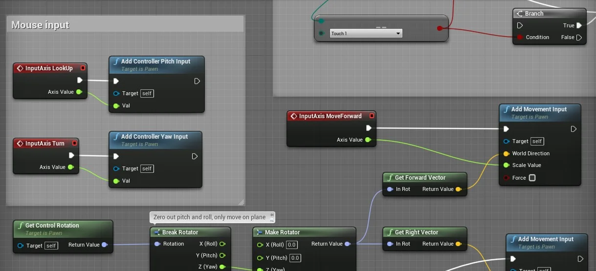

> Figura: Unreal Engine com Blueprint.

<a name="4.2"></a>
## 4.2 O que são *Blueprints* e *Visual Scripting?*
O sistema *Blueprints Visual Scripting* no *Unreal Engine* é um sistema completo de script de jogo baseado no conceito de usar uma interface baseada em nó para criar elementos de jogo a partir do *Unreal Editor*. Como acontece com muitas linguagens de script comuns, ele é usado para definir classes orientadas a objetos (OO) ou objetos na *engine* .

**Blueprints**s focam em ser acessíveis, versáteis para qualquer membro do projeto e isso simplifica tarefas para programadores e engenheiros de projeto, o que facilita entender, interagir e construir.  

Para que o **Unreal Engine** possa construir os nós gráficos que representam a instruções de programação **C++** é importante entender como é a hierarquia de elementos que compõem o projeto, segue abaixo a representação baseado no arquivo de referência no seguinte em [unreal_schematics](https://github.com/drstreit/unreal_schematics "https://github.com/drstreit/unreal_schematics").

```bash
|-- C++  
|   |-- Herança - Classes derivam e herdam de suas classes pai  
|   |   |-- Framework - Classes Padrão  
|   |   |   |-- Actor  
|   |   |   |   |-- GameMode
|   |   |   |   |   |-- Pawn
|   |   |   |   |   |-- Controller
|   |   |   |   |   |-- GameState
|   |   |   |   |   |-- PlayerState
|   |   |   |   |-- GameInstance
|   |   |-- Events/Functions/Var - Eventos, funções e variáveis.
|   |-- Blueprint
|   |   |-- Components
|   |   |   |-- Static Mesh
|   |   |   |-- Emiter
|   |   |-- Editores
|   |   |   |-- Timeline
|   |   |   |-- Componentes
|   |   |   |-- Editor de script
|   |   |-- Communication BP to BP - Comunicação entre Blueprints
|   |   |   |-- Casting
|   |   |   |-- Interface
|   |   |   |-- Event Dispacher
|   |-- Compilação - Compilação do Bytecode.
|   |   |-- Navitization - Durante o processo de preparação, o Blueprint pode ser cruzado para c ++ e nativizado*
|   |-- VM - Executado em uma máquina virtual
```

**Nativização.**

"A nativização é uma funcionalidade relativamente nova no Unreal Engine, que permite aos desenvolvedores converter suas classes criadas em Blueprint para código nativo C++ no momento em que é construído o pacote final do jogo. Isso faz com que seja possível aliar a facilidade de prototipação dos Blueprints ao desempenho do C++, acelerando o processo de desenvolvimento e também reduzindo a possibilidade de erros na programação, levando em consideração que ao desenvolver em Blueprint todas as entradas e saídas de dados, assim como o fluxo das operações são verificados pela máquina virtual enquanto os testes estão sendo realizados, isso permite garantir que tudo funcione conforme o esperado, ou na pior das hipóteses, alerte ao desenvolvedor caso algo não saia como o esperado, por meio de mensagens intuitivas e claras."

**[⬆ Volta para o CAPÍTULO 4](#capitulo4)**

<a name="4.3"></a>
## 4.3 Trabalhando com Levels
Todo os objetos que estão visiveis em um jogo estão armazenados em um *Level* ou mapa de jogo, o *Level* no **Unreal Engine** é composto por iluminação, objetos poligonais e personagens controlados pelos jogadores.


> Figura: Tutorial List: UE4  https://www.worldofleveldesign.com.

<a name="4.3.1"></a>
### 4.3.1 Criando Levels
Para criar um *level* utilizamos o menu principal `File` > `New Level`.


> Figura: File > New Level.

A janela para cria um novo *Level* aparece apresentando vários modelos prontos para servir como base.


> Figura: New Level.

- `Default`: Selecione para criar um novo `Level` com uma configuração básica que inclui um início de jogador, uma luz, uma cúpula do céu e outros vários atores que você precisa para um *Level* funcionar corretamente;
- `TimeofDay`: selecione para criar um novo `Level` com uma configuração que permite que você visualize as configurações da atmosfera da hora do dia em tempo real;
- `VR-Basic`: selecione para criar um novo `Level` com atores para interagir, projetado para guiá-lo no aprendizado dos controles do Editor de VR;
- `Empty Level`: selecione para criar um novo `Level` completamente vazio.

<a name="4.3.2"></a>
### 4.3.2 Salvando Levels
Para salvar o *level* carregado utilizamos o menu `File` > `Save Current`.


> Figura: Save Current.

<a name="4.3.3"></a>
### 4.3.3 Carregando Levels
É possível abrir um  *Level* utilizando `File` > `Open Level`.


> Figura: Open Level.

<a name="4.4"></a>
## 4.4 O que é Level Blueprint?  
Um `Level Blueprint` é um tipo especializado de **Blueprint** que atua como um gráfico de evento global em todo o nível ou *Level*. Cada *Level* em seu projeto tem seu próprio `Level Blueprint` criado por padrão, que pode ser editado no *Unreal Editor*.

Para editar utilizamos a opção `Blueprints` > `Open Level Blueprint`.

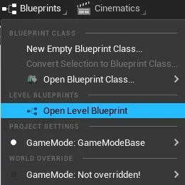        

> Figura:  Open Level Blueprint.

Para escrever uma mensagem no `ViewPort` utilizando o `Level Bueprint` quando o *level* iniciar utilizaremos o evento `BeginPlay` e conectaremos o nó `Print String` para escrever uma mensagem na tela.

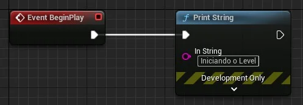      

> Figura: Iniciando o level e escrevendo uma mensagem na tela.

Os nós utilizados são os seguintes:
- `BeginPlay`: Este evento é executado quando o *level* é carregado.
- `Print String`: É uma função que recebe como parâmetro um texto (*String*) e a escreve na tela.

**[⬆ Volta para o CAPÍTULO 4](#capitulo4)**

<a name="4.5"></a>
## 4.5 Atores e Classes utilizando Blueprint
Atores são objetos de uma determinada classe que suportam vários componentes, métodos e variáveis. Por exemplo:

- Personagem Herói - tem atributos, como vida e velocidade, tem componentes, como esqueleto e malha, e métodos, como direção e movimentação.

A lógica de programação dos atores é expressada em **Blueprint** e nos próximos capítulos vamos abordar este temo com mais detalhes.

<a name="4.5.1"></a>
### 4.5.1 Atores predefinidos ou Place Actors
No nível mais fundamental, um ator é qualquer objeto que você pode colocar em um *Level*.

Para adicionar o ator predefinido na cena utilizamos a opção `Create` e escolhemos o tipo de ator.

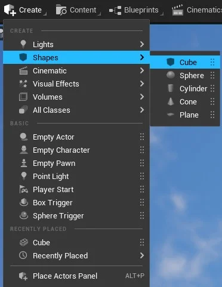       

> Figura: Create > Shapes para criar um objeto poligonal.

Ou podemos acessar o menu principal `Menu` > `Place Actors` para ter acesso a mais atores.

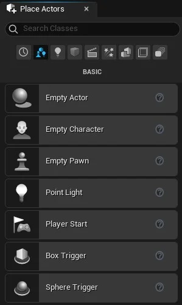        

> Figura: Windows >Place Actors.

<a name="4.5.2"></a>
### 4.5.2 Classes Blueprint ou Blueprint Class
Uma classe **Blueprint**, muitas vezes abreviada como Blueprint, é um ativo que permite que os criadores de conteúdo adicionem funcionalidades facilmente às classes de jogo existentes. Os projetos são criados dentro do **Unreal Editor** visualmente, em vez de digitar o código, e salvos como ativos em um pacote de conteúdo. Essencialmente, eles definem uma nova classe ou tipo de ator que pode então ser colocado em mapas como instâncias que se comportam como qualquer outro tipo de ator.  

Para adicionar um ator na cena utilizamos o menu de acesso rápido `Context Menu` e acionando com o botão direito do mouse na aba `Content`.  

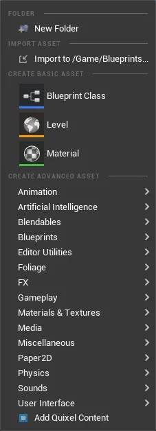       

> Figura: Context Menu.s

Escolha de Classe de atores  `Blueprint Class`.

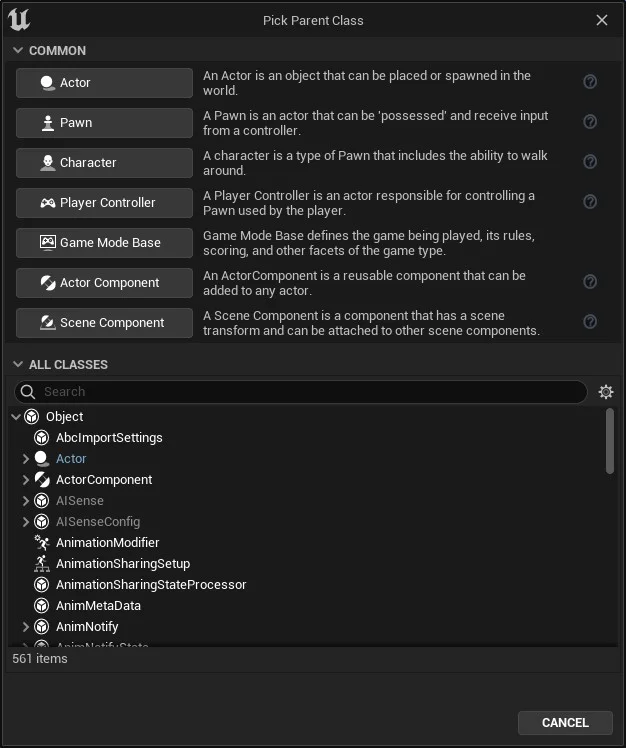     

> Figura: Pick Parent Classe e All Classes.

**[⬆ Volta para o CAPÍTULO 4](#capitulo4)**

<a name="4.6"></a>
## 4.6 Componentes -  Components
Os *Components* ou componentes são um tipo especial de objeto que os atores podem anexar a si próprios como subobjetos.

Os componentes são úteis para compartilhar comportamentos comuns, como a capacidade de exibir uma representação visual e reproduzir sons. Eles também podem representar conceitos específicos do projeto, como a maneira como um veículo interpreta a entrada e muda sua própria velocidade e orientação.

Por exemplo, um projeto com carros, aeronaves e barcos controláveis pelo usuário pode implementar as diferenças no controle e movimento do veículo, alterando qual componente um ator do veículo usa.

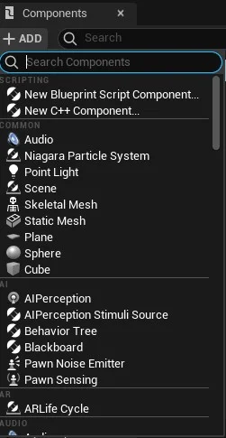       

> Figura: Add Components.

<a name="4.6.1"></a>
### 4.6.1 Components e a aba My Blueprint
Para ter acesso aos componentes que estão associados a um determinado objeto utilizamos a aba `My Blueprint`, que é uma representação visual do agrupamento de componentes, funções, variáveis e macros, abaixo um exemplo.

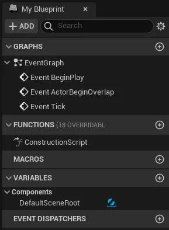       

> Figura: Aba MyBlueprint.

**[⬆ Volta para o CAPÍTULO 4](#capitulo4)**

<a name="4.7"></a>
## 4.7 Estrutura da classe Actor no Unreal Engine
A classe `Actor` é composta por vários elementos, entre eles estão as variáveis, métodos e funções, abaixo uma representação dessa estrutura.

```bash
|-- Objeto
|   |-- Events
|   |   |-- BeginPlay
|   |   |-- ActorBeginOverlap
|   |   |-- Tick
|   |-- Functions
|   |   |-- ConstructionScript
|   |-- Variables      
|   |   |-- VariavelLocal
```
 A representação visual da lógica de programação da classe `Actor` é divida em:

 - `Construction Script`;

 - `Event Graph`.

A seguir vamos aprender mais sobre esses elementos.

<a name="4.7.1"></a>
### 4.7.1 Construction Script
Lógica de que é executada na construção do objeto, similares ao eventos *Construtor* em C++.  

**Exemplo:**

Apresentando uma mensagem ao construir o objeto.      

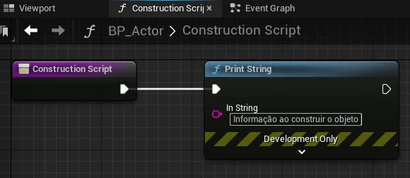        

> Figura: Construction Script.s

<a name="4.7.2"></a>
### 4.7.2 Event Graph
Contém um gráfico de nós e suas ligações representando a lógica de um **Blueprint**.  

"Exibe a representação visual de um gráfico específico de nós, pois mostra todos os nós contidos no gráfico, bem como as conexões entre eles. Ele fornece recursos de edição para adicionar e remover nós, organizar nós e criar links entre nós. Os pontos de interrupção também podem ser definidos na guia Gráfico para auxiliar na depuração de Blueprints."


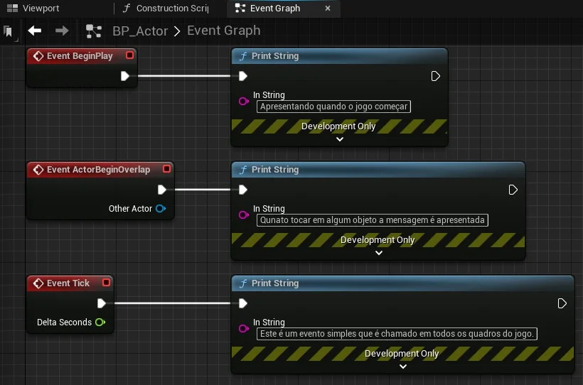       

> Figura: Event Graph.s

<a name="4.7.3"></a>
### 4.7.3 BeginPlay
Este evento é acionado para todos os Atores quando o jogo é iniciado, quaisquer Atores gerados após o jogo ser iniciado terão isso chamado imediatamente.

<a name="4.7.4"></a>
### 4.7.4 ActorBeginOverlap
Este evento será executado quando uma série de condições forem atendidas ao mesmo tempo:
-  A resposta à colisão entre os atores deve permitir sobreposições.
- Ambos os Atores que devem executar o evento têm que gerar Eventos de Sobreposição definido como verdadeiro.
- E, finalmente, a colisão de ambos os Atores começa a se sobrepor; movendo-se juntos ou um é criado sobrepondo-se ao outro.

<a name="4.7.5"></a>
### 4.7.5 Tick
Este é um evento simples que é chamado em todos os quadros do jogo. Tem como parâmetro a variável **Delta Seconds**.

"Vários motores gráficos ou *Game Engines*, como por exemplo *Unity* e *Pico-8*  tem os mesmos eventos com as mesmas Características."s

**[⬆ Volta para CAPÍTULO 4](#capitulo4)**

<a name="4.8"></a>
## 4.8 Comentários   
Os comentários podem ser incluídos diretamente em nós **Blueprint** únicos ou podem ser incluídos como caixas de comentários para agrupar nós relacionados e fornecer descrições sobre sua funcionalidade.

Eles podem ser usados apenas para fins organizacionais para tornar os gráficos mais legíveis, mas também podem ser usados para fins informativos, pois permitem que descrições textuais sejam adicionadas da mesma forma que adicionar comentários ao código.

Selecione os nós e digite "C" no teclado para adicionar um comentário.  

**Exemplo:**

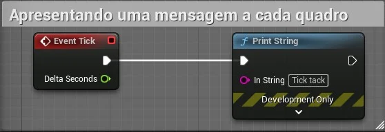       

> Figura: Comment Example.

Podemos adicionar Características aos comentários que detalham melhor a lógica dos nós envolvidos, como por exemplo adicionando cores.    

- **Vermelho** - Lógica principal ou crítica.  

- **Azul** - Lógica de atores.  

- **Verde** - Lógica de estruturas de controle.  

Detalhes do comentário.   

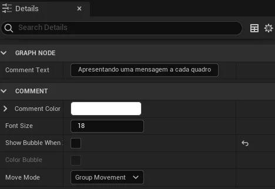       

> Figura: Comment Details.


<a name="4.9"></a>
## 4.9 Atividades - Crie um level para apresentar uma mensagem na tela.

**Regras.**

1. Utilize variáveis para parametrizar a mensagem.

**Desafio.**

1. Adicione vários objetos de diferentes tipos.

**[⬆ Volta para o CAPÍTULO 4](#capitulo4)**

<a name="5"></a>
## CAPÍTULO 5 - Programação C++ no Unreal Engine


Neste capítulo será apresentado o modelo da lógica de programação utilizando **C++** com Unreal Engine.

O **C++** por ter como base de desenvolvimento o C tem o benefício da rapidez e da portabilidade para diversas plataformas e ainda permite a implementação de classes, tornando a linguagem em uma boa candidata para o desenvolvimento de projetos com necessidade de velocidade acessando recursos de baixo nível e construção de classes.

O **Unreal Egine** utiliza a linguagem **C++** aproveitando todas as funcionalidades que a linguagem fornece, como por exemplo o gerenciamento otimizado de memória, quanto a implementação a Engine fornece muitos elementos para auxiliar a codificação tornando-a mais fácil, entre eles a utilização de macros e objetos primitivos próprios da Engine.

**[⬆ Volta para o CAPÍTULO 5](#capitulo5)**

<a name="5.1"></a>
## 5.1 Mas quanto usar a linguagem  C++?
Não há uma resposta definitiva dessa questão mas podemos considerar algumas diferenças entre **Blueprint** e o **C++**, segue abaixo algumas considerações.

**Blueprints vs C++.**

- **Blueprints** são mais fáceis de ser lidos e entendidos pelos membros da equipe;

- **C++** evita sobrecarga de chamadas de função economizando ciclos de CPU;

- **C++** Conseguem acesso a `Library Math`;

- É possível utilizar um sistema de versionamento como por exemplo o Git ou SVN com **C++**;

- **Blueprints** necessitam de ferramenta específica para versionamento;

- Para projetos em plataformas mobile o recomendado é **C++**.

**O que é ideal?**
A resposta é depende do problema mas considere o seguinte:

- Analise a complexidade do projeto e a infraestrutura local e remota;

- Para equipes pequenas e projetos pequenos é recomendado **Blueprints**;

- Para equipes pequenas com cultura de desenvolvimento e necessidade de processamento é recomendado **C++**.

**[⬆ Volta para o CAPÍTULO 5](#capitulo5)**

<a name="5.2"></a>
## 5.2 O fluxo de desenvolvimento e Herança
Um modelo de desenvolvimento utilizando **C++** pode ser visto abaixo onde primeiro criamos a classe do objeto A em **C++** e depois uma classe **Blueprint** B filha da classe A. Fazendo isso pode-se aproveitar as características de ambas linguagens, como por exemplo: lógica em **C++** e parametrização de componentes visuais usando o Editor **Blueprint**.  

Exemplo:

1. Vamos Criar uma Blueprint *BP_Plataforma* do tipo `static_mesh_actor`;
1. Depois Criar a classe **C++** `Plataforma` do tipo `AStaticMeshActor`;
1. Alterar classe pai do *BP_Plataforma* para *Plataforma*.

Onde :

| Origem      | Destino       |       |
|:-           |:-             |:-     |
|Classe C++   |Blueprints     |Certo  |
|Blueprints   |Classe C++     | Errado|

*Tabela: Representação do desenvolvimento descrito anteriormente.*

Sobre a herança de classes permitem usar classes já definidas para derivar classes novas onde a nova classe herda as propriedades da classe base.

Exemplo:

**C++.**

```cpp
// Classe Pessoa
class Pessoa {
  int32 iVida;
  FString sNome;
}

class Heroi: public Pessoa {
  float fForca = 100;
}

void main() {
   // instânciando o objeto Nostromo do tipo Heroi
    Heroi nostromo;
}
```

**Blueprint.**

```cpp
class Hugo: Pessoa
      // iVida -- Herdada
      // movimentacao() - Herdada  

      AddActiveTrigger()  
      float SpeedPlataforma  
      int32 Vida #Error  
```

**[⬆ Volta para o CAPÍTULO 5](#capitulo5)**

<a name="5.3"></a>
## 5.3Tipos de variáveis
A seguir vamos apresentar os tipos de variáveis em ambas as linguagens mas no próximo capítulo descrevermos melhor as variáveis.

| Blueprint | C++     |
|:-:        |:-       |
|integer    |int32    |
|Vector     |FVector  |
|String     |FString  |
|Float      |float  |

**[⬆ Volta para o CAPÍTULO 5](#capitulo5)**

<a name="5.4"></a>
## 5.4 Construindo classes C++ no Unreal Engine
A seguir vamos implementar uma classe **C++** no Unreal Engine para tal utilizamos o `Menu Tools` > `New C++ Class`

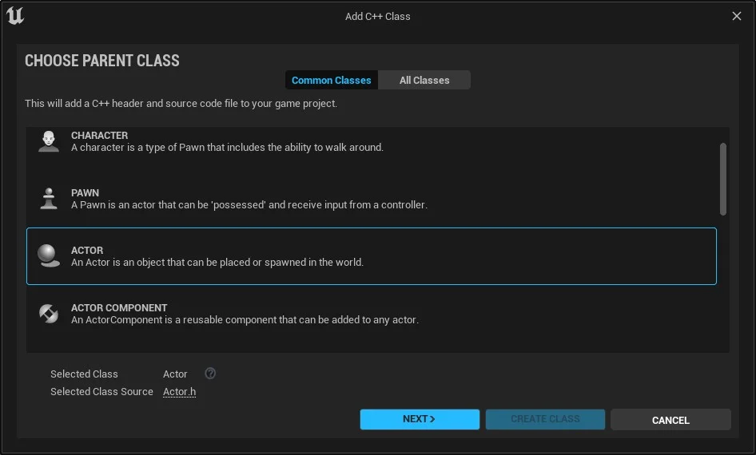

> Figura: Create Class C++.

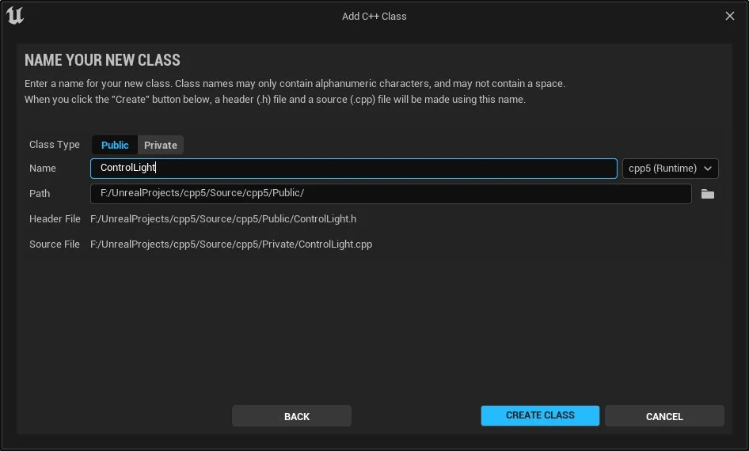

> Figura: Add C++ Class.

O **Unreal Engine** vai criar dois arquivos, o arquivo header (.h) e o de implementação (.cpp), sugerindo separar ambos nas pastas `private` e `header`.

<a name="5.4.1"></a>
### 5.4.1 Pasta privada com os arquivos header das classes
```bash
<Projeto>/Private/ControlLight.h
```

```cpp
// Diretiva de compilação que serve para fazer com que o arquivo seja
// incluído somente uma vez durante o processo de compilação.
#pragma once

#include "CoreMinimal.h"
#include "GameFramework/Actor.h"
// Arquivo criado durante a compilação
#include "ControlLight.generated.h"

// Macro utilizada para indicar que uma C++ fará parte do Unreal
// Reflection system. Isto é necessário para
//que a classe seja reconhecida pelo editor do Unreal Engine.

UCLASS()
class CPP5_API AControlLight : public AActor
{
	GENERATED_BODY()

public:
	// Construtor da classe
	AControlLight();

protected:
	// Método chamado quando o jogo inicia ou quando a classe
  // é adicionada na cena.
  virtual void BeginPlay() override;
public:
	// Método chamado a cada quadro.
	virtual void Tick(float DeltaTime) override;
};
```

Pasta publica com a implementação das classes :
```bash
<Projeto>/Public/ControlLight.cpp
```

```cpp
#include "ControlLight.h"

// Método construtor da classe
AControlLight::AControlLight()
{
  // Configura este ator para chamar o evento Tick() a cada frame.
	PrimaryActorTick.bCanEverTick = true;
}

void AControlLight::BeginPlay()
{
	Super::BeginPlay();
}

void AControlLight::Tick(float DeltaTime)
{
	Super::Tick(DeltaTime);
}
```

<a name="5.4.2"></a>
### 5.4.2 Exemplo de um arquivo header com variáveis
Abaixo vamos construir uma classe em **C++** chamado plataforma para exemplificar um arquivo `header` a declaração de variáveis.

```cpp

#include "CoreMinimal.h"
#include "Engine/StaticMeshActor.h"
#include "Plataforma.generated.h"

UCLASS(ClassGroup=(Custom),meta=(BlueprintSpawnableComponent) )
class PROJETOPLATAFORMA_API APlataforma : public AStaticMeshActor
{
	GENERATED_BODY()

public:
  // Construtor da classe
	APlataforma();

	virtual void Tick(float DeltaTime) override;

	virtual void BeginPlay() override;

	UPROPERTY(EditAnywhere, Meta = (MakeEditWidget = true))
		FVector TargetLocation;

	UPROPERTY(EditAnywhere, BlueprintReadWrite, Category = "Plataforma")
		float SpeedPlataform = 20;

	UFUNCTION(BlueprintCallable, Category = "Plataforma")
	void AddActiveTrigger();

	UFUNCTION(BlueprintCallable, Category = "Plataforma")
	void RemoveActiveTrigger();


protected:
	FVector GlobalStartLocation;
	FVector GlobalTargetLocation;

	UPROPERTY(EditAnywhere)
		int ActiveTriggers = 1;
};
```

**[⬆ Volta para o CAPÍTULO 5](#capitulo5)**

<a name="5.5"></a>
## 5.5 Sintaxe da linguagem e C++ e macros do Unreal Engine
A seguir vamos apresentar algumas características de linguagem e as macros que facilitam a implementação em **C++**.

<a name="5.5.1"></a>
### 5.5.1 Include
É uma forma de incluir um arquivo padrão ou definido pelo usuário no programa e é principalmente escrito no início de qualquer programa **C / C ++**.  
Esta diretiva é lida pelo pré-processador e ordena que ele insira o conteúdo de um arquivo de cabeçalho do sistema ou definido pelo usuário no programa a seguir. Esses arquivos são importados principalmente de uma fonte externa para o programa atual. O processo de importação de tais arquivos que podem ser definidos pelo sistema ou pelo usuário é conhecido como Inclusão de Arquivo. Este tipo de diretiva de pré-processador diz ao compilador para incluir um arquivo no programa de código-fonte.

Exemplo:

```cpp
#include "CoreMinimal.h"
#include "Engine/StaticMeshActor.h"
#include "Plataforma.generated.h"
```

**O arquivo <Classe>.generated.h**

O **Unreal Engine** faz uso extensivo de macros de pré-processador, e algumas dessas macros são definidas (#defined) no arquivo `genrated.h` que acompanha cada `UCLASS`. Se você criar uma `UCLASS` *MyClass*, o arquivo MyClass.h irá incluir (#include) MyClass.generated.h. O cabeçalho gerado, MyClass.generated.h, é feito na parte inicial do processo de construção do **Unreal Engine**.

<a name="5.5.2"></a>
### 5.5.2 Encapsulamento
`Public` – Quando precede uma lista de membros de classe, o  *Public*  palavra-chave especifica que esses membros são acessíveis a partir de qualquer função. Isso se aplica a todos os membros declarados até o próximo especificador de acesso ou o fim da classe. Ou seja visível a todos.

`Private` – Quando precede uma lista de membros de classe, o *Private* palavra-chave especifica que esses membros são acessíveis somente dentro de funções de membro e amigos da classe.  Isso se aplica a todos os membros declarados até o próximo especificador de acesso ou o fim da classe. Ou seja visível somente para membros dentro da classe.

`Protected` – O *Protected* palavra-chave especifica o acesso a membros de classe no lista de membros até o próximo especificador de acesso (pública ou private) ou no final da definição de classe.  O *Protected* é mistura entre *Public* e *Private* ou seja é visível somente para membros da classe e visível para subclasses.

<a name="5.5.3"></a>
###  5.5.3 UCLASS
Você também pode declarar classes **C ++** personalizadas, que se comportam como classes UE4, declarando seus objetos **C++** personalizados como UCLASS. UCLASS usa [Smart Pointers](https://docs.microsoft.com/pt-br/cpp/cpp/smart-pointers-modern-cpp?view=msvc-170 "Ponteiros inteligentes (C++ moderno)") do UE4 e rotinas de gerenciamento de memória para alocação e desalocação de acordo com as regras do Smart Pointer, podem ser carregados e lidos pelo *UE4 Editor* e opcionalmente acessados a partir de Blueprints.

Exemplo:

```cpp
UCLASS(ClassGroup=(Custom),meta=(BlueprintSpawnableComponent) )
```
Os parâmetros descritos no exemplo são os [especificadores](https://docs.unrealengine.com/4.27/en-US/ProgrammingAndScripting/GameplayArchitecture/Classes/Specifiers/ "Class Specifiers") da classe que irão determinar o seu comportamento.

- `BlueprintSpawnableComponent` - Se estiver presente, o componente Class pode ser gerado por um Blueprint.
- `ClassGroup=GroupName` - Indica que o Navegador de ator do Unreal Editor deve incluir esta classe e qualquer subclasse dessa classe dentro do GroupName especificado quando a Visualização de grupo estiver ativada no Navegador de ator.

<a name="5.5.4"></a>
### 5.5.4 UFUNCTION

Um **UFunction** é uma função **C ++** que é reconhecida pelo sistema de reflexão Unreal Engine 4 (UE4). Qualquer **UObject** ou biblioteca de função Blueprint pode declarar uma função de membro como um **UFunction**, colocando a macro UFUNCTION na linha acima da declaração da função no arquivo de cabeçalho. A macro oferecerá suporte a Especificadores de Função para alterar como o UE4 interpreta e usa uma função.

Ao declarar funções, os especificadores de função podem ser adicionados à declaração para controlar como a função se comporta com vários aspectos do mecanismo e do editor.

Exemplo:
```cpp
UFUNCTION(BlueprintCallable, Category = "Plataforma")
void AddActiveTrigger();
```
- `BlueprintAuthorityOnly` - Esta função só será executada a partir do código Blueprint se for executada em uma máquina com autoridade de rede (um servidor, servidor dedicado ou jogo para um único jogador).
- `BlueprintCallable` - A função pode ser executada em um gráfico Blueprint ou Level Blueprint.

<a name="5.5.5"></a>
### 5.5.5 UPROPERTY
As propriedades são declaradas usando a sintaxe de variável **C++** padrão, precedida pela macro UPROPERTY que define metadados de propriedade e especificadores de variável.

Ao declarar propriedades, os Especificadores de Propriedade podem ser adicionados à declaração para controlar como a propriedade se comporta com vários aspectos do Motor e do Editor.

```cpp
UPROPERTY(EditAnywhere, Meta = (MakeEditWidget = true))
  FVector TargetLocation;
```
- `BlueprintReadOnly` - Esta propriedade pode ser lida pelo Blueprints, mas não modificada. Este especificador é incompatível com o especificador BlueprintReadWrite.
- `BlueprintReadWrite` - Esta propriedade pode ser lida ou escrita a partir de um Blueprint. Este especificador é incompatível com o especificador BlueprintReadOnly.
- `EditAnywhere` - Indica que esta propriedade pode ser editada por janelas de propriedades, em arquétipos e instâncias. Este especificador é incompatível com qualquer um dos especificadores "visíveis".
- `MakeEditWidget` - Usado para propriedades *Transform* ou *Rotator*, ou Matrizes de *Transforms* ou *Rotators*. Indica que a propriedade deve ser exposta na janela de visualização como um *widget* móvel.

**[⬆ Volta para o CAPÍTULO 5](#capitulo5)**

<a name="5.6"></a>
## 5.6 Funções Virtuais

"Uma função virtual é uma função de membro que é declarada dentro de uma classe base e é redefinida (Substituída) por uma classe derivada. Quando você se refere a um objeto de classe derivada usando um ponteiro ou uma referência à classe base, pode chamar uma função virtual para esse objeto e executar a versão da função da classe derivada."[Funções Virtuais](https://pt.wikipedia.org/wiki/Fun%C3%A7%C3%A3o_virtual "Funções Virtuais")

- As funções virtuais garantem que a função correta seja chamada para um objeto, independentemente do tipo de referência (ou ponteiro) usado para a chamada da função;

- Eles são usados principalmente para obter polimorfismo de tempo de execução;

- As funções são declaradas com uma palavra-chave virtual na classe base;

- A resolução da chamada de função é feita em tempo de execução.

Exemplo:
```cpp
class WeaponBase {
  public: virtual void OnFire() {}
};
class WeaponRifle : public WeaponBase {
  public: void OnFire() override {}
};

...
WeaponRifle
void anotherFunction(WeaponBase *someWeapon) {
  someWeapon->OnFire();
}
```

Na função anotherFunction o método chamado em OnFire é WeaponRifle::OnFire().
O método WeaponBase::OnFire não é chamado pois foi sobreposto.

**[⬆ Volta para o CAPÍTULO 5](#capitulo5)**

***

<a name="6"></a>
## CAPÍTULO 6 -  Estruturas de programação no Unreal Engine


Neste capítulo serão descritas as estruturas de armazenamento, manipulação e fluxo da lógica de programação.

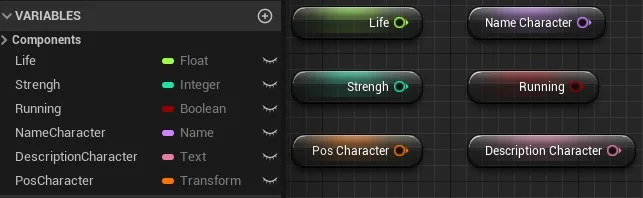

> Figura: Blueprint Variáveis.

<a name="6.1"></a>
## 6.1 O que são variáveis?
Variáveis são estruturas que são utilizadas para armazenar um valor de um determinado tipo na memória do computador.

Estrutura de memória.

|Variável       |Tipo     | Valor       |
|:-             |:-:      |:-:          |
|iSoma          |Integer  |0            |
|fValor         |Float    |6.5          |
|tName          |String   |"Gandalf"    |
|bRunnig        |Boolean  |false        |


Abaixo um exemplo em C++:
```cpp
// Variável do tipo inteiro
int iSoma = 0;

// Variável do tipo ponto flutuante
float fValor = 6.5;
```

**[⬆ Volta para o CAPÍTULO 6](#capitulo6)**

<a name="6.2"></a>
## 6.2 Variáveis no Unreal Engine
Variáveis no Unreal Engine são propriedades que contêm um valor ou fazem referência a um objeto ou ator no mundo. Essas propriedades podem ser acessíveis internamente ao **Blueprint** que as contém, ou podem ser tornadas acessíveis externamente para que seus valores possam ser modificados por designers que trabalham com instâncias do **Blueprint** colocadas em um nível.

<a name="6.2.1"></a>
### 6.2.1 Tipos de Variáveis
Para armazenar qualquer informação na memória devemos definir um tipo de dados primitivo ou mesmo uma estrutura de dados, a seguir alguns tipos de dados:

- `Boolean` - Armazena valores falso ou verdadeiro (true e false).

    ```cpp
bool VariavelBoolean;
VariavelBoolean = true;
  ```

 - `Integer` - Valores inteiros entre −2.147.483.648 e 2.147.483.647

    ```cpp
int32 VariavelInt;
VariavelInt = 1;
  ```
    Utilize int32, uint8, uint32 para representar números inteiros.

-  `Float` - Valores com casas decimais tal como 0,0553, 101,2887 e -78,322 .

    ```cpp
float VariavelFloat;
VariavelFloat = 2.4;
    ```

- `String`- Grupo de caracteres alfanuméricos.

    ```cpp
FString VariavelString ;
VariavelString = TEXT("Alo mundo!!");
    ```

<a name="6.2.2"></a>
### 6.2.2 Declarando variáveis   
Declarando variáveis informamos ao computador que estamos reservando um espaço de memória temporário.  

**Blueprint.**

- Variáveis no Editor de Blueprint.

    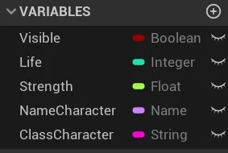

    > Figura: Blueprint Variables.

- As variáveis tem tipos e propriedades que determinam o sua utilização.  

    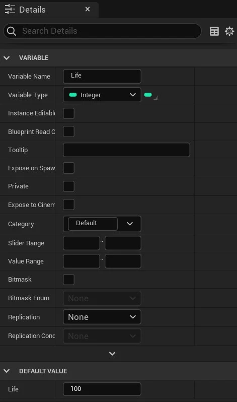

    > Figura: Details ou properiedades das variáveis.

    Observe que a propriedade `Category` agrupa as variáveis por uma categoria.

**C++.**

```cpp
UPROPERTY(EditAnywhere, BlueprintReadWrite, Category = "Parâmetros")
    int32 iLife = 10;
```

**[⬆ Volta para o CAPÍTULO 6](#capitulo6)**

<a name="6.3"></a>
## 6.3 Métodos Get e Set
Para acessar o conteúdo das variáveis utilizamos os métodos `Get` e `Set`, onde:

- `Get`: Obtém o valor de uma variável.
- `Set`: Atualiza o valor da variável.

**Blueprint.**

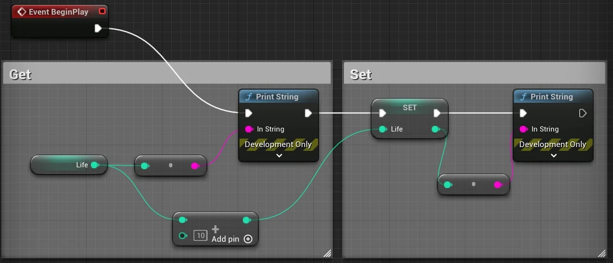

> Figura: Métodos Get e Set.

- `BeginPlay` - Ao iniciar o jogo a lista de comandos conectados a estes nó deve ser acionado.
- `Print String` - Escreve um texto na cena do jogo.
- `Add +` - Variáveis numéricas podem ser manipuladas com operadores matemáticos.
- `Converts` - Converte tipos de variáveis, neste caso converte um valor do tipo `integer` em um do tipo `String`.

**C++.**

Arquivo Header.

```cpp
// MyHero.h
UPROPERTY()
virtual void BeginPlay() override;
```

Arquivo de implementação.

```cpp
// Myhero.cpp
void AMyHeroClass::BeginPlay()
 {
    Super::BeginPlay();
    int32 iLifeLocal = 5;
    float fSpeed = 3.7f;
    FString fsName = TEXT("O nome do personagem é Nostromo");
    iLifeLocal = iLifeLocal + iLife;
    // iLife é uma variável global
    UE_LOG(LogTemp, Warning, TEXT("O resultado é =, %d %f %s"), iLife, fSpeed, *fsName );
 }
 ```

**[⬆ Volta para o início](#índice)**

<a name="6.4"></a>
## 6.4 Tratamento e armazenamento de texto no Unreal Engine
No **Unreal Engine** são definidos alguns tipos de dados para manipulação e armazenamento de caracteres alfanuméricos, entre elas estão os tipos de variáveis a seguir.

| Variável          |Tamanho    | Considerações               |
|:-:                |-          |-                            |
| `Text`            | 40 Bytes  | Podemos adicionar opções avançadas como exemplo `String Table`, ideal para textos longos que podem variar conforme a lingua definida pelo jogador.  |
| `String`          | 16 Bytes  | Armazenamento e consumo de memória mediano |
| `Name`            | 8 Bytes   |  Cadeias de caracteres  curtas que ocupam pouca memória.|

Podemos realizar as seguintes operações em `strings`:

- Atribuir o valor de uma `string` para outra;

- Acessar caracteres individualmente;

- Adicionar uma `string` no final de outra;

- Concatenar `strings`;

- Procurar uma determinada letra ou Substring dentro da `string`.

**Blueprint.**

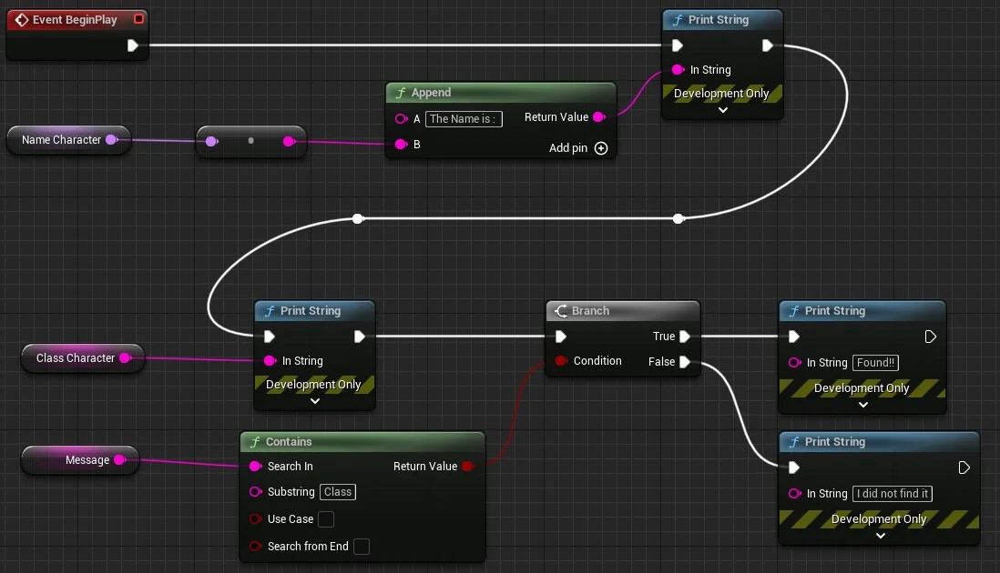

> Figura: String functions.

**C++.**

Arquivo header.

```cpp
// myHero.h
UPROPERTY()
virtual void BeginPlay() override;

UPROPERTY()
FString NomeCharacter;

UPROPERTY()
FString ClassCharacter;


```

Arquivo de implementação.
```cpp
// myHero.cpp
void AMyHeroClass::BeginPlay()
 {
    Super::BeginPlay();

    FString fsMessage = TEXT("Procurando a classe do personagem");
    FString fsResultado;

    fsResultado.append("O nome é ",*NomeCharacter)

    // ou
    fsResultado =TEXT("O nome é ");
    fsResultado += *NomeCharacter;

    UE_LOG(LogTemp, Warning, TEXT("O resultado é =,  %s"), *fsResultado );

    // Procurando uma Substring
    if (fsMessage.Contains("class"))
    {
      UE_LOG(LogTemp, Warning, TEXT("Encontrei!!"));
    }
    else
        UE_LOG(LogTemp, Warning, TEXT("Não encontrei"));
 }

```

<a name="6.4.1"></a>
### 6.4.1 Concatenando textos usando a função Append
A função `Append` concatena duas ou mais `strings`, passamos como parâmetros os textos que gostaríamos de concatenar e tendo como resultado um novo texto contendo os dois textos.

**C++**

```cpp

FString sTexto = TEXT("Alo mundo...");
sTexto.append("Cruel");

// Resultado: Alo mundo...Cruel
```

<a name="6.4.2"></a>
### 6.4.2 Procurando texto dentro de uma string
A função `Contains` procura uma sequencia de caracteres dentro de uma `string`, passamos os seguintes parâmetros para a função.

**Blueprint.**

- `Search In` - Texto passado como parâmetro.
- `Substring` - Texto que deve ser localizado.
- `Use Case` - Diferencia maiúsculas e minúsculas.
 `Search from end` - Inicia a busca pelo fim do texto.

**C++.**

```cpp

FString sTexto = TEXT("Procurando o texto escondido.");

if (sTexto.Contains(TEXT("texto")))
{
  return true;
}
else
  return false;

// Resultado: Alo mundo...Cruel
```

**[⬆ Volta para o CAPÍTULO 6](#capitulo6)**

<a name="6.5"></a>
## 6.5 Variáveis do tipo numéricas Integer e Float
Valores numéricos utilizam operadores matemáticos para a sua manutenção, como veremos a seguir.  

**Blueprint.**

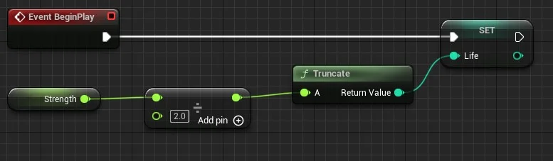

> Figura: Utilizando Divisão.

**C++.**

```cpp
void AMyCharacterClass::BeginPlay()
{
    Super::BeginPlay();
    Float fStrength = 10;
    int32 iLife = 0;

    iLife = int(fStrength / 2);
}
```

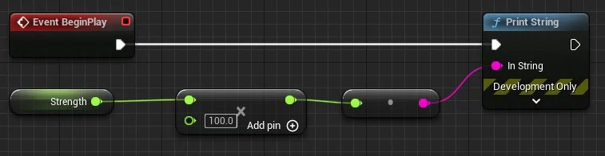

> Figura: Multiplicação valores.

- (+) - soma;
- (*) - Multiplicação;
- (/) - Divisão.

**[⬆ Volta para o CAPÍTULO 6](#capitulo6)**

<a name="6.6"></a>
## 6.6 Armazenando valores lógicos com Boolean
Armazena dois valores : falso `false` ou verdadeiro `true`.

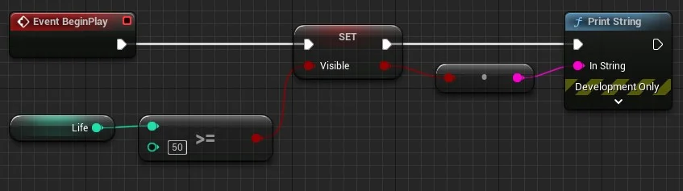

> Figura: Variável Boolean.

No exemplo acima se o valor de `life` for maior que 50 então o valor é atualizado para `true`.

**[⬆ Volta para o CAPÍTULO 6](#capitulo6)**

<a name="6.7"></a>
## 6.7 Controle de acesso a variáveis
Como especificar quais variáveis de um objeto um usuário pode acessar e quais estão fora dos limites? - usando os especificadores de controle de acesso público e privado.

<a name="6.7.1"></a>
### 6.7.1 Variáveis Privadas
Com a opção Privada marcada em uma variável, isso evita que a variável seja modificada por módulos externos.  

**Blueprint.**

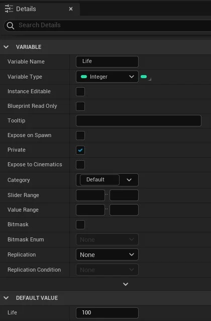

> Figura: Private details.

**C++.**

```cpp
private:
   bool Running = false;
```

<a name="6.7.2"></a>
### 6.7.2 Variáveis Públicas
Para permitir que uma variável seja modificada de fora de seu módulos, torne-a pública.  

**Blueprint.**

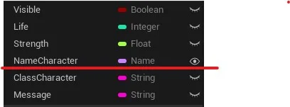

> Figura: Public.

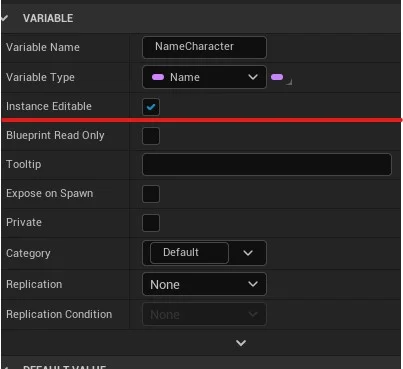

> Figura: Public details.

**C++.**

```cpp
public:
  UFUNCTION(BlueprintCallable, Category="Player")
  bool IsRunning();

```

<a name="6.8"></a>
## 6.8 Atividade - Crie um projeto que implemente as variáveis dos tipos de variáveis.

**Regras.**
1. Implemente variáveis para armazenar o Nome do personagem, a vida do personagem e força do personagem;
1. Aumente a vida e a força do personagem;
2. Altere o nome do personagem e escreva na cena.

**Desafio.**

1. Implemente uma lógica para calcular o maior valor entre três números.

  Exemplo:
```bash
x = 3;
y = 5;
z = 2;
O maior valor é Y = 5;
```


**[⬆ Volta para o CAPÍTULO 6](#capitulo6)**
